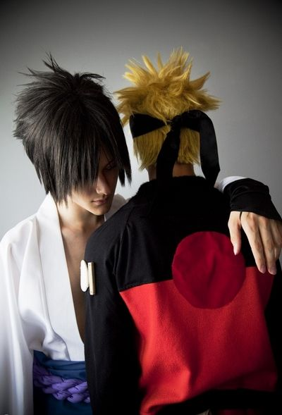
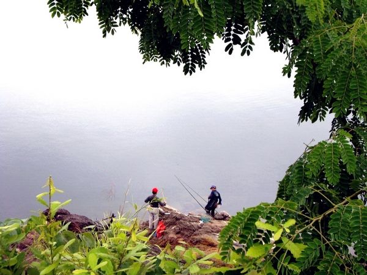

# ＜天璇＞江湖路远

**人不喜欢的不是被贴上标签，而是容易厌倦旧的标签，想换新的标签而已。大概每个人都会经历这个年纪，有的人持续的时间短，像我，从瑞金跑到了北京，最后还是想回到瑞金；有的人持续的时间长，像好兄弟久涛，从瑞金跑到了包头，又从包头跑到了嘉峪关，不知道他什么时候能停下来。我给他写明信片，说我发现他像极了以前的我，总是渴望去远方，过不一样的生活，看不一样的风景。**  

# 江湖路远

## 文/ 钟起鹏（中国人民大学）

 

在人生的每一个路口，我们都会面临选择。大学毕业就是其中一个路口：工作，读研，出国；去哪工作，进入什么行业，从事什么岗位；内保，外保，考研；申Master，申PHD，去欧洲，去北美……如果我们把这个选择树画下去，人的一生从出生到死亡就会是一棵庞大无比的选择树，而在人生每一个路口，当时看是平淡无奇的选择，就完全有可能决定我们一生的轨迹。人生的奇妙正在于此。

我常说，不怕等不到，就怕来不及。事实上我并不是一个急性子，但是我不喜欢什么都不做或什么都做不了。这些年和我一起成长的兄弟姐妹，还有那个难以取悦的姑娘，2011年夏天大学毕业了，从此走上江湖路。我本来也应该是他们中的一员，所以我常觉得自己被落下了。难以取悦的姑娘，说话三句不离“你们大学生……”“你现在没毕业，说什么都是没用的……”“老娘……”，老实说我好讨厌她们这副倚老卖老的嘴脸。再说她们也不比我老啊，我在江湖上挨刀的时候，她们还是个花痴的小姑娘呢。可是我也不好说什么，人家一个弱女子二话不说风风火火闯九州去了，而我已不做大哥好多年。

身边认识的朋友，那些年少时一起指点江山、激扬文字的男孩们并没有到体制内去，而是选择了走更远的路；反倒是那些当年小文艺、小清新的姑娘们，她们娇弱的外表下都有着一颗纯爷们的心，好几个姑娘去了体制内或者正谋划着要去体制内，或者她们的父母都希望她们能嫁给一个体制内或依附于体制的青年才俊。这就是为什么愤青和文艺男青年最后都去搞基的原因。有一些和我关系不错的姑娘偶尔会感叹为什么自己找不到男朋友，我一般都会说，那又怎么，我也没有男朋友。要是她还不开窍反问我一句，可是你有女朋友啊！我就会问她，你的女朋友应该比我多很多吧？！

有一回和几个师弟师妹们聊天，都是不知人间凄苦的主，纠结于保研还是出国。其中一个说，就是想出去看看，不想在一个地方待太久被贴上各种标签。其他人也帮腔，是啊是啊，自己都变成RUCer了，自己倒感觉不明显，可是别人都会有明显的感觉，反正就觉得自己被困住了。我说还好吧，我还在乡下的时候也是现在这样一副死猪不怕开水烫的样子啊，我的朋友们以前觉得我无聊，现在也没觉得我更无聊了啊！他们说，不一样，真的不一样。高中认识的同学，天资普通的那种，就是因为在国外上学，觉得他们整个人气质都不一样了，浑身散发着自信和活力。我说，这也是一种标签啊。

人不喜欢的不是被贴上标签，而是容易厌倦旧的标签，想换新的标签而已。大概每个人都会经历这个年纪，有的人持续的时间短，像我，从瑞金跑到了北京，最后还是想回到瑞金；有的人持续的时间长，像好兄弟久涛，从瑞金跑到了包头，又从包头跑到了嘉峪关，不知道他什么时候能停下来。我给他写明信片，说我发现他像极了以前的我，总是渴望去远方，过不一样的生活，看不一样的风景。然而最怕的是，我们总是想登上一个又一个山峰，去到一个又一个远方，以为那里能看见不一样的风景，最后却发现，“满目荒凉谁可语”。我十七岁的时候独自一人来北京就是这种体会，那是我第一次出远门，感觉是不一样，可也不过如此而已。不过总的来说，我觉得到外面的世界走走逛逛也什么坏处，世间美好不一定都要拥有也不可能都能拥有，但是不能不知道。因为只有这样，我们才可能有胆量说出沈从文先生说的那样的话——“我行过许多地方的桥，看过许多次数的云，喝过许多种美的酒，却只爱过一个正当最好年龄的人。”

这一年很多兄弟姐妹们毕业，见惯悲欢离合，听到谁和谁闹着要分手，我都不再像以前一样规劝他们了。而且这一年，让我见过一次的兄弟们的女朋友，接受过我最真挚祝福的情侣们，最后都散尽了。有的时候也会很难过，比如大学好友小豆豆说出她和男朋友分手了那句话的同时瞬间情绪失控的时候。她那样一个从来都是、真的从来都是没心没肺的女人，是怎样的难过才可以让她这样难过。远隔重洋，万水千山，他们终究没能一起倚靠着向前走。我安慰过很多朋友，我说如果彼此是对的人，就算万水千山走遍，你们终会回到出发的地方。可是坦白说我也不能坚信这一点，就像我离开厦门是给喜欢的姑娘写的邮件里面说的一样，“我想我从来都不曾相信你会愿意跟我在一起，是的，我从不相信。”两个各自旅行的人，要有多大的笃定，才敢赌对方会回到出发的地方。这一年我开解过很多朋友的心事，也装下了很多他们的秘密和我自己的秘密，有一些可以说，有一些可能永远都无法说。“佛曰不可说，一说便是错。”

面包和爱情，是过去一年摆在很多朋友面前不得不做的选择题。有的人职场得意，情场失意；有的人情场得意，考场失意。相爱的人不能在一起，门当户对的也不能在一起，性格互补的不能再一起，志趣相投也不能在一起，好像一夜之间大家就觉悟了，满脑子想的都是车子、房子、本子、票子、孩子……相比之下我就特别像一个疯子。我也在做这道选择题，师心自用的我，和他们一样也没能得偿所愿。花了大半年时间做了一个两全其美的计划，却还是应了那句老话，计划总是赶不上变化，最后被一个好朋友没心没肺地看了笑话。可是我并不介意她的揶揄，因为在我们这些朋友看不见的地方和看不见的时候，估计连一个可以没心没肺笑话她的朋友都没有吧。我们这些人，太多人的心事都是一个人的心事，都遇不到一个可以像我一样胡说八道的人。她说，把故事存在你这儿的，没一个有好下场，我才不会把故事存在你这儿。不过她也说，我们都对得起祖国对得起党，没有理由不幸福。其中一个好朋友，我们都以为他和他女朋友要谈婚论嫁了，结果还是因为工作地点无法两全，分手了，我给他写明信片说，如果爱情已经来过，那么以后就不必信了。工作，娶妻，生子，各自安好。过年回去鹏哥摇旗，请兄弟们喝酒。

男人其实更关心能否获得男人的认同。在家希望被父亲认同，在外希望被朋友认同。像韩寒那样“全世界我只想争取一个粉丝，就是我女儿”的男人其实并不多见，那是因为作为一个男人他已经到极致。所以尽管韩寒不爱他的女粉丝，但是他的女粉丝却很爱他。而对于大部分对韩寒只能羡慕嫉妒恨的男人而言，女人是这样的——你在乎她，她不在乎你；但是别以为你不在乎她，她就会在乎你。你要是敢不在乎她，她就敢呼你全家。这是一道无解的题。

我常常觉得这一路走下来，我还是最喜欢小时候在乡下，春天的时候把路边野生的桃树李树苗挖到房前屋后栽种，精心照料；夏天的时候，早上去梯田新做的田埂上抓黄鳝，午后去门口的池塘摸田螺或者钓鱼，要是傍晚下了暴雨，晚上就可以打着手电筒到稻田里捉田鸡；秋天和小伙伴到山上采各种野果子，吃饱了出汗了，脱得一丝不挂下到水库里面游泳；冬天就是打打闹闹捉迷藏，地毯式扫荡各家大人藏起来的零食和年货。自己做水枪，做弹弓，爬树，打架，玩弹珠……我只看过央视一套和江西卫视一套播过的动画片，我不知道舒克和贝塔，我没学过乐器，我没上过奥数班，我十四岁之前从未离开过方圆五十公里的地方……那个时候没有宏大的梦想，那个时候不会渴望去远方流浪，那个时候不知道喜欢一个人会让人如此忧伤……但是我觉得自己活得很快乐。

离开了小城瑞金才知道江湖险恶，路堵且远。“到不了的，叫远方；回不去的，叫故乡。”尽管我总是遇见对我很好很友善的人，可是我常问我自己为什么要舍近求远？我有的时候真是厌倦这种颠沛流离、亲情疏离、爱人不见的生活。坦白说，这个世界对我来说没有太多新鲜感，因为我上辈子就来过。除了血脉相连的亲人，真正让我挂念的，不过是一个女人几本好书，几个地方一些朋友，如此而已。所以我强烈要求下辈子做一头猪。吃睡皆不爱，就爱拱白菜。引刀成一块，一斤十五块。

 

（采编：林静；责编：陈锴）

 
