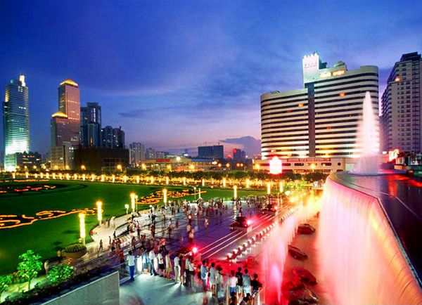
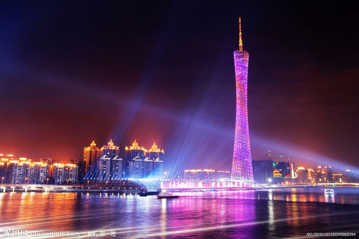

# ＜天璇＞活在广州，我想说的不多

**这地方市井气浓厚，但如果你能欣赏尘世的快乐，每个人都能在江湖里自得，这就是广州的魅力所在。在这里日子久了，你开始加入各种寻觅美食的行列，从穿街过巷的小吃到荒山野岭的野味，体验舌尖的纯粹愉悦；你开始从恩宁路逢源路走到沙面，从长洲到小洲，从东风路到淘金路，从滨江到沿江路，领略属于岭南水乡的、千年商都的、中西合璧的、开放包容的一些独到风情；你开始习惯有比全国其他地方要活跃的各种媒体，远离正经八百却空荡无物的政治论调，每天在对着公民议题吹拉弹唱；你开始结交广东的朋友，慢慢欣赏他们的实干、乐天、淡定，也结交来自五湖四海的朋友，他们跟你说天南地北的快意恩仇的故事。**  

# 活在广州，我想说的不多

## 文/郑颖（中山大学）

晚饭后走去东站广场吹吹风。

扶梯上去首先映入眼帘的，是流浪汉三三两两，闲适地在各个角落里聊天。

繁华与邋遢齐飞，现代共脏乱一色，广州给人杂糅的感觉在这里彰显。上有不见星光的夜空，前有霓虹闪烁的CBD最高建筑中信广场和各种高楼，而我脚下是即使夜色之下也看到不甚干净的火车站广场。不知名的虫鸣夹杂着车声，夜风里隐隐约约的尿骚味，是流浪汉们在角落留下的痕迹。行人偶尔拖着行李走过，行色匆匆。我和友人一边质疑这卫生城市到底是怎么来的，一边在一个散落烟头的花坛边缘坐下，而不远处的流浪汉大叔也铺开报纸就着一盏路灯悠然躺下看起报来，我们就这样共处在一个时空里，各自闲适。过了一会，有奇怪的哨声响起，我赶紧看他们是不是有什么动静，猜想是不是丐帮要集会了呢？又或者是天地会？

这一幕让我想到，广州果然不是一个适合旅游的城市，这“羊城八景”的东站广场拿出手恐怕要落人笑柄。诚然，白云山不高，珠江水不长，荔湾湖越秀湖越来越小，自然景观就不用说了。人文方面吗，所谓的文化古迹寺庙博物馆，都低低调调默默无闻的——我很怀疑有能外地人欣赏最繁华的北京路底下那个玻璃盖着的几朝古道和古水泵；新兴的创意园区，都是些实用的设计公司聚居地，要比其他城市那装模作样的艺术区还真不成气候，搞不了太文艺的东西；标志性建筑，看看那块乱石一样的广州歌剧院，扭捏的小蛮腰广州塔，估计也没什么太大惊喜；大学城嘛，全国都有，而且一个有六七环路的小岛你上去兜，要么太阳大得晒死人，要么横风横雨全身湿透，除非有人喜欢荒岛奇遇。要购物吗，商业区难道不是全国大城市一个样，广州商场的密度、规格和品牌档次，都没法跟北京上海深圳甚至杭州厦门比。因此，被问起在广州玩推荐去什么地方，我总是很难回答——短暂逗留的旅客，注定对这个城市没太高评价。

能喜欢广州的人，一定是在这里生活了一定日子的人。记得以前看的一篇博文说，广州用一锅浓汤，就让你卸下武装，消散恩怨情仇，溶解在这股江湖气息里，愚以为比喻得很贴切。

看吧，别人的市长在教大家怎么唱红歌，我们的市长在教大家怎么垃圾分类。别人的市政府警卫深严，我们的市政府广场聚集三教九流的人，除了阿公阿婆踢毽子跳扇舞，还有那些有事没事去当快闪客的，或者一群人静默地坐着的，或者是占领某厕所运动的，也许只图个好玩，但也表达了什么。别人的地铁里都是西装笔挺的白领或者收拾妥当的普通市民，我们的地铁里连市中心上班的小白领都踢着人字拖，然后一大半是七倒八歪的行人过客，夹杂着来自全国各地行李、麻包袋甚至是扁担竹筐，带着沙泥的安全帽，批发市场来的大袋黑包裹，空气里五味杂陈，车厢挤不堪言……官话说的“现代化大都市”不敢当，现代化大城镇当之无愧。

这地方市井气浓厚，但如果你能欣赏尘世的快乐，每个人都能在江湖里自得，这就是广州的魅力所在。在这里日子久了，你开始加入各种寻觅美食的行列，从穿街过巷的小吃到荒山野岭的野味，体验舌尖的纯粹愉悦；你开始从恩宁路逢源路走到沙面，从长洲到小洲，从东风路到淘金路，从滨江到沿江路，领略属于岭南水乡的、千年商都的、中西合璧的、开放包容的一些独到风情；你开始习惯有比全国其他地方要活跃的各种媒体，远离正经八百却空荡无物的政治论调，每天在对着公民议题吹拉弹唱；你开始结交广东的朋友，慢慢欣赏他们的实干、乐天、淡定，也结交来自五湖四海的朋友，他们跟你说天南地北的快意恩仇的故事。所谓“现代化”，是给你机遇和挑战，让你拼杀的时候纵横事业腥风血雨；所谓“大城镇”，是给你闲散和解放，让你收刀的时候大口鱼肉惬意散乱。金戈铁马搭配着花间一壶酒，这正是我理解的“江湖”。

前些日子《北爱》很红，而我能想象了一下能发生在广州的浪漫爱情故事：一个夏夜，开凌志车的单身男子来到牛杂店，买下一碗萝卜牛杂，准备混酱的时候手一抖，不小心沾到了旁边女子的衣角，两人抬起头，有点惊讶：“好耐无见，乜咁巧啊？”“系咯，你仲系咁中意吃牛杂啊。”“你都系遮……哈哈。”两人会神一笑。

从出生到现在的二十余年，只能说出这么些个没内涵的话。活在广州，我想说的不多，没有太多诗意的想象，唯有真切地实在地快意地活着而已。但谁说这不正是活着的意义呢？

也许是我在这里浸泡太久，想法主观了。因此决定出去晃荡几年，再回来学煲汤。到时看看我的汤能沉淀多浓厚的味道，又能瓦解谁身上的武装，然后与我在江湖里携手浮沉又大快朵颐。

（采编：黄理罡；责编：黄理罡）

 
