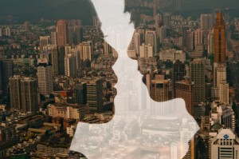
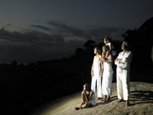

# ＜天璇＞活着

**人为什么活着？这是个荒诞的哑谜，而时间是没有一刻为荒诞而停滞的。我把鞋脱了，赤脚行走，所感受到的草梗与露水如上。那么你呢？鞋子在真实的世界是无用的，如果相信地面也有温度，如果你还活着，如果我们还活着。所以听到缪斯说，抬起你的脚，走到更深处去，除非你能得到独一无二的回答，否则，不要停下来。**  

# 活着

## 文/赵无良（西安外国语大学）

 

问一个老套的问题，人为什么活着，再朴素一点，我为什么活着。

这个问题很明显具有强烈的自我意识，人的概念太广，我只管我自己。但这就足够了，能给自己一个回答已经是不易。

第一次开始考虑这个问题是在课堂上，老师冠冕堂皇地提问，大家冠冕堂皇地回答，自然不能有什么收获。活着本来就不是一个用来提高自己段位的思考内容。我八岁的时候去游泳馆，教练用竹竿把我压在水里，我在其中挣扎反复，恐惧莫名，想呼救又被池水堵住嘴巴，那时候我知道，求生避死是本能，而为什么，还真没有深究过。

经常在肥皂剧里看到，家族纷争流血漂橹之后，一个年轻人面对泪流满面的父母大喊道：“你们为什么要把我生下来！”然后对方无言以对，掩面而泣。是的，活着首先是个被动的前提，父母没有经过，也没办法经过你的同意。所以我认为，讨论我们为什么活着没有过多意义，除非你对生物学很感兴趣。

但是当你发现世上还有自杀一途的时候，独立自主的意识似乎能帮你重新选择是否要面对这个世界———这个狗血的，顽固的，或者美丽到该死的世界。并且在你选择死亡的同时，又有服毒上吊投海沉湖等等形式各异的选项。所以身体发肤虽受之父母，但是否要继续活下去，已经不是父母能左右的了。

我们为什么要继续活下去？为什么?为了什么？

昨天和一个学长聊天，他说自己想拍电影，前提是没有工作，没有收入，上有年迈父母，自己又不是科班出身。他说：“我把这四不像的剧本拿给好多人看，只有你没有骂我。”我有点吃惊，因为首先我找不到骂他的动机，其次是我不知道该骂他什么，再次是我不明白周围人的看法算什么。安兰德鄙视为邻居的愿望而奋斗的人，我也一样。我说你好好写，我帮你改，先把剧本搞好，其余的还用不着现在发愁。

能不发愁吗？我之所以尊敬导演，就是因为拍电影太不容易，况且就学长现在的情况，如同在现实的夹缝中孤军作战，而我这个唯一不嘲笑他的人，却只能在一旁观战而无能为力。 我知道他心里有多没底，也知道就算电影披荆斩棘勉强完成，也不会有多少人去看，因为完全是一个再普通不过的普通人的自白。而我们现在还有几分精力去关注一个没有故事没有爆点的，另一个人的故事？

我最后问他，如果你现在要死了，躺在地上，还有最后一口气，你会觉得什么是遗憾？我记不全答案，但其中就有“想完成这部电影”。我说这理由就足够了。说难听点，趁你还没死，趁你还活着，去做吧，哪怕必败无疑。

同样的问题我也问过自己。应该说我是先问的自己，才敢去问别人。我经常想象自己在大限来临时会想些什么，结果从未变过，一是放心不下老妈，二是没有读完文学史。当时才看到魏晋玄学，觉得没看到清末民初不能死。这是让我这个貌似斯文的人唯一会心潮澎湃热血沸腾久久不能自已的事，如果说爱情的炙热终有一天会消失，那我对文化的炙热的触感注定要保持一生。如某人所言，爱人的白发开始脱落，但缪斯，那女神，将永远年轻，永远惑人。

这是没有选择的选择。家事沉重，我又太敏感，二十年积忧成性。故知作为个人的命运颓唐如此，天尚不顾，吾又何顾耶？生活就是满把的尘埃，平庸琐碎无穷无尽，唯一的出路就是另寻出路。我生在尘埃之中，有幸遇见缪斯，带我从十平方不见阳光的小屋，去悠游楚王上下通天的宫邸，带我在人情冷暖中寄人篱下时，到长安放歌纵马，与隐士独坐复长啸。否则贫瘠如我，是万不能体会人生中的优雅精细的，更何况那只有肉食者才有心体会的高妙意境？

就为这知遇之恩，我为缪斯而活，并且死而后已。

写到这里，我还活着。在这看似高雅的命题下，我过着一个平凡大学生的生活，有一样的忧虑，一样的困境，一样甚至雷同的娱乐。所以我知道自己为什么而活，但问题是，该怎么活着？对我们每一个普通人。

我的方式很不靠谱。由于在校外租房，生活成本水涨船高，每月几乎不逛街，饮食方面不过随便而已。但香是不能断的，不管檀香还是印度香，哪怕要去小寨的人流中搜索我最喜欢的那家店，哪怕一盒香30或50块钱；更有那些无用的装饰，乱弹的音乐，多余的步骤。记得有天晚上停电，我面对窗外静默的小村庄，突然觉得没有灯的夜晚才是夜晚。此后很久一段时间，我的小屋在晚上是不开大灯的，把柚子掰碎了冰在蜂蜜里（因为当时天气已经很冷），月色挂在走廊，台灯与一排小书相对无言，萨顶顶姜昕左小祖咒郑钧周旋张蔷在唱，李祥霆管平湖还有许许多多不知名的手在弹，我就独坐幽篁里，不知道自己在干什么。时光流逝，我就活着。兜里没钱四级没过专业课没复习，我觉得一切都很完美，我就这么活着，从不觉得有什么不对。

也曾经有一段时间，我觉得自己该去信萨满教。因为窃听了人类学的课程后觉得生命本身就该有信仰，而这信仰又应该是最蛮荒淳朴的，没有道德约束，只有敬畏。所以在临睡前会自发地感谢当天遇到的所有人和所有事。当然，这种超脱的状态没有持续多久，就因琐事而渐渐忘记了。昨晚看《源代码》，想知道自己该如何做出选择，遂又想起这件事来，觉得应该有一种类似激情的热爱，对生命不论好坏的本身，并且在这激情之中不卑不亢。怀有这样情感的人，才不会做出仓促的选择。我愿意这是我，虽然还不能感受到这种不卑不亢是什么。

最近无钱可以置香，房间也渐渐混乱，因为要搬回学校去住。于我自己而言，就好比从出世到入世，心境天差地别。我不敢肯定，回到那个热闹的地方后，我在这小屋里精心雕刻的幽境是否会消散？而舍友说笑之间，和自己曾经的玄谈密语是否要忘记？不知道，出世难免有逃避的意味，而只有逃避才能解决的问题往往得在现实中考验一番。我也一样，难逃法网。比如在面对除我以外的任何一个人时，都有不能自控的虚伪。

所以我希望我是怎么活着？

乌篷船上的过客，撑着伞，听岸上的人声。

过客有留恋却不受羁绊，漂流到此。闲暇之中，看看岸上的异乡人是怎么生活的，这时候，为细节而惊奇，为似曾相识而动容，一切都刚刚好。

我没有多少内涵，读书亦是有限，所以不敢引经据典。能援以成文者，唯有我这个人本身。我可以把灵魂剥开给你们看，哪怕有些隐晦，却无可隐瞒。卢梭说过，要毫无保留地度过一生。这个世界给我的，我可以全数还回去，甚至更多。我想这么活着。好比乌篷船上的过客，她珍重往事，不轻视他人，不听天由命，不卑贱，不超脱，不矫饰。好比死过一次的人，重来一遍，自然会多了些温情和敬意，不管是对什么。

人为什么活着？这是个荒诞的哑谜，而时间是没有一刻为荒诞而停滞的。我把鞋脱了，赤脚行走，所感受到的草梗与露水如上。那么你呢？鞋子在真实的世界是无用的，如果相信地面也有温度，如果你还活着，如果我们还活着。所以听到缪斯说，抬起你的脚，走到更深处去，除非你能得到独一无二的回答，否则，不要停下来。

附：缪斯在本文指代一个精神信仰，而非希腊神话里的女神本身。

 

（采编：麦静；责编：麦静）

 
