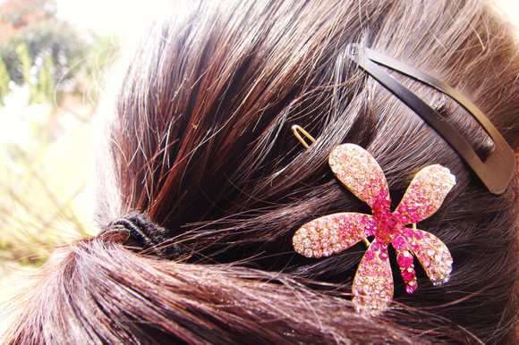
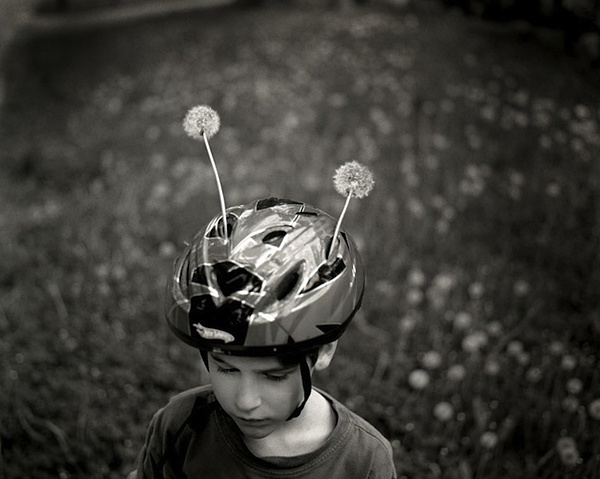

# ＜天璇＞深一点，再深一点

**其实每个人的生命体里面都会出现这样那样的情节，一个个拼凑起来，装点着我们不断流失的时光，我也不知道自己重复这样的话重复了多少遍，像是不同的意志从四面八方汇聚在同一节车厢，然后拢在一起，跌宕出一路的风景和美好，而随着到站的鸣笛声，四下又流散开来，分配到这个社会的边边角角，从而构成我们整个庞大的世界观。** ** **

# 深一点，再深一点

## 文/黄劲（安徽财经大学）

  纷乱和淡然这两个词现在不足以形容或修饰这些所谓时光流逝里的任何一个角落。 像把磁带里的黑灰色磁条拽出来揉成一团砸在地板上，扑扑的两声后，就再也不动弹了。   小时候里的真实场景。在老式连体的衣橱和写字台前。把父母收藏好久的磁带拿出来，为了里面的磁带条而把小手伸进去，拉出一段来，然后把剩下的剪断。可能每个人都会问这样一个问题，以最初的原始意识对事物做出评价的时候，自己会做出怎样的反应。在某个契机恰好应和了这几天的情绪，手心一面已经被时节摧残得掉了一层皮，每年的这个时候，蛇一般地褪掉一层，然后露出粉嫩的新肉，忽然之间，就不经意地裂开了一道小口子，生疼。那要是再沾上一点洗衣粉，抓什么东西都是毛毛蹭蹭的感觉，手在脸上滑过去刺剌剌地作响，无疑这给烦躁又多添了一份情绪催化剂。 只是蛇的蜕皮是在长大，我的蜕皮是在衰老。   我们在一种叫做永续不断的时光里生活，被拖曳着，鞭挞着从一个地方赶到另一个地方，扬起皮鞭的监工戴着鬼魅的面具，一边将阳光鞭笞到我们身上，呲啦一声烙红白嫩的肌肤，一边夹杂着西风的冰凉，让渗透的鲜血迅速结痂。而我们就这样，拎着包，在由小及大的画面里，显露在茫茫朝前涌动的人潮中，身边的母亲被脖子上的孩子坠得低下了头，理发师们吸进一大把一大把的碎头发，呛得眼睛直泛白。 地球迅速转动，太阳直射点从北半球慢慢移至南半球，亚洲棉花价格的不断上涨，而澳洲的人们即将迎来穿红白泳衣的圣诞老人。     上个星期学校开运动会的时候出去溜达了一圈，也不是玩吧，仅仅是出去散心，看看老同学，见见好久都没碰面的朋友，如此这般，也花去了三四天的时间，从一个校园逛到另一个校园，从一个宾馆的床上睡到另一个寝室的被子里，和同学围在炉子边吃麻辣串，或者是嚼着鳗鱼饭听同学在边上抱怨怎么想起来到这家餐厅吃饭来着。在来来回回的火车上看到一张又一张不同的面孔，想来自己其实挺享受这样观察的经历，不同的年龄，不同的身份，抱着孩子的大妈也不知道是孩子的什么人，站在厕所门口一边哄着孩子不要吵闹，一边焦急地在拥挤的厕所门口打听着里面的人好了没有，农民工形象的大叔穿得又厚又脏，从列车售货员尖细的声音里掏出了十块钱，买了两根火腿肠和一瓶冰红茶，貌似没有找钱回来，就这样一个人蹲在人群的腿柱子之间，用牙齿咬开火腿肠的一段，狠狠地吃了起来。 其实每个人的生命体里面都会出现这样那样的情节，一个个拼凑起来，装点着我们不断流失的时光，我也不知道自己重复这样的话重复了多少遍，像是不同的意志从四面八方汇聚在同一节车厢，然后拢在一起，跌宕出一路的风景和美好，而随着到站的鸣笛声，四下又流散开来，分配到这个社会的边边角角，从而构成我们整个庞大的世界观。 你的脸廓为什么那么明净爽朗，线条锐利，完美的曲线在不胖不瘦的面颊上婀娜着，舞动着。 我被你干净的眸子吸引住了，一点点橘色的灯光从马路边小商贩的摊子上流入你的眼睛，电光火石之间，我看到了你的明媚，以及英华。而你呢，你有着微微上翘的薄嘴唇，轻佻，魅惑，在车厢的晃动中，光在你清晰的下颌上投下一块充满秘密的阴影，你就那样静静地站在车厢的角落，低头微醺。 而你的容颜为什么那么苍老干瘪，泛黄的瞳孔焦灼暗淡，像是一块死去了的琥珀，凝固着岁月的无言。

  迷惑的永远是人类，在这样的五光十色之间，选择是一件教人难受的事情，我们无法从远古取来光明之火指引我们前行，也无法从后世拿来希望教导我们淡定，我们用我们的血肉之躯在灵魂的吸引下做出我们最本初的抉择，是选择不离不弃，长相厮守，还是选择把照片中的两人一剪刀剪成两半，放在香炉里面袅成一团青烟。请不要误会，这只是一个比喻，我无意说到感情。再说那种东西，也没什么好讲。 你们陪我挥洒了一个又一个风华正茂的书生意气，你们和太阳在一起，而我一个人在月球的表面面朝你们，点头微笑。也记不得是谁说过：月亮的光是太阳的恩赐，月亮要感谢太阳，可我初中的时候写过一篇日志，名字就叫月亮也曾是个贼。那也算是我偷你们的吧，在这也不赘述太多复杂的关系，只是知道，些许美好，些许感恩，也只能在这样朴实的文字叙述中得以生存，要是有片刻的修饰，怕是再多的情绪，就会教时间的耽误而损失大片大片的韵味了，又想到米兰·昆德拉说的，再多的模仿都是失败，记叙永远是我们最难做到的一件事情。 而我不断地用这样那样的词语来夸赞，可能也是因为柔弱或者是不坚强吧。 我总想帮这片文字找一个主线，可是我找来找去都找不到，我想了好长时间，也许我们的思路在一开始就被固定了下来，谁说文章一定要有主心骨，我说是在一种被沉浸的情绪状态里写出来的也未尝不可算作一种风骨。  如果曹植和七子他们不反对的话，那就请这么看吧。  

(采编：佛冉 责编：黄理罡)
