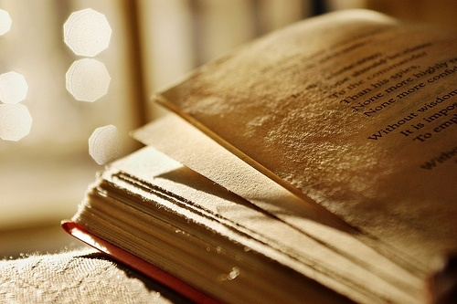
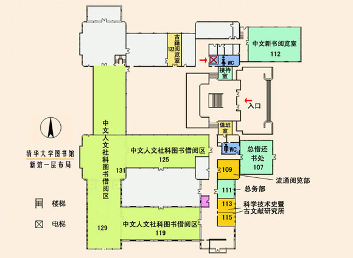
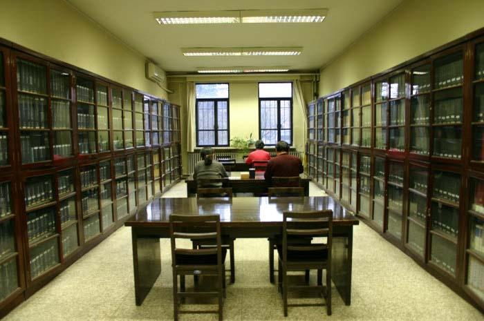
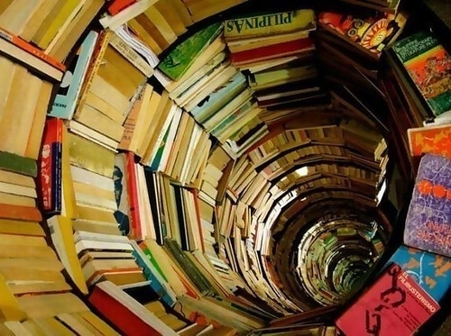
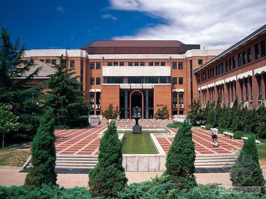

# ＜天璇＞清华大学图书馆的回忆

**好的图书馆，自然主要地看它的藏书，其次才是建筑——当然建筑也重要。建筑是脸面。心灵美固然好，但外在美和心灵美兼有，那就更好了。**

** **

# 清华大学图书馆的回忆

##  文/陆遥遥（清华大学）

 如果说这个日渐混沌的国度还有净土的话，我想清华大学图书馆算一块——清华大学则算不上了。 事实上，清华有N个图书馆，比如法律、人文、美术、经管、建筑、医学图书馆等。其中所有学生都能去的那个，我们称为清华大学图书馆，简称大图。然后根据建造年代的不同，大图老的那部分被叫做老图，新的部分也叫做（狭义的）大图。基本概念如此。 夫大学者，非大楼之谓也，乃大师之谓也。这是老校长梅贻琦先生的训诲，迩来被顾秉林校长抛到阴山背后。但余人以为梅校长的话很对。所以好的图书馆，自然主要地看它的藏书，其次才是建筑——当然建筑也重要。建筑是脸面。心灵美固然好，但外在美和心灵美兼有，那就更好了。譬如北大的图书馆，就是被清华建筑系设计烂了的；武汉大学的老图书馆气象巍峨，有国立大学的做派，山下那栋新的，实在不好置评。 清华的大图，真的很美。它实际上有两部分组成，分三期建设。中华民国8年，老图的东翼落成，当时还是一栋自成一体的四方建筑。民国19年在西侧加修了中厅和西翼，形成了中厅带动两翼的格局。1991年再在整个老图西侧加修（狭义的）大图。气象更加庄严、雄浑。校歌“吾校庄严，巍然中央”或有人联想到大礼堂，而我总是联想到大图。 

老图还是很有人文气息的。著名的话剧《雷雨》即由万家宝先生创作于彼。（狭义的）大图和老图在建筑上衔接自如，浑然一体，闲花落地听无声，乃清华关肇邺院士的手笔，屡获各种奖项。当时设计者的理念是：“尊重历史、尊重环境、为今人服务、为先贤增辉。”为达到此目的，避免突出新馆而置老馆于从属地位，他们做了这样的处理：为了，首先把新馆高大的主体部分适当北移，而以低层部分布置在前方，以求在尺度上与老馆保持协调一致；同时把主入口隐蔽于半开敞的前院之内，避免了对老馆的压倒态势；从南面扫视，新馆、老馆两个入口，一虚一实，避免了二门并列的重复感。事实说明，设计构想都较完美地实现了 所以新建筑，并不意味着越大越好，越新越好，越怪越好。新而有历史脉络——在学校就是文脉——的延续，传统而带有当代的性格，才是方家之力作。 老图和（狭义的）大图之间，有一T形水池，内一青铜喷泉，乃民国11年校友所赠，后移到此处。只是该池完全用瓷砖砌死，内无一丸泥土一茎水草。而馆方还不时放群红鱼其内，颇为造作。大概文科一点的学院所不为也。 我的同学大多常在法律图书馆（以下简称法图）。若非课间休息，去翻翻日文《判例时报》或者大部头《泰晤士地图集》，我则不愿意去。我对人文社会学颇感兴趣，对法学真不感冒。 很多人以为法学亦是人为社会学之一。算是吧，但差别实在很大。法学，说到底就是个应用技术。所以早期西方的律师，不是学院培养，而是事务所学徒制，和铁匠铺、面包房的学徒制并无二致。民事法、商事法，哪有什么费脑子的，就是个见多识广，熟能生巧。惟刑法比较类似哲学。大哲学家往往兼治刑法，比如福柯。大哲学家小费尔巴哈的父亲老费尔巴哈就是大刑法学家。老费尔巴哈做刑法的理由是，刑法来钱，等攒够了钱才能供儿子搞哲学。 我真不喜欢法学，所以不喜欢法图。而在（狭义的）大图的中文人文社科图书借阅区，连午睡都是安逸的。这个中文人文社科图书借阅区并不大，工科为主的学校，难免硬伤。譬如未删节的《金瓶梅》都没有。倒不是喜欢看色情描写，无非什么“一泄如注，四体无非畅美，一团都是阳春”之类，有甚稀奇！而是觉得，删节过的，就如人嚼过的饭，实在懒得去嚼。我又不是幼儿，还要你告诉哪个是糟粕，哪个是精华？ 上图131的地方，却有几架好书，为之流连两三年，到大四时已无书看。所以我的知识构成就是，什么都约莫知道点儿，但又不精深。百无一用，百无一用。 上图值班室正对一条夹道，沿夹道往西到头，有一门，推开还是中文人文社科图书区。但有一排沙发。我常常搬个五六本书过去，坐在沙发上，看累了就睡，睡醒了就看。这里的沙发油迹斑斑，清华的学生有很多真不爱整洁。且不说旁人，不洗头不洗澡到那个程度，自己怎么忍得了！据说当年有个师兄被美国大使馆拒签，理由是衣冠不整！此处西墙有窗，窗外就是西部大操场（西操）。我小时候读的历史教科书，上有五四时期爱国学生焚烧日货的照片，即民国8年在西操所照。西操西侧有体育馆，“文革”中批斗王光美，给她戴上乒乓球项链，就是那里。当然常年在西操的，是热心体育锻炼，要为祖国健康工作五十年而跑圈的校友们。 

上图可见，被中文人文社科图书区的125、131、119所围，有一个天井。略有植株。天气好时，坐看流云，或明或暗，也是一番享受。 一楼还有中文新书阅览室，总体说来，格调不高。 从（狭义的）大图入口进来，就是一陛台阶。拾阶而上，是二层大厅。中文科技图书、外文图书、闭架中文书从那里借。我在那里读的比较好的一部书是吴晗先生辑的《朝鲜李朝实录中的中国史料》全7册。“去年尔这里进将去的女子, 每胖的胖, 麻的麻, 矮的矮, 都不甚好。只看尔国王敬心重的, 上头封妃的封妃, 封美人的封美人, 封昭容的封昭容, 都封了也。王如今有寻下的女子, 多便两个, 小只一个, 更将来。”居然这是明皇帝给朝鲜国王圣旨，还是南京话！ 二层还有馆际互借处。清华的人文社会学图书还是偏少，比如《国榷》都没有，要到国家图书馆借。这还是让我小震惊了一番。 三楼有个工具书阅览室。记忆中里面有好几部百科全书：比如台译《大不列颠百科全书》，比如台湾的《中华百科全书》。“中华”这个词基本被他们用了，我们只能用“中国”。比如我们有《中国大百科全书》回避之。他们叫中华邮政，我们叫中国邮政，他们叫中华航空，我们叫中国国际航空。所以台湾参见奥运会，叫做“中华台北”。而大陆官媒，故意叫中国台北。台湾认为那是矮化他们的“主权”。 这个《中华百科全书》对大陆完全按照“匪区”来写。一张医院前江南人习见的人力板车上躺着一老妪的照片，该书加的文字描述就是，连病患都没有公共交通工具可以利用，大陆人民的悲惨可见一斑，云云。不过确实也如此。该书对毛泽东词条的描述，简直就是“鞭尸”。当时读来，就想，哎呀，居然能把这书放在图书馆啊！清华毛派甚多，尤其工物系，要是他们看了，岂不想焚书！ 老管现在主要地成为自习场所。那个地方要是没有老馆艳后去讨嫌，实在是个圣洁的地方——当然，偶尔也有围绕占座和反占座的斗争。 其中厅二层的闭架书库，收藏了全部日文书籍。其中大量笹川良一的基金会的赠书。 这个笹川良一在抗战时期，是有名的军国主义者。他曾去意大利会见过墨索里尼，拥有私人武力高达1万5千人，且有战斗机20架。战后他被盟军以甲级战犯的嫌疑收监，虽然之后被不起诉释放，但总之是个军国主义的巨魁。二战后他成为大富豪，开始致力于社会慈善事业，一心想拿诺-和平奖，大笔援助南太平洋岛国。有钱能使鬼推磨，南太平洋岛国就把他当做太上皇。比如他曾经招集南太平洋9国元首访华。一个商人，能召集9个国家的元首，出访另一个国家，恐怕在世界外交史上都是空前绝后的。当然，他没能拿到诺奖，大概因为评选委不想侮辱日本人民。 笹川良一晚年致力于中日友好，他设立的单项“笹川日中友好基金”高达100亿日元，而他死后的留给儿女的遗产不过50亿日元。可谓传奇人物。 笹川赠书格调很高，绝非敷衍了事。其内容涵盖了文、理、工、法、农、医诸学部。理工科的技术类书籍，有无过时，我不敢说。但人文社会类的，我敢说它邺架巍巍。光围绕江上波夫对日本史解读提出的骑马民族袭来说，我就读过至少十本尖端、一流著作。当然人文社会类图书，往往不在新；反而是沉淀的，窖藏的更好。因为人文社会学本来就是极少数立言，被不断地历史地再解释的过程。遗憾的是，能读这些日文书的人太少了。 

老图还有个科恩图书室，内藏美国波士顿大学科恩教授捐赠的2万余册私人藏书。我每常想，为什么西方人，和中国无甚渊源的人，愿意那样慷慨地资助中国的文化事业。而中国的暴发户，宁可人手三四辆宝马，不愿捐赠给哪怕自己出身的小学几架图书呢？ 这也难怪，虑不及将来。临大事而惜身，见小利而忘命，此国民劣根性。譬如我们的校友，做了几年皇帝。应该说荣华富贵、权力欲，这些不都满足了？总要想想历史评价的问题了。但他不想，他就是不想，不说他“我死以后哪怕洪水滔天”，但“前人栽树后人乘凉”的觉悟是没有一星半点的。 清华图书馆多历沧桑。抗战时老图为日寇所据，被改成战地医院和军火仓库。这期间馆藏损失达17万5千余册。而清华园则被日寇改成战俘营。国军上尉连长花岗暴动的幸存者耿谆先生回忆，当年他和其他被俘的战士，先被羁押在清华园，“约在农历七月初，敌人把我战俘身体健壮者，挑出300人，由北平（陆注：清华园站）上火车，送到青岛海岸。当天傍晚，将我300名战俘驱上轮船，送往倭国”做苦力挖煤。这段不是校史的校史，竟有几个清华人知道？ （狭义的）大图和老图连接处，有一门阙。我们往往从下面穿行。门阙东侧，是一个报告厅。所谓清华MBA的课程就在那里举行。清华大学图书馆其实也不是什么净土。 老图的东北侧有一人工土堆，名为情人坡。周围有连廊藤架，有婆娑竹影，有假山石凳，年轻的时候常在那里和人卿卿我我，扣扣摸摸。 大图径西就是西北门，往北就是北门，出了门都是小馆子。我呢反革命的小酒天天醉。醉归，醉归，三更夜，红灯满路辉。有时候尿急了，难免卸在大图后面，那棵大雪松下。 

