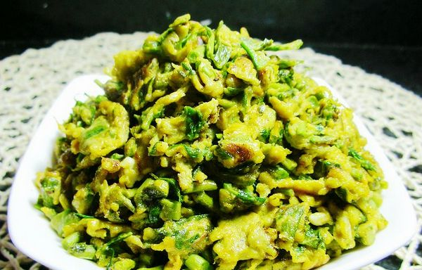

# ＜天璇＞清明的香椿

**在袁子才的《随园食单》里我是找不到关于香椿的条目的，但是有一个网站的《随园食单》里却有，不知道是不是因为版本不同，引之供食友鉴别：“山西平定州方物也。鲜者拌豆腐，到处有之，嗜者尤众。”汪曾祺的鸭蛋我的香椿，不管袁枚写过还是纪昀整理过，我最大的愿望，就是能在成都找到一个吃香椿的馆子，只要一个就好了。**  

# 清明的香椿

## 文/张信宇（四川大学）

 

老家在浙东山区，屋子周围、田间地埂、水阴山阳，有一些稀落的香椿树，从不成林；每年清明左右，香椿叶儿苗儿就按时长出来了，祭祖上坟，比起清明果，我更喜欢吃香椿。

可是这喜欢却“来之不易”。我并不是天生就爱吃香椿的。记事中最初吃到的香椿，一点甜味也没有，微苦；闻着气味虽然是香的，但当时并不欢喜香的东西，比如奶奶念佛经的阁楼我就不爱去，夏天宁愿喂蚊子也不要母亲点蚊香——反而很喜欢在放火炮完了时冲进白烟，拼命吸嗅着那股硫磺味儿硝烟味儿，并感觉自己被烟雾缭绕周身，特像太上老君身边的童子。当然味蕾不满意是主因，我一直认为在淮水以南武夷以北度过童年特幸福，许多菜式都酸甜有味，惯坏了江南小孩儿的刁钻口味。但是最普遍的经验是这样的，不仅仅是香椿，所有不爱吃的东西似乎都是大人眼里的营养食品，而那种吃多了就不长个儿的则都是我们爱吃贪嘴的。对于长个儿的热切期盼和反向的恐惧笼罩着我的童年，并因此经常无可奈何地跟自己舌头过不去，这是阴，这肯定是影。

不知是因为年龄的自然增长，还是缘于分别在鲁粤生活过，总之后来“味觉大开”，一年一年的香椿吃下来，竟然逐渐成了我最爱吃的一种时令菜。每年的清明谷雨之间，总会趁假期或周末，与父母怀着不同的目的回到老家，祭祖上坟，吃刚抽芽的香椿。对于玉山人（玉山是我家所在的旧镇名称）来说，清明是比过年还要重要的节日呢。今年在成都，太远了，母亲说我不必回家，家里的事情也不多；其实即便家里的事情多，我也还不懂如何去承担责任，只是想念一些人事，春风不忍绿新坟。

家里对香椿的做法一般有两种，香椿炒蛋和醋溜香椿。作为一个半吊子厨师，会做一些家常小炒简汤，但在清明期间，从来不需要也不允许我掌勺，所以我是不会做这两个菜式的。可毕竟自诩聪明，香椿炒蛋跟番茄炒蛋应该是无甚区别，假使真的赶鸭子上架，想必也可以不辱使命，至少不会炒焦。为什么敢夸海口呢？因为知道香椿可以生吃，实在把握不了火候，尽量往嫩了炒还不简单！先打蛋，和均匀，一个色儿了，下到油锅里，使劲炒，下香椿，加盐，再炒，马上起锅……以上纯属想象，不记得母亲是怎么做的，还是上网查，才知道香椿和蛋还可以在未下锅前就和匀，两样做都可以，鸡蛋先下锅的话可以炒出大块的，蛋椿会分开一点，适合挑食的小朋友吃。醋溜香椿就更简单啦，让香椿和醋滚滚床单嘛，人虽没机会，成全手中菜。然而根据印象，又保险地搜索了一下，不管把香椿做成什么样儿，下锅下盘之前都须用沸水焯一下，是为了除去过重的硝酸盐和亚硝酸盐，保证健康。记得去年清明，情绪低落，又无出口发泄，独吃了一大盘香椿炒蛋，却不是因为味道如何好；后来，记不清是爷爷还是母亲，还为我可能中微毒而担心过，好在也没出什么事，体检、五模、高考、填志愿，与同学们相同，一路走了下来，岁月静好，现世安稳。

这几天特别想吃香椿，没有由头地想吃，大概是时令到了，人随四季，阴阳调和，自然而然地就对某种东西产生了需求。打电话给母亲，又在打麻将。我说，香椿摘过了么？

妈有点惊讶的样子，香椿啊，早就吃过啦，清明回去的时候就吃了，出来还带了很多，你想吃了？要不要叫爷爷晒点香椿干出来给你寄过去？碰啦碰啦，哎等等我碰了。但是头茬已经摘了啊，后面的味道就不是很好了。要不要嘛，要就给你寄。哎，寄了你也没办法烧啊。嗯，可以给张老师带一些的。你自己说吧，要不要？

我有点无措，说，我自己跟爷爷说吧。你好好打，多赢点。

挂了电话又打给爷爷，还好，打的早，爷爷还没睡，说了几句，我就问了，香椿吃了吗？

爷爷也略提高了音调，香椿？吃了啊，前段时间你爸爸、伯伯还有姑姑他们回来，都一块儿吃的，你要吃吗？我留着很多呢，冰箱里冰着，等你回来也可以吃的，稍微会差一点，没事，可以吃的，一样的……

在袁子才的《随园食单》里我是找不到关于香椿的条目的，但是有一个网站的《随园食单》里却有，不知道是不是因为版本不同，引之供食友鉴别：“山西平定州方物也。鲜者拌豆腐，到处有之，嗜者尤众。”汪曾祺的鸭蛋我的香椿，不管袁枚写过还是纪昀整理过，我最大的愿望，就是能在成都找到一个吃香椿的馆子，只要一个就好了。

 

（采编自投稿邮箱；责编：应鹏华）

 
