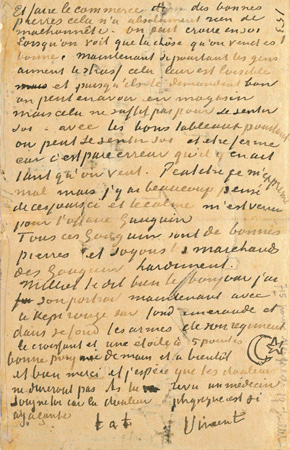
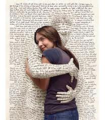

# ＜天璇＞满枕信笺破梦来

**初中到现在的几年间，自己的阅读兴趣虽不断地转移，但每当看到静静压在抽屉下面的这几封信笺，看到拥挤的书架上那一排理群师的著述，心里总会升腾起温暖和感动，还有鼓舞和力量。就像此刻外面的夕阳，映在窗户里，散开成柔软的光。曾经有人把一封红线短笺放在枕下。我不知道这意味着什么，但我愿意想得浪漫一点：每一封从云中飘落的信笺都会在她们的梦里去寻找各自的回音。**

 

# 满枕信笺破梦来

## 文/江帆（华东政法大学）

 

初三那年，有一次被老师问及“最开心的事情”，我几乎未作多少思考就回答：“收到远方的来信”。

那种寄寓在“遗我双鲤鱼，中有尺素书”、“云中谁寄锦书来”里的期盼、急切和美好，会不会在信息时代的短信电话Email的席卷下渐行渐远？赫胥黎曾预言，在一个科技发达的时代里，造成精神毁灭的敌人更可能是一个满面笑容的人，而不是那种一眼看上去就让人心生怀疑和仇恨的人。

#### （一）

回想自己寄出去的第一封信，完全是种偶然——

记得初二下学期，也就是2005年的3、4月份吧，我在一份名叫《作文通讯》的杂志上看到一篇《佳作欣赏：聪明人和傻子和奴才》，当我饶有兴味地读完时，才发现这是鲁迅《野草》里的作品。虽然当时我已经草草翻过《呐喊》和《朝花夕拾》，但对“鲁迅”，确实是没有一丝的感觉，后来开始阅读余杰的一些文集，才慢慢地试图去主动重新认识“鲁迅”。而真正勾起我兴趣的，却是这篇《聪明人和傻子和奴才》——鲁迅竟然能写出这样的笔调，竟然也有这样的文风！

接下来的事情就很顺理成章了，从《野草》开始慢慢地重读鲁迅，在收获了巨大精神资源的同时，也产生了很多困惑与不解。几乎是在同时，一本阅读杂志上刊出钱理群先生与中学生讨论鲁迅的信札，也不知自己是哪里来的勇气，竟也学着去给理群师冒昧地写信，但地址不清楚，只好寄到北京大学中文系。当这第一封信贴上邮票投入信箱之后，兴奋与紧张也逐渐消失，自己对这位著名教授能给一位唐突幼稚的初二学生回信，确实不敢抱很大的希望。

直到将近两个月之后的7月初，那时学校正在组织初二升初三的学生暑期补课。班主任将一个白色的邮包递到我的课桌上，寄信人姓名里竟然填着的是“钱理群”！我迫不及待地等到放学，抱着邮包直接冲回家，慌慌张张却又小心翼翼地拆开邮包，里面是先生的两本著作，扉页上都写着“江帆同学 存念 钱理群”。第二天一早，我收到了理群师的信：

 江帆同学： 

你好！

原谅我拖了这么久才给你回信，我杂事太多，老是欠债不还，真没办法。

鲁迅的杂文实际上现实针对性和超越性的统一，他是有强烈的现实关怀的，因此他的作品有时代性；但同时他对现实问题的分析，又常常深入到历史的深处，人性的深处，因此具有超前性，以及长远的生命力，超越了他的时代，而成了今天（以及以后）的现实存在。

《野草》确实令人震撼，我觉得最好的阅读方式是反复诵读原文，感受其中意蕴，朦胧感悟，而不必深究其意义。当然，我是写有有关研究文章的，不过那是我的《野草》观，仅能供参考。而且这类解读、分析是以将鲁迅《野草》的丰富观、复杂性简化作为代价的。可以寄送出两本给你：《心灵的探寻》与《与鲁迅相遇》，但要过几天寄出，假期中你能去学校取吗？

来信还提到冯友兰。冯友兰最大的问题是一直想当“国师”，于是，总要依附最高统治者，前有蒋介石，后有毛泽东，后来想用《新编》重塑自己，实际已力不从心了。

匆匆写此

祝顺

学安

钱理群

6月30日

#### （二）

可以想象，这样一封信和两本书对一个初二学生的鼓励是多么巨大。从这之后，我便开始更进一步地阅读和思考，自己的心得和疑惑也不断地记录下来（可惜的是，我放假回去竟然没有找到自己初中时候的几本读书笔记，那段时间的思想轨迹再也找不回了），也继续保持着与理群师的精神沟通与信件往来。也许是由于自己年纪太小，对正面的阅读和思考感觉不“过瘾”，便直接跳到背后来寻求鲁迅的不足和局限。于是，就有了这封回信：

 江帆同学： 

你好！

来信已收悉，因为杂事太多，直到岁末才来集中偿还倍债。

鲁迅那一代人对中国传统文化的态度，今人已很难理解。在我看来，鲁迅是真正把中国传统文化吃透、看透了的人，他与中国传统文化有一种十分缠绕的关系。你说的很对，传统文化中的糟粕和精华纠缠在一起，很难分清的。我常说中国传统文化博大精深，很难“进去”，进去以后又很容易被他俘虏，不能“出来”。这就要求我们，在面对这样的博大精深的传统，要有极强的独立自主性，一方面要勇于进去，勇于吸收，同时又保持一定的警惕，不为其俘虏。为做到这一点，一方面要有独立审视的态度与眼光，一方面要大量吸取外国文化，有了比较，才“爰生自觉”。而这一切的目的是为了促成现代新文化的创造。我以为这就是鲁迅对传统文化的基本立场。

而我们这一代人（也包括你们这一代）与鲁迅那一代不同，基本处于还没有“进去”的状态。在这个意义上，强调要学习“国学”是有积极的一面的。但现在的问题是：认真学国学的少，炒作的多，最后成了一个表演。而且又走向“中华中心主义”，完全拜倒于传统文化，缺少独立审视态度，甚至因此排斥学习外国文化，这就走上了“固步自封”的恶路。

来信还提到了鲁迅有没有错误或者局限的问题。有的人认为鲁迅的局限在对传统否定太多，我的看法却不同，在我看来，鲁迅在将中国传统文化现代转换中是发挥的最好的，甚至说他已经发挥到了极致，因此，鲁迅如果有局限的话，可能不是他个人的局限，而是中国传统文化的局限。但这个局限究竟是什么，坦白地说，我现在也说不清楚。因为要真正突破鲁迅的局限，击中他的要害，就需要具有比鲁迅更为强大的思想力量和精神力量，这点我做不到，这也就构成了我的局限。因此有人说“钱理群走在鲁迅的阴影下”，这批评是有道理的。对于你们这一代，要真正“走出”鲁迅，“走出”传统，第一步先得“进去”，而进去时一定要有自己的独立的态度与立场。

匆匆写此

致

新年的祝福！

钱理群

2005.12.31

#### （三）

自从我2006年进入高中之后，阅读兴趣从鲁迅扩大为整个20世纪中国知识分子的历史，越是钻进去，就越会慨叹与遗憾，而理群师的这封短笺，也与我产生了“共鸣”：

 江帆： 

你好！

你所谈到的，都是这一个多世纪以来知识分子的道路选择的问题，既是历史问题，也是现实问题。对于我们这一代，更是与我们的生命联结在一起的。我自己就曾背叛过五四传统，背叛过自己的选择，也曾看不清鲁迅这样的巨人，因此我的关于中国知识分子的研究，带有很大的自我反省、自我赎罪的成份，那真是和着血与泪写成的。你作为一个刚开始走上人生之路的年轻人，对这段历史感到兴趣，这是我深为感动的。因为今天的统治者正在强迫人们，特别是年轻人遗忘这一切，于是，就有了“拒绝遗忘”的挣扎与努力。

我也挑选了几本书寄送给你，供你参考和阅读：《1948：天地玄黄》、《大小舞台之间》、《话说周氏兄弟》、《丰富的痛苦》、《王瑶和他的世界》。

因为后天我就要外出开会，到这个月20号以后才回来，请在20号以后给我来个电话，告诉我书应寄到哪里，因为放寒假了，我担心书寄到学校会收不到。

匆匆写此

致

新年的祝福！

钱理群

2007.1.3

#### （四）

在高一快结束的时候，学文还是学理的问题就摆在了面前。我最终还是选择了理科，既是因为对高中文科课程的反感和厌恶，同时也考虑到，如果去学两年文科，可能什么都学不到，还会丢失了自己刚刚培养起来的朦胧的独立思想。理群师关于文理选择的回信，也给了我莫大的鼓励和鞭策：

 江帆： 

你好！

我认为你做出了一个正确的选择。

中国的文科教育其实是误人的，不如自己自学。更重要的是，中国更需要有人文关怀的科学技术人才。我是一直主张“文理交融”的，你应该以此作为自己的培养目标。不过，如你已经意识到的，中国的科技教育是不重视人文关怀的，因此，你仍然会有孤独感，对此要有充分的思想准备。但你已经逐渐走向成熟，可以不管这些，走自己的路。上了大学以后，可以选修或者旁听一些人文方面的课程，也可以寻找一些志同道合的朋友。不过，这都是后话。你现在的任务是集中精力，准备高考，不管你对眼下的高考体制有何看法，你现在只能适应它，并在它的范围内，力争考出好成绩，以使读一所较好的高校，为自己一生长远发展创造一个较好的条件。

尽管你以后不再学文，但需要我帮助时，可随时找我，我们应该是“朋友”了。

匆匆写此

祝

好!

理群

11.4

可我却自觉辜负了理群师的期望，在紧张备战高考之时，仍不忘偷闲读书，虽然高中学理科，但最终却还是遁入“文”门，来华政研习法律，不知算不算“殊途同归”？

初中到现在的几年间，自己的阅读兴趣虽不断地转移，但每当看到静静压在抽屉下面的这几封信笺，看到拥挤的书架上那一排理群师的著述，心里总会升腾起温暖和感动，还有鼓舞和力量。就像此刻外面的夕阳，映在窗户里，散开成柔软的光。

曾经有人把一封红线短笺放在枕下。我不知道这意味着什么，但我愿意想得浪漫一点：

每一封从云中飘落的信笺都会在她们的梦里去寻找各自的回音。

 

（采编：麦静；责编：麦静）

 
