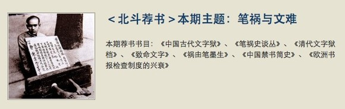
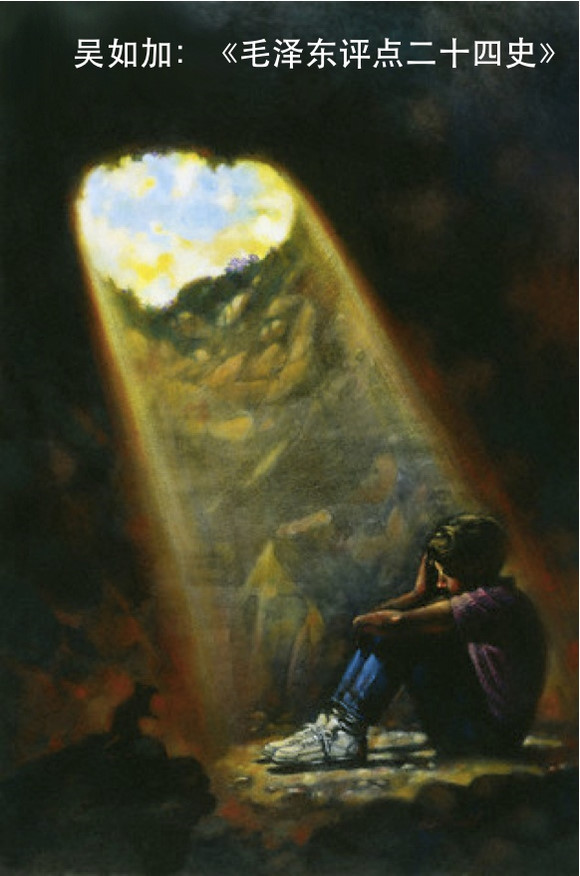

# ＜天璇＞灾星

**改变世界的途径有很多，商人靠苦心经营，学者要著作等身，匠人艺人磨练技艺。但是青春和改变之间，总是有着讨论不完的“更好的世界”。而大学生们的交流，不再是一个极其受限于地域的时代。我们知道改变很难，老一辈更是以不可言喻的方式把知识传给了后代，可不仅如此，他们还把梦想和希望留给了后代**。 

### 

### 

# 灾星

### 

## 文/李卓然（北京体育大学）

### 

### 

### －灾星－

林语堂77年前写《中国人》时就有“在中国，如果一个人有公共精神，他就会有危险。”所以，在中国，如果一个男孩具有公共精神和社会意识，他将会是他家庭的灾星。 我曾尝试用过于粗糙的方法表达我身边的人： 他自己必须好，别人好不好无所谓； 他自己必须好，别人不好他会难受； 他自己必须好，别人也必须好； 他自己好不好无所谓，别人不好他会难受。 他自己好不好无所谓，别人必须好。 上述规律中的要素排列组合没出现的，是我还没有遇到。这种表达方法的确太过简单。我是看何兆武翻译的东西长大，对他所谓的“幸福”判断标准深以为然。在《上学记》中，他说：“幸福的条件有两个，一个是你必须觉得个人前途是光明的、美好的，可是这又非常模糊，非常朦胧，并不一定是什么明确的目标。另一方面，整个社会的前景，也必须是一天比一天更加美好，如果社会整体在腐败下去，个人是不可能真正幸福的。”可我看到多少人，从此时此地望向未来，只要他关于自己生活的事斜率大，哪管时代的斜率负值累累。他们让大街瞠目结舌，我听见政府大楼笑声粗野。 朋友里那么多的人：拒绝联姻、拒绝公务员、拒绝在商事工作里给公权力行贿、拒绝入党⋯⋯你看！千万个指头朝他们身上戳，正当他们把时代的山脊翻越。亲人指责他们死脑筋：“几千年都是这样！”，“你以为你了解社会？”，“你对父母不负责任！”这些话的寒气浇到周身。是啊，一个人，不是有原则坚持走自己认为正确的路，就不会焦虑和迷茫。那些不祛魅的关爱像刺刀刮光他们的羽毛，抓伤他们的心肠。“真是知识越多越反动！”，“学出息了，连传统都丢了！”，好吧，他们是舶来的、格格不入的，尽管用愚孝去消灭吧。年轻的他们在所不惜，任凭每年春夏疯狂肆虐。 

 如此说来，吴如加算是“他自己好不好无所谓，别人必须好。”的人。我们交往这一年里，他对穿着、吃食都不讲究，工资除了贴补家用、回故里探望长辈，余下的都买书了。可能你会说，宅在书斋里的人大半都是这副模样啊，是的，所以这种人大半会遇到成为“灾星”的人生困惑。 就在上个月，吴如加由于“具有公共精神和社会意识”被市公安局找了4次，其中传唤2次。除了因为他可能被刑拘或者劳动教养而担惊受怕，那些精神施压上的威胁骚扰还是让人怀疑人生，暗自叹气。从书本学到的各种主义，把妹装逼时口若悬河也只是及格。书本咯，要写“自由”“公平”还不容易？可是把”梦想”变成活例的工作，只显示了“血”“肉”“模糊”。熊猫在热带雨林咖啡找他“喝茶”，直言不讳他没犯法，就是“政治”问题。我不知道有多少人敢说自己懂什么是“政治”，继而支持他关心他，或由此嘲笑他讽刺他。 心疼他的人都说，他才二十四岁。可我坚持说，他可都已经二十四了。 但是，有几个人，我面对他们没法张开嘴，说出一个字。 我们不知道如何面对因为“喝茶”而带来的威胁骚扰，就像地富反坏右不知道如何躲避时代穷凶极恶的屠杀。自然，我也找不到教材学习如何有效处理男友被“喝茶”而带来的生活颠簸，更没有大量教参指导我怎么和“因为儿子被‘喝茶’而忧心忡忡的男友父母”进行沟通。 

### －孽子－

“谁顶不住家里的压力，躺倒在纸玫瑰丛中酣卧， ——这种人目前还没资格迎接未来的强有力的生活。 ” ——符拉基米尔•符拉基米罗维奇•马雅可夫斯基 

### －关于“血”－

如加：“我是公民。” 如加妈：“你不是牺牲品。” 如加妈：“儿子，我不管你做什么，只想你平安。古语说‘枪打出头鸟。’” 如加：“妈，那是俗语，古语有的，是‘文死谏，武死战。’” 如加妈：“毕业就去做事的律所也很有名，为什么就不做了呢？” 我：“⋯⋯” （当时他在律所负责一个德国客户的业务，其中一个文件需要在区地税局盖章，被刁难n次，第1次只说：两段要分开写；第2次只说：这两个不能在一行；第3次只说：间距不能这么大⋯⋯偏不一次说完。每次都要寄送回德国然后回来再被拒。摔！效率何在！于是合伙人准备了2张购物卡，让他给地税局送去。合伙人没有错。傻逼的当然是公权力寻租的地税局工作人员。他也真贱，就值2张购物卡。但是吴如加因为这个睡不好觉，吃不下饭，一直没送。合伙人说，小吴，这个事你做不了是吧？好，下午我去送。 阿姨，他因为这个掉过眼泪。我记得那个晚上，吴如加喝得玉山颓倒，一边哭一边喊：“让我给税务人员送购物卡，那就是行贿！一块钱都不行！我绝对不干！绝对不干！！”反反复复，一遍又一遍⋯⋯他一掌拍破玻璃杯，碎琼一片，血在我的裙子上溅开。我忽然明白为什么有人毁家纾难，甚至蹈海明志。然而，在制度的夹缝里要活得好，活得体面，活得滋润，行贿的合伙人没有错，是吴如加不求活得舒适优越，关于行贿的原则，我信他一辈子都不会变，变了他就死。） 如加妈：“律所很好，他外语又好，只做非诉讼，就算他没兴趣商事业务，年薪也有个8万。说不做就不做了。他现在的地方叫什么？” 我：“公盟。” 如加妈：“那是做什么的？百度它，‘根据相关法律法规和政策，部分搜索结果未予显示。’” 我：“维权。全部免费。主要项目有拆迁救济、《中国信访报告》、教育公平、选举关注等项目，还有个案法律援助。” 如加妈：“那他是负责教育公平？都做些什么呢。” 我：“对，他负责教育公平项目。 随迁子女就读地高考的必要性/可行性分析 平衡各省高考招生比例的必要性/可行性分析 北京教育资源均衡的必要性/可行性分析 …… ” 如加妈：“听起来都是研究哦。那怎么会被警察找呢？” 我：“完全不犯法的。 偶尔也组织研讨会，让学者专家讨论。还有让在京随迁子女的家长签字支持教委在这些问题上改革，会去教委进言上书。” （把有“问题”的人撵出北京，曾经他们是：地主、富农、反革命分子、坏分子、右派分子、资本家、黑帮分子、反动军官、伪警察、伪宪兵、特务。如今他们是：访民、农民工、双反分子、有下厂经验的马派、办杂志的学生、博士学历以下的外地人、总资产低于1000万的中产、中联办和国台办奸细、勾结境外势力的艺术家⋯）

如加妈：我好担心他。知道他被传唤，我真想现在就飞到北京去看看他。 我：阿姨，你别担心。没什么事的。 （我不担心⋯路是他自己选的。常有人瞧不起“以卵击石”，大意是说24K金的学理研究提议，被社运和搞公民运动的人做出了屎一样的执行⋯⋯去死、去遭罪的事，谁适合？没人适合。我还觉得吴如加只适合书斋呢，看书的效率和习惯都很好，除了特别守时，哪里适合组织集会这种工作？谁的性格命理星座属相血型专门适合被传唤、刑拘和劳教？） 如加妈：“我看了许志永的博客，有一篇写道一个滕律师，就失踪了。怎么能让人放心。” 我：他不会的。没事的。 （没有教参，我开起了空头支票。其实，我问过自己，如果是我自己的儿子，将心比心，我会放手让他去么？我说会！我希望他死得其所。我心里满是“杨继盛”，也许我中了革命的毒，我看到国是日非，张口就问民不聊生聊什么？然而别人没理由跟我一样，阿姨倾诉对儿子的挂念，我却三缄其口。我有些恨自己。 10年9月，我第一次在厦门见到他父母，他们对我非常好。很多小事都让我感受到吴如加能为人正直，跟他家教绝对分不开。 我们当时刚刚交往，那么快就见父母其实巧合，北斗（ibeidou.org）的朋友约在厦门聚会。他父母是少有的善解人意，怕有南北差异，关心起居，尽可能地带我熟悉厦门岛。记着我爱吃的东西，后来还陆续邮到北京。但我记忆最深刻的，还是一个拥抱。因为领导双规，我在厦门落地的第一天突然被组织喊走，当时的我不知道要怎么交待问题，心里十分焦虑，虽然脸上装作没事，他妈心细还是看出来了。第二天在机场，她就一直跟着人流排队，送我到最里面登机安检的闸门，跟我说工作不要太辛苦，也不多问，最后分开的时候抱了我一下。） 是的，父母其实深知那些官为钱得，政以贿成。父母不喜欢“黄四郎”，却不希望自己儿子是“张麻子”。尽管知识分子对抗权力而失声自戕的悲剧上演了如此之多，读书人却总是不厌其烦地重蹈覆辙。他们不能容忍作为权力之恶的被动帮凶，也难以承受对权力之恶的主动漠视。当权者对他们削株掘根，几千年前，就用最恶毒地言辞说他们“惶惶如丧家之犬”。制度没有对吴如加肉体消灭，但是，他拍碎的那只玻璃杯的伤口，止不住淌血。我看见，仿佛对长辈疼爱最后的挣扎留下了镌刻的字迹，永远在他右手，闪着血光。他可贵的生机冲散了恹恹若绝的虚伪和冲突。 被传唤，我知道平常静电打雷他都怕，性格绵软的他态度却强硬，嘴犟得很。我又想起曾经的他，什么都没有，只有一支笔。他的笔没有名望，他的笔清瘦廉价，也许他一直用这支笔写下去，可他笔下的力量撼动了我的世界。一年前，他就那样走上前来——成为我英俊的恋人。

### －关于“肉”－

那天看了一个86年的意大利电影。背景是70年代的意大利，社会动荡，社会运动和极端左派组织非常活跃。正在筹备结婚的女主角，未婚夫却因为参与政治运动坐了牢。她内心焦虑，不知道爱人什么时候可以出来，很惶恐。没有陪伴的爱渐渐褪色，让她在偶遇正太后迅速堕入情欲的释放中去。 只要我支持你的政治主张，和你立场一致，只要我爱过你，我就会一直爱你？这个逻辑并不成立。 君扫危难我扫黛，描眉画眼，花枝招展。 吴如加最近在看： 《关于彻底肃清暗藏的反革命分子的指示》（1955年8月） 《关于各省、市立即筹办劳动教养机构的指示》（1956年1月） 《国务院关于劳动教养问题的决定》（1957年8月3日颁布） 《国务院关于劳动教养的补充规定》（1979年11月29日颁布） 《关于进一步做好刑满释放、解除劳教人员促进就业和社会保障工作的意见》（2004年2月6日颁布） 近年，访民被劳教的不在少数，期限大多数为一年，少数为一年半左右，极少数为三年。 所有这些规定里，只要被判定成坏分子，等着被劳教吧，妥妥的。所有文件里都提到“一切反革命分子都是坏分子。”然而坏分子中的“政治骗子，叛变投敌分子，流氓分子，品质极端恶劣的蜕化变质分子。”的确很难界定耶。（这操蛋制度不终结，感觉不到是依法治国） 

 吴如加问我，如果他进去劳教了，我会不会给他送书，我说我早就想过，“百谧一书”，如果人家允许带Kindle，就来个大满贯。如果不让，只好送你《毛泽东点评二十四史》，起码够看三年。他掐住我的脸喃喃：出事了，当然做风流寡妇。（有没有立刻想找《手把手教你如何送你的男人去劳动教养》？） 这一年，因为出差，我们一共分开了17天。你哪里都好，唯一伤害我的，就是你初恋女友时隔多年提出复合而有的一系列伴随行为。我自来不信会有一个花草芳菲的鼓浪屿，然而我愿意接受：像医院似的让人睡坏的男人， 像格言似的被人用滥的女人。 我尊敬她敢爱敢恨，我更珍惜被初恋念念不忘的爱人。若禁不住肉欲翻滚，早就屈服于金山银山。昨天是末世的慌乱，明天是尚不明确的未来，我们在熟悉的异乡， 我将自己一年年流放， 穿过鲜花， 走过荆棘。 只为自由之地。在欲望的城市，你就是我最后的信仰，洁白如一道喜乐的光芒将我心照亮。 最后，我只害怕一件事，短暂的煎熬，让我的等待有了一个“王翠翘”的注脚。 

### －关于“模糊”－

面对专制的铜墙铁壁撬动钉铆是一件危险的事情，又是一种无法抗拒的诱惑。 鞭子在手便打算驭农的人，并不真正想生活在阳光下，他们更多叹息为什么没有从父亲那里继承鞭子，或者天问鞭子为什么没从天上掉到自己手里。很多人把政治当时尚谈资，他们当中也有人遭受过专制的切肤之痛，可他们仍然只是想晒晒太阳。 强行抵押生命，去认同这种贫富差距下买房买车而成婚的价值观，不如直接去死。虽然我爱人的灵魂中不能有一茎白发，但他里面也不能有“年迈”之人对衰老和死亡的盲目反抗。我想用自己的命支持他在公盟做“教育公平”，可惜替代牺牲这种充满道德梦幻的句子已经破坏了对真理的忠诚。 母亲哭够了，父亲始终不曾言语，他们总在出其不意的时刻砸碎哪吒庙堂的金身。 生活中，我还没见过一个哪吒，除非你父母双亡，妻离子散。真的只有一死才能了结孽子夙缘。道统在，不死不能达精神之独立。即便吴如加的世界没有枯萎的顺从和黯淡的赞誉，他回望父权社会却充满温情。他又如何“剔骨还父，削肉还母”。不必有玲珑宝塔，吴如加已然心肝俱焚。让人难过的是，他深深知道不孝子在生活里要背负“无视传统和责任”的骂名，面对煎熬，他始终期待沟通谅解与父母接纳。 多余的我却不用遵守任何誓言，面对机枪扫射，我保证，我肯定后退。我愿活了又活，冲过一年又一年的时光。

但在生命的终点，我知道，我不想在任何一个广场遇到我亲爱的朋友们却只能道路以目。

血肉模糊，我重复着一切多余的话。

### －扫帚－

《春秋》记载，公元前613年，“秋七月，有星孛入于北斗”。 社会化媒体并不新鲜，人人网的成立，微博的诞生，都让当年赛博空间对于民众舆论的寓言一一兑现。

08年的时候，在那个以大学生实名制社交为基点的“校内网”，虽然，换了时代和空间，可年轻人，想改变世界的热情，依然萌发出了《北斗》。在北斗，大学生打破校际壁垒，可以畅所欲言。在这里讲话，可以不再使用某种权力意识形态的教条规范，而是彼此启发思考一些与好的公共生活有关的认知、判断、价值观问题：真实、好坏是非、不同知识重要性的区别、个性和个体尊严、群体身份认同和塑造。

改变世界的途径有很多，商人靠苦心经营，学者要著作等身，匠人艺人磨练技艺。但是青春和改变之间，总是有着讨论不完的“更好的世界”。而大学生们的交流，不再是一个极其受限于地域的时代。我们知道改变很难，老一辈更是以不可言喻的方式把知识传给了后代，可不仅如此，他们还把梦想和希望留给了后代。

这些灾星，孽子，拖着长长的彗尾，有些甚至迎着枪口的狂吠，挺进不歇，声称自己夜夜为自由而害相思病。 我的灾星，如果想你们，就看看天。

### 

（采编：陈轩 责编：陈轩）

### 
