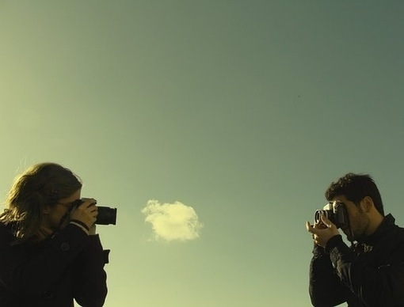

# ＜天璇＞爱情故事

**我爸和我妈又在大学校园里散步呢。想想这真是一件伟大的事。他们在这个园子里散步，也得有二十多年了吧！他们在这个园子里相识、求学、毕业工作、结婚生子、送子远行，在同一个园子里散二十多年的步，从刚开始的懵懂，到后来的恋爱，再到后来的互相扶持一路奋斗，直到今天悠然散步间给女儿打一个长途电话……同样的路途，从音乐喷泉到图书馆、从主席像到后操场，寥寥几步路，他们用过多少种不同的心情去体味呢。** 

# 爱情故事

## 文/张一甲（北京大学）

 

#### 1.

关于爱情，电话里我妈总是替我操心：会不会相处的心里不快乐呢，两个人沟通的及时不及时到位不到位能不能彼此理解呢，想没想好将来呢，要是分处异地怎么办呢……

我说：妈妈你想的是不是太多啦！

我妈说：当妈的谁不希望自己的女儿赶紧有个归宿。

我说：妈妈，五年之内“归宿”这两个字和我没关系！

我妈停了几秒钟没说话。

然后我也愣了一下。哦，我好像21岁了。

我妈18岁上了大学，大学报到第一天认识了我爸。然后和我爸恋爱了。大学毕业一年后23的我妈嫁给了我爸。再一年后24岁的我妈有了我。

难怪我妈担心我。

我妈停了几秒钟没说话。

然后接着说，她最近禁不住我表姐的怂恿开始看《北京爱情故事》，看着看着觉得，唉。

我知道她又有感触了，赶紧岔开话题问了句：爸爸呢，最近他忙不忙？

我妈说：忙啊。他最近除了工作每周又要给别人上好几次课，他那股认真劲儿，备个课也能把自己给弄那么累。

挂了电话，我突然觉得，我妈这句话是不是说了二十多年了？

#### 2.

我妈大学报到第一天认识的我爸。

妈妈考上大学，从南阳考到新乡，那是要出很远很远的门了。姥爷送我妈去大学报到，那时的我爸已经是个大二的小伙子了。师大门口的公交站牌，我姥爷领着初出茅庐不谙世事的闺女，在人群里茫然而期待地张望着迎新的队伍。忽然我姥爷猫着身子冲着前面迎新阵容里一个男生盯着看了半天。

姥爷盯着他看了半天，然后冲着那个即将成为我爸的人——那时一个在大学门口兴奋地迎接新生的大二小伙子，半信半疑喊了一声名字。小伙子一瞅，愣了一下，立刻笑着迎了上来。

故事就是这么巧妙地呈现了：我姥爷认得这个小伙子。在我爸还是个调皮捣蛋的小学生时，我的姥爷，是他的音乐和美术老师。

接着，二十多年前的我爸和我姥爷在那个秋天的报到日展开了一次千里之外老乡见老乡的唠家常叙旧事。越唠家常我姥爷心里越踏实，临走末了冲着我爸说：你可要好好照顾你这个妹子啊！我爸一口答应。

我爸就这么名正言顺地在那个年代，为所有“学长善待学妹”的行为准则，竖起了一支标杆。

姥爷临走末了冲着我爸说：你可要好好照顾你这个妹子啊！

我爸一口答应。

我爸这一照顾，竟然就真的一直照顾下去了。

#### 3.

我爸我妈到底是怎么在一块儿的，我至今也没有搞清楚。

我妈说：是你爸追的我。

我爸说：听你妈瞎说，是她追的我。

我妈的室友阿姨说：你爸上大学天天不干正事儿，净往我们宿舍跑了。

我爸的同事说：你爸当年呀，那是风流倜傥。

我爸办公室书架里藏着一摞毕业临别赠语卡片，临别时他的同班同学每个人写的祝福摞了一沓，鲜有不提到我妈的。言语间全是对我爸爱情事业双丰收的羡慕，字里行间我爸的“想当年”也跃然纸上。

我妈曾经偷偷给我看了她存着的我爸当年的一张黑白一寸头像：别看你爸个儿不高皮肤黑，你看这五官，浓眉大眼的。

叔叔阿姨们帮我还原过那段历史，那时我爸一个穷乡僻壤来的书生，一进大学好像攒着的才情都爆发了。吹拉弹唱自学成才，还一点点成了大学里的团支书、板报组长、书法社长、学生会主席……那些往事，我妈零零散散一个片段一个片段地告诉过我。我不问她不说，我问了，她就满心欢喜地说。说的时候眼角泛着点小女生的骄傲和害羞，表情跟她让我看那张黑白照片时她的表情一个样。

我妈当年也很美，皮肤白，身材好。有男孩子约她出来散步“逛操场”，我妈心里就犯嘀咕，感觉好像逛操场是不太对劲，是有啥想法，就赶紧跟人家解释清楚赔礼道歉忙说不行。我爸也曾经半开玩笑地跟我说：你妈当年真是纯情。心里面困惑了就写信给我，那些困惑的话一下子就把我打动了。

不管谁追的谁，反正后来他们就在一起了。

文科师兄，理科学妹。寒暑假一起去做社会实践、去支教、放假回老家一起挤火车。有一次放假我爸刚把我妈送回家，发现姥姥家在盖房子，我爸二话没说放下行李就留下来一起帮忙做体力活儿，结果干脆就在那儿帮了几天忙没回家。想当年的老爸真是高明，秀了体力不说还轻轻松松跟我妈的兄弟姐妹们都打成一片了。

#### 4.

我妈还没毕业姥爷就去世了。

去世的消息由电报传到学校里，我爸先知道的，没敢告诉我妈。陪着我妈回到老家，在我妈还不知情的情况下，我爸偷偷买了纸钱用黑塑料布裹着。

那个时代的信息和交通太不发达，信息的延误让我妈最终赶回去发现了一切的时候，姥爷已经安然入土了。

那个时候妈妈还是个大学生，在那个不曾有人形容过的画面里，我难以体味她当时的感受。只知道一件事，她旁边站着我爸。

姥爷临走前对那时的这个小伙子应该也没太多期望，也不知道女儿将来会和这个男人成家立业，更不知道他当年见面的一句嘱托被未来的这位女婿记了那么久。

#### 5.

在那个毕业分配的年代，我爸被校方说服留了校，我妈就跟着拒绝了去外地发展。于是同样的一片大学园子，同样的花草树木山石泉水，从学校，变成了单位，又变成了家。

我妈后来抱怨过，说我爸当年在大学里太活跃，生活不规律把胃弄坏了。毕业结婚后，我妈做饭极其注意，用了几年的时间，一点一点地把我爸的胃调养过来了。我妈说，那时你爸都渐渐吃胖了。

在我上幼儿园的某一年，突然我妈接到了一个电话，我爸在出差的高速路上出车祸了。

那段记忆太模糊，幼小的我不太懂得领会当时她拉着我奔往医院时的恐怖心情。小轿车从高速路上翻起来飞出去落在旁边的庄稼地里四脚朝天。我爸坐在副驾驶位子上。

我爸经历了一次死里逃生。

出院后我爸的胃又不好了。我妈做的饭又回到了极其注意小心翼翼的风格上来。又是十几年过去，我爸的胃又渐渐好起来了。不管什么时候，我爸的渐渐发福总是我妈的骄傲。

#### 6.

多少年没变的，我妈泪点低，我爸笑点低。

我妈常常看家庭伦理剧都能哭的稀里哗啦的，我爸在一边不加点评地陪。我爸看赵本山、看间谍片，哈哈大笑或者眉头紧锁，我妈在一边不懂就问地陪。

有一晚我给我妈打了个电话，说我自己做了个片子，关于辩手秦一骁的，你和爸爸看看吧。第二天一早，我妈给我打了回来，说：昨晚看了几遍，我和你爸都很喜欢。今早你爸起床的第一句话还在说：过去甲甲那些辩论的视频资料还留着吗？还留着吗？我想看。

我上了高中之后就经常因为各种活动和集训离开家，一次至少十天半月的。上了大学更是很少回家，沟通的方式变成了一个个晚上爸妈打来的电话。十次里有八次，是我妈跟我说：我在和你爸散步呢。

在散步呢。我爸和我妈又在大学校园里散步呢。想想这真是一件伟大的事。他们在这个园子里散步，也得有二十多年了吧！他们在这个园子里相识、求学、毕业工作、结婚生子、送子远行，在同一个园子里散二十多年的步，从刚开始的懵懂，到后来的恋爱，再到后来的互相扶持一路奋斗，直到今天悠然散步间给女儿打一个长途电话……同样的路途，从音乐喷泉到图书馆、从主席像到后操场，寥寥几步路，他们用过多少种不同的心情去体味呢。

#### 7.

忙碌而不知所终的生活里我整日困惑，看电影读书哭的稀里哗啦时我依然困惑：到底什么是好的爱情？到底什么是，好的爱情。

我的名字有个甲字。所有人都在问我：你爸妈起名字很想让你当第一吧？

其实他们才没有这么想呢。

我出生之后三天没有名字。我爸起我这个名字想了三天三夜。然后当着所有人的面宣布了这个决定：我爸妈1984年美丽秋日报到相识。我爸说，那一年是甲子年。天干地支之首，六十年一轮回。为了这个纪念，取名为一甲。

我的妈妈，当时那个依旧青春焕发，对前方充满未知和笃信的年轻母亲，再一次毫无犹豫地认同了我爸。

我想这就是好的爱情了吧？我想这就是好的爱情了吧。

（采编：何凌昊；责编：尹桑）

 
