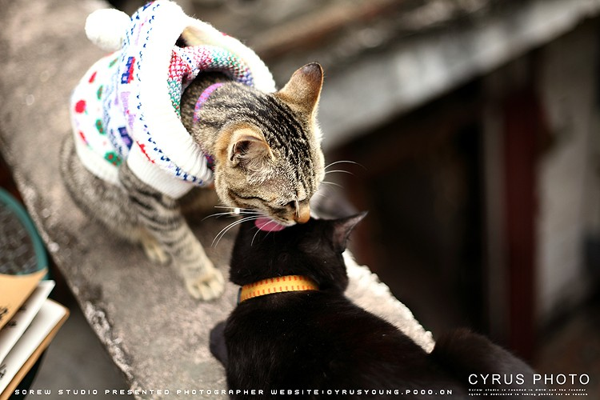

# ＜天璇＞爱情该有的模样

**我想爱情该有的模样，就像在这圣地亚哥的夕阳，我们面对着面，什么也不说，但是此时此时我知道，我们只属于彼此。**  

# 爱情该有的模样

## 文/廖汉斯（University of Michigan Ann Arbor）

 

在安娜堡的这五个月来，不出什么意外，我每周六晚上都会去北校区的senior center聚会。senior center离超市很近；大多数时候，我都是先从中校坐巴士到北校的超市，买一大堆吃的放在手推车上，再把车从超市推到senior center。推到聚会的地方的时候天色总是近黄昏了；房间里却总是透出温暖的黄色的灯光，因为弟兄姊妹已经提前去布置好吃的，等着我们这些在安娜堡上学的孩子。

教会的牧师是台湾人。我应该称他为牧师吗？牧师似乎总是带了一点神话的色彩，然而他却平易近人的很。我称他为L先生。L先生是东密歇根大学的教授，我总记得他穿竖条衬衣的样子，手里拿着一本繁体字竖排版的圣经，看起来很有学问。L先生年轻的时候一定很帅,或者说人们年轻的时候都是如此。而L太太和L先生的气质看起来很不一样。我无法判定L太太年轻的时候是什么样子，但是显然和L先生的气场不甚相同。L先生说话沉稳，内敛；而L太太则为有趣得多，浓厚的台湾口音加上女人独特的滔滔不绝（甚至有些啰嗦），叽叽喳喳的，大老远就能听出来是她的声音。聚会房间的形状是一个很长的长方形，中间拼了一张长桌子。L先生就坐在桌子的一端，L太太却总是在另一端——我很少看见他们并肩而坐，也不知道是为什么。我总是挨着L先生坐，因为喜欢看他念圣经的样子。讲道的时候，L先生总是会提起以前在台湾的读书生涯；每每此时，L太太就要从长桌子的另一端插一句：“我们那个时候在台湾...我当时刚进大学的时候，根本不信主！后来有人跟我说，教会的弟兄很不错.....我刚刚信主几个月，就开始跟你们的L弟兄Dating啦！” 她眉飞色舞地讲着讲着，我似乎已经对他们的情史耳熟能详了。然而有趣的是，这个“开始和L弟兄dating" 似乎成了她人生中的一个分水岭，也成了她讲自己见证每次必提的东西。L先生坐在这一头，总是微微笑着。

有时候L太太总是记不清楚一些在台湾的事情----比如，台湾有多少个县市——L先生就在桌子的另一端远程协助说：“21 个，21个啦！” 偶尔有那么一个瞬间，我会想起那个叫做"一唱一和”的词，用在这里也许不错。然而大家都很乐于听L太太讲她的见证，虽然她说的10句里面有9句和直接主题是毫不相关的。于是每个周六的晚上，我都乐于坐在长桌子的一端，看着L先生和L太太时不时“远程调情”一下。我们这些年轻人看着，总是笑笑，心里却羡慕得很；起码我总那么觉得。L太太说，她当时想调去离台北近一些的地方，因为L先生会留在台北，而她的成绩不够留下来。上次L太太和L先生讲自己大学毕业分配工作的时候，二人又在众人面前秀了一番恩爱。今天在另一位师母家聚会，读经的主题是那句很有名的“一个人若赚得了全世界，却丢掉了自己，有什么益处”；于是L先生就说，现在许多人年轻的时候拼命赚钱，拿健康去换大房子和大车子，结果老了就要拿钱买回健康。他笑着说：“我昨天还在看自己年轻时候的照片，还是很帅气的！说不定你们的Grace阿姨（L太太的英文名）就是因为这个嫁给我的！” 我看见L太太坐在靠近门的地方笑了，我们大家也笑了；但是她的笑一定和我们的笑不一样。我总是揣测，上了年纪的人秀恩爱总和年轻人不同；那味道很难形容。如果年轻人是带着果味的香水，上了年纪的人也许就像是放在木质橱柜角落里的大块奶酪散发出的或淡或甜的，经过时间沉淀出来的香味。我看着他们，觉得这也许就是爱情该有的模样。

有人嘲笑我说：“你还太年轻，我怀疑你连爱情是什么都不知道。”我自以为经历了一些算作爱情的东西，现在看来竟然有些虚无缥缈了。也难怪这样会被人嘲笑。我又想，我好歹是心碎过，流泪过，这样子算不算是经历了爱情呢？在这个浮躁的世界，什么样子才是爱情该有的模样呢？我只知道每次看见老头老太太在一起，就特别羡慕；上个月在圣地亚哥夕阳下的海滨，我看见一对老夫妇在沙滩上散步；他们一把年纪了，手还牵在一起；橘红色的夕阳从侧面射过来，在地上投射出伸长的剪影来，美丽极了，看着看着我竟然一时无语。他们携手前行的背影我没有捕捉到；转眼一想，这太美好了，这样的美留存于心便好。我看见海滩上有些打磨得很圆的石头，不知道是经过多久时间的冲刷才成了今天这个样子。也许爱情也是一样；感情的大海从来都不是一帆风顺的，锋芒毕露的人多多少少也该为在乎的另一半做一些改变和牺牲，就像这些经过时间洗礼的石头一样圆润而贴心。我以前很固执，一味追逐所谓的“自由”，如今才发现这世上没有绝对的自由；我以前也不想改变，觉得改变就是牺牲，就是一味的吃亏，如今也才发现，不认真付出，哪能奢求什么对等的回报。到如今，如果喜欢的人能够和我在一个时区，一块大陆上，我就能无比满足，倍加珍惜。有的人说他爱你，说完了就没有然后了；有的人说他爱你，但是他说可惜你们不合适；有的人说爱你，但是他说爱不一定要总是挂在嘴边，他自己心里明白就好，但是他不知道爱情不是一个人的事情，他如果能多表达一点，事情也许又会是另外一个样子。我看到有些身边的人已经开始着急自己的爱情，但是这个世界似乎开始告诫女孩子，要高贵，要吊着别人胃口，要矜持，要不轻易动心，要不为物质所动，要学会索取和挑剔......但是人不偶尔犯傻，不心潮澎湃，不为了喜欢的人放下面子勇敢追逐，我猜想要么就是年纪大了，要么就是根本不想付出。有时候，母亲也会教导我，说做人不能太傻，总是喜欢为别人忙这忙那；可是，如果不真诚对待别人，别人怎么会真诚对待自己？自己什么都不愿意付出，怎么能够指望别人知道自己就是那个值得在一起的人？爱情本来就是两个人的事情，看着那些老头儿老太太，我有时候觉得也许爱情其实很简单，但是一定要两个人在一起经历生活，互相习惯彼此并且适当做出改变。这些东西永远强求不来，所以每次有人哭哭啼啼找我诉苦，我只能两手一摊说：“还是看缘分吧，是你的终归还是你的，不是你的怎么都得不到。”

我想爱情该有的模样，就像在这圣地亚哥的夕阳，我们面对着面，什么也不说，但是此时此时我知道，我们只属于彼此。

 

（荐稿：王也；责编：麦静）

 
