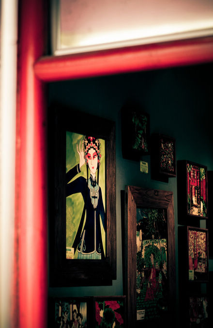

# ＜天璇＞爱是什么

**嘴巴大，不符合众人的审美标准，但是我喜欢啊，很性感啊！个子不高，可是我喜欢啊，我可以不穿高跟鞋嘛！说的笑话有点冷，可是没关系啊，我觉得也是一种幽默！喝醉酒之后会变一个人，不可怕啊，我喜欢啊，虽然这不是我熟悉的感觉，但是我可以慢慢熟悉。** 

# 爱是什么

## 文/周佩玲（北京大学）

 

“爱是恒久忍耐、又有恩慈。爱是不嫉妒。爱是不自夸，不张狂，不作害羞的事；不求自己的益处，不轻易发怒，不计算人的恶，不喜欢不义，只喜欢真理。凡事包容。凡事相信。凡事盼望。凡事忍耐。爱是永不止息。”

这是哥林多前书里面关于爱的解读。

少不更事的时候不了悟，觉得这只是清教徒才会相信的说辞。

还有一句，也是令人回味的，莎莉文老师的话：“爱就像云一样，在太阳出来之前布满天空”。

年少的时候喜欢一个男孩，有点帅气，写得一手好诗。他在众人面前侃侃而谈，在我面前话却不多。初中时候的他对政治什么的就比较有见地，是个有理想的人。他做的最浪漫的事，是曾为我写过一支钢琴曲，名曰Forever。后来，这个普通的单词跟我们确定关系的日期成了我生命中最最重要的符号。

我对于爱情的摸着，大概是从这开始的吧。那时的我，以为这就是爱情了。

后来，他遇见一个美丽光鲜的女子，“一见倾心相见恨晚”。然后跟我道别，后悔当年的“一时冲动”。我很清楚地记得他那时的话，他说：“那时候太小了。遇见她之后，我才知道爱情是什么。”

这中间又过了几年，发生了一些事，而他们从未成为过恋人。多半的时候，我们一起，风雨兼程，不管彼此之间是恋人也好，朋友也好。

从14岁到19岁，我的爱情只和这一个男人有关。

终于在19岁的尾巴上，他落泪，我心碎。忘不掉的，是那天在艺园一起吃饭，我说小炒太油了，他就条件反射地跟我调换了饭盒。我问他，知道什么是爱了吗？他说，以前不懂，现在懂了。

我知道，那个时候他是真的懂了，真的愿意跟我相濡以沫，真的不再有恃无恐。

可惜，我已经让自己从曾经的那种认定中抽身，再也回不来了。

于是各自转身，好久不见。

爱是什么？真是个太难回答的问题。我仍然没有自信，自己所体悟到的绝不是爱情的全貌，只是初见端倪罢了。只是虚情假意见得太多，无可奈何也见得太多，已经陪上自己生命中独一的六年去教一个人如何去爱，实在是没有勇气再试炼一遍。何况，已有人给了答案，是我们还不能了悟。

我只想说：

真爱是个羞涩的孩子，不需要总写在脸上，发在状态里，写进日志里。因为，爱本身已经足够我们心里得宁静。她悄悄地关心着他，悄悄地沉醉于他可能一辈子也不会知道的付出，悄悄地吃醋落泪恬退隐忍，又悄悄地给自己一个坚定的微笑。她冷暖自知。

真爱是个自信的孩子，因为幸福原本就是仁者见仁智者见智的。就像美丽、美味一样。我们所定义的幸福，源于对幸福的最初定义和生命中对这个最初定义的注解。

“两情相悦，不是无视对方的缺点，而是容忍对方的缺点，当然也就可以容忍小眼睛、塌鼻子、大嘴巴等等。如果你的女朋友不是美女，其实并不一定是坏事，或许这能让你们更加关注到感情最核心的问题，是你们的价值观、生活方式，是发自内心的两个人关系的和谐。”

其实这句话有道理，但需要分情况讨论。

嘴巴大，不符合众人的审美标准，但是我喜欢啊，很性感啊！个子不高，可是我喜欢啊，我可以不穿高跟鞋嘛！说的笑话有点冷，可是没关系啊，我觉得也是一种幽默！喝醉酒之后会变一个人，不可怕啊，我喜欢啊，虽然这不是我熟悉的感觉，但是我可以慢慢熟悉。

以上这些所谓的缺点，对你而言可能是不能改变的，也正因为这些，你才是你。所以，当我们互相张望的时候，你在我眼里是最美。请注意，我没有在“忍受”你的缺点，而是把你的这些所谓的缺点内化成我所喜欢的特质。

而对于另一些性格，则是需要改变的，因为这或许对我不会有什么影响，只是如果你有所改变会成为更好的你。对于这些所谓的缺点，是可以和有必要改变的。当我们站在一起张望远方的时候，我们都是卑微的，需要相互提醒，相互鼓励。因为，我们都是罪人，都需要忏悔，需要为前方的路挥汗如雨。

所以，不必把相貌啊气质啊学识啊什么的当做因子赋予权重，最后计算出个数值再看看有没有超过择偶的合格线。一点意义也没有。爱情是不讲理的，不是吗？这跟长得美不美可能没有半毛钱的关系。我认识的恋人手拉着手一同欣赏美女的多了去了。

美与不美，不必因他人的负面评价而有什么自卑的情绪。如果一点点小事就可以让人煎熬让人纠结让人耳根发软听不得别人的挑逗，如果连简单的认定也需要一篇逻辑清晰倍受关注跟赞叹的日志来辅助，如果成了那所谓退而求其次的苦逼娃儿，真不好意思，错不在你，只恰恰说明，你不是那个Mr Right。

爱情，是简单的认定之后的相濡以沫，是经历过岁月的雕琢后两人一同筑造的一座高山。而寒山守护的，是最初的你我，人问寒山道，寒山路不通。

对的那个人，就在那里，静静的等我。

而我们生命的华丽，才刚刚开始。

采稿：王粤北 责编：黄理罡

 
