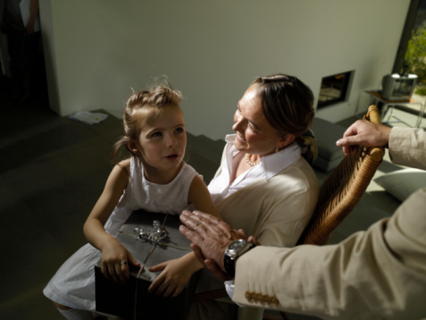

# ＜天璇＞父母皆祸害？

**只有选择，没有对错。听父母的话OR走自己的路，工作OR考研，体制内OR体制外，富二代OR凤凰男，北上广OR咱家乡……重要的不是选了什么，而是选了自己想选的那个，在自己选的路上好好走下去，一路吃喝玩乐勤劳勇敢，走出幸福快乐来。**  

# 父母皆祸害？

## 文/暖乎乎（营销人&写作者）

 

我同事说，她有一个朋友，毕业前两年一直在复习考研，一直没考上。到今年毕业第三年，一天也没工作过。她妈妈一直觉得，自己的女儿不能就这么进社会，太危险，不放心。前一阵子，她自己跑去人才市场兜了一圈，结论是自己啥也干不了。于是回家老老实实听她妈妈的话，开始复习准备考公务员。

我跟同事说，她毕业三年不工作，还不是最惨的。更惨的是可能她以后在婚姻问题上也会放弃选择权，和妈妈喜欢的人结婚。同事说没错，她和前任已经被妈妈拆散了。我接着说，最最惨的，是她大抵以后也会这样管制自己的小孩，纵使她没有去争取自己喜欢的工作和喜欢的人，可她在妈妈的视野里，一定也过上了寻常的安稳日子，虽波澜不惊却平安喜乐，所以她想当然地认为“妈妈是对的”，想当然地也要做这样一个“对”的妈妈。

这样的人，你身边也有吧？

十几二十几岁的时候，我们每每面对一个重大的选择，都有两条出路：一是交给个人的自由意志，即follow your heart；二是遵从父母的意见。豆瓣那个很火的“父母皆祸害”小组，讨论的就是这回事，大家抱团在一起“抵御腐朽、无知、无理取闹父母的束缚和戕害”。

我有一个朋友，从小被父母安排着长大，上哪个学校，学什么专业，留学去哪个国家，回来做什么工作，跟什么样的人结婚，父母一条龙服务得很好。难得的是，我的朋友特别喜欢这种“被安排”的生活，她深信她父母的选择一定比自己的选择好。“我从来不企望，靠自己的打拼，能过上比父母为我创造的还要好的生活”，十几岁的时候她就这样对说我。十几岁的我，很不理解这种人生态度，觉得人生怎么能就这么“被安排了”。前几日见她，她说过两年回国会去青岛一所大学做行政，不教书是因为累，她爸爸打算好了。我说你在国外读了6年精算和统计，如果去大学干嘛不教书，扔掉多可惜。她说倒也是，考虑下看看。见多了那些一边服从父母一边抱怨父母的人，现在的我觉得，像她这样毫无怨言地“被安排”，其实是一种福气。

我有一个同事，青岛人，三十几岁，读书工作都没有离开过青岛，一直和父母住在一起。她的一个朋友曾指责她说：“像你这样的人，永远也不会知道被房东扫地出门，无家可归的滋味。”她很有底气地反驳道：“没错。你离开家出来打拼是你的选择，被房东赶出来是你的选择为你带来的。我离不开老妈，不出去闯荡，也注定我不会有大出息。咱俩只是选择不一样，你不能因为被房东赶出去过，就觉得高我一等。”彼时刚工作的我，正租住在一个时常有蟑螂出没的小破房儿里。但那会儿我觉得她说得对极了，在心里为她拍案叫好。承担自己的选择为自己带来的一切，本是理所应当的事，有什么好炫耀的？

我的这个朋友和这个同事，是我身边选择听父母的话的人中，心态最健康的。不健康的，随手一抓一大把。

大三下大四上的时候，室友L参加了所有能够参加的考试：研究生、公务员、教师证、各种证书……她并不是每个考试都想参加，是父母的主意。她对此多少有些耿耿于怀。这种心情，在她父母让她参加教师资格证考试时，达到了顶峰。有天我俩一起在沃尔玛闲逛，我听到她和家里通电话，态度恶劣。扣上电话，她心情很差地跟我说，她不想考教师证。我说那就别考啊。她说她父母非让她考。我说那就好好沟通一下。她没再吱声。后来回宿舍，她说她决定参加考试，虽然自己不想考，然后抱怨了一通父母。我一下子很火大，声音很大地说：“是你在‘听父母的话’和‘做自己想做的事’之间选择了前者，这是你掂量权衡后自己做出的选择，你没有权利指责你的父母！”我当时的心情，是一种强烈的“恨铁不成钢”。今年五一的时候又见了L，她说等硕士毕业想去北京或者青岛找工作，我说别了，你还是老老实实在济南当个老师什么的吧，呆在父母身边，那更适合你。她想了想说：恩。这时候我已经对她没了当初的脾气，只希望她能明白她到底适合过哪种生活，而不是单纯地和父母赌气。

毕业前我跟外教S聊天，她说她发现好多中国学生做了父母安排的工作之后，都反过来说自己“没的选”，其实是他们不承认自己的选择，不愿意为自己的选择负责任，就全推给父母。I can’t agree more.这样的人，假如和父母选择的人结婚，要是过得不幸福，一样会去指责父母。

我是我的同学朋友圈子里活得比较随性的一枚，基本没有在任何选择上放弃过自由意志。是我父母开明到对我大撒把吗？当然不。

考大学时，老娘和千千万万老娘一样，想让我学医。我对医生的印象是四个字：挖心掏肺。他们说那是外科，其它科不，而且医生越老越值钱，永不失业。我依然无法扭转这种恐怖的印象，果断拒绝。我也不知道自己想学什么，就选了不讨厌的英文。

大四时，老娘和千千万万老娘一样，想让我考研。我倒是认真地准备了一阵子，越准备越难受，觉得还是工作更适合我，果断放弃。

找工作时，老娘和千千万万老娘一样，想让我当公务员，或者当老师。我十二万分地知道自己不适合这两个职业，外贸、媒体、广告试了一圈，选了觉得最合适自己的。

工作后，老娘和千千万万老娘一样，想让我回家。动不动就说家里哪家哪家企业在招人。我无意说起其实我挺想去超市工作时，老娘反应很快地说，家里要新开一家大润发！她说这些的时候，我都装没听懂。

我最近一次涨薪水之后，老娘再也没说过那些话，可能觉得我这丫头把自己选的路走顺了，也可能是真的死心了。这会儿我常跟老娘说：“下月我要去哪哪干什么，明年我想到哪哪干什么，三年后我必须在哪哪干什么。”都是些遥远的地方，都是些不靠谱的事儿，可老娘听了只有一句话：“你自己看着吧。”

我觉得，这句话是我赚来的。

真的，用永不妥协的坚持，用拼命折腾的成绩，赚来的。

有时候我会觉得自己挺狠心的，比如在装作听不懂她想让我回家的那些个暗示时。高木直子说她从老家三重县回东京，每每在车站挥别开车送她来的老爸时，都有种“我是不是很不孝顺”的感慨。这种心情，我也是有的。可是孝顺到底是陪在父母身边听父母的话，还是尽力把自己的日子过得幸福快乐，是一件值得商榷的事。没办法，像我这种热血死小孩，对“自由意志”实在宝贝得要命。记得大学时老师问大家的梦想，我说的是“在喜欢的地方生活，和喜欢的人在一起，做自己喜欢的事”。这几件事对我来说如此重要，我不能把选择它们的权利交给任何一个人，老爹老妈也不行。

很多一直贯彻自由意志的所谓成功人士，都在当下中国的年轻人群体里推广这种意识，比如袁岳的“黑苹果”公益项目，比如吴迪的“如何管理父母”讲座。不管免费的还是收钱的，我都觉得是件功德无量的事，也是社会走向的一种必然。

张泉灵在北大毕业典礼上说：“常有人说，做喜欢的事并成为事业是奢侈，没几个人有这幸运。如果，你考大学时选的专业不是你喜欢的，而是你父母喜欢的；你的选修课不是你喜欢的，而是拿证多、学分好得的；你求职不是挑你喜欢的，而是待遇好的，请问，你选择时从未拿喜欢当事，凭什么你会从事喜欢的职业呢？”

李欣频说：“如果想成为自己真正的主人，就是把自己现在活得好不好的责任，从他人、父母、家庭、学校、工作环境、社会环境中拿回自己的命运决定权，不要再把自己幸福快乐自由与否归疚给他人，没有人需要对你的命运负责任，只有你自己可以！”

理论依据神马的，一找一大摞。反方向也是如此，所以还是得拿自己作实验。

只有选择，没有对错。听父母的话OR走自己的路，工作OR考研，体制内OR体制外，富二代OR凤凰男，北上广OR咱家乡……重要的不是选了什么，而是选了自己想选的那个，在自己选的路上好好走下去，一路吃喝玩乐勤劳勇敢，走出幸福快乐来。That’s All.

原文链接：[http://www.nuanhuhu.net/2011/08/02/choice/](http://www.nuanhuhu.net/2011/08/02/choice/) 

 

（采编：董一儒；责编：应鹏华）

 
