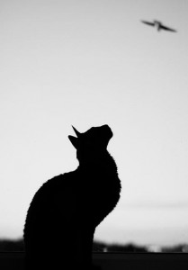

# ＜天璇＞狐死兔泣，蝇死人悲？

**这个世界有太多美好的东西被我们屏蔽，人类把自己从一个更大的圈子里孤立出来，在自造的精密复杂的小圈子里勾心斗角不亦乐乎，至少我觉得这是可悲的。我不可能脱离这个圈子，也不排斥这个圈子，就好像我下次在自己的屋子里见到苍蝇还是会把它赶出去或者打死而不会试图和它做精神伴侣。但是当我愿意暂时用苍蝇的眼睛看世界的时候，一切都更好玩了，不是么？**

### 

### 

# 狐死兔泣，蝇死人悲？

### 

## 文/ 姜伯源（香港中文大学）

### 

### 

早上在众志吃完饭看报，正在研读facebook自动圈人功能引发的隐私危机，忽觉左手一痒，定睛细观，原来是一只从天而降、硕大无朋的苍蝇试图爬上我的手背。伴随着心中油然而生的一阵恶心，我迅速地抖手想让苍蝇飞走，岂料这物只是费力地挪开一两毫米，趴在报纸上不动了。我很无奈，我还要翻页啊！我只好再迅速地抖动报纸，做出最后的友好驱逐。结果……结果它像一座小小的坚毅的丰碑，屹立着，无论我以何种频率扑扇，都是一副千磨万击还坚劲任尔东南西北风的英雄主义气概。当然，当时的我内心只有“把苍蝇赶走”这一个念头，所以并没来得及将眼前的一切与邱少云黄继光等历史上一幕幕动人的画面做比较。二十一年生命长河里接触苍蝇的经验告诉我，这只苍蝇如此排斥布朗运动，必已是垂垂老矣了。逼不得已，我只好用手边洁白的餐巾纸把它扫到地上去。如果艺术化地表现这一过程，那就应该像罗琳阿姨描写邓不利多摔下高塔或者指环王里甘道夫率领大队人马冲下那个八十度的斜坡一样，用慢镜头，配上雄浑壮阔的背景音乐，聚焦在苍蝇无力的翅膀和复杂的眼神（每个小眼都有一个不同的眼神？）上，看它缓缓落地，落地之后还要弹起来一次，增加戏剧张力。 然而现实是，这只苍蝇在我没反应过来的时候已经六足朝天掉到地砖上面，死了。 我有些小小的惊讶（这么快就死了？），然后惊讶迅速转变为一种更复杂的感情。这个转变源于我意识到自己是这只苍蝇死前遇到的最后一个生命：我是它离开这个世界的唯一见证。 昨天晚上刚刚看了纪念罗京的视频，他在爱妻的注视下撒手人寰，我又想到达芬奇死在爱才的法王弗朗索瓦一世怀里。但是这只苍蝇生命的最后几十秒钟里遇到的却是我这个一心想赶走它的陌生人——甚至还跟它不是一个物种。不知道它奄奄一息地掉到我手边时究竟是有意要爬上去引起我注意还是无目的的乱撞，理论上应该是后者，不过当我意淫地想到第一种可能性的时候还是止不住思维泛滥。它也应该花了大半生与各种天敌斗智斗勇吧，终于熬到了善终，却死在我这个容不得自己居室里有任何虫子的人类身旁，还引起了我对生命的思考。多讽刺。 

 看的书越多越觉得人这一辈子和苍蝇差不多，都活在布朗运动里，未来永远不可预料。个人经历固不必说，因缘和合变化万千，就生死而言，也说不准哪天我就像罗京一样癌症上身（尤其在建筑这个过劳专业）或者像张雨生一样飞来横祸一命呜乎，死的时候身旁会是谁呢？会不会也是个陌生人（但愿不是个陌生的物种。。）？又甚至像自然界大多数生命那样，自己孤寂的耗尽最后一点气息？我会不会在死前忙乱地希望再引起谁的注意？哪怕是一只苍蝇，告诉它，大限已至的我还曾博得过一些东西？ 庄子说人生来就游于羿之彀中，羿射不中你是你命大。小时候去丽江听纳西古乐，主持人是鬼才宣科，他讲了一大堆东西我都忘了，但是有一段话记忆犹新。他说别人都说纳西人生活节奏慢，纳西人却觉得，人生来只有一个目的地，就是坟墓，既然这样，走的那么快干什么？在这个人类已经快要忘记生命之卑微的年代，无论是罗京张雨生，还是普华永道女孩和复旦女博士，都只能让我们当作谈资心动一时，却提不起古人敬畏生命的忧患意识。qinger说她觉得人类已经在走向末日了，谁知道呢，反正2012的确不远了。 这个商科当道的社会是弱肉强食的没错，但我至今也不认为所有人就要因此兵戎相见人吃人。争名夺利的心我不是没有，但滚滚红尘和袅袅佛音在我看来也没太大区别。规则哪里都有，桎梏是永恒的，重点还是我们应该怎么和它们打交道吧。二十多岁的我还会因为一树火红的凤凰木兴奋一个星期，还会蹲在路边和青蛙四目相对一起避雨。让我开心的是，这样的朋友我还认识不少。这个世界有太多美好的东西被我们屏蔽，人类把自己从一个更大的圈子里孤立出来，在自造的精密复杂的小圈子里勾心斗角不亦乐乎，至少我觉得这是可悲的。我不可能脱离这个圈子，也不排斥这个圈子，就好像我下次在自己的屋子里见到苍蝇还是会把它赶出去或者打死而不会试图和它做精神伴侣。但是当我愿意暂时用苍蝇的眼睛看世界的时候，一切都更好玩了，不是么？ 成语兔死狐悲原来作“狐死兔泣”，讲的是同类之间因为一方的死去而伤心。狐狸伤心完了还是要抓兔子，兔子伤心完了还是要躲狐狸。我和苍蝇们一样。 

 那只苍蝇应该不会有这么复杂的思想吧，或许它反而更快乐。不知道它是在报纸上扮演丰碑时就已经死了，还是落地过程中死了，又或是落地那一下对它造成了致命一击。我想如果是落地过程中死了应该是最浪漫的吧，死在它最熟悉的飞的感觉里。 后记 众志堂的麻雀傲娇地从我脚边蹦达过去，对它身边的死苍蝇看都不看，见到没有别的食物，便飞到对面的桌上去吃别人吃剩的双送了。记忆里我家四合院的麻雀看到这么肥硕的苍蝇是绝对不舍得放弃的，尤其在它们还要面对四处出没的野猫的时候，能有吃的根本不会挑三拣四。 想到四合院，想起北京的太阳多么正常，决不会像今天这样让我的影子投在了南边。 

### 

### 

（采编：陈锴；责编：陈锴）

### 

### 
