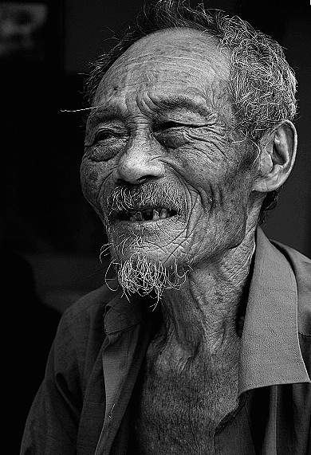

# ＜天璇＞生命的流水账

**这小地方，最有钱最得势，除了官员，就是矿场煤厂老板。而你知道，他们的车轮滚滚，是不会给你任何提问和质疑的机会的，当然，你知道，其实也没有人想要质疑什么。病的人和亲属，都在疾病的折磨下痛不欲生憔悴不堪，谁有心去问，这些发电厂煤矿金属矿的不合理布局，于这地方的罕见发病率有多少贡献。**

** **

# 生命的流水账

## 文/张益清（Syracuse University, S.I.Newhouse）

 

我长大的小城常年以癌症高发病率著称，原因无人探究。而无人探究的原因，则让我在过去的几年，翻来覆去想了好多遍。

第一个亲人，是我的外公。我出生的那月，外公查出肺癌晚期。在接下来的几个月，迅速转移到头部，压迫了神经，倒使得人感觉不到了疼痛，只是昏迷。父母每天带着我走两公里的路去看外公，到我6个月大时，到了巷子门口我就知要左转，会伸出手指着外公家的方向。我7个月时外公在昏迷中去世。 

我自然是根本不记得外公的模样。后来看照片，发现我长了和他一模一样的脸廓和颧骨。这个一辈子养马赶马车的城市居民。 前年，是我外公的二儿子，我的舅舅。舅舅是城中最德高望重的中医，在他行医的医院，每天都有上百个人排队等他号脉看诊。他有无数单独开诊所或与人合伙赚钱的机会，但他统统拒绝，照常朝九晚五。而他最大的爱好，是在自家院子里栽浓密的竹子和照料各式盆栽花，以及每天练习写2个小时的小楷字。前年到今天，已经是两次切除手术，现在又面临高风险的第三回…… 那天他走，我去火车站送他。站在我面前的这个已近老年的男人，穿着多年漂洗的白色衬衫，一丝不苟的白色袜子和凉鞋，神情是安静的。闷热的候车室里面我有些发昏，很久，才发现他的女儿，我的姐姐在我旁边偷偷掉泪。她的腹中胎儿已近6个月……这生命的残酷往复循环。 昨天高谈阔论的饭局上，接到电话，说手术台上意外的位置上发现肿瘤，切除的风险很大，征询家人意见。我没想到这抉择来得这样迅速，仿佛被人当头一棒。 而这一切，和这城里的任何一个人说起，都不是什么稀奇事：喔，我的某叔叔舅舅爷爷姑妈姨娘，也是如此，某年某月查出病，又某年某月去世。 谁要动辄扯到制度这样的大词汇。我坚持认为美国的媒体之发达不在于大机构大制作，而在于小镇小城的报纸和电视台，也是多年目睹中国这些小地方的失语和失声。最终大家都活在这样人情世故纷繁但是却冷漠得可以的地方。早些时候有摄影记者拍摄了这地方靠近煤矿的癌症村的患儿的照片获奖，可是谁都知道，这根本不能改变什么。这小地方，最有钱最得势，除了官员，就是矿场煤厂老板。而你知道，他们的车轮滚滚，是不会给你任何提问和质疑的机会的，当然，你知道，其实也没有人想要质疑什么。病的人和亲属，都在疾病的折磨下痛不欲生憔悴不堪，谁有心去问，这些发电厂煤矿金属矿的不合理布局，于这地方的罕见发病率有多少贡献。 这地方的新闻，只有城里最高的楼里字正腔圆的播音员每天朗诵的官员会议或者考察报告。 此刻，我的表姐和腹中的胎儿，正在驶往舅舅手术的城市的火车上。手术终究是没有进行，那肿瘤依然在舅舅体内。而我们一家人，还在为选择一个合适的手术方案而犹豫不决。 而我知道，这已经不是生死两端的选择。这一切，就是一场悄然无声却密不透风的死亡。 

（采编：徐超 责编：黄理罡）

