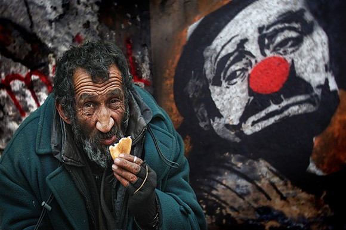
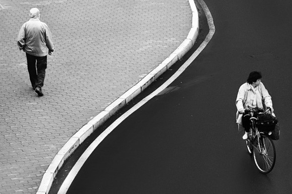

# ＜天璇＞生命里的陌生人

**自己在陌生人的眼里到底是什么样的呢？带给他们什么样的感受呢？我在他们生命的长河中扮演一个什么样的路人甲？他会记我记多久？两条不平行的直线在交汇的那一刹那之后又迅速沿着自己的方向继续前进，而那交汇的节点，对他来书没什么特别，对我来说也没什么特别，只有把我俩放在一起，那个在浩瀚的人海中普通的节点才会有意义。但这意义又有多大呢？琢磨着这些问题，我开始对陌生人这个概念着迷。**  

# 生命里的陌生人

## 文/李东哲（吉林大学）

陌生人是个很有意思的概念。

第一次对“陌生人”这个概念感兴趣，是我在福州玩的时候，一个人背着一个硕大的包，清晨时分坐在一家早餐店的桌子旁，等店家给上我点的早餐。那是一个普通的家属区的一个平静的早晨，在那个时间段走在路上的多是睡眼惺忪上学去的学生和神采奕奕买菜归的老太。而我这样一个全身满脸写满疲惫和落魄的年轻人，吸引了很多人的注意力。

自从我一进店，把沉甸甸的包往旁边的凳子上一砸的同时用北方口音喊了一声老板开始，老板就在熟练地忙活中时不时地撇出两眼，用来打量我。

刚开始是很不习惯。但当我开始琢磨他们眼中的我到底是什么样的时候，也就忘了那浑身的不自在。他在打量我，我在琢磨他，这本身就是一个很有意思的场景。

自己在陌生人的眼里到底是什么样的呢？带给他们什么样的感受呢？我在他们生命的长河中扮演一个什么样的路人甲？他会记我记多久？两条不平行的直线在交汇的那一刹那之后又迅速沿着自己的方向继续前进，而那交汇的节点，对他来书没什么特别，对我来说也没什么特别，只有把我俩放在一起，那个在浩瀚的人海中普通的节点才会有意义。但这意义又有多大呢？

琢磨着这些问题，我开始对陌生人这个概念着迷。

有时候翻看旅行时拍的照片，总有那么一些陌生人有意无意地钻进我的镜头、闯入我的画面。起初对此很是愤慨，恼怒其破坏了自己的作品。但时间长了，却学会欣赏那些跟你生命本无甚大关系的陌生人。看着照片中陌生人的表情神态、衣着打扮，去揣测他正在过着一种什么样的生活，处于一种什么样的心情，经历着什么样的事情和变革。虽然这样的猜测无甚意义且没有标准答案供你参考，让我这个从应试教育中活过来的人十分难受。但等你接受并习惯了这种没有答案的题目，你就会发现，这其实代表了一种美，多样性开放性多元化等等无论你怎么说，都可。生命就是这样充满着可能和多变，在这样无聊的猜测中我体会到了。

有些看上去无意义的事情其实是有意义的，起码是有意思的。只不过不好发现不好描述罢了。

但是传统的中国人并不喜欢被陌生人拍照。肯能是他觉得被拍之后，还要时不时被自己并不相识的人谈起看到，会不舒服。但我则享受这种被偶尔想起的感觉，虽然我并没有办法能够获悉这一切。

在我在外行走的过程中，有不少陌生人都给了我深刻的印象。比如在某个历史名人故居里那个拿着单反戴着讲解耳机走在人流之外头发扎起露出脑门的女孩，比如那个吹着江风坐在岸边端着一本小书看的外国人，比如在公园的休息区阳光下看着自己小孩在里面尽情玩耍的两个年轻妈妈，等等等等。我对他们都很好奇，但我不会去接触去搭讪去挖掘我认为应该有的那些故事，因为那样大多会让我失望。我宁愿把他们停留在我想象的层次上，停留在我的纸面上、文字里。

这样的感觉更奇妙。

有时走在大街上，看到公车里坐在靠窗座位上的乘客在往外看，或许看到了我。这时我会想到我坐公车时，坐在窗户旁边时，看到外面的行人时，那个行人也恰巧在看我时，我的感受。于是，那一瞬间，就好像我的灵魂飞出我的肉体，冲进了那辆公交车，钻进了那个陌生人的躯体里面一样，放佛我从别人眼里看到了自己一般神奇。

前两天看常远的一篇文章里面，写到了一面之交情况下不同人的不同做法。若你和一个人见过一面之后便老死不相往来，你会对他微笑吗，会和他聊天吗，会热心提供帮助吗？恐怕没有这个必要。但如若你做了，那个人在未来的某个时候偶尔想起了你，哪怕心头的一热仅持续了瞬间，那也就足够了。

对于仅有一面之缘的陌生人，人们大多只会考虑能从他们身上获取点什么，比如一张具有冲击力的照片、一个有价值的信息、一个对他而言微不足道的帮忙。但从来没有想过能为他带来点什么。湘伦和Navi某年寒假搭车回家的过程中，带了一个迷你打印机，会把和司机的合影打印出来送给司机。我因此佩服不已。你想象不到这样的举动会给那个陌生人带来什么，也不用你去想去猜，总之是有的，那就够了。以前看一些有人文关怀的摄影师，在去贫困的地方拍照的时候，总会给当地的孩子拍照，并让他们看照片，条件允许的话还会洗出来送给他们。在我眼里，这简直是天使般的作为。

也许做到这些有些难度，那么，一个微笑，一句带着微笑毫不生硬的谢谢，两句家常，总是容易做到的。要知道，世界这么有趣，离不开那些你可能从来都不关心的陌生人。

没有陌生人的世界，其实是最孤独的世界。

（采编：应鹏华；责编：麦静）

 
