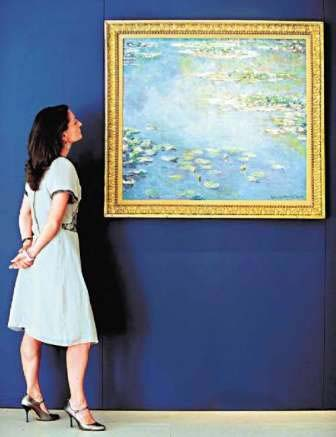

# ＜天璇＞生活不过是件艺术品

**“ 所谓“艺术品”，不过是我们自己认为“美”的东西。我们在上帝为我们设置的囚笼里，捡起一块石头，拿起一把锉刀，孜孜不倦地雕刻着，只不过想让我们觉得美好的那些东西，从内心中走出来，来到这个世界上。我们为之倾注心血，我们沉醉于其中。或许我们的双手不够灵巧，雕刻出的实物跟心中的美好形象大相径庭；或许才刻到一半，我们就得到救赎，去拜会马克思了；甚至我们毕生都找不到合适的锉刀，但这些并不妨碍我们对美好的渴望。因为对“美”孜孜不倦地追求，是我们存在的唯一理由。”**

** **

# **生活不过是件艺术品**

### 

** **

## 文/徐超 (上海交通大学)

 题记：对“美”孜孜不倦的追求，是我们存在的唯一理由。 “人们面临权衡取舍。”经济学一开始便丢给我们这样一个看似残酷的真理：当你选择了一条道路，你便放弃了其他一切可能。人活一生，不过是在做一次又一次的选择。未来不可预知，而人生却只有一次。我们永远无法知道哪一条路是“最好”的选择。历史没有假设，你永远无法预料，如果改变当年一个小小的令人“遗憾”的决定，会引起怎样的“蝴蝶效应”，你的人生或许因此而完全不同。 可是，什么是所谓的“最好”呢？经济学家杜撰了“效用”来刻画人们获得的满足，所谓选择不过是在有限资源的约束下，最大化自己的效用。似乎世间的一切现象都纳入了这个“最优化”的数学模型。可是他们却从来没有告诉我们，效用函数是什么！就如同有了万有引力定律，却不知道G是多少，所谓的“效用论”也不过是数学家们的自娱自乐罢了。 每当我们在纠结今天晚上是要看一部电影，还是把上周的实验报告写完时，每当我们在纠结到底是考研还是找工作时，我都仿佛看到上帝的脸上露出了幸灾乐祸的笑容，仿佛在说：“省省吧，挣扎是没有意义的。”我敢打赌，他的“效用”瞬间就上去了，就如同我们用飞盘调戏小狗狗时一样。每次想到这里，我就暗暗地下定决心，坚决不能让上帝的快乐建立在我的痛苦之上。可是终归只是上帝的玩物，往往在最后一刻才能按下submit，然后如释重负。其实说到底，不管选择什么，都不过是最后一刻的“一时冲动”而已。 

信马由缰久了，不免会迷失自己。可能就在某一天的清晨，你醒来的时候，发现不再像海萍那样，脑子里闪过一串数字：房租、水电费、手机费@#￥%……；不再像每一个爸爸不是李刚的普通大学生那般，盘算着如何提升自己的“核心竞争力”，不再揣测高盛、花旗、摩根斯坦利HR的口味，不再渴望百万年薪，不再渴望成为什么公司的CXO。你给了自己狠狠一记耳光：What are you fucking doing? 我们安慰自己：“金钱只是维持自由的一种手段”。最喜欢说的是：“等我们有钱了，我们就可以blablabla。”我们用马斯洛需求理论来安慰自己，人首先要满足自己最基本的物质需求，才可能去考虑“自我实现”。可是什么叫做“满足”呢？是不是一定要有一栋市区的房子？是不是一定要有一辆自己的奔驰，或者说至少是辆宾利？还是说只要能填得饱肚子，外加一件体面的衬衫就可以了？既然金钱并不是我们的目的，为什么一定要走这一段弯路，一定要“等我们很有钱了”呢？ 想到这里，我们又问自己，钱是没有意义的，物质是没有意义的，那什么是有意义的呢？是爱情吗？不过是多分泌了点荷尔蒙而已；是幸福吗？大麻可以短时间内给你更强烈的“高潮”体验；是思考吗？人类一思考，上帝就发笑。 Nothing is meaningful! 想到这里，我们不禁想骂一句：“谁他妈的让我来到这个世界上的？经过我同意了吗？”上帝的脸上再次浮现出那坏坏的笑容，她又高潮了。我们沮丧的环视着这个世界，突然明白，原来这就是上帝对我们的惩罚，就如同西西弗永远不能推到山顶的石头。 可是为什么一切都要有意义呢？闲着无聊，我们总要找点事情做。与其去追问虚无缥缈的意义，不如去雕刻一件令自己赏心悦目的“艺术品”。 

这件艺术品可能是一张五线谱，可能是一幅油画，可能是一本书，可能是一件根雕，可能是一个微分方程； 这件艺术品也可能是一个健康长大的孩子，可能是一个温馨和睦的家庭，可能是一段精心维持的友谊，可能是一家稳健发展的公司； 这件艺术品也可能是“建立一个自由的国家”，可能是“建设一个法治社会”，可能是“让共和观念深入人心”，也可能只是“让一段历史真相大白与天下”。 所谓“艺术品”，不过是我们自己认为“美”的东西。我们在上帝为我们设置的囚笼里，捡起一块石头，拿起一把锉刀，孜孜不倦地雕刻着，只不过想让我们觉得美好的那些东西，从内心中走出来，来到这个世界上。我们为之倾注心血，我们沉醉于其中。或许我们的双手不够灵巧，雕刻出的实物跟心中的美好形象大相径庭；或许才刻到一半，我们就得到救赎，去拜会马克思了；甚至我们毕生都找不到合适的锉刀，但这些并不妨碍我们对美好的渴望。因为对“美”孜孜不倦地追求，是我们存在的唯一理由。 这个世界可能并不美好，但是我们有一颗追求美好的心。 

(采编：安镜轩 责编：刘一舟)

