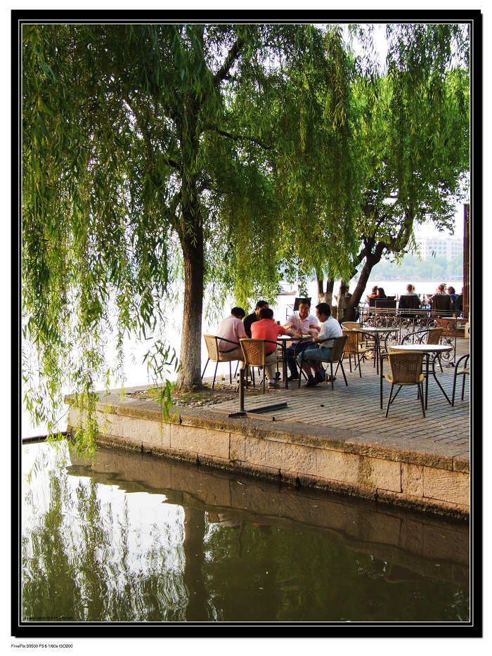
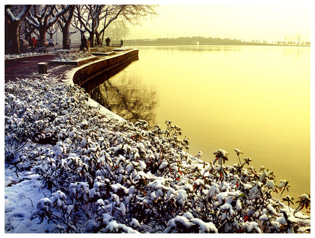

# ＜天璇＞生活在杭州

**西湖不是景点！它不是一个“点”！你连报销用的门票票根都捞不着！它是杭州生活的一部分，小时候去太子湾公园春游，去孤山边上的浙江博物馆，去少年宫上课，年纪大一点了去西湖边的龙翔工联解百银泰逛街，谈恋爱了去杨公堤骑个自行车，招待客人了去湖心亭做个船看看三潭映月回头去楼外楼吃顿好的，老头老太了一早在西湖边遛弯跳舞带孙子。**  

# 生活在杭州

## 文/曾珍 （中央民族大学）

  “哟，你是杭州的啊。” 北方人对杭州普遍都怀有美好的印象，多谢老祖宗们长久以来孜孜不倦的努力对外宣传，特别是几个写文章写诗的大爷们，什么欲把西湖比西子，什么上有天堂下有苏杭，什么江南忆，最忆是杭州。搞的杭州好像是风景宜人青山碧水美女如云的样子。 

 事实就是杭州和所有的南方城市一样，很少所谓的江南水乡的出众美女，百年出了个汤唯啊很了不起了，普遍长的都很顺眼，没有特别丑的让人审美情怀崩溃的。好吃的么，也没有满汉全席那么霸气，也不会像川菜一样受到全国人民欢迎，叫得上名得有那若干个，你要问杭州人杭州有什么好吃的一般就报给你龙井虾仁啊西湖醋鱼啊什么的，其实内心翻着大白眼说谁家有空没空天天出去吃啊，家常菜吃吃么好了。 这个情况还通常出现在别人问“杭州有什么好玩的啊？”然后正常人都会呆呆的报一个“西湖啊”。杭州的西湖我怀疑地球人都知道，西湖作为一个景点很失败，因为它全开放不收门票，在湖边还有一块莫名其妙没有来历的大石头写着“杭州西湖”。要是旅游观光的话在石头前面拍照是拍不到西湖的。西湖不是景点！它不是一个“点”！你连报销用的门票票根都捞不着！它是杭州生活的一部分，小时候去太子湾公园春游，去孤山边上的浙江博物馆，去少年宫上课，年纪大一点了去西湖边的龙翔工联解百银泰逛街，谈恋爱了去杨公堤骑个自行车，招待客人了去湖心亭做个船看看三潭映月回头去楼外楼吃顿好的（楼外楼的地位就好像北京的全聚德，杭州人自己不去吃，未必好吃，来了一定要吃，名声在外的好处啊。），老头老太一早在西湖边遛弯跳舞带孙子。 

 杭州整个城市就是围绕西湖发展起来的，虽然现在开始走钱塘江的发展路线了，但是底子还在，杭州人的生活习惯还在，说这么大一通就是为了说明当别人问“灵隐门票多少啊？”“云溪竹径在哪里啊？”的时候，多数杭州人脸上都会有ORZ的表情，很正常好不好，谁关心鸡鸣寺票价多少！谁没事去八大处爬山玩！ “你是杭州哪里的？”我大一被问这个问题以后卡壳了！脑子卡壳了！纠结了五秒钟以后说“我是西湖区的。”导致在此之后我听说XXX是杭州人，第一反应是“会讲杭州话么？”不是说所有的杭州人都会说杭州话，也不是说不会说杭州话的不是杭州人，在这个萧山区说完全听不懂的萧山话的叫杭州的城市，会不会说杭州话是一个很重要的标志，证明老底子杭州人身份的重要一点。没有一个像四川话陕西话河南话广东话一样叫浙江话的东西，在这里毫不夸张的说，隔座山就完全不能交流了，所以，就大杭州而言，基本有杭州话、萧山话、临安话、余杭话、富阳话等等等还有各种话的小分支，所以，当一个出租车司机听不懂杭州话得时候，很正常！刚刚看到一个数据说杭州六成司机是河南人，两成是东北人，剩下的还都不一定是杭州本地人。 “杭州好不好？哪里好？” 这个问题，用辩论的语言来回答就是“你妈好不好？哪里好？”就不要拿杭州和别的地方做比较了，是！杭州没有拉萨海拔高日照好，杭州没有北京大气，杭州没有苏州婉约，杭州没有上海现代，杭州和郑州比不过历史，哪怕在浙江省里，大概也能这么说，杭州没有温州有钱，杭州没有宁波开放，杭州没有绍兴小城古韵。问题是，这些杭州都应该有吗？那别的地方的长处和杭州比，有什么意思？杭帮菜要比四川菜辣么？ 杭州好，是因为我觉得它好，是和别人怎么觉得的没有任何关系，杭州好不是因为地处亚热带风和日丽四季分明，其实杭州夏天热起来是新火炉，台风天“整个人都要崩溃了”，杭州好也不是因为有西湖映日荷花别样红，杭州好也不是因为苏杭出美女，那绝对是瞎说，中国博大精深哪里都有美女。 

 真煽情，杭州好是因为我家在杭州，是因为住在杭州的从来就没想过要走，哪怕房价万丈高也硬着头皮想要留下来住下来成为新杭州人，杭州好是因为，一样的道理，我妈妈是世界上最好的妈妈。  

（采编：佛冉 责编：项栋梁 ）

 
