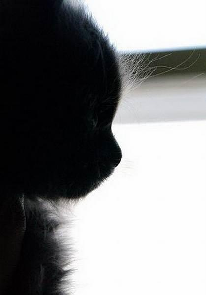
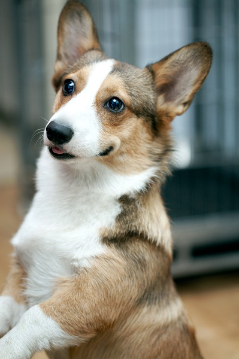
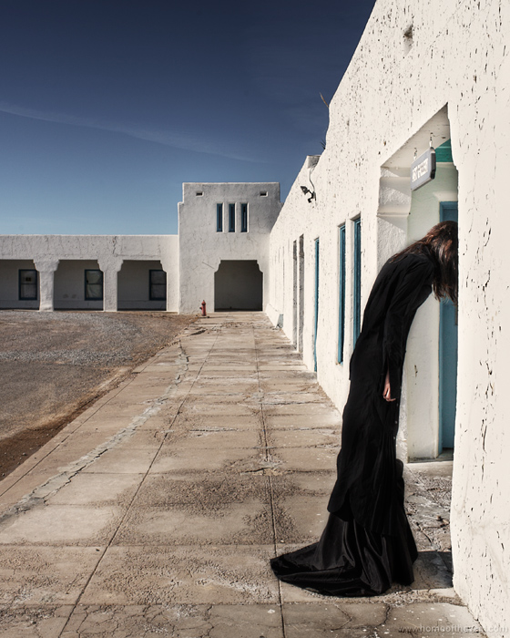

# ＜天璇＞男人狗性  女人猫性

**我不否认我很喜欢猫，我也不否认我就要做一只优雅的猫。每个女人的前世或许大多是猫，因为她们总会把自己伪装在冷漠的表情下，她们有着自己独特的姿态，但在这个物欲横流的社会很多特性被磨灭了。我就是要做猫，冷血、傲世、清高的猫。**

# 男人狗性 女人猫性

## 文/一一（沈阳音乐学院）

前几天有感而发写了一句话：“男人的狗性让我看的淋漓尽致，女人要无时无刻的构建自己的猫性！”不料获得了大家的热情关注。有很多人问我怎么了，是不是受什么刺激了，其实我想说我很好，你们想到的种种都是在我意料之内。我要说第一我没有被男人欺骗，第二我没有失身，第三我也不是在骂男人，第四我也不是在维护女性的权益。我只想客观地表达我对于人性的某些理解。

说男人是狗性，不是在骂你们男人，而是一种调侃的夸奖！ 狗是人类患难与共的朋友，对人类特别忠诚，狗又是一种通人性的动物。“牧羊犬三千里寻主”、“义犬救主”、“犬马之劳”都是用来说明狗狗忠心耿耿。日本电影《忠犬八公》中的八公的故事，也是让人感动得催泪，狗狗忠诚孝主的优点，无疑应在每个人的心里。 

狗的本性是什么？我想除了忠诚之外，还有一些死乞白赖的特点吧。这种死乞白赖，是对生命的一种渴望。当狗见到人时，总会摇起尾巴死乞白赖地跑到你的脚边，嗅着它不熟悉的味道。人们也会教给狗狗一些对于我们来说，不会做的动作，如：作揖、转圈、趴下、装死等。它们是在尽量讨好着人类，希望人类多多怜爱它，它也在人面前做出可爱的样子，百依百顺，摇起尾巴来博得主人的开心。而那些游走在街边的流浪狗，每天奔波于每个垃圾站，每个有倒掉的食物堆积的地方，不管人们多么的嗤之以鼻，它们还是会出现在街边垃圾堆的旁边。那些大腹便便的欧巴桑把垃圾倒在垃圾堆旁边时，那些流浪狗会因这种异物的到来而假装惊慌而逃，其实等那些丢垃圾的欧巴桑走了之后，它们就会一哄而上，心中窃喜着又有食物到来了。我只想说，它们对生命的渴望是多么真挚，它们会不管异样的眼光，只为自己的生命负责。这些流浪狗看到有主人牵领的狗狗经过时，会向它们进行攻击，那是一种对自尊的证明。 我想，一个成功的男人身上，无疑具有狗性吧。跟着老妈接触了一些商人，让我看得是淋漓尽致。他们很成功，只能说是生意，说是在事业上，年纪轻轻、不到而立之年，虽只有小学文化，却凭自己的能力开上宝马车住上小别墅。他们很狗性，会死乞白赖地央求你留下来为他们卖力地工作，就算是你没有给他们带来效益，但是你的技术你的能力他们认可，他们也会白养着你、供着你，不让你离开。因为他们知道，你在他的地盘一天就有可能为他们创造财富。他们不在乎一个地方不盈利，因为他们手里不只靠这一个地方挣钱，他们只知道，你有一天给他们创造的利益远比现在养着你要多。当你决心要离开时，他们会喊奶奶爷爷地央求你留下，他们对你实行煽情计划。级别高的不会因为心软而留下的，他们会提出加薪等一系列的金钱诱惑。如果实在决心已定，他们只能选择不给你发工资来限制你的离开。最后撕破脸皮之时，放你走之时，他们还是会对你说一句，我们这里随时欢迎你的到来。他们眼里只有金钱，不关于感情，这就是商人与普通人的特点吧。需要你之时，尽力地讨好你，不惜降下自己脸面。不用你之时，就会冷下脸面翻脸不认人似地狠狠赶你离开。这些不跟狗性的死乞白赖、百依百顺、伪装自己、撕破脸面相同吗？一个成功的商人，具有这样的狗性无疑是他金钱来源的一种狠招吧。他们始终以利益为重，只有一个目标，就是如何挣钱。这样很好，有了目标，有了特性，成功自然来。 但是女人跟男人不同，男人的这些狗性用在他们身上是事半功倍的，但是女人用狗性去做事情时却是事倍功半的。如果女人百依百顺、死乞白赖、伪装自己、放下脸面地去做事，肯定会被别人称为臭不要脸，为了达到成功不择手段的坏女人。但猫性，无疑会是女人成功的一剂良药。 猫在从古至今都被认为是奸臣的象征，是阴险狡诈的代名词。听老人常说，如果养狗的一家人没有食物喂给狗，狗还是不离不弃的，但是没有食物喂猫，猫就会离开。猫的眼神是很多人不喜欢的，一条缝，从来不正眼看人，这无疑是一种清高的表现。如果把狗比作忠诚的男性的话，猫无疑就是优雅的女性。如：“猫步”就是模特步，就是根据猫走路来命名的。猫走路从来都是昂头挺胸，冷眼傲视的样子。 女人要做猫。无疑就是要冷血、清高、傲世、优雅、有原则。不要因为别人的一两句悦耳的话语，自己听了就飘飘然地，殊不知那只不过是骗你跟随的一个手段而已。要时刻保持自己的姿态，不要为了金钱、享受而出卖了自己，在任何时候都要昂头傲世，要时刻记着这个世界没有什么是可以左右自己的。要优雅的姿态出现在任何一个场合。虽说猫是奸臣，是个没食儿吃就会离开的小人，但是“留得青山在不怕没柴烧”。不要吊死在一棵树上，为生命负责，你才有创造奇迹的可能。 

我不否认我很喜欢猫，我也不否认我就要做一只优雅的猫。每个女人的前世或许大多是猫，因为她们总会把自己伪装在冷漠的表情下，她们有着自己独特的姿态，但在这个物欲横流的社会很多特性被磨灭了。我就是要做猫，冷血、傲世、清高的猫**。**因为只有这样你才不会随波逐流，因为只有这样你才不会被社会化，因为只有这样你才有可能傲立群雄。女人也可以强大，但首先你要有一个使你强大的特性。 狗性是男人成功的特性，猫性是女人成功的特性。殊不知有多少人能把握这些特性，又有多少人会赞同我的这种说法呢？或许有一天你会发现，我说的是对的，或许你现在就会认为我说的毫无道理。我无所谓。但是我想，至少我的想法说出来了，就会对一些人造成影响，这就够了。
