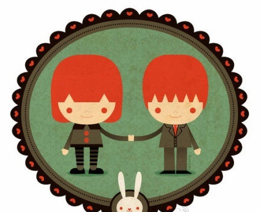

# ＜天璇＞相忘于江湖

**毕业、工作、结婚，然后就是尿不湿和奶粉了，生活就在一片片的尿不湿和一罐罐的洋奶粉中过去，平淡得都不知道是怎么过去的。有几个人能像孔圣人那样：子在川上曰：“逝者如斯夫，不舍昼夜”。中华煌煌五千年，孔圣人就一个，却出了数不清的张三李四王二麻子。这就是圣人和凡人的区别吧。作为凡人的我们，只能曰的是尿不湿好用还是旧秋裤好用，奶粉是三鹿好还是三元好？**

 

# 相忘于江湖

## 文/卞海鹏（重庆三峡学院）

 

今天我依然能感到，那清风掠过的春天，掠过了城市掠过村庄，掠过我们年少胸膛。我依然看到那些少年，站在九月新学期操场，仰望着天空清澈的眼神，想着无限的未来。

——《少年》

闲来无事，乱翻同学朋友的QQ空间，见到最多就是某某女生的婚纱照和某某文艺青年的“到此一游”。这也算是秀幸福吧， 连谈个恋爱都要“非诚勿扰”，爱情才能连连看，人家秀秀幸福也很正常。那天收到一朋友的邮件，打开一看，内容的形式和校内上流传的点名大同小异。“类似点名”中有一条是这样的：“现在有暗恋的对象吗：我结婚了，嘿嘿”。她竟这么早结婚！其实当年这位传邮件的同学就不是很“老实”，只是没预料到她会结婚这么早罢了。

学生时代，多少日月，绿了杨柳，红了芭蕉，柳吐鹅黄，杏披素裹，转眼便是一年年。痕迹像是空气一样，无法看到，无法捉摸。唯有深夜钟表的滴答声，以此证明青涩在滴滴答答中退去。但是过去的时间从何处消失，未来的时间从何处开始，我不得而知。那什么能够证明青春的流逝呢？挖空脑筋，苦苦思索，好像散伙饭、毕业证、结婚照、满月酒、尿不湿、奶粉钱、或者还会有离婚证，能够证明青春的度过和青涩的逝去吧。

回想学生时代，种种情境历历在目，恍如昨天。同学朋友相互打闹、篮球场上挥汗如雨、拿出在夹在书山中的镜子看着满脸的青春痘。现在想想都感觉清澈无瑕，一尘不染。春风拂过，空气中还有一丝凉意。教室旁边的龙爪槐却伸出了嫩嫩的小手指，教室里高考的烦恼与反叛情绪都在记忆背诵时的一曲高歌中得到发泄。八零后的我们，多多少少，都在高考前的奋战中有过类似的插曲。犹清晰地记得躲闪着老师外出上网那份忐忑；更无法忘却那次在月光下树影里红着脸牵过她的手。现在回首想想，仅仅几年，大家变化真大。现在那个脚踩高跟扭着屁股的美女，那时候扎着马尾辫坐在教室里安静地看书。那个写过无数检查的小男生现在满脸胡茬奋战考研。那时候，大家都差不多，穿衣选物没有时尚和老土的概念，更不会想到挎着包穿着红艳的高跟鞋去上课。

想当年，她并没有现在风骚，却多些清纯秀丽，他也没有现在圆滑，却多些奋发有为。

从一起骑自行车飞驰而过到进了四中监狱为高考奋战，等到考入大学，大家的差距就开始显现了。当然，不论是去的是211还是民办院校，最终靠的还是自己，蓝翔技校也能出精英，清华大学也能产糟粕。

其实在哪里读大学都没有什么差别，唯一不同的是：男人在何处的超市买杜蕾斯，女人在哪的路上穿着丝袜。而地点却不同，他可能在红色重庆，而她可能在自由美国。就在“红色重庆”和“自由美国”的差别中，同学之间距离日益扩大。她也可能人在红色重庆，心却在自由美国，她可能身在自由美国，心却在非洲大陆游走。

很多人说不读大学的人生是不完美的，虽失之偏颇，但也有一定道理。大学散发着青春的活力，充满了灯火阑珊的浪漫。虽说中国当下的教育制度有各种各样的问题，诸如老师如何贪财，教授如何流氓，领导如何内斗，考试录取制度有各种弊病等等。总是瑕不掩瑜，尽管大学充满了各种腐化堕落，总比社会的各种尔虞我诈少得多，大家也单纯得多，不像社会上整天你争我夺，勾心斗角。大浪淘沙始见金，去伪存真，只是时间问题而已。

且说大学里的爱情吧，这也是每个人差不多在大学里都经历过的事情。虽说社会的现实污染了清纯的感情，但毕竟是清纯的爱情始终占大多数，现实仅仅是清风吹过起的涟漪，或是顽童扔在水里的小石子，扑通一声，波纹几许，水花四溅，但是石头总会沉底，顽童也总会因为石头的沉落而离开。大学的爱情大部分总是清澈如水，清可见底，清水绕卵石，绿藻陪游鱼。无心的几句言语，就能心有灵犀一点通；杏吐芳蕊时共享大好时光；落木萧萧处畅谈人生理想。校园处，灯光下，月影斑驳处，苔痕青青地，满天星斗体育场，喧闹声声教室里，处处都有恋人的身影，或牵手，或依偎，或接吻，或吵架，更有甚者哪怕是学校后山草丛里的人影翻滚。大学的爱情，总是充斥着青春的气息，青春的萌动，青春的糊里糊涂，甚至青春的错误。

大部分人都在寝室里打Dota和一把鼻涕一把泪地看韩剧、偶尔杜蕾斯一下、丝袜一下、野战一下、旅馆一下借此证明自己的魅力和性感，顺便借此证明自己有那个能力。等看完韩剧，扔掉杜蕾斯，窜入人才市场，猛然发现，大学很是可爱，而社会却让你喘不过气来。等你拿起军训集体照和毕业照一对比，却发现每个人都不容易对上号。四年大学转眼而过，毕业证拿到，散伙饭吃完就只好各回各家，各找各妈……

那个默默无闻的扎马尾的小女生现在性感妖艳；那个喳喳呼呼、上蹿下跳的调皮小童已然成了耶鲁的研究生；那个大学期间数不清补考过多少次的小女生现在在韩国首尔留学，有人出国绿卡了，有人却在建筑工地满身泥水被呼来喝去……大家都在为房子、车子、票子忙碌着。

毕业、工作、结婚，然后就是尿不湿和奶粉了，生活就在一片片的尿不湿和一罐罐的洋奶粉中过去，平淡得都不知道是怎么过去的。有几个人能像孔圣人那样：子在川上曰：“逝者如斯夫，不舍昼夜”。中华煌煌五千年，孔圣人就一个，却出了数不清的张三李四王二麻子。这就是圣人和凡人的区别吧。作为凡人的我们，只能曰的是尿不湿好用还是旧秋裤好用，奶粉是三鹿好还是三元好？

无论是三鹿的三聚氰胺还是医院血浆的HIV还是要去面对，纵然地沟油能够引发癌症，还是堂而皇之进入老百姓的餐桌；纵然爱情情比金坚，还是抵挡不住LV的诱惑；纵然你国考高中状元，还不是被某某的儿子女儿顶替了。现实种种无奈让你纠结无语，你是想改变这个现状，还是口口声声骂着强权和复杂的人际关系，然后在面试前请领导大吃一顿呢？我看，是一边骂，一边是请领导吃饭吧。大多数人叫骂仅仅是叫骂，开会时说得咬牙切齿，恨不得食其肉寝其皮，散会后还依旧天上人间，风月无边。至于找个为自己开脱的借口，是怪社会还是怪个人，我不得而知。谁叫我们是初级阶段呢？这也许是最佳答案。你既没有阮籍的洒脱，可以青岩长啸，青白眼示人；更没有陶渊明的才情，可以采菊东篱下，悠然见南山。其实长满青苔的青石板，历经千年风雨的怪石，都被拉去建了人民公园，市政工程，你要坐在人民公园的怪石上长啸，可能就会去蹲号子；青白眼示人得到的就是电棍的震动。而南山都拿来建了别墅和度假村，东篱下采菊可能是一位二奶或者N奶！

年少时期的哥们义气，闺蜜情怀好像都不重要，并且也没有多少可以留恋的。同窗读书时无话不说的哥们闺蜜早已不再联系，联系再多也不能联系到广厦千万间和满头珠翠遍身绫罗。纵然是聚会，也仅仅是冷漠的寒暄。哥们义气闺蜜情怀能买来BMW吗？能买来LV吗？能住上Town House吗？好像都没有从大腹便便的口中说出，“放心，我会对你负责的”来得实在，来得享受，来得幸福。

说一个大家都熟悉的故事吧。他和她是同班同学，恋爱，高考。她落榜了。他独自踏上征途，成为当年的“天之骄子”。二十年转瞬而过，他成为财政官员后下乡视察。“买点地瓜吧，自己家种的又大又甜”。二人双目相视，是他，是她。他衣冠楚楚，前呼后拥，头大脖子粗，她蓬松着头发，身体很瘦。他已不是当年那个啃着黑窝头的瘦弱男孩，她也不是当年那个扎着马尾，笑声阵阵的女孩。时光消磨了青春年华，剩下的只是世故沧桑。最后财政人员要向赶集的人要税，“家里二个孩子等着上学呢，能不能”？他默许了，然后被乡镇干部拉着去了镇上最好的饭馆。

时光荏苒，你我都感觉不到时间的溜走，唯有闹钟上指针在赶路，一刻也没有停息。时光消灭了一切，打闹玩耍，笑声哭泣，牵手对骂，留下了光滑脸庞上的刀劈斧刻，心中的鬼斧神工，还有鱼尾纹和大肚腩。

相濡以沫，不如相忘于江湖。庄子说的一点都不错。

你会不会忽然地出现，在街角的咖啡店。我会带着笑脸，挥手寒暄。和你坐着聊聊天 我多么想和你见一面，看看你最近改变。不再去说从前，只是寒暄。只是说一句：“好久不见”。我想说：“好久不见，你过得好吗”？

拿起电话，听到那个熟悉的声音，最多的时候只想听到一句,“挺好的，你呢”？多年未见，距离在不知不觉中被拉大了许多。青涩褪去，剩下了圆滑。虽会有“何时共剪西窗烛，却话巴山夜雨时”的愿望，却充满了“有钱的时候没时间，有时间的时候没钱”的无奈。

理想总是那么丰满，现实却骨感得让你喘不过气。只能说：世事如白云苍狗，请君各自珍重。

 

采编自投稿邮箱；责编：麦静

 
