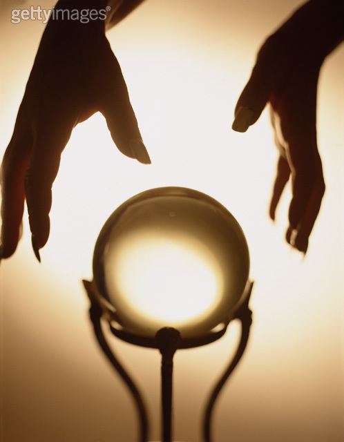

# ＜天璇＞相逢何必匆匆：关于龟、诺贝尔和爱情

某人指了指电脑屏幕上《中国古代房事考》的一行小字，一脸坏笑：你知道你为什么喜欢龟了吧？我瞥了一眼，感觉和当年乔放在我桌子上的《性经验史》一样，都是拿生活去做学问。做着做着就走丢了。我喜欢龟，是因为龟的眼睛亮而无神，盯着我看的时候慵懒无力，像目前很多人的境遇。

我经常喜欢自下断言，然后用生活中不时涌现的细碎事实打破它们。比如我说，我大概永远不会写昨天那样的文章，自恋狂。但是拿起笔还是一样。但是马尔克斯的自恋与我的自恋究竟有什么差别，使得读《霍乱时期的爱情》时深深一叹。原来爱情还可以是这样？！回过头，却听见耳边响起的声音：情侣间的甜言蜜语或是尖酸刻薄、保研还是直博相互纠缠、谁和谁……那天我突然决意下辈子变成一只龟，不是因为寿命，而是因为它可以躲避、伸缩和冬眠。总之是对外物的可理可不理。

我想永远这样同一种制度的东西疏离。不必争抢好处，争风吃醋。也不要暗自揣度、勾心斗角。这些统统都不擅长。最好就是开一家不必盈利也可生存的咖啡店，购来所有爱读的书，细心装潢、捡拾起多年似乎已经荒废的水笔、细细涂鸦。领养一只慵懒的猫，不要怕人也不要粘人，走路的样子像踩在皮球上的轻盈和悠闲，带些玩的味道。人说，猫都是得了抑郁症的孩子。每晚在宿舍楼下的夜影中和喵星人聊天的时候，它们的样子就是一副事不关己的感觉，倒让人舒坦。

昨天经历了种种不快。送快递的大叔一副猴急的样子，连连催促，理由是：我有心脏病。我的朋友冲下楼取到快递的时候，他只愤怒地说：我有心脏病。我突然想起了王小波，没有理由。那天莫言捧得了诺贝尔奖的时候我们正在咖啡厅读书。老板扭头问：你读过莫言么？我第一个反应就是：丰乳肥臀。当晚，我梦见自己站在一个巨大的舞台上，也许真的是诺贝尔奖的舞台。那是一个舞台，和戏剧一样。翌日清晨，我笑着醒过来。隔了一日，我才想起自己笑的原因。大家在表演。接着文学课上，老师说，中国当代有哪个算得上是真正的写手？老师细数了北岛、莫言、王安忆和余华。老师说：王小波死了。我的心突然无限沉下去，好像在说一个熟悉的朋友。王小波的文字太奇异了，只能在制度外围做英雄。因为一些东西经不起他这样的幽默与嘲讽，一些人宁愿自戳双目也不愿看着他“堕落”。我怕我们真的失去了太多单纯，以至于有一天醒过来不认识自己，不记得童年，还不屑于抱怨不公。

我问乔，我怎么这么背？乔想了想，戏谑：你对待这个世界的方式太不严肃了。笑了半天。想起了去年的这个时候我大概还在英国错综复杂的街道上用男人一样的嘶哑嗓音唱歌。那个时候多少带着点儿因为愤怒和迷茫产生的莽撞，于是把全部的虚无缥缈的希望寄托在异国他乡的每一个过客身上，或者是浓烈的酒精中。直到我遇到了那对基督徒夫妇。他们家中的烛光亮着，我就多一分坚定；他们熬的鸡汤，让我至今想来都是热泪盈眶。男人说：我爱她，因为上帝知道我爱她，把她安排在我身旁。女人并不顺从，可是却善解人意。我接过熬好的鸡汤道别，就再没联系过。

去年今日。我大抵还在流浪。自诩的流浪，实际并不落魄。我想起阿伯丁的机械轰鸣声，一年间每当我深感孤独或冷漠，就想起那夜持久的轰鸣声。我曾以为我便是死掉也无人知道。彻底的被遗忘并没有让人超然，反而徒增了惶恐。我就那样惶恐地走在异国的一座陌生城市的街头，深夜的寒霜笼罩在昏暗的路灯上，海鸟惊惧地起飞降落。寒冷可以让人绝望。孤独可以产生死亡。

还有斯特灵的落叶。苏格兰太寂寞了。当日后我无意间看见关于它的讯息，读到《呼啸山庄》的时候，竟然觉得自己就站在荒野上，四下无人。狂风呼啸，黄叶遍野。原来曾经的际遇都已经输入你的神经和血肉，除非死或是失忆，不然它们会永远在。不论是呼啸山庄还是那些诗句，都是你当初就已酝酿的云霞。

一直不相信那些照片中的岁月。好像快门按过之后，那一刻就永不复返。儿时因为不断躲闪，浪费了胶卷，被父亲骂。有一日数码取代了那些原有的笨拙，技术大行其道的时候，我突然想念起那日在公园中，父亲为我修理坏掉的车子。他站起身给我拍照，相机发出嘶嘶的声音——没有胶卷了——那张照片没有拍成，却永远地印在我的脑海里，挥之不去。我第一次吻了我父亲的脸颊。

依旧不相信留影过后的日子怎么过。那些转瞬即逝的流华和光影。那些一期一会的人和斗转星移飘忽不定的际遇。

我从未想过自己要活过20岁。当我在医院度过一部分童年的时候仿佛就已经顿悟生死。所以从不觉得健康长寿是怎样的祝福，虽然时时以此宽慰老人。当我读到约翰克里斯朵夫说，20岁以后的日子不过是机械的重复，毫无新意的时候，才发觉自己不必然已经走在这条路上。竟然安然自得。

那天在比较文学课上，我讲完了自己的论文提纲，关于波德莱尔和北岛。那位感性的女老师讲到波德莱尔的《恶之花》时愤怒地说，这个世界怎么配他活！我还没有这个老师这样文艺，所以并没有为逝去的人和诗感到愤怒。只是觉得忧郁背后有太多的华丽没有成型，就已经湮埋在众人的迷茫中了。

我的脑海里，最美的画面，竟然是那天夕阳西下，我们一行人徒步走上斯坦福背后的山岗。夕阳很暖，山下的海湾和城市一览无余。落日将人的剪影留在地上。我牵起离我最近的男孩的手。太美的景色已经难以用言语表达，更无法延迟到文字生成，我只想握住一只手。

或许真的是太不严肃了。我还依旧握着他。他的眼睛盯着我，慵懒而无力，像我爱的那只龟。

 

（采编：何凌昊；责编：何凌昊）

 
