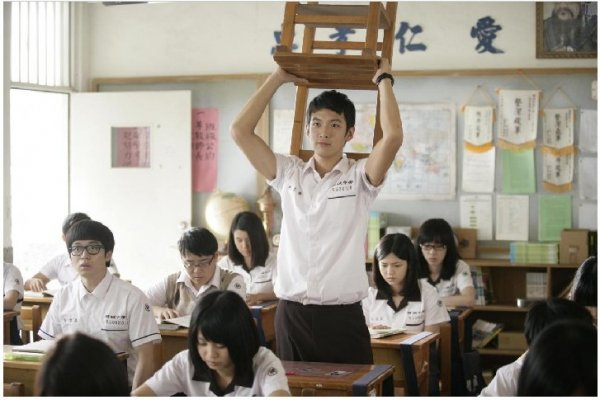
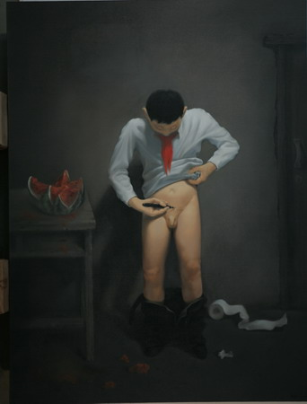

# ＜天璇＞看不见的兄弟

**如果不是老师的恩赐，我永远也不会知道后面的世界是怎么样，这种机缘可遇而不可求。韩寒必然没有机会去体验科学家的严谨，方舟子估计也没什么机会了解教室后面的天地。这个世界在我小学去公园翻墙的时候被割裂成了好学生和小流氓，在我被发配到垃圾角的时候又弥合了回来。它让我明白了是什么使得一个人成为了一个人现在的样子，也让我窥探了这种不同的生活竟然可以如此天翻地覆。**  

# 看不见的兄弟

## 文/ 武卓韵(香港中文大学)

 

先说件有趣的事情吧。

小时候家教很严格，没什么零花钱，偶尔父母给个一两块钱总是很开心。四五年级的时候，有一次带了几块钱和小朋友去公园玩，公园要收三毛钱的门票，而我刚好知道旁边的栅栏有一个口子，可以直接翻过去。结果我刚带着朋友走到栅栏旁边，就听到一声“站住”。本来以为是公园的人来抓我们，没想到抬头一看是几个跟我年纪差不多的小流氓。于是，于是几分钟以后那几块钱就都被几个小流氓敲诈走了。

想象一下，身上带着几块钱巨款，前一秒还想着翻墙过去了又能省下一根冰棍钱，后一秒不但冰棍买不到了，身上连一分钱都没有了！这在当时的我看来简直就是奇耻大辱：身为经常考班里第一，经常被老师夸赞，经常自我感觉良好的好学生，竟然在一群小流氓面前束手无策被敲诈了个精光！

经历了物质和精神上的双重打击之后，我回到家，看见老娘就像是看见了亲人，终于忍不住哇地一声哭了起来。在老娘帮我谴责了小流氓，并承诺由她弥补我大概2.5元巨额损失之后，我终于从悲伤当中短暂脱离了出来，并开始思考两个问题：第一，下次再遇到这种小流氓，要怎么样才能不被敲诈？第二，为什么我们年龄差不多，他们竟然能这么坏？

第一个问题很快就得到了解答，因为大概一年之后我又遇到了两个小流氓，这次的解决方法相当利索，当他们把我逼在墙角之后，我顺手抡起了十几斤的书包朝其中一个小流氓狠狠砸了过去，然后趁着两人愣住的一秒拔腿就跑，冲到大街上拽住了一个阿姨的自行车说有小流氓敲诈我，然后飞奔回了家。

第二个问题，很久都没有解决，而且就像方舟子质疑韩寒怎么可能那么有才一样悬不可决——直到上了初中。

小城市里的教育资源匮乏得就像如今的真爱，再加上我去的又是所谓的好班，于是就产生了八十多青春期少男少女共处一间教室的壮观景象。当时的教室挤到什么程度呢？一、那种标准的单人课桌，排成了一个横八纵十的矩阵，横排以242为格局，在教室当众划出两条走廊。二、走廊只可以侧身而过。三、中间的四张课桌往往会挤着五个学生。在这种情况下，排座位就成了很头疼的问题。因为是在老娘任教的学校，所以我和班里的三五个教师子弟享有至高无上的优先挑选位置的权力。于是，第四排成了我几乎雷打不动的座位。

想想吧，八十多人挤在一间教室，教室里面又没有扩音器等先进的设备，所以坐在最后一两排的同学几乎处于听不见看不见的状态，所以座位成了家长们争相向老师争取的重要资源。在看着身旁的同桌流水般轮换的同时，我，仍然恬不知耻的以将近一米八的身高，安然自得地坐在第四排的位置。虽然同学之间下课都玩得很融洽，但是后面的世界，似乎只存在于老师们口口相传的“后面坐的都是小流氓”的传说中，和自习时候后面传来的聊天声中。

终于有一天这种嚣张跋扈遭到了报应，老师觉得再让我嚣张下去似乎民愤难平，于是大手一挥，指着最后一排的一个犄角旮旯，说，坐那儿去。

于是第二天我就出现在了那个角落。

那是一个天高皇帝远的地方，周围就是打扫卫生的扫帚，前面是层层叠叠的人墙，我终于能够亲身体会什么叫做看不见和听不见。但是我也瞬间发现了这里的好处，聊天没人管，上课吃东西没人管，甚至拿副扑克牌出来悄悄地斗地主也没人管，在不到一天的时间里，我就爱上了这个地方。上课的时候，我看着前面那些同学举起手踊跃回答问题，忽然觉得距离是那么遥远。

坐在我旁边的，是一个长得挺帅的留级生。这个年龄，上一个姑娘容易，交一个朋友难，那会儿恰恰相反。不到一天的时间，我们就熟络了起来，而也就是这不到一天的时间，让我想明白了那第二个问题。

初中正是身体发育的时候，各种猥琐的念头也跟着屌毛一起滋长。就在我坐在垃圾角落的第二天晚上，身边这哥们儿晚自习的时候喝得醉醺醺的来了……作为一个初二的乖孩子，虽然我每天也关注女孩子的胸部，但是却从来没想过亲自尝试一下。可是这位哥们，一见到我，瞪着迷离的双眼，嘴角咧开一种我当时无法理解的笑容，对我说道：哈，x班那个xxx，咪咪好大啊，摸起来太爽了!

这在当时无异于高帅富在屌丝面前炫耀昨晚和女神啪啪啪，我强忍着内心的不平，和他就这个问题讨论了下去。言谈间，我说为什么女孩子不喜欢我，这哥们说，你要会讨女孩子喜欢。接着，就从书包里掏出了七八个笔记本，说，你看，这些都是我给她写的诗，你看，这都是我给她抄的歌词，你看，这都是我学唱广东话歌一个字一个字记下来的拼音……他还说，你们是好学生，跟我们不一样，你们上课要回答问题，我们上课就干这个……

他接着滔滔不绝地讲了下去，从小城市里黑社会的帮派讲到学校周围哪里可以租到黄色小说，从beyond每首歌的来历讲到了自己第一次怎么样被他哥带着上了一个比他大好几岁的姑娘，从跟着“老大”出去敲诈别人讲到了自己晚上打着手电给姑娘写情书，从调座位给老师送礼讲到了班里的好学生的傻逼表现……等他讲完了，我就像被扒光了一样，就仿佛原来他早就数清楚了我身上有几根屌毛，而我却还不知道他有没有存在于这个世界上……

其实不是小流氓坏，而是我从来没有了解过小流氓的生活——就像我坐在前排不会了解后面的角落里到底发生什么一样；就像天赋高到不用比拼努力的人理解不了努力到还没够格比拼天赋的人一样；就像我以前一直想的大城市的孩子理解不了农村孩子一样；也许，甚至就像方舟子理解不了韩寒一样。

如果不是老师的恩赐，我永远也不会知道后面的世界是怎么样，这种机缘可遇而不可求。韩寒必然没有机会去体验科学家的严谨，方舟子估计也没什么机会了解教室后面的天地。这个世界在我小学去公园翻墙的时候被割裂成了好学生和小流氓，在我被发配到垃圾角的时候又弥合了回来。它让我明白了是什么使得一个人成为了一个人现在的样子，也让我窥探了这种不同的生活竟然可以如此天翻地覆。

东西写到这里，说教和装逼的意思也浓了起来。我无意说服谁，也无意标榜谁。去年同学聚会见到了这哥们，混得很不错，挣着我都不敢想象的薪水，偶尔还在网上写写挺有思想的见地。我不由得想起了，在我坐在垃圾角之后没几天，老师又大手一挥把我调回了第四排，我又变成了那个每天上课积极举手的好孩子。有一点不一样的是，在那之后的一两年里，我在举手的时候偶尔回想起，在我背后很远的地方，有一位看不见的兄弟……

 

（采编：应宁康；责编：陈锴）

 
