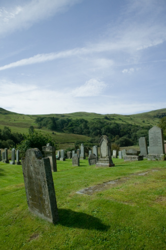

# ＜天璇＞看不见的历史

**那个陵园破败的古色古香，参天的柏树遮天蔽日。我去的时候正逢冬天，陵园里安静的一个人都没有，只有灰喜鹊叽喳叫着飞下来飞上去。那一代文豪，也就在这里安眠了。**  

# 看不见的历史

## 文/王大风（北京大学）

 

昨天我看到朋友分享的一张照片，周世宗柴荣的坟冢，忽然想到，这类很破败的坟墓我还是见过许多的，颇有感慨，随手一写。

河南这地方承载了太多的历史，她的土地就是这段历史的真实写照。差不多每个县都会有一段足以上历史书的事情在这里发生，每个县城的辖区都有几位妇孺皆知的人物，或生于斯，抑或长眠于此。这些年旅游成了许多地方创收的新方式，于是许多假古董就在真历史发生过又消失的地方如雨后春笋般建起来。比如中牟的官渡古战场，比如许昌的春秋楼，比如开封的清明上河城，等等等等。

许多地方也都会用一些跟此地有瓜葛的名人来作为当地的名片，你会看到他们的塑像立在铁道边，立在国道的十字路口，雕工粗糙，让人不忍多看。我记得几年前我在汤阴看到那个骑马北望的岳飞塑像，被我讥笑为老头骑瞎驴，凡此种种，不一而足。

而在河南真正值得看的，以我之见还就是很多很多破败的坟墓，那种墓主人名字如雷贯耳、而墓园破败不堪的墓。

所谓生在苏杭葬在北邙，邙山是确有其地的。开车自郑州到洛阳，高速路边上绵延不断的黄土坡即邙山是也。在冬天，你大概会看到那种黄土坡被覆盖着中国北方特有的灰蒙蒙的色彩，灰蒙蒙的房子，零星树木的灰蒙蒙的残枝，远方灰蒙蒙的天地交界处，被惊起的几只乌鸦看起来也是灰蒙蒙的。

然而驾驶者是不该为这些平淡无奇的景象吸引的。专心驾驶时要留意路牌，除了有标明地点距离的绿色路牌，也有标明名胜古迹所在的棕色路牌。于是你知道，路过了楚河汉界，路过了玄奘故里，路过了北宋的皇家陵墓，路过了东汉的帝陵，再往北过了黄河就是温县，司马仲达之故里乎？等等等等，而高速路一直在被劈开的土坡中蜿蜒行进，那两边压过来的黄土就是邙山了。无数的达官贵人就埋骨于山中，生前显赫的他们死后就真的万事空，甚至连墓碑庐冢都剩不下。那么，在山下疾驰而过的我们，大概抬头看到的就是古人的遗骨。这样的场景会让我想到伦敦西敏寺，踩下一步踩到了牛顿等先贤的感觉。

我不想在这里叙述邙山陵墓群的具体位置还有盗墓贼们发明洛阳铲的故事。在这里的许多人们看来，历史和现实水乳交融。车开着开着，要过隧道了，那隧道名唤兴洛仓，该不是当年翟让和李密放粮之所在吧。过了这里，再走一段到洛阳了，路边会有贩卖的各种唐三彩。假作真时真亦假。而远远看着，我会感觉历史就在眼前流过，就从这些人们身边悄无声息地去了又来了。

倘若愿意离开城区，去到田野里，可能就会不经意间看到一些名人的墓冢。比如在郏县的苏轼坟墓。事实上，这里不仅葬着他，也葬着苏洵和苏辙。那个陵园破败的古色古香，参天的柏树遮天蔽日。我去的时候正逢冬天，陵园里安静的一个人都没有，只有灰喜鹊叽喳叫着飞下来飞上去。那一代文豪，也就在这里安眠了。

再比如新郑的欧阳修的坟墓。那是在一大片农田中的一个土堆，简单砌就了围墙而已。墓冢边上就是绿油油的玉米田。雨后夏末的时节，空气中弥漫着好闻的田野味道还有各种鸣虫声嘶力竭的叫声。站在那里，农民们或者骑着摩托车去田野里除草了，或者开着拖拉机去干其他农活了，就那么过来过去，安静地生活，恰如安静地躺在他们边上一千年的欧阳修。

逝者和生者原来可以这么安静地共处而不互相打扰。

或许这些破败的坟墓会让人觉得痛惜，我亦有此感，但我也觉得，这样看不见的历史才是凭吊古迹最好的去处。某年某月某日，我在又一处坟冢前（曹植的衣冠冢），想到这样的场景：罗马将军凯旋时，总有个奴隶在他后面捧着桂冠，说一些不祥的话语——

所有的荣耀都会过去，你的胜利终将是过眼云烟。

远处夕阳西下，天空被晕成了好看的淡紫色。此时的罗马也破败了，那斗兽场早就成了古迹，它看着游客们熙熙攘攘大概也很寂寥，一如空对茫茫原野的子建。

都过去了，谁又看得见？

也曾经看到一些普通的墓冢，可能就密密麻麻地排布在铁路边上。我有时候盯着它们，会想的出神。

临末，我想到去年我在温州见到的一些类似冲绳地区的墓葬，在山坳里挖个半圆，然后是一个水泥或石块砌出的类似元宝的形状。我记得我那会儿犯困，在一个略平整的水泥坟堆上躺着，睡了。

而我斜眼看见几只蝴蝶，倏忽地飘来，停在墓主人的牌位边上，停在我边上，然后又飘飘地飞走了。下午的阳光晒的刺眼，山野里虫鸣阵阵。

多好的生活！

 

（采编：楼杭丹；责编：应鹏华）

 
