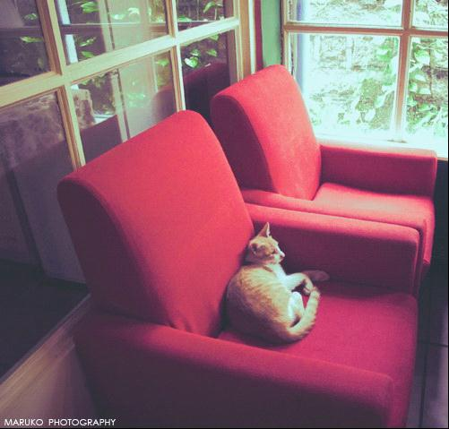
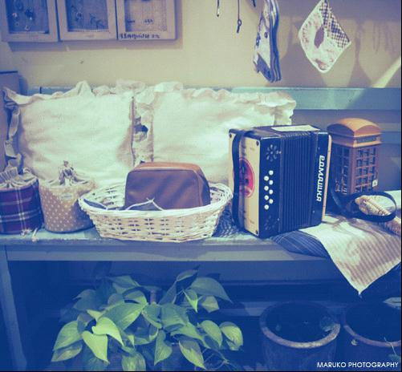

# ＜天璇＞看不见的星球

**我一直是个极有耐心的人，尤其是在这样默剧一般的质感里，竟忘记思考木炭燃烧的意义，跳脱开所有书本里的智慧，什么模式、什么抽象的经验和理念；甚至于跳脱开时间这个虚幻的存在** ** ——天气，刚刚好；滇红，刚刚好；苹果，刚刚好；火炉，刚刚好；连散乱了一地的木屑，都各自以电影般缓缓流动的模样，不差丝毫，刚刚好。**  

# 看不见的星球

## 文/佘曦玥（云南大学）

 

昨日下午，丽江微晴，偶见碎雪，大风，寒。

加了件厚衣，把一堆乱糟糟的头发塞进衣服里，竖起衣领，关门，上栓。

本是去菜场寻几朵入眼的花回，半路父亲来电话唤我去拿订好的木雕画。

我原是不允，因这古城曲曲折折，有小桥流水，或庭院深深，对于我这样蠢笨的姑娘，简直是一大折磨。

父亲说:那是个极好的人。

我好奇，便答应了。顺手买了斤苹果，一路稳稳当当，竟然没有迷了方向。

是一家小作坊，我进去的时候，他正在炉子边刻柳树，抬头跟我打了个招呼，用眼神示意了放在旁边的两杯茶。

因为背光，我看不清他的样子，走近了又不好过分地打量，于是便径直走到火炉边，烤烤手，端起了杯滇红，哈了口气。

“最近太忙，五幅画就差这一个了。”

“这是哪?”

“四方街，仔细看看。”

我捧着茶凑了过去，细细地辨认了会儿，然后抱歉地朝他一笑：“我，实在是对景物没有多大的记忆力。”

“这是黑龙潭……”他递给我刻好的几块画。

我这才看清他的几分模样，旋即意识到自己的唐突，只好低下头，不安分地转了转手中的茶。

“唔……”

“你家客栈叫什么？能写下来么？“

“栖月，哦，不不，”我着急着把写下的字抹去，想了想，便写下“棲月”。

“你呢？”

“曦玥。”

“都是好名字。”

炉火几乎把我刘海烤焦了，我往后退了退，打了个巨大的喷嚏。

他笑笑，便回头继续雕他的柳树，而之后便没了几句交流。

炉火把这个角落映得明暖，我依旧捧着那杯茶坐在旁边，怔怔地看着炉子里的黑炭，如浸入红色墨水里的宣纸，明亮的颜色顺着木炭纤维侵染过去，时明时灭，像一场安静的缠绵。

我一直是个极有耐心的人，尤其是在这样默剧一般的质感里，竟忘记思考木炭燃烧的意义，跳脱开所有书本里的智慧，什么模式、什么抽象的经验和理念；甚至于跳脱开时间这个虚幻的存在

——天气，刚刚好；滇红，刚刚好；苹果，刚刚好；火炉，刚刚好；连散乱了一地的木屑，都各自以电影般缓缓流动的模样，不差丝毫，刚刚好。

浮躁不安的灵魂此时像一只懒猫一样，微眯着双眼缩在火堆旁边，长伸一个懒腰，换个更舒服的姿势，安然入睡。

多好。我得到了一种梦寐以求、平静的满足感，来自于眼前这位我记不住长相、交谈不过尔尔的陌生人。

“你真的是个偏执狂！”几乎所有身边的人都怒不可遏地冲我说。

我放下手中正在剥的石榴，停下正在打字的手，脚开始安分地放在一起，于是刚刚正被我踢着的好玩的球，安静地滚到一边。我喃喃：“你们都说得不错，可是我偏生不喜欢。”

“你喜欢什么？”

“平静的、欢乐的、归属感。”

“就好像？”

“唔……我不知道，我真的不知道。像现在，我就是一个人，可有着一个完整的世界，就像我喜欢站在可以看见夕阳的窗子旁思考，尽管我常常说不上我在思考什么，好在我还能和自己交流。嗯，是交流，不是交谈，我是指，不必要硬说点什么。”

“我不知道你在说什么，你是个没有心的人。”

“言语，正如同空虚，寂寞，无助，会因为听者的理解，而慢慢脱离说话者的本身。”

“你总对一切都懒洋洋的。”

“我不喜欢说话，可是，除了自己，你必须和别人说话。”

“你总在抱怨！”

“就像你们和我之间，我们必须交谈。从交谈中获得一种关系上的维持。你总会有那么多问题问我，而我词不达意，尽管我每次都急于向你们表达，得到你们的理解……结果，只能证明，‘说话’真的是效率最低的传播仪器，它就是你想表达的东西的噪音。”

“……”

“平静的、欢乐的归属感是指交流，不用说话的那种。比如说，我在炒菜的时候，我把油倒进锅里，然后你自然地把抽油烟机开起来。我放下油壶喊你一声，然后你看向我。”

“你说的是默契？”

“并不完全是……有些东西，它早就在那里等着我，而我遇见它，仿佛也早就知道它会在那里。我们不需要任何仪式去迎接这一刻到来，一切都这么自然而然地发生了。”

“什么叫自然而然？”

“就像两颗相同的孤独行星。以前的日子，连旁观者都会觉得:哦，它就是要这样单个的。现在它们聚在一起了，所有的人又觉得，它们本来就是要聚在一起的啊，这多么合情合理。”

“……”

“……我经常觉得自己浮在半空中，着不了地又抓不到什么东西……可是，那种归属感会让我沉静下来。它，让我觉得舒服。”

“……”

“The house, the stars, the desert —— what gives them their beauty is something that is invisible。”

炭烧完了，那只大猫受不了突然降下来的寒冷，优雅地爬起来伸了个懒腰，猝地跑出门——吓了我一跳。

该走了，画已经雕刻好了，我欠身起来，把杯子递给他。

“今天真是，麻烦了。茶，唔，很好喝……”

他背过身整理他的刻刀圆规还有散落一桌子的铅笔，连火炉的光都没有了，我还是没有看清他的样子。

我要绝望了。

“这样吧，我送送你。”

“唔……”

一路仍是一言不发，徒步走到四方街的柳树那，我看着怀里的那幅画：“原来就是这里。”

“你看看这柳树，还没掉完叶子，新的叶子就要长出来了。”

“可，那时候我已经不在了。”

“有缘再见，曦玥姑娘。”

“嗯，再见。”

我抱着五幅木画，继续低着头仓促地往家里走。天色越来越暗了，好像马上就要天晴了一样。一阵冷风过，吹起了身旁的杨柳枝。

“啊——欠！”

 

（采编：楼杭丹；责编：麦静）

 
