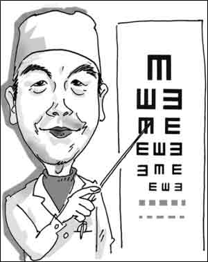

# ＜天璇＞短发

**从前我敬佩超短发的女性。刘瑜，演过赫敏的艾玛，客语歌手Misa。我从前以为在超短发的女性身上有一种我无法想象的坚韧和气场，因为当你羞涩地低下头便可用长发将自己掩藏起来时，她们会总是骄傲地抬着脸，直面这个世界。可是当现在我也突然状况外地变成一个和她们一般的女性时，我才明白那不过只是一个瞬间而已，你所要忍耐或是抛弃的仅仅只是一个瞬间。**  

# 短发

## 文/周雨霏（国立清华大学）

 

从小到大我最害怕的两个地方就是眼科医院和发廊。

从小到大我最害怕的两件事情就是查视力和理发。至于查视力，从弱视查到近视，从近视查到散光，从100度查到400度，从400度查到800度，从小学三年级查到大学二年级……这些年来，涨的永远是度数，跌的永远是信心，不变的永远是暴力用眼，以及我和眼科医院之间不见不散的年度约会。验光师就是见证我与一圈比一圈厚的眼镜之间爱情的神父，一排比一排模糊的视力表就是我们的结婚证。

至于理发，害怕它的原因其实和查视力密不可分。因为我查的视力多了，配的眼镜多了，所以才如此地害怕理发。每当在理发师的坚决要求下不舍地取下眼镜时，我都恐惧得像参加高考，仿佛立马就变成了一只没有游泳圈的旱鸭子，掉进北冰洋，沦为浪花手里随意蹂躏的猎物。直到重新带上眼镜的那一刻，那暗无天日的半小时里，我的命运已经在一个素不相识的人那里被全部改写，以我所看不见的方式和程度。所以每一次查视力，都是为自己的行为负责；而每一次理发，都是为理发师的行为负责。

于是，为了降低带上眼镜面对镜子里的自己时崩溃的频率，我尽量不理发。到了非理不可的时候，也要先思考一个月、和理发师做尽可能详尽的理性沟通，并做好视死如归的心理准备。可是今天的状况却完全不同，从我刚刚决定要理发，到理完发坐在这里码字，时间过去不到两个小时。发型的改变程度是前所未有得大尺度的，然而我的心情却还是一样的平静。

我从图书馆冲出来，拎着电脑背着书包冲出校门。不知是冲太快还是风太大，张牙舞爪随风乱飞的长发这次飞得比往常任何一次都更加张牙舞爪。

远远看见一家发廊，于是我冲了进去，问：“可以理发吗？”

答：“要等半小时。”

然后我就冲了出来，左右望望，径直又冲进了30米外的另一家发廊。

再问：“可以理发吗？”

答：“要等一两分钟。”

于是我一屁股坐在沙发上。

“怎么剪？” 等我坐在转椅中了，理发师抓着我快要齐腰长的一把头发问。

“剪短。”

“多短？”

“很短。” 我想起刘瑜，然而又突然记起这里是民国，刘瑜不火。并且还想到即使是在大陆，对理发师讲刘瑜也不是靠谱的事。

于是暗无天日的半小时之后我终于戴上了眼镜，抬头一看，发现镜子里的自己并没有变成刘瑜，反而像是变成女版戴眼镜的常远老师……

总之我现在是从很长很长的长发突然变成很短很短的短发了。这其中听起来最为靠谱的一个理由就是，我想彻彻底底做一件可能后悔的事，一件堪比“毁容”的事。

有句话说，头发是自由的象征。明末清初留发不留头、留头不留发，那是国家暴力在头发上施的符咒；军营里随处可见的jarhead，也是自由的剥夺以及服从意识留在头发上的痕迹。每一个年代都有流行的发式，然而在这样一个以标榜个人风格为自由象征的今天，走在街上你还是会发现，一半以上迎面而来的的女性发型是一样的，特别是在台湾的大学校园。

从前我敬佩超短发的女性。刘瑜，演过赫敏的艾玛，客语歌手Misa。我从前以为在超短发的女性身上有一种我无法想象的坚韧和气场，因为当你羞涩地低下头便可用长发将自己掩藏起来时，她们会总是骄傲地抬着脸，直面这个世界。可是当现在我也突然状况外地变成一个和她们一般的女性时，我才明白那不过只是一个瞬间而已，你所要忍耐或是抛弃的仅仅只是一个瞬间。你甚至可以在这一个瞬间里享受将自己的头颅完全交到一个素不相识之人手中的快感。你把自己交给他，没有乞求和担忧，不论结果如何都欣然地全盘接受。你甚至可以通过这样的仪式，在头发和自由之间做一次关系上的断裂，或者也可以反过来说，以发型的方式更完全地拥抱那摆脱了审美规则与价值暴力的——真正的自由。

我又想起有一次和“领导”、“小朋友”在台北，那会儿我们正要去鹿港，我背着一个登山包和他们一起站在捷运里。“领导”凑过来对我说，台湾的女生根本不会背这种包，背这种包的都是理工女。所以，我就是理工女了？

我从不忌讳讲一两句脏话。有人说只有粗鲁的女生才讲脏话。所以，我就是粗鲁的女生了？

昨晚看98年的电影《征婚启事》，片中的刘若英有着比我现在还要短的短发。那部电影讲的是相亲，刘若英在同一个餐厅里与几十个素不相识的男人碰面，希望能与其中一个结婚。这部电影最终让我愤懑，不是因为刘若英最终也没能对任何一个男人以身相许并获得她期盼已久的婚姻，而是因为，当刘若英在以那精确而完美的标准从几十个男人里做着居高临下的筛选和挑剔时——“这个不适合结婚”、“这个没有结婚的能力”……当她在从事着这般在每个女性观众眼里都理所当然的淘汰时——那所有被淘汰的男人们，就全部失去了结婚的“权力”和“资格”吗？24盏灯全灭的男嘉宾离开了，走向他更真实的生活；而女神一般屹立的女嘉宾们还在继续贯彻执行着她们神圣不可侵犯的王法，奔向她们梦想中的爱情和自由。

所以，虽然我本是一头讨喜的黑长直，现在却像挣脱一只笼子一样顶着一头短发了。你也许不会喜欢，然而我的初衷，本来就不是讨你欢喜。

 

（采编：楼杭丹；责编：麦静）

 
