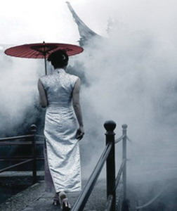

# ＜天璇＞红颜

**脸是一生努力不断自省之集大成者，每一处优点都想方设法在传达，每一处缺点都只有自己最了解。君不见萍水相逢、男欢女爱在即，各于自家明镜台前搔首弄姿之盛势。而面对糟糠旧识，则难免不修边幅、若无其事。露脸好比上茶，也分自家惯饮、熟客时斟和贵宾鲜奉。好脸须用在刀刃上，着最闪的衫，扮十分感慨，有人来拍照要记住插袋。**  

# 红颜

## 文/李孟元（Yale University）

 

一

初二那年班里转来一个新西兰长大的中国女孩，混进来没多久就和我一样获准免修英语课，于是每当Mrs.Xu进班，我和她就一声不吭跑出教学楼，载歌载舞君临空无一人的校园。偷闲莫如少年人；感到饿了，便跑去海淀剧院斜对过麦当劳里凑钱换一袋薯条；精神上需要补给，则潜入图书馆把《看电影》心照不宣地翻到“情爱参考”一页屏息凝神地阅读。不必说，只个把星期我就坚信自己找到了真爱，随后义无反顾地陷入十四岁小处男特有的自卑自嘲患得患失与难舍难分。 

和所有早恋剧情大致相同：女孩并不喜欢我，她喜欢外班的一个型男。型男打得一手好篮球，战到深处常常会扯下校服及打底T恤，露出雪白耀眼的肌肉和一撮不合时宜的胸毛。女孩经常好端端散着步就被奇妙的引力扯去篮球场方向，趔趄着倒在铁丝网前然后巧目盼兮地检查型男踪影。此时我大约在她身后不远处潦草地踢着石子，大声寻找有趣的话题寻钓注意力。无果，继续踢石子。这落脚扬尘间建立的心理落差和自卑情怀将长久影响此后生活的节奏和价值观，带来动力的同时产生大量心理补偿机制和群体性偏见。当然，和所有早恋剧情大致相同：型男并不喜欢女孩。 

初中毕业之后，女孩转到四中待了一年，继而风风火火地飞回新西兰入读一所女校。型男和我按部就班升入本校高中，平时隔一条楼道井水不犯河水。从高中开始我怒下决心在篮球事业上卧薪尝胆，于是偶尔也能窥见型男在邻场与其他帅哥筋肉齐飞的身姿，尊敬之情慢慢冲淡了敌意，几次在男厕里不期而遇时甚至会微沉下颚，以示问候。 

然后不知从哪天开始，型男开始每天对着洗手池上的镜子往脸上捣鼓些什么。如果你斗胆绕过他结实的后背和宽厚的肩膀详细观察，你会发现——他正在使用护肤品。型男涂抹护肤品有如仪式一般庄严，仔仔细细，一丝不苟，手指在痘痕与肌肤间跳跃，留下昂贵的膏泥和对未来的期冀。型男的眼神有十二分认真，动作如手术刀精确，即便有熟人打趣也丝毫不会分心。他像雕刻家一般修改着自己脸上的坑洼、成长的代价，仿佛镜中的倒影不是自己也不是人，而是含苞欲放的艺术品等待着勤劳执着的双手去挖掘。于是我们得知：型男恋爱了。 

本来，这一切与我毫无干系。 

高中年代的我是极胖的，长期处于“胖得可爱”与“胖得令人反感”之间，且多偏向后者。每当我弯下腿把屁股放在座椅上，腹部积垂的赘肉都会团结成浓浓的一圈稠密让肋骨和脊柱在油脂里游曳，像安全套勒住阳物一般紧绷不适却又无路可走。我从未不食人间烟火，于是心中的挣扎只能用旁的方式弥补。弥补方式之一即动用千百种手段减少脸的面积。我头很大，脸自不必谈，怎奈何面部毛发少得可怜，且发迹奇高，撩起刘海便有毛润之天命之年的风范。当时唯一对策就只有留长头发，再长一点，理想中的长度大约在腮帮子底沿和教导主任的眉头之间那片完美的天空里。每次走过一块带反光的表面，一定会望眼过去检查头发的位置和角度，扭动脖子观察不同效果，直到刘海偏斜的位置与下颚可辨识的轮廓形成完美映衬，再行继续走动。这就是我的脸，别人最后看到的是什么并不重要。在我自忖满意离开镜面之前最后一刻所捕捉到的那个表情与那张面孔，那才是我的脸。 

高三某一天我走进卫生间，溺毕甩干之后提裤子洗手，突然从脖子后面伸来一只肉掌，以不可抗拒的力量箍住肩膀和脖颈二话不说把我从洗手台拉回了小便池。落定回神，发现正是型男。他脸上挂着笑容，嘴角上粘了一抹未及洗净的护肤膏，表情憨态可掬，与冰冷的眼神形成鲜明对比。 

“XXX是不是喜欢你啊？” 

XXX是型男班上一个戴眼镜的女孩，喜欢在校服里穿一件绿色的兜帽衫，皮肤很白。我和她在校外辅导班里认识，后来学校里晚自习的时候她会约我到校园里散步。她有时会问起新西兰姑娘。我捕捉到了型男的眼神；一切仿佛昨日再现，只是换了站的地点。 

“你丫说什么呢？” 

“你丫别装傻。” 

脑后的手臂松一下、紧一下，在旁人看来想必与哥们彼此的勾肩搭背无异，我却从心底里感受到了几百万年前人类雄性相遇时那种出离见闻的警惕。型男还在笑，口吻依旧打趣，空出的一只手却突然找到我的头顶开始友好地搅乱我的头发。一瞬之间，精心设计的造型被打散，角度概不成立，刘海和鬓角分崩离析，大片肿胀的脸颊浮出水面，像指甲盖下粉红色的婴儿肉痛不欲生地暴露在空气与世界面前。恐惧瞬间占据了心灵。在意识到发生了什么之前，自己已经开始歇斯底地喊叫了： 

“别碰我的脸！别碰我的脸！！” 

声音一定很大。 

型男心虚地看着厕所周围驻足的人群，解下手臂，低头赔笑，表情上却写满了尴尬和不解。他也许觉得自己手头口头都未动粗就招致却如此激动的反馈未尝出乎预料。但他没有想过，如果书包里那一瓶欧莱雅男士活性洁面膏不翼而飞，如果他自己的脸像我这样被人抢走，那时世界会变成什么样子。 

二

电影《Watchmen》里争议角色Rorschach从不摘下他标志性的白色面罩，面罩上黑色的墨迹甚至会根据Rorschach自己的心境变化而表现出不同形态。而当他遭到暗算，被赶来的警察制服并强行揭下面罩之后，Rorschach用撕心裂肺的声音哀嚎:“My face!Give me back my face!” 面罩下面，是一个暗红色头发、皮肤苍白、相貌普通的中年男子。不是怪杰，不是英雄。 

不要碰我的脸。 

三

有一个非常简单的生活常识我近几年才领悟到：一个人在镜中窥得的自身倒影其实与旁人眼中所见的完全相反。换言之，对镜半晌精雕细琢的左倾刘海在外界看来实则斜向右方，而顾影凝神亮出的黄金侧脸在现实中亦要颠倒乾坤。我在自拍镜头里欣赏到的面孔，并不是我。 

那又何妨？把蒙娜丽莎沿中轴翻转过来，她还是蒙娜丽莎。人爱面子早不是一两千年的事了，从Narcissus被Nemesis引到河边望穿秋水的一刻起便已没有了回头路。 

如果自拍照片是我向世界展示的主体，那谁又能说这不是真实的我！自拍时我能控制自己的表情，我能预知拍照的结果，我能决定自己的脸。我能决定自己的脸！这与化妆安得区别？这与护肤何相径庭？什么教养、健康、知识、涵养，说到底不就是操纵一张脸面的艺术。 

脸是一生努力不断自省之集大成者，每一处优点都想方设法在传达，每一处缺点都只有自己最了解。君不见萍水相逢、男欢女爱在即，各于自家明镜台前搔首弄姿之盛势。而面对糟糠旧识，则难免不修边幅、若无其事。露脸好比上茶，也分自家惯饮、熟客时斟和贵宾鲜奉。好脸须用在刀刃上，着最闪的衫，扮十分感慨，有人来拍照要记住插袋。 

我记得某日在纽约与一众半生不熟的“圈内人”聚餐，餐到狼藉自有好事者提出拍照。少顷，服务生接过嗷嗷待哺的爱奉4s立于桌端就位，看着兀自叽叽喳喳的食客喊句：帅哥美女们，要拍了。其效果不亚于往起跑线上伸展压腿的运动员当中吹响一声明锐的准备哨；只见筵席间的头颅有如鲦鱼大群一般扭往同一个方向，原本弓腰驼背的伸展坐直，原本笑出牙龈的轻抿嘴唇，原本发丝拂面的疾手净颜，原本神志不清的眼波流转。霎时间我看到了在这一刻之前他们受过的每一次羞辱，照烂的每一张照片，无谓的自怨自艾，以及脱胎换骨的决心。开玩笑，爷爷（姑奶奶）可是练过的。 

四

就我个人而言，非常喜欢素颜的女孩子。 

须得澄清绝不是诸如“素颜的女孩，运气一定不会太差”之类的操蛋说法。之所以会喜欢道理异常简单：如果一个姑娘允许我看到了她的素颜，那往往两人之间要么即将发生事情，要么已经发生了事情。值得注意的是：就算发生了事情，我也不一定能见到这姑娘的素颜，因为自从十八岁之后，我就意识到有些女孩子的素颜是一种特权。不能等，得挣。 

看心爱的姑娘卸妆是一种视觉享受；她瞪大眼睛，不媚不惑，手持不明材质的白净物体蘸上卸妆水，擦眼影，抹口红，露出不尽完美的皮肤和胭脂下面未经人事的缺憾。她俏生生地看着我，把世界看不到的夜晚展现在我眼前；这比内衣、红酒和肌肤之亲更要性感。 

包括我在内，由好莱坞喂养大的这一代青少年容易相信做爱是一场美学盛宴。我们看到男女主角面色红润地拥进被窝，唇齿相接——继而镜头切置窗外，而再等切回来时阳光已撒满房间，男主角正以一个完美的姿势从背后抱着女主，两人发型舒展，面皮白净，嘴角还挂着一丝甜蜜的微笑。PG-13的性爱就是如此：干净利落，没有过程。它们不会描述激情当中汗水沾湿的头发挂在额角一个可笑的位置，不会描述从始料未及的角度看一个人的五官会产生如何猎奇的视觉效果，也不会描述第二天醒来时难以睁开的双目和口中苦涩的酒精味道。尽管如此，在人与人最亲密的过程当中时人的脸上终于表现出无法掩饰的诚实。诚然小伙子会装爷们，小姑娘会装高潮，但当那冰雪清澈的一刻来防之际，不仅是身体，人的脸也会无一例外袒露出超越一切自拍镜面而浑不自知的至高美丽。我们说身体是诚实的，也许当身体与脸终于不再各自为政的时候，后者也能够找回属于自己的真实。 

这一年夏天，我把伴随自己三年的发长缩短至额头上沿和两耳边缘。新的脸很大，很圆，很丑陋。我戴着它和人交谈，寻找故事，去不同的城市，遇到一个美丽的姑娘。最近一段时间，越来越习惯这张脸了。  

（采编：周拙恒；责编：周拙恒）

 
