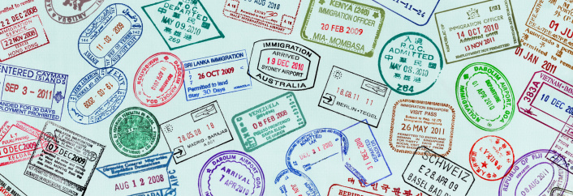

# ＜天璇＞给学妹的信：出国还是不出国

**写了这么多，不知道你体会到我的意思没有。你还有半年的时间来决定是否要出国，所以不如先把这个问题放下，好好想一想你想要的是什么，然后再回到这个问题上。而且，即使你做错了选择，不要沮丧，你还有大把的时间来改正这个错误，人生就是一个不断犯错误改正错误的过程。还有什么想不明白的，或者有什么问题，放心大胆地继续问吧。**  

# 给学妹的信：出国还是不出国

## 文/刘欢（北京大学）

 

你今天跟我说，出国的信念有点动摇，因为突然不知道出国是为了什么了，而且听在国外的学长说美国对金融工程的认可度越来越低。还有，你不喜欢编程，“最近觉得自己对咨询很感兴趣 而且相对于搞研究 我觉得我更擅长和人打交道 如果我真要干咨询的话 出国还有什么意义呢”。看到最后一句，我觉得这不是一句两句可以说清楚的，所以还是写一篇长点的多废话些吧。

其实很多人都有这个疑惑，到底是出国还是不出国，出国到底是为了什么。我觉得这必须取决于你自己想做什么。出国和不出国完全面对的是两个世界，两种生活。我无法帮你做决定，但是我可以告诉你我在国外这三个多月以来的感触，你自己来作对比，然后决定你自己的人生。

我到这里了以后，最大的cultural shock是，这里的大部分人都在做自己喜欢做的事情，上自己喜欢的专业，有自己的兴趣爱好。记得刚来的时候和一个意大利人聊天，他问我到处hiking的时候有没有看到paraglider，我说我看到过，他就很兴奋的问我在哪里。原来他一年前拿到了flying license,之前在意大利的时候每周末都要和朋友一起飞的，现在在瑞士不知道哪里可以飞。碰巧我们一块的朋友里有另一个瑞士人听到了，他说他最近正在考license，于是两个情投意合的人就兴奋地聊起来了。其时我还是相当惊讶的，在我脑海里我不能把普通的大学生和paragliding联合起来。我的很多瑞士同学也让我时时感到诧异。我隔壁房间的男孩子是曾经的瑞士国家队的轻量级拳击队员，后来参加兵役荒废了一年之后不想再回去了，于是开始上大学。现在他大二，年龄跟我一样。我现在master项目的同学，曾经入选了瑞士击剑的国家队。后来交了女朋友，训练越来越苦，学习也越来越难，他自己衡量了一下，就退出了国家队。以前的我很难想象这些事情就会发生在自己的身边。这就是我要告诉你的第一点，出国后，你的生活就不再那么局限了，你的生活突然就多了无数的可能性。这些是你在国内很难做到的。

以我自己为例子。刚到这里的时候老去hiking，一是喜欢这项运动，二是山上的风景实在是漂亮，三是每周末你都能从平时生活的海拔三四百米的地方跑到海拔三四千米的地方去玩，想一想是不是就会觉得很爽？后来开始出国旅行，曾经两个小女生在时尚之都米兰一起感慨什么东西都买不起，曾经一个人在漂亮的威尼斯到处游荡随时处理意大利人的各种搭讪，曾经在巴塞罗那的诺坎普球场外听着里面的欢呼声心潮澎湃。其实我开始时没有想到在学期中间的时候，我就可以到处游走的。是我在这里一起玩的同学们，上周有人去荷兰，这周有人在伦敦，下周有人去巴塞罗那，再下周有人要去罗马尼亚参加婚礼，我才意识到，原来我也可以到处玩的。在这里，我突然觉得世界就只有那么小，都在眼前摆着，又觉得世界那么大，我的生活里可能性实在是太多了。

关于第一点我就说这么多，你大概已经能体会到我要表达的意思了。第二点，咱就不说好的，说点不好的。自从九月一号落地的那一刻起，我就意识到从今往后一切都要靠自己了。所有人都要面临的最大问题是做饭，如果你很享受做饭倒还好，如果不是很喜欢的话，学校食堂的实在是又贵又不好吃，自己做的话太费时间，花一个小时做完了很快就吃完了，然后还要洗锅洗碗收拾厨房。而且一个人做一个人吃，做一个菜吧觉得菜的种类太少，做多了又吃不完。当然一切主意都是自己定，最终还是能找到一个平衡的。我也是到了这里，才发现原来生活还有这么多的细节。曾经flat里开会的时候，大家为了牛奶盒子是应该直接扔到垃圾箱里还是当做纸板回收争执了很久，我们现在也要每周末把玻璃瓶子、易拉罐、PET分门别类地提到附近的火车站进行回收，还要在每个月特定的时间把报纸等可回收的纸板类放到街区的指定地点。而且厕所啊，浴室啊，都要自己清洁。

但其实这些都不是问题，问题是你生病的时候会很难受。我们flat里有一个男生从苏格兰玩儿回来得了水痘，医生让他自己在家休息。flat里有好几个人都从来没有得过水痘，于是他一个人在房间里躺了一周，几乎没有出来过，至少我是一周都没有看到过他。一周之后再见到他的时候，整个人瘦了一大圈。至于我自己么，没什么大事，能提一提的就是去德国大采购买了很多东西扛回来在车站等车的时候已经是晚上十二点了，下着大雨没带伞还险些误了最后一班公交车。等我几经周折终于扛着许多东西走到家里楼下的时候，我突然觉得自己就像是女超人一般。在这种情况下，你还能坚持自己的标准不随便把自己许给某个频频向你献殷勤的学长么？如果能，那恭喜你，你大概就要迈入剩女的行列了。因为我们都成了不需要男人自己就能过的很好的强大的女人。就是说，不需要有人听我们撒娇，不需要有人听我们抱怨，我们自己就能过得很好。是么？不是。不需要不代表我们不想要，但是很多人会理解成我们不想要，所以，就会越来越剩了。不过说这个貌似没有用，你是有家室的人了，但是要提醒你的是如果你俩是异地，那么关系的处理就比单着更复杂了。

以上是第二点。最后一点，也是最重要的一点，是针对“出国还有什么意义呢”这句话。我一直觉得中国教育对我在细节上是成功的，在大方向上是失败的。因为我并不知道我想要什么。我不知道我想要什么样的生活，我不知道我真正感兴趣的是什么，不知道“天生我材必有用”的材是什么，我生活的终极目标是什么。我或许清楚那么一点，有时候又突然觉得自己不清楚了。很多人都是混混沌沌的活着，偶尔想一想这个问题觉得头疼，然后就干别的去了。我希望你不是这样。我希望你可以清清楚楚得想一想，你自己到底要什么，你活着的意义是什么，你希望你自己可以干什么。我说的不是近的比如要不要出国之类的，而是不管你是出国还是不出国，最终大方向都是一致的那个大方向。方向找对了，你就不会在走路的过程中迷失自己了，你就会知道自己最想要的是什么了。

也许你现在还是云里雾里的，其实这个东西也不是一时半会儿就能想明白的。我最终没有去读金融工程，而是读了统计，原因是我对自己到底是不是要干金融实在是困惑了。我在这边也经常会和同学谈起这个问题，我不确定金融到底对人类有没有特别大的好处，因为it’s all about money. 如果我能做生物统计方面的工作，比如一些研究，那么我至少确定我现在在做的东西是对人类有益的，不是单纯地为了某几个人的个人利益，不是把我自己的高兴建立在别人的痛苦上。相信你也知道，在金融的世界里，总有人要为了你的获益买单，买单的人往往是平民。这就是我困惑的原因。你不喜欢编程，喜欢与人打交道，那就大胆的去追寻你自己想要的吧。如果你把目标设定成了咨询，那么不出国当然也有很大的发展空间，出国的好处在第一点里我也说明白了。我想告诫你的是，你还有大把的时间，没有必要去rush。很多人都急着早早把大学读完读研究生，把研究生读完就工作，工作了以后发现生活真TM无聊，还不如读书的时候呢，这样的人其实是失败的。要给自己多一些时间，没必要上赶着去找工作，也没必要怕自己嫁不出去随便找个人上赶着就嫁了。生活是要慢慢体会的，如果你在追向咨询的路上发现自己其实喜欢的并不是咨询，而是别的，如果你真的确定，那你就大胆地把方向改了，我们的时间还多的是呢。在自己真正擅长的、喜欢的事业上，我相信我们任何一个人都在短时间内就爆发出巨大的能量，达到巨大的成就。

我记得曾经看一个电视节目，采访了一对儿正在法国的中国留学生夫妻。说是留学生，其实都三十多岁了。丈夫是在三十多岁的时候决定自己要追寻多年来的兴趣机械设计，而把所有以前的一切都抛弃了，跑到法国来读本科，重新开始自己的人生。妻子非常支持，也一起跟到了法国。我们flat里也有一个男生在德国读完了土木工程，觉得自己最喜欢的还是建筑设计，于是现在在我们学校重新开始读本科。这又让我想到了我的高中校友，虽然本科在北大上了中文，但是发现自己最喜欢的是设计，于是决定要去香港重新读一个设计的本科。当时听到这个消息的时候是在大四下学期，当所有人都确定了未来的方向急急的向前走的时候，我特别佩服有这样一个人，大胆的走回到起跑线上，让一切重新开始。但是我非常确信的是，一旦出发了，她会比我们谁都跑得快。

写了这么多，不知道你体会到我的意思没有。你还有半年的时间来决定是否要出国，所以不如先把这个问题放下，好好想一想你想要的是什么，然后再回到这个问题上。而且，即使你做错了选择，不要沮丧，你还有大把的时间来改正这个错误，人生就是一个不断犯错误改正错误的过程。还有什么想不明白的，或者有什么问题，放心大胆地继续问吧。

（采编：佛冉；责编：尹桑）

 
