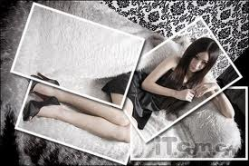
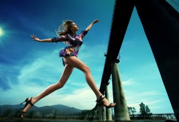

# ＜天璇＞美女

**国人已经越来越搞不清什么叫美女了。一有人说闫凤娇纯情如含苞待放的桃花，马上她穿着三角裤衩光着膀子的照片就蹿红网络了；一有人说马诺卡哇伊如hello kitty ，马上她就爆出一句“宁愿坐在宝马里哭也不愿坐在自行车上笑” ；一有人说北体美女孔燕松的长腿堪比凯莉·布鲁克那两根世界第一美腿时，马上她就自我爆料说现实生活中的自己其实很邋遢几个礼拜不洗头 虱子遍地爬是常事……**

### 

### 

# 美女

### 

## 文/ 张开埠（江西财经大学）

### 

### 

由于很久没看到美女了，我那明媚的眸子最近又酸又胀，做眼保健操滴珍视明滴闪亮都无济于事于事无补。患上眼疾的我怒火中烧倍感焦虑，深怕成为帕瓦罗蒂二世、阿炳第二，更怕有朝一日只能学着美国盲人作家海伦凯勒颤颤巍巍地写下臆想曲《假如给我三天光明》。于是，我想尽一切办法去寻觅美女，在美女经常出没的地方翘首以盼望眼欲穿，最后换来鬼妹的冷眼以待嗤之以鼻。现实世界总是冷冰冰凉飕飕惨兮兮的如同停尸房，已经绝望的我决定在网上寄托最后的愿景。 不幸的是愿景最终变成了哀思，好不容易找到的美女被肖同学无情地批为一坨走资本主义路线背弃毛主席邓爷爷等伟大领袖的婴儿肥少女。还亏我兴致勃勃地把照片发给他看呢，唉…… 

 连法力无边的互联网都找不到传说中的美女了，这无疑是网上美女泛滥进而乏善可陈的结果。是的，这是一个是个女人就可以称之为美女的时代，无论是自卖自夸自吹自擂还是网络推手作祟，都是对天生丽质浑然天成的公然挑衅。我们不愿看到的结果还是出现了：国人已经越来越搞不清什么叫美女了。一有人说闫凤娇纯情如含苞待放的桃花，马上她穿着三角裤衩光着膀子的照片就蹿红网络了；一有人说马诺卡哇伊如hello kitty ，马上她就爆出一句“宁愿坐在宝马里哭也不愿坐在自行车上笑” ；一有人说北体美女孔燕松的长腿堪比凯莉·布鲁克那两根世界第一美腿时，马上她就自我爆料说现实生活中的自己其实很邋遢几个礼拜不洗头，虱子遍地爬是常事…… 当网络美女和凡间美女都化为一坨少女之后，我决心向记忆索要残缺的资源。隐隐约约还记得《色戒》中的汤唯很美丽动人，于是我决定再看一遍岸西的伪文艺电影 《月满轩尼诗》。 看这部电影，当然是冲着汤唯去的。看了无数她的街拍照片，嘴角浅扬，眉眼低垂，每次我看到都要惊叹：哦，美女，原来你在这里！且跟范冰冰式最佳角度微笑全然不同，一看就知道是有思想，有文化，有理想，有内涵的深度笑容，拥有这种笑容的女人，我们称之为气质型，她爆不爆乳，屁股翘不翘都没所谓，气质面前，一切肉弹都是浮云。这种轻描淡写的出场多了后，一部以她为女主角的电影无疑吊起所有人的胃口，大家都期待，汤唯《色戒》后将以何面目示人？平底鞋牛仔裤，转过身时我忽然很欣慰：原来她屁股也挺大的。我期望看到一个什么样的汤唯？老实说她既然长得这么有文化，扮演一个只爱看通俗小说的女人，还真让人尴尬，大俗与大雅间偏偏挑了一个中间路线，你又不是张学友，天生长得就很市井，亦庄亦谐。当然小规格的文艺女青年挺讨男人喜欢，看她娴静如水，大家都很享受，但实在无法胜过她在英国的全胜文艺女青年样。 再次被自己刻薄扭曲的审美观击倒，记忆中美女看来要坐上时光列车到遥远的童年才能找到了。在哥不经事的年代，曾很没出息地笃信《还珠格格》里面的紫薇（林心如版）是我的最爱，是最美的。最是那前刘海的随风而荡漾以及那两个滚圆滚圆的眼球显露出的少女独有的无知与清白。可是后来，被看到林心如主演的毛片时，她在我心目中伟岸高大的形象轰然倒塌。我在一片废墟滚滚灰尘中发誓：我再也不相信琼瑶阿姨了，再也不相信所谓的少女独有的无知与清白了。 

 美女啊，你在哪？我怎么总也找不到你？ 

### 

### 

（采编：林静 责编：陈锴）

### 

### 
