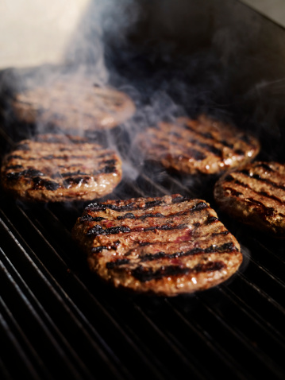
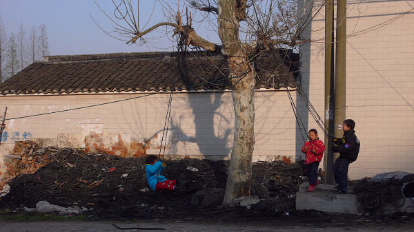

# ＜天璇＞肉饼店吃肉饼

**想想觉得在大洼开个肉饼店蛮好的：不用在市区吸汽车尾气，生意好了也不担心被土豪劣绅压榨；住房离上班地点五米远，完爆日日夜夜挤地铁的劳苦大众；夫妻店里有老板娘文君当垆，完爆长年累月分居两地的痴男怨女；工作不用看人脸色、不用装腔作势、不用曲意逢迎、不用良心不安，堂堂正正烙肉饼，直接创造社会财富，司机兄弟都说赞；专注烙饼几十年，不跟风搞多元化，经济学家说learning by doing，终将达到庖丁烙饼、技近乎神的境界，届时老板烙的不再是饼，而是艺术品。**

# 肉饼店吃肉饼

## 文/刘铮 （中央财经大学）

 

一

我是在湖南小吃摊中吃大的，看待北方小吃的态度素来很傲慢——就像西学东渐时天朝上国看待泰西诸夷那样——觉得虽有些奇技淫巧眩人耳目，总的来说还是落后未开化的。

当初看到肉饼店，心想既然以前没吃过，就当来旅游尝个新鲜吧。但是在啃完一张饼后，我心中还是勉为其难地承认了北方小吃的合法地位，至于后来每周都要来肉饼店几次，那是后话，在此不表。

每天经过十字路口的货车成千上万，在主教上无聊课时可以俯瞰窗外数车取乐。因此肉饼店的主要顾客是大车司机，也有旁边工地的民工大叔。

一直以为肉饼店只有我一个学生客，说起来好像很小众，却毫无清新格调可言。有回结账找钱时我表达了对一元硬币的需求，老板娘说不巧，昨天被一个客人搜刮干净了，那一刻我竟忘了失望，心中颇为激荡：中财袍泽中有肉饼同好，吾道不孤矣。

这里猪肉馅的饼十元，牛肉馅的饼十二元。一张饼足重一斤，非常扎实，应该有好几块钱材料在里面。一般人一次吃一张饼也就够了，我自恃饭量惊人，长期每次要两张饼，然后撑得滚出肉饼店，很痛快也很痛苦。

后来我深思此法食饼不太科学健康，改要一张饼，外加多喝几碗免费的粥。就在那一回，细心的老板马上察觉出来我的变化，“一张饼吃了不够吧？”然后将食饼秘笈私相授受于我：

“你可以说烙一张一斤半的饼。”

感于老板如此坦诚相待，我也就乐得从善如流了。

店里免费的粥也值得一提，南方的粥都是大米煮的，我在肉饼店第一次看到玉米渣做的粥时，觉得这个世界很荒谬，粥已不粥了。于是打算批判性地喝一点再嘲笑它，至于后来每次来都要喝掉三四碗粥，那是后话，在此不表。

二

大车司机不会在吃饭时敬酒劝酒、拉业务、攀交情、介绍朋友，对他们而言吃饭的意义就是吃饱了好赶路，何况他们确实很赶时间，所以总是来去匆匆。

我性格很温吞，吃块饼都要两面占上醋和辣椒，用筷子抹匀了才肯下口，吃完了也不急着走，再倒碗粥慢慢抿。也许还要在店里看会书，心想在星巴克自习的高富帅真是装逼，我视其如粪土。

所以我偶尔会成为肉饼店里最后一个客人。

但此时并没有肉饼店全体员工招待我一个人的奢华享受，因为他们要开饭了。总计五人，包括一个四五岁的小孩，也就是肉饼店少老板。老板娘会炒个菜单上没有的土豆丝，老板会从柜台上摸下一瓶老村长——

“兄弟，来口酒不？”老板这时候会对着我敲一下酒瓶。当他们关上门开饭时，我有点像是一个登门拜访的客人，而不只是一个掏钱买饼的食客，所以理应要请我喝口酒——我猜老板是这么想的。

我对酒精有点过敏，很怕喝酒的。但如果下午没课的话，我还是愿意喝一点，让老板给我倒小半杯，即使因此脑袋会砰砰砰地响一下午。

老板说他看我很喜欢吃肉饼，以前以为我是个北方人。

他说知道我家乡那个小地方，他以前在广东待过十年，对湖南也还熟。

香河肉饼是河北的特产，在北方很有名气，只是南方人不太知道。他是陕西人，肉饼是跟别人学着做的，但肉夹馍和凉皮是他老家那一带的最正宗。

沙河这一带以后要建大学城，要弄商业开发，到时候这一片低矮平房说拆就拆了。好不容易招来一批客，生意却做不长久，也就做这一两年，拆了以后别人都不知道上哪找去。

他也想在我们食堂弄一个窗口，但那都需要关系，赚得越多送礼就要送得越多。

一口白酒下去我就微醺了，随口问：“你这店生意还挺好的吧？”话音刚落就觉得问得蠢，商家对自家营业额都是讳莫如深的。我似乎能看到老板娘脸色一青，虽然她正背对我。

老板很无所谓，说确实还不错，主要是门前有一大块坪，方便停车。只是大车停停走走的，灰沙太多，学生都爱干净，就来得很少。

清明放假的时候，我在店里啃完两张饼，擦嘴起身准备赶路进城。店里也没有别的客人，我就朝厨房问了一句：“清明也不休息两天吗？”

老板笑：“我们不像你们学生，自己当自己的老板，哪有什么做事跟休息，都差不多。”老板娘也接了一句：“就算真关上门也休息不了，零零碎碎的事情太多了。”

听到这话不知为什么想起了我外婆，突然觉得好感动。

外婆也是一辈子不休息的人，七十岁人了，还在屋旁边种菜喂鸡。她什么都会，做擂茶、做甜酒、用菜籽榨油、把衣服改小、缝补丁、生炭火、刮痧、哄小孩，唯独不会享福，不会玩乐，不会被人照顾。

我曾经羡慕看上去很会玩乐而且玩得有品味有格调的人，也曾经羡慕几乎不需要劳作就金山银山取用不竭的人。我曾经很愿意那样设想自己将来的生活，却忘了如果没有大多数人生无所息地活着，这个社会一秒都运转不下去。我对他们有真诚厚实的感动与敬意。

有回一个客人吃完走人，碟子里还剩了几片饼没动。老板娘收拾完桌子，把碟子端到厨房里面，然后招呼少老板进来。她说的陕西话我没听太仔细，只看到老板娘用筷子夹着饼喂少老板吃了。小鬼之前在门口玩沙，手很脏。

如果就这个案例出材料分析题的话，我能谈三点看法：1.老板娘相信老公烙的肉饼没有食品安全问题，也许还能补充钙铁锌硒维生素、促进儿童智力发育；2.老板娘觉得把没吃动过的肉饼扔进潲水桶很浪费；3.老板娘觉得吃客人剩下的东西不是很体面，要端到厨房去。

看过一则关于剩菜的新闻，五星级酒店的洗碗工打算把客人吃剩的东西带回家给读大学的儿子补身体，被酒店以盗窃财物为由辞退了。这件事情很让人心酸。

我外婆从来舍不得把剩菜剩饭倒掉，即使已经吃过几天了。但是如果家里来了客人，她肯定会做一桌新鲜的菜。所以我很能理解老板娘的节约与爱体面。

想想觉得在大洼开个肉饼店蛮好的：不用在市区吸汽车尾气，生意好了也不担心被土豪劣绅压榨；住房离上班地点五米远，完爆日日夜夜挤地铁的劳苦大众；夫妻店里有老板娘文君当垆，完爆长年累月分居两地的痴男怨女；工作不用看人脸色、不用装腔作势、不用曲意逢迎、不用良心不安，堂堂正正烙肉饼，直接创造社会财富，司机兄弟都说赞；专注烙饼几十年，不跟风搞多元化，经济学家说learning by doing，终将达到庖丁烙饼、技近乎神的境界，届时老板烙的不再是饼，而是艺术品。

老板有时要骑摩托车去数公里之外的沃尔玛采购，必定会带上儿子一起出去兜风。回来时，摩托才停稳，少老板就会跳下来欢快地奔厨房，迫不及待地向老板娘讲述一路上的见闻。然后再看到老板提着几个袋子走进来。

每次看到这一幕，我都觉得这样的日子金山银山都换不来，未必不值得羡慕。

我祝福他们一直都活在这样平凡的快乐之中，但是小鬼总会慢慢长大，会向家里伸手要耐克鞋、择校费、结婚聘礼与买房首付，父亲烙百万饼也许够，还要祈求不遭灾祸。何况这一片房过一两年就要被拆。

不得感慨世情残酷如斯，容不得人安心踏实地烙饼。

三

大洼村位于帝都荒芜的北六环，未能受到市区绿化工程的恩泽，因此中财学子偶尔要被北国极端天气肆虐。

那一天正是扬沙天，校园整个变身灾难片拍摄现场，这个时候就应该宅寝室，在人人上骂天骂地骂学校，不幸的是，我腹中的馋食虫正搜肠刮肚打家劫舍。要知道吃货发起饿来战斗力之强堪比天朝城管，我看了一眼楼外黄沙滚滚漫天，毅然迈出了宿舍，在艰苦卓绝的客观环境中充分发挥人的主观能动性，英雄般地冲到了肉饼店。

“牛肉大葱，做一斤半，”我抹一把脸，再从头发里抓出一把沙。

有点意外的是，店里面还是有一些客，也许比平时还要多一点，大概是司机们也想在这歇会，等风沙小些了再上路吧。

不止是大车司机，世界上有那么多人在漂泊、在途中。于是就有人在路旁开家小店，让疲惫的人可以在异乡找到一个地方饱肚、取暖、小憩、挡风沙。突然想到老板也不是本地人，他从陕西老家出来，在广东生活过十年，又北上到了大洼，找到这个地方暂时停下，养家糊口、照顾孩子、结识朋友、他未尝不是在拖家带口地漂泊。

这样看来，此时这店里的人也没有宾主之分，每一个都是匆匆过客。只是司机们献出饭钱，老板献出劳动，大家各尽所能，各取所需，也互相支持，互道珍重。

而帝都偌大，满城过客，又有几人不是异乡人。

我有时会很厌倦，厌倦校园里半生不熟的人群，厌倦客套敷衍的对话，厌倦虚有其表的形式，厌倦睡眼惺忪的沉闷，厌倦无所事事的时刻。我有时会很想逃避它们，更甚于逃避这漫天风沙。

所以我经常不辞风沙来这坐一会，出十八块钱，买张一斤半的饼，占一张角落里的桌，看这里的人，看电视里播的新闻，甚至在这看书背单词。这让我有种莫名的自在与轻松。

此时，门外是黄沙滚滚，隐约看得出五六辆大车的轮廓。突然有种错觉，仿佛我如今身处大漠北疆，而不是华北平原。门外驻着的不是庞大卡车，而是旅人的骆驼。

再看一眼店里，那些杯觥交错的人可不是司机叔叔，这之间有押送异宝的镖师、往返丝路的行商、被朝廷通缉的亡命之徒、身怀藏宝图的淘金者、刀疤脸的官差、赤身乱发的昆仑奴、妖娆艳丽的西域歌姬……而我呢？给自己的人物设定应该是什么身份？

大概是屡试不中的落魄书生吧，试图到这荒凉大漠来碰碰运气。

嚼着嘴里的肉饼，突然觉得肉的味道很怪。警觉地嗅一嗅碗里的粥，隐然有蒙汗药的清香。我一拍桌子，喝道：“店家，你这饼可是拿什么做的馅？”

老板娘笑容异常灿烂：“一碟保险馅，一碟金融馅，你自己是会计馅吧？我知道的。”

听了老板娘的话，我若有所思地点点头，好像很有道理的样子。再一看，世界又回到了一次元，门外还是大卡车，门里还是司机叔叔，饼还是牛肉大葱大葱做的馅，厨房里忙得不可开交，老板娘点单收钱不苟言笑。

而我呢？还是落魄书生吧。

笑，再喝一口蒙汗药。

原文链接[http://blog.renren.com/blog/307078586/846956685?from=307078586#id1960974901](http://blog.renren.com/blog/307078586/846956685?from=307078586#id1960974901)

（荐稿：张苏樊；采编：何凌昊；责编：黄理罡）

 
