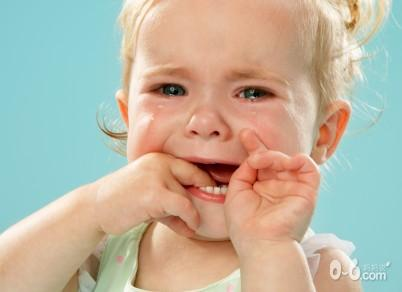
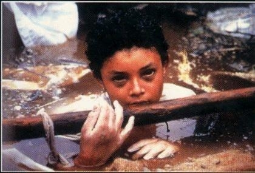

# ＜天璇＞自己的命运，只有自己买单

**以前有听说某男醉酒后吐露心事，在一大帮朋友面前吐露自己的从小到大的各种经历，那些影响了自己在心里成为疤痕的往事。某商科男说他幼稚，怎么可以在这么多人面前亮出底牌。我最初的感觉是商科人虚伪。但是慢慢的，我却开始觉得那是应该有的成熟的交往方式，除了少量的亲密的朋友，那些私事是不应该拿出来讲的，伤口或者软肋。而亲密的朋友，也是限于交谈而已，情绪上的“买单”，却不应该是别人来承受的。** 

# 自己的命运，只有自己买单

## 文/ 朱逸欣（香港中文大学）

 

想到这个话题是因为那天和某人讨论家暴的问题，他会用到“可怜”这个词，可是我却觉得如果只是过去的经历的话，已经成年人了，就不需要额外的“同情”（这儿的同情指的是和可怜连起来说的同情）。

这样说也许不近人情。我之所以这样说是因为想起了一些例子，有时候我们会因为一个人“可怜”就原谅他纵容他，在他犯错的时候觉得他需要额外的耐心和时间。然而这是没有好处的，不幸是那样一种东西，你越是强化它，那些记忆就越是影响这一个人。也许他自己都会陷入那种表演中，觉得自己很可怜，然后种种做错的事，糟糕的人生，都是因为那而起，然后反而无法摆脱了。然而这个世界，却不能一直给他耐心。一个很简单的例子，如果一个受过家暴的男孩，长大后结婚后对老婆和儿子家暴，周围的人就不会对他再有什么同情，愤怒的骂他不是人的也许会更多。

所以我一直反对任何形式的纵容，作为朋友，尊重，信任，支持，这些东西，比对他无原则的同情或者犯错的忍让，珍贵多了。

感情上的事，也是一样。有的人在感情上受了伤，向周围的倾诉，开始大家都会报以同情的目光，也会听你讲故事。但是伤口好转和别人的耐心根本不是一个时间维度的。这只是一个普通朋友，也许他本来是一个很好很好的人，只是他的经历改变了，而那样的伤口确实需要时间去愈合，但是周围，却没人会喜欢真心一个怨男or怨妇，也许还会不厚道的冒出“这样讨厌的性格活该被抛弃”这样的念头。

以前有听说某男醉酒后吐露心事，在一大帮朋友面前吐露自己的从小到大的各种经历，那些影响了自己在心里成为疤痕的往事。某商科男说他幼稚，怎么可以在这么多人面前亮出底牌。我最初的感觉是商科人虚伪。但是慢慢的，我却开始觉得那是应该有的成熟的交往方式，除了少量的亲密的朋友，那些私事是不应该拿出来讲的，伤口或者软肋。而亲密的朋友，也是限于交谈而已，情绪上的“买单”，却不应该是别人来承受的。

受过家暴的孩子，有些选择了去打自己的孩子，年轻时被别人抛弃过的，有的选择了去玩弄别人的感情……然而这样的生活就能给人被偿还的幸福感么？一个阿姨，她的父亲年轻有钱的时候抛弃妻子，但是现在都七十多了，她应该抛弃父亲么？被家暴的孩子呢，也是一样，转眼就到了自己成为家庭支柱父母成为无辜的老人的阶段。那些在感情上伤害过自己的前任，纠缠着就能让他还点什么回来么？

答案是，伤口就是伤口，其实我们什么都讨不回来。

也许还是《硬币》唱过的那句，“只有宽容能够让你释怀”，所有自以为的不公平的对待，已经是记忆中的过往，不存在有仇报仇的情形，就只能自己的心去化解。这样的过程大体是孤独的，有多少朋友都好，只能自己好起来，在无数的长夜，多痛苦都好，忍耐，不失去理智和自我，因为等待的涅槃是某一日豁然开朗的感觉。终于，可以用不同的眼光看待过往，经历没有改变，我们对其的态度和解释却是可以改变的。让生活好起来的，不是其他，是我们看待它的态度。而这看似轻巧的一句，却也常常给人难于登天的感觉。

始终觉得理解一个人是很困难的，所以更喜欢和有相似经历的人相处，因为这样才更容易有那种感同身受的“同情”，区分于上一种。那种不用伪装的契合感，不用纠结，一眼就可以分辨出来，超过任何形式上的安慰。对大多数人戴着没有恶意的“面具”，亲疏有别的本着尊重的态度去交往，寻找亲密的少数人，有伤口自己养好，也许就是我认为不错的生活方式吧。

为自己的生活买单，无论从前，还是以后。

 

（采编：陈锴；责编：陈锴）

 
