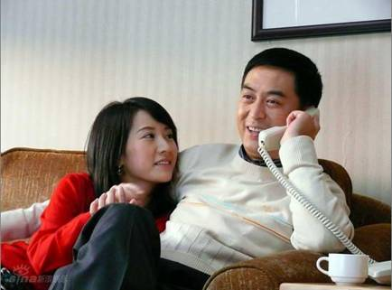
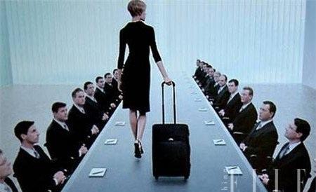

# ＜天璇＞自由恋爱时代的爱情奴隶

**三从四德的时代早就过了，在这个社会，所有想要幸福的人都必须要靠自己的双手去拼杀，所有的成果都必须依靠付出切实的代价来换取。等着别人来给予幸福的人，不过是这自由恋爱时代的爱情奴隶。他们不具备健全的人格与创造的热情，而这两点，恰恰是幸福的基石。**  

# 自由恋爱时代的爱情奴隶

## 文/安期未（中央财经大学）

 

我已经很久不在人人网发日志了，今天之所以发，是因为看到又有一个女人的爱情似乎是被时间和距离打败了。我不了解具体的情况但是我丝毫不意外——因为见得太多了。令人熟悉的悲鸣、哀恸与不甘的情绪回荡在女人的世界里，每一次撞见都让我无意外地想起我那在人人网上认识的前女友。

长久的时光中，我认识的大部分女性都缺乏两种可贵的品质——对自我命运的主导权与对幸福生活的创造力。女人总是喜欢把自己的恋爱过程诠释为自我牺牲和自我付出的过程。如果一个女人在恋爱中，大部分她的朋友都会知道她是有多么爱自己的恋人以及她都做了哪些付出。但是，极少有女人会详细地对认识的每个人提及自己的男人是如何为自己牺牲付出以及如何珍爱自己的。也许是她们认为没有提及的必要，也许是她们觉得那只是自己的努力所应得的回报（或者只是微不足道的回报）。似乎每个失恋的女人都觉得是恋爱和男人掏空了自己的心，而不是因为自己本来就是个空壳子；似乎每个失恋的女人都将分手这件事理解为“他给不了我幸福”。我不得不说，女人（或某些男人）是有权利这样想的，但这绝不是一种值得欣赏的态度——不仅是作为女人，更是作为一个自由恋爱时代的自然人。

三从四德的时代早就过了，在这个社会，所有想要幸福的人都必须要靠自己的双手去拼杀，所有的成果都必须依靠付出切实的代价来换取。等着别人来给予幸福的人，不过是这自由恋爱时代的爱情奴隶。他们不具备健全的人格与创造的热情，而这两点，恰恰是幸福的基石。我不知道别人怎么定义“幸福”这个词，反正我从来不觉得衣食无忧有房有车，每天下班回家都有个人一起做饭打炮这就是幸福了。我也不觉得一年去几次马尔代夫，拉着手去巴黎血拼购物或者去希尔顿开房这就是幸福。真正的幸福是心灵的契合，是生命的羁绊，是两个灵魂并肩前行的默契与快乐。这就要求两个人都必须有能力不断地自我成长和超越，并在前进中有着相近的速度与力量。等着别人排除万难然后跑来娶你的女人是愚蠢的。自己没有披荆斩棘的力量却要求别人翻山越岭地来跟你凑合，就算真的走到了一起，以后的路还长着呢。当两个人再次遇到沟壑障碍的时候，难道要男人背着你游过河？（沉底是必然…）

十八岁那年，就因为地域和国籍的原因，我很轻易地放弃了我挚爱的初恋。我有一万个理由来阐述我的无奈——我年纪太轻，我经济能力有限，我们所在的距离太远，我的前路漫漫凶吉未卜…但是这些理由毫无意义。这次放弃一直被我视作是一种耻辱和教训。很多年来，每一年在我们初见的那一天，我都会去当初分手的地方看看。不是因为我对谁还有着念念不忘的痴情，而是我需要重温一下这种自我否定带来的耻辱感和无尽的遗憾，并提醒自己不要再让时间、距离、经济条件这些狗日的借口再次成为自己爱情的障碍。诚然不是每对情侣都必须从一而终走到最后，但是除了两个人真的不合适之外，没有什么分手的原因是真正“合情合理”的，特别是“等不起”。暂且不论你是不是真的等不起，更重要的问题是你为什么要等？真正全心全意付出的人，为什么会把排除爱情路上的障碍当做别人的责任而不是自己的工作？地理距离太远，那就努力跨越它；分离时间太长，那就努力缩短它；不被至亲好友看好和祝福，那就努力证明给他们看。也许做到最后真正在一起了才发觉两个人的确不合适，但是这一路的辛苦都不会是白费。经过岁月淬炼与自我提升，你会更了解自己的潜质，从而知道自己真正想要的是什么。以这种成熟的心智去创造幸福，远比在茫然中痴痴地等更有效率。事实上，我也确实从来没见过谁的幸福，是靠两手一背、无所作为等来的。

嗯，你说我可以这么想，因为我是个男人；而你不行，因为你是女人。你青春有限，你等不起，拼不起。别傻了姑娘，就算找到了如意郎君，就算住上了花园洋房，你就不会老不会死了吗？一个没有事业、没有自我、没有社会价值的女人，在人老珠黄青春不再的时候被甩掉那是最常见不过的结果。什么是青春？青春就是有热情和精力去奋斗、创造和改变的岁月。给自己的青春画上标签，待价而沽，趁自己的皮囊还算看得过去时赶紧把自己嫁了，这种女人的生命其实跟青春其实毫无关系，也跟爱情毫无关系。所以我从不认为有什么“现实打败了爱情”的说法，只能说，这样的人，要么根本就没有拥有过爱情，要么就是她自己认知的爱情其实从不来在现实之中。因为我是男人，所以我可以拼搏，可以受伤、吃苦，可以创造和掌握，可以不在乎时间流逝或年老色衰而去执着于爱情。如果你觉得以上都是男人的特权，我无话可说。但是我确实无法理解为什么有人肯把自己的生命当做别人的附属品，等着爱情的主人将幸福赏赐给自己。过着这样生活的人，真的就会感到很轻松、很满足吗？

大学期间我在人人网上认识了我的前女友，一个丰满苗条的女人。我尽我所能地宠爱她，带她远离狭窄的宿舍到我自己的房子里去住，为她添置最时尚美丽的套装、旗袍，送她我亲自设计的珠宝，一起出入于一般的大学生消费不起的场所。我并不比一般人富裕多少，只是我花自己赚的钱打扮自己的女友，这让我感觉到无比的骄傲和快乐。我期望她作为一个女人而不仅仅是“我的女人”的身份去闪耀。所以对于做饭洗碗一律不会的她，我手把手地从切菜煮饭、洗衣扫地开始教起。因为希望她有个好身体而不是好身材，我禁止她再拿可乐当水喝，也不准她再像过去一样吃那么多零食。因为希望她有独立自主的底气与能力，在她临近毕业时，我积极支持她的实践活动与择业。因为希望她有自己的社交圈和社会地位，我善待她的每一位好友，愿意和她一起去出席我完全无兴趣的活动。我不介意替她手洗内裤和胸罩，不介意在她的生理期替她跑去买红糖和卫生巾。我对她所有的爱，都是基于充分的尊重和信任而作用的。我一直认为，女人的生活必须以自己的步调为主旋律，有自己的事业，有自己的生活空间和社会价值，我甚至认为女人在婚后也应该拥有一套完全属于自己的房子。但是这一切，都绝不应该由一个爱她的男人去替她付出、向她施与。她应该在我的支持引导和帮助下，靠自己去实现，这样的一切才有意义。大多数当代女性在听到我如上的言论时，都会表现得极度认同，但是一回归到实际的生活中去时，她们仍然坚持认为女人其实只要撒个娇卖个萌就应该解决这些问题，否则这家的男人也太没用了。所以说，理论毕竟是理论，在中国，大家似乎已经适应了言行不一致的模式了。（笑）

一转眼，五年过去了。我一直是单身，因为还没碰到过可以交往的、从本质上有别于“自由恋爱时代的爱情奴隶”模式的人。大家还是在找借口，拼无奈，玩命地控诉社会。我倒觉得自己过得挺好，始终在碾压着前进路上的一切障碍。在这个社会生存，每个人多多少少都要做出些让步，才能让自己的生活顺遂起来。不过，任何让步都是有底线的，从长远来看，有的时候坚持到底才是胜利的唯一途径。不要说什么“得先生存下去才有改变”的废话，为了生存而成为奴隶即是放弃改变的开始。看着一个世代为奴的人的眼睛你便知道，尽管他饱受压迫与痛苦，他乞求的也并不是自由，不过是换一个和蔼可亲一点的主人。在人生的战场上，我已经“死”过很多次了，面对他人口中的现实，现在的我也不过就是抱了必死的决心去抗争罢了。爱情是何等美好何等高贵的情感，但是它从来没有脱离于现实之外。用现实来做借口放弃爱情的人，既没认清现实，也不配拥有爱情。熟识我的人知道我是个双性恋，大多数人对这种特质的理解不过就是“摸着女人的胸的时候脑子里还想着男人的菊花”而已。但是对我来说，我真正欣赏并心爱的是男人灵魂中不屈不挠、独立自主、冷静思考与勇敢面对的部分，大多数女人身上很难看到类似的品质（尽管现在即使是男性也已经不是人人都有这些品质了）。除非女人不再仅仅拿自己当个女人，而是把自己当做一个独立的“人”去在社会中搏杀。你可以不服气，但是这个时代就是如此。不是一分耕耘一分收获，而是百倍努力一线希望；不是男尊女卑三从四德，而是男女竞争你死我活。说到底，女人想要真正的幸福，就不能时时刻刻都太拿自己当个女人了。像一个真正的心智成熟、人格独立的人一样，咬紧牙关在这社会中去拼搏努力，不管是为了自我实现还是为了爱情，这都是成功的唯一出路。

套一句我常讲的玩笑话，你够爷们，才值得这世界疼爱你。

号称无爱不欢的女人呐，你有没有胆子自己挑起追梦的大梁？有没有本事靠自己得到想要的一切？有没有底气让那些抱着“娶妻=养女人在家做饭打炮”思路的猥琐男滚蛋？有没有觉悟让自己离那些贩售青春的非职业窑姐远一点？有没有力量让你所恐惧的一切障碍：距离，非议，工作，环境，全都为了爱而靠边站？没有？嗯…那还是找个条件过得去的男人，趁年轻嫁了吧。

 

（采编：麦静；责编：麦静）

 
