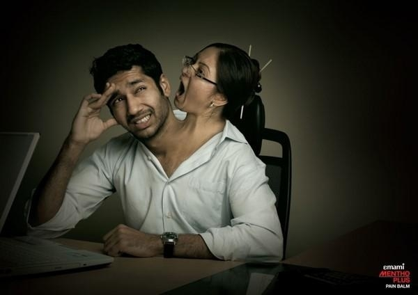

# ＜天璇＞舒服的爱情没有脚镣

**我理解并尊重你的对社会、对他人无害甚至有利的爱好，并在我乐意的范围内给你支持与仰望。我不相信爱情与自由不能共存，如果真是那样就只能说明那不是好的爱情。我会给你充分的自由与舒服的爱情，既然舒服，就不应该有脚镣。我相信你的爱和责任以及忠贞，而当我们彼此都成为互相无法忍受的束缚之后，我们也能在良心和道德的指引下和平分手。我希望你也如是。**

### 

### 

# 舒服的爱情没有脚镣

## 文/ 米粲（武汉大学）

### 

### ** **

 今天我想起裴多菲那首被念烂的诗来，“生命诚可贵，爱情价更高，若为自由故，二者皆可抛。”我小时候喜欢听老米说他上大学时候的那个版本：“生命诚可贵，自由价更高，若为爱情故，二者皆可抛。”这被一群饥渴男活生生地念出来的时候，有一种甘愿为下半身抛头颅洒热血的热情和决绝。那时候作为一个雌性灵长类动物，我很为之产生出一种傲慢且傲娇的情绪来：“看看吧，拥有一个阴户是多么的值得骄傲，在趋之若鹜的长枪面前，每个阴户都是权倾天下的女皇。所有的热血、理想甚至脑子，都愿意随时为之献祭。”这种囤积居奇的优越感一直伴随着我的少女时代，直到我开始因为不愿放弃自己的表达风格而一次次地失去爱情。 去年9、10月份我疯狂地往北京蹦跶，北师大的专硕学费又贵又不提供住宿，算算两年下来要多花家里6、7万块钱。我在这种深深的自责感中都坚持要去那里，因为想和男朋友在一起。想着不再需要为性生活而奔袭千里的日子，还有给他洗衣服做饭的细节，我常常乐不可支。而今年4月我就已经毫不留恋地分手，无非就是想要在校内上继续书写自己的潮湿。想来要不是叶茜也要去北京的话，没有朋友的北京当真会成为我的噩梦。 我坚持以为，选择自己的方式表达是我的自由，无论表达我的愤怒或是欲望，坚贞还是风骚，只要没有触犯国家律法，伤害到别人的肉体和精神，并能使更多人寻找共鸣并以之为乐，我都觉得是生活单调的宅女少有的快事。而男朋友用来阻止我的理由也让我嗤之以鼻，一个气度有待考量的人，一个人以旧式的道德标准要求女人三从四德的人，一个将我视其为所有物的人，一个自以为可以用爱情绑架我的人，一个不能“爱我也爱我的自由”的人，将不配拥有我最坏的一面。所以分手之后我才体会到裴多菲在选择时的毫不犹豫来，那个“抛”字里，甚至都不含有恋恋不舍的“舍”字。 我小时理解那首改编后的诗，一直都觉得女人对男人的控制虽然是有力的，但是是肤浅的。男人被女人所控，不过就像年轻时被政治课所控一样，是一种表演出来的妥协和避免麻烦的选择。以爱情之名对自由的说教、控制甚至勉为其难的妥协，都是爱情里痛苦的来源。这让我想到我还是小女人的时候，我有个男朋友非常喜欢泡酒吧，对于VOX那种小众的地方更是时时心向往之。而我是一个又懒惰又吝啬又俗气的女人，完全不能理解一晚上一百多泡在里面听一些听也听不懂的音乐有什么意思。所以每当他想带我去酒吧的时候，要么我就表明我坚决不去，宁愿在家看脑白金广告，还勉强自己说出“你自己去就好了”这种话；这种时候他每次去完回来都很有愧疚感，我也为他丢下我出去而觉得不爽。要么我就勉强自己跟他一起去，事实上我确实不能理解音乐，我在满场子嗨翻了的人群中拉长脸，怨念着一动不动，既不鼓掌，也不扭动。这也让他非常尴尬。现在想来我非常后悔当时的做法，我因用我的价值观而强迫他而使我们俩人都付出了不快乐的代价。 如今家欢的男朋友千里奔袭要来VOX的时候，我真心想对她说，哪怕你不喜欢，你也接受理解他的品味和爱好，并以他的快乐为自己的快乐，以能尊重理解他的价值观而为自己感到骄傲，并以从他的窗口里感受到更大的世界而感到快乐。这就是爱情里纯粹的乐趣，远比那种他向你妥协而产生的控制感带来的快感强烈得多。 

 到底有没有资格以爱之名剥夺爱人自由的权利，我在幼儿园实习的时候就老在想这个问题。我有没有权利控制小孩们违背本性地端坐，有没有权利说“老师爱你们，你们要听老师的话”？我有没有权利对老公说“你爱好这个有什么意思？有那时间你把家务做一哈”“一天到晚在那上面乱花钱，你心里有没有我”？在我现在想来，我认为老师和女人都没有这样的权利。如果可能，我会在吃早饭的时候对他说：“我理解并尊重你的对社会、对他人无害甚至有利的爱好，并在我乐意的范围内给你支持与仰望。我不相信爱情与自由不能共存，如果真是那样就只能说明那不是好的爱情。我会给你充分的自由与舒服的爱情，既然舒服，就不应该有脚镣。我相信你的爱和责任以及忠贞，而当我们彼此都成为互相无法忍受的束缚之后，我们也能在良心和道德的指引下和平分手。我希望你也如是。” 虽然我小时候对自己有着一种囤积居奇静待买家的情怀，现在倒是越来越不怕在爱情里面付出了。每个人都是懒惰的，每个人都是想要被照顾被宠爱的，每个人晚上都是缺抱的，每个人都是想要有质量的有趣的生活的，每个人都是想要依靠的，每个人都是想要被人仰望的，每个人都想自己是独一无二的，每个人都是自由的。而你如果爱这个人，就会想从方方面面满足他。其实做一个去满足别人的人是很强大的，反而做一个被别人满足的人非常弱小。事实上若是分手，强者依然很强，并不觉得自己失去了什么东西，而弱者反而被失落感折磨得生不如死。 我一直谈恋爱也一直思考一直反省，不得不说，爱情观总是洗洗更健康。我喜欢现在的自己，舒服自在，挑男朋友也越来越有方向，不会再遇到一个就饿虎扑食般地上去撕咬又厮磨。作为一个又懒又馋的女人，以前我总是很看重男朋友在生活上是不是会照顾人之类的，觉得围围裙的男人简直是无可争议的天下最帅。现在发现干家务也没那么难，我的口腹之欲满足起来也又便宜又简单，只是精神上不愿意再受什么束缚。话说这样的要求其实越来越高，不过慢慢地我总会遇到和我相似又让我仰望的人，能自在地做爱舒服地恋爱。因生理的快感和精神的高度而狠狠感到，这样的世界真tm深度美好啊。 

### 

### 

（采编：陈锴；责编：陈锴）

### 
