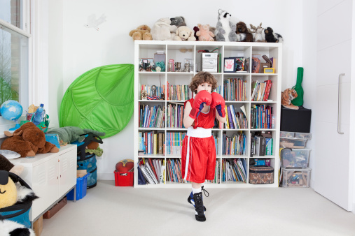
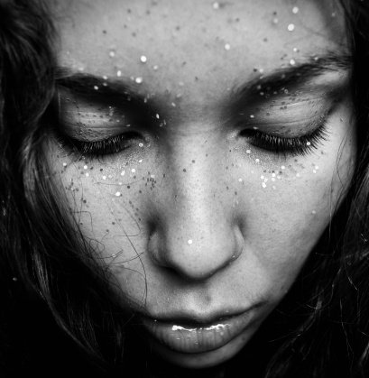

# ＜天璇＞若是妥协又怎能让我的笔惊艳

**我遇见过太多不同阶层不同世界的人，诸如农民、小贩、普通市民、乞丐、流浪者、藏人、维族人，他们有着与我迥异的世界观和价值观，让我感到特别无力又无奈。曾经面对他们谈论的话题，我会升起一股莫名的优越感，觉得他们懂得的太少，而又不够开明不够智慧。但是现在想想自己，和其他比我学识更渊博，心胸更开阔的人比起来，不也类似于未完全开化的人么？他们的生长的世界和我的太不一样了，又有什么办法呢？环境造就性格，而人面对命运安排的环境总是无能为力的。所以，又有什么资格去批判别人的价值观和人生观呢？**  

# 若是妥协又怎能让我的笔惊艳

## 文/鹿野小痴 （amherst college）

 

一．

从小到大，我都是一个特别讨厌甚至惧怕变得和群体一样的人，一方面是我觉得通过加入某个团体来获得安全感是一件很没有力量的事儿，我希望变得强大到可以依赖自己解决一切问题，只忠于内心的声音，随心所欲地变换立场并蔑视一切主流价值观，另一方面是我很自负地觉得世界上的大部分人都特别无聊。我喜欢和有趣的人打交道，他们像珍稀动物一样给我新鲜感和灵感，尽管接近很可能意味着受伤。

唉，其实这样白开水自述式的文章开头我并不常写，之所以突然莫名其妙地开了篇文章，是因为跑步。我经常给自己设置一些自虐型的任务，比如说每天跑六千米，比如说一口气做上百个仰卧起坐等等。长跑的时光既折磨又漫长，除了不停地数数或者看着计程器和计时器来支撑自己的身体不停运转，我还会一直思索。我想了想自己这些年的事情，想起了一些故事，一些倔强和懦弱，渐渐地，这些情感在脑海里成型，跑步的时候特别热，我的全身的衣服都像被洗过了一样，浑身不停地冒汗，头快要炸掉，脚指头因为摩擦好像要烧起来，我听见了脚掌的皮肤撕扯破裂的声音，也听见了心里好多平时隐藏得很深的声音，我觉得我得写写，不然白辜负了天天那么漫长的跑步。

这些年来，我一直倔强地保护着自己的独立性，虽然有时会痛苦，但我知道如果我失去了它我会更痛苦，二者相较取其轻罢了。这一点是从我很小的时候意识到的，那时发生了一件事，让我发现自己会以不惜伤害自身的途径来守住它。

那是还在上小学的时候，班里有个劳动课女教师，快五十岁了，脾气很差，素质比脾气还差劲，心情不好时经常破口大骂班里的学生们，使用各种肮脏污秽的词汇来侮辱女生们，譬如“将来你们都一定去做三陪女”等等，也经常体罚学生，扇耳光、推搡、拧人、脚踢等等。小朋友们全都敢怒不敢言，每次上她的课前都唉声叹气。

有一次她为了管教同学又做了一些令人发指的事情，她做这些事情的时候，我突然不想一直坐在那里了，十一岁的我觉得得做点什么，我想动弹，想笑，想大声说话，不然我会喘不过气来。于是我向邻座同学借了一本笑话书。我努力地读那本书，努力地让自己沉浸在里面的世界，然后，不出所料，大声哈哈笑了出来。

她果然被引爆了。老太太大喊一声，拧着我的耳朵将我抽了出来，又扇了我一耳光，问我为什么笑，为什么破坏纪律。我知道要出现这样的结果，但我不想像其他学生一样老老实实地认错、骂自己，于是我一直瞪着她不说话，直到瞪出眼泪来，其实当时我觉得这事儿很丢脸，因为我不想哭但是泪点太低也没办法。我们僵持了快一节课，我一语不发，不认错，不低头，只是在她审讯时不停地摇头，时而举起袖子来擦鼻涕。

后面的细节不想多说。还记得她点了好几个同学的名字，让他们说我的不是，还让另外一个小朋友在黑板上用大字写我的名字，直到写满了一黑板。我当时很失望，我希望会有人站起来帮助我，可是没有，我希望有人能大声抗拒她的指令，可是没有。事件以我的妥协和她的胜利告终。

那是我第一次开始发现我的格格不入的脾气。我明明有保护自己的方法可我不想用。我明明可以通过变得和其他人一样来受到群体的接纳但我从潜意识里抗拒。

在儿童期与青春期的交接口，那几年里，于我来说是惊喜与痛苦并存的，一方面我看到的世界还太小，找不到很多足够有趣的志同道合的人，另一方面我却也总能被奇奇怪怪的家伙们治愈，偶尔遇见一两个强大到指引我的方向，激励我成长的导师和偶像。

二．

我一直想说说那个代号叫“猫”的少女。猫现在的年纪已经算不上少女了，但她又一定是个少女，或者说，少年，更为合适。我们认识的时候，我十一岁，她十七岁半。那时候我还上小学，在玩一款RPG网游。在游戏里为了掩饰自己的年龄我从来都学着大人的口气说话，撒谎说自己已经十六岁了。当时的我觉得十六岁好远，好大，自己是那么的小，那么的弱，那么地希望快长大。

十一岁的时候我特别烦躁，特别孤独，虽然我一直都比较孤独。我想钻入一个别人都找不到的地方去，那里我以全新的身份随心所欲地做事情，我见到陌生而遥远的人却不用紧张跟他们的关系。于是我钻入了那个RPG游戏的世界。在那里我遇见了她。七年。猫以一种奇特的方式存在于我的生活中。我没有见过她的样子，没听过她的声音，不了解她的生活，她却曾经近乎熟悉我的一切。

猫性格古怪，休学在家，学过画画和CG，同性恋（当然这是在很多年后我才知道的），玩世不恭，无反骨却有逆鳞。

我是多么喜欢跟她说话。我跟她讲我的同学，我受到的委屈，我的困惑，我和爸妈吵架了，我花痴一个很帅的学长，我吃零食，我被罚站，我被打小报告，我写了篇新文章，我的好多大逆不道的想法。

她蹦出来许多好玩儿的词。她的说话方式和其他人都不一样。她听我讲，给我建议，叫我注意远眺，可自己却从不照做。她说她只喜欢讲。我也只是听听而已，因为我从最初认识她时的好视力已经被破坏成了现在的四百度。她叫我昂首挺胸睁开眼睛走路，可自己却从来眯着眼睛，像只猫一样。我猜她这样骄傲的人，一定是不想把世界看得太清楚。

她写过很多好玩的东西，最后却全都删掉了，一点痕迹也不留。她给我讲故事，关于女朋友关于同老师的矛盾关于同家人的不和关于青春的疯狂，虽然现在我也只是能忆起淡淡的影子而已。她看我的文字。我从十一岁写到十八岁。中间的跨度太大了，那么多的烂文，那么多我现在看了都觉得不好意思的小儿女情态。猫却说，它们之中有一种死过的美。

其实，猫，我一直没告诉你，这句话对我是很受用的。因为啊，我一直在心里觉得自己的灵魂是很美的呢。尽管它也不干净，也有血迹和尘埃。可是我还是觉得我的灵魂是美的，我写的东西比不上它的美，因为有限的被人为构造出来的文字永远配不上我天然的灵魂。

我不知道我死过没有，但我一定被重铸过很多次。从小女孩的时代开始，我就一次又一次艰难地从废墟上爬起来，吃力地捡起的新的砖瓦，试图搭起一个完全属于自己的世界。她徘徊在我的世界的边缘，在我像个逃兵一样钻进来寻求治愈的时候，以看不见的形态拍拍我的肩膀说，嗳，要加油喔。

看到这里你一定会笑的。

哈哈。但我不会让你笑的，因为我不会让你看见。如果你看见了我就不写了。

那时候在游戏里，猫交了个男朋友。我对她的男朋友印象不是很深刻，但这些年来一直记得他写的一句话“半阖眼眸看尽世俗庸人，微扬嘴角笑遍天下英雄”。这很有趣啊，我当场就背过了，那么多年来还一直在想着这话，我最喜欢它了。更加有趣的是，后来我迷上了霹雳布袋戏，遇到了素还真叶小钗梵天一页书，突然就，咦，从某个角色的诗号里看到了这句话。原来如此啊！这不是巧合。一定不是巧合。我想，它们都是线索，是一股神秘的力量故意遗落在我的路上的东西，它指引着我把它们拼起来，让我看看最后到底能出来什么东西。

那几年里，猫陪伴在我从一个小女孩即将成长为少女的阶段，听我的愤怒，我的迷惑，我的孤独，我的成功，静静地，我长大了，她却远去了。

我不敢算猫现在的年纪。因为我觉得，她到底还是个少年啊，少年是永远没有确切年龄的。

她一定会说，你怎么又把我挖出来了，我已经死了很久了。

我知道啊。我也已经死了很久了。

但是我们都以不同的身份重生在那个世界里了吧，那个会真正削断指头，会着火，会长花花草草也会死亡的世界。不知道猫还有没有在抗争，不知道她还在追么，不知道她赢了没有，不知道我会不会赢。不过，时间还长着呢，时间还早着呢。

三．

我离经叛道、经常犯中二、不修边幅、脾气火爆、邋里邋遢。

我觉得我这一生最大的敌人就是媚俗。但是我现在又想，刻意不媚俗或许才是最大的媚俗，真正的无所住不是忽略立场或保持中立，而是观念和态度不受限制，逍遥自在，随心所欲。

我誓死捍卫少数人的发声权，尽管也许我不欣赏他们的人格或者态度，但我希望总是能听到不同的声音。

我很庆幸在长大以后，能遇见一些怪人、狂徒、特立独行的人、和我一样在抵抗着什么的人，甚至不顾逻辑和所谓的理智。说话之乎者也的外表羞涩内心却强大到惊人的书卷气少年、自己离家出走只带三十块现金的女孩子、偏执地活在自己世界里的数学系男生、总是充满想象力的给我写诗的乌鸦君、总是愤怒着的嘴角挂着冷笑的千里走单骑的胖子……

他们让我觉得，世界除了俗套的每天上演的段子还是充满着想象力的，而在我看来想象力是一个人最重要的品质，甚至地位远远高于智商和情商。一个缺乏想象力的世界是可怕的，它不会创造，不会真正地流动起来，更重要的是，不会像诗。

说到像诗，不得不提到那个四姑娘山下的下着小雨的夜晚。经幡在风中呼呼作响，远处的马蹄声湿嗒嗒地，我一个人呆着无所事事，撑起伞在日隆溜达，以为又要度过一个孤独地夜晚，却闯进了他的世界。

他对我的到来感到喜出望外，如数家珍地我讲着grey goose vodka, 毒药，螺丝钉，野樱桃，威士忌，和其他一些奇奇怪怪自己调制的酒。他做的灯很漂亮，据说冬天把炉子底下的炭火烧起来的时候，烟雾会腾腾上升从灯孔中穿入，再溢满出来，屋子里尽是乳白色。他收集了许多干花，也拍了好多花，野百合，格桑花，雪莲，高山杜鹃，龙胆花，川芍药……他喜欢烤面包，打理门口的小花园，曾经试过种向日葵，但是开花结果的时候被路过的马帮全都吃干净了，只好作罢。他的两只大狗特别乖巧，会扑上来舔我的衣服和手，在地上打滚儿，乖乖地坐在椅子上，或者嫉妒地跑来讨关爱。他每天和他们说话，耐心地，慢慢地，安静地。

我打手鼓的时候，他给我配乐，我不好意思，大喊不要啊不要啊我什么都不会的。他却说，你其实懂音乐，只是不想让别人知道你懂。

他跟我们分享故事。不同的有趣的人。他们路过他，留下了好多故事，又离开了。所以他把故事全部收藏起来。

我跟来自香港的大叔聊，他四处旅行，没有孩子，漂泊一生，跟苏州的夫妻聊，他们来度假，称赞我英语讲得好，跟带我来喝酒的藏族姑娘聊，她很羡慕外面的世界，她说他们这里英语和数学教的特别不好，她有一个妹妹和年纪很老的外婆，她早已辍学出来打工。

我离开的时候，外面正下着雨，山风微微吹着。远处浓郁的黑暗寂静无声。他的小木屋就那样隐在无限的苍茫中，留着一盏灯，暖黄色。他站在灯下，向我摆手作别。我裹紧兜帽，撑开雨伞，闻到自己微醺的呼吸，就这样微微摇摆地向客栈跑去。跑一段，又回过头，看见他还站在那片光下，向我招手。

我的心里却一直在回响着那段话：观棋柯烂，伐木丁丁，云边谷口徐行。卖薪沽酒，狂笑自陶情。苍径秋高，对月枕松根，一觉天明……

他该有多么寂寞。所有人都是那么寂寞。

但是，我有些明白了这样的日子对于人们的意义。当我一个人生活的时候，这些足迹，这些事物，才是真正完全属于我的，它们不能被任何一个人分享或者体验，它们是独特的，是私人的，让我成为自己，让我时刻警醒着不要被生活的琐碎磨蚀殆尽，让我保护着诗意的灵动与神圣。

我只需要成为自己。

我想，这样的人是不会老去的，因为他们忠于内心，不会向自己妥协，也不会向世界妥协。

四．

我越来越觉得，我的思维是无比狭隘的，局限的。

我遇见过太多不同阶层不同世界的人，诸如农民、小贩、普通市民、乞丐、流浪者、藏人、维族人，他们有着与我迥异的世界观和价值观，让我感到特别无力又无奈。曾经面对他们谈论的话题，我会升起一股莫名的优越感，觉得他们懂得的太少，而又不够开明不够智慧。但是现在想想自己，和其他比我学识更渊博，心胸更开阔的人比起来，不也类似于未完全开化的人么？他们的生长的世界和我的太不一样了，又有什么办法呢？环境造就性格，而人面对命运安排的环境总是无能为力的。所以，又有什么资格去批判别人的价值观和人生观呢？

这就好比，我在一个大笼子里，他们在一些小笼子里，大笼子里的人怜悯或者嘲笑小笼子里的人，却不知道外面还有怎样更大的世界。笼子的大小也是没法比较的，因为你永远体会不到另一个笼子里生活的滋味。

我在火车站遇见一个哑巴，他一副农民工打扮，拖着大包行李，特别焦急地从喉咙里发出声响，似乎想知道关于列车的消息。他四处无头苍蝇般奔走，口齿不清地发出凄厉的声音。人们漠然地看着他，有些甚至露出不屑的笑容。我猜，他肯定不认识字，否则也不会如此担心误了火车。然而却没有人帮助他。后来他渐渐跑远了，声音也越来越小，我不知道他去了哪里，我也没有穿越人群挤上前去帮助他，因为我的火车马上就要进站了。

我也不感到自责或者惭愧。生活是残酷的。小笼子有小笼子的残酷，大笼子有大笼子的残酷。我们都在残酷中生长，试图爬到更高的地方。祝你有力量。

五．

写了这么多，回到独立性上来吧。

马上我又要进入一种新的生活，面临新的世界。我感到异常兴奋，因为我确信在那里我将遇到不同的独特的人，会有鼓舞我的长者，会有激励我的对手，会有给我提供不同思考的来自四面八方的朋友们。我知道我会吃很多苦，面临前所未有的挑战，但这也是生活充满了想象力的地方。

我很庆幸在成都遇到的那个家伙，我们有着共同的对存在的困惑和恐惧。我不知道人类社会对于地球的价值有多大，地球对宇宙的价值又有多大，整个存在又是多么地徒劳，但他让我确定，至少在现在，我的目标是让人类社会因为我的存在而多一些改变。思考来源于生活，来源于行动。虽然现在还是很迷惑，但我要行动起来，要想象起来。

我要成为能改变世界的人。

我不会妥协，也不能妥协。

我一定会变强的。

听见了吗，我 会 更 强 的！

 

(采编：何凌昊；责编：黄理罡）

 
