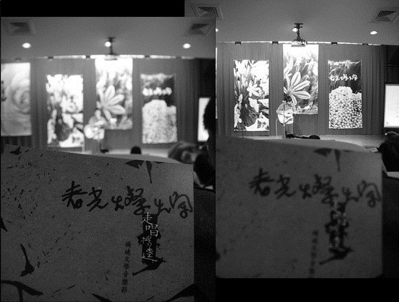

# ＜天璇＞落地

**后现代思想家认为乡愁只有在于对进步的希望和对应中才有意义，因此真正抛弃了这一希望也就导致了他们对乡愁的超越。回到卑谦而默默的我们，虽然也尝试以后现代主义者的潇洒进行着自我武装与装逼，虽然也钦羡着拒绝回国的世界主义流浪者如米兰昆德拉、高行健云云，可当一个关于羊肉汤、饺子或是汤圆的欲求无法被温柔地安放时，一切壮志豪情都应声倒地，甚至敌不过一个仅仅是春节回家的念头来得顽固和执着。** 

# 落地

## 文/周雨霏（国立清华大学）

 

冬至又到了，北方人要吃饺子，成都人却要喝羊肉汤。成都人不能理解北方人为什么吃饺子，北方人不能理解成都人为什么喝羊肉汤。于是在北方的那些成都人可耻地寂寞了。

去年冬至，两个在北京的成都人坐了一两个小时的公车到一家老乡开的羊肉汤锅馆子喝了一下午的羊肉汤。馆子里冷冷清清，只有我们这一口锅在沸腾，空气凝固，节庆的气氛寡淡。老板娘在一旁看着韩剧，啧啧于剧情，对于做生意也懒心无偿。

那一回还吃到了久违数月的“豌豆颠”，20块一小碗，绿莹莹的一碗、绿油油的一碗，绿满了眼、绿满了心。遗憾的是太久没吃过以致遗忘了“门路”，下锅之后煮得太久，捞起来竟老了，涩涩地嚼在嘴里，涩涩地咽下食道。等到终于吃完了，又坐公车慢悠悠晃了一两个小时回学校，到学校时又已经到了吃晚饭的时间，北方人的食堂里，饺子还在一盘一盘地被端出来。

今年冬至，一个在台湾的成都人又想念起白白的羊肉汤。冬至的时候，台湾人要吃汤圆，成都人却要喝羊肉汤。成都人不能理解台湾人为什么吃汤圆，台湾人不能理解成都人为什么喝羊肉汤。于是在台湾的这个成都人，再一次可耻地泛起了关于一锅羊肉汤的乡愁。

羊肉也不是成都的特产，却还是和这块凹陷的土地深深联结，对于盆地里来的人来说，没有喝羊肉汤，就像没有过冬至。然而说到土地，台湾人的悲愁则又更远甚于成都人了，悲愁的他们，甚至使用了“对土地的爱恋”这样充满位格暗示的表达，甚至以“祖母”指称“妈祖”。这一座小小的岛上的这一群小小的人们，他们对土地所表现出的爱与精力，甚至倾覆整个960万平方公里所加起来的频率与厚度。

后现代思想家认为乡愁只有在于对进步的希望和对应中才有意义，因此真正抛弃了这一希望也就导致了他们对乡愁的超越。回到卑谦而默默的我们，虽然也尝试以后现代主义者的潇洒进行着自我武装与装逼，虽然也钦羡着拒绝回国的世界主义流浪者如米兰昆德拉、高行健云云，可当一个关于羊肉汤、饺子或是汤圆的欲求无法被温柔地安放时，一切壮志豪情都应声倒地，甚至敌不过一个仅仅是春节回家的念头来得顽固和执着。

羊肉汤、饺子还有汤圆都不是土地里长出来的果实，可当它们落地之后，就都成为了土地怀抱里不可或缺的一层尘埃。关于落地，有一首客家话的民谣正是叫做《落地歌》，在前天晚上纪念杨逵——这位深情的土地作家——的音乐会上，这首歌被轻轻地吟唱，即使仅仅是自我安慰，也差不多可以补足这一台羊肉汤缺席的盛宴：

將自己種下

種在這離鄉遠遠的泥土裡

我要生根 管他呼呼的北風

靜靜長著深入田

將自己種下

種在離鄉這麼遠的泥土裡

我會發芽 聽到那驚蟄的雷響

新葉迎著春風搖

夜晚過去 溫暖蔭心田

走過的路不必轉回頭

太陽曬足 雨水浸透

故鄉的山歌時時唱

將自己種下

種在這離鄉遠遠的泥土裡

我要開花 蜜蜂蝴蝶來作伴

開做一朵無刺的香

將自己種下

種在這離鄉最遠的泥土裡

我會結果 銀河拉直的時節

結做一輩子最美的收成

（采编：佛冉 责编：黄理罡）

 
