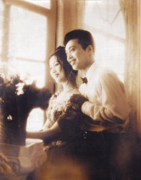

# ＜天璇＞裸婚时代

**有的时代并不那么糟糕，很多的幸运儿就此产生；有的时代则坏透了，他们在这上面苦苦支撑着别人的重量，承受着生存的重量，任凭如何努力，也如在囧途一般。裸婚时代，也许是先前多年的折腾（党史称“曲折探索”）导致的民生凋敝，那时的婚姻，裸的只是物；也许是这些年的失衡，这时的婚姻，裸的却是心。**

### 

### 

# 裸婚时代

### 

## 文/刘步筑（北京大学）

### 

### 

1987年当我的父亲第一次踏上北京的土地时，他像一个农民工一样不知所之。那时他是我外祖父的硕士研究生，来北京进修课程。 两年以后的春节我的父亲与母亲结婚了，父亲在定福庄的北京电建工作，那里在14年后建成了五环路；母亲跑到武汉水利水电大学（今武大工学院）读研。又过两年我出生了，之后的三年我们一家三口住在定福庄的电建职工宿舍，不到十平米的单间，公共厨卫。 我在这样的环境过了十个月，之后被送到吉林度过了我的幼儿期。这段时间，我父亲“停薪留职”（这个词在之后那些年叫做“下岗”），后来他与几个朋友经商罕有成功，而他们的婚姻也几度遭遇危机。和他们同处一个时代的人，有些如西进运动中的淘金者，衣钵满满；有些则过得很不如意，既无安居，也无乐业。 毕竟有一技之长在身，后来我父亲跑到房地产公司做电力结构的工程师，一做就做到了今天。他们是那个时代的幸运儿，依托着1997年最后一次福利分房的狂潮弄到了一套属于自己的房子。否则会怎样呢？一对夫妻，一个是出自赤贫的工人阶层，一个是出自刚刚被正名不久的“臭老九”阶层。没有房，只有两辆自行车，没有钻戒，一场成员全由家人组成的婚礼。对于这一对“新北京人”，这是一场完完全全的裸婚。 

 那个时候留在北京奋斗的大学毕业生毕竟是人中之才，在国有企事业单位也好、在私营/外资企业也罢，或技术出类拔萃，或多才多艺，能够在京城安身立命的居多数。否则会怎样呢？黯然离去、回到老家的人也有很多，当他们与二十年前共同奋斗的同学一同参加聚会时，还是会不免唏嘘。 95年我回到北京之后，00年福利分房入住之前，我家在北京举家迁徙四次，他们带着很简易的家居、为数不多的书、还有一些衣物，和一个现在还摆在一栋房子里的9寸电视，在整个城市漂泊。那是我们对未来的生活是充满憧憬的，在颠沛流离中期盼着一个安稳的住处。如今的裸婚一族怎么样？他们没有福利分房的好事，在那种没有盼头的生活中漂泊。 现在这些“新北京人”，即便有理想主义的支撑，即便心怀大志，大都也会渐渐被地铁1、5、13号线的拥挤消磨，也会在9字头的公交车上和汗味熏在一起，也会在生存的大山下被压得变形。这些裸婚的人，即使这个梦想只是拥有一个孩子、在北京有个家。但是就在这每天早晨和傍晚那上下班的高峰之中，他们幸福渐行渐远。 而他们生活在一个更糟糕的环境之下，小两口与别人合租在憋屈的小屋，除了双人床几乎没有落脚的地方。临着街，旁边是混乱的市场或垃圾场。老房子的墙掉漆、又漏水，加之无所不在的飞虫蟑螂。你和你合租的人可能很不融洽，房东也经常跑过来催钱，甚至一年几次的涨房租，同时几经搬迁。这并不是在描述别人，而是我和小乔这两年以及成为合法夫妻之前的生活形态。 每一个时代都是裸婚时代，社会是一个平台，那些奔放着理想的人、或者那些想安安稳稳过日子的人在这上面书写自己的人生。有的时代并不那么糟糕，很多的幸运儿就此产生；有的时代则坏透了，他们在这上面苦苦支撑着别人的重量，承受着生存的重量，任凭如何努力，也如在囧途一般。裸婚时代，也许是先前多年的折腾（党史称“曲折探索”）导致的民生凋敝，那时的婚姻，裸的只是物；也许是这些年的失衡，这时的婚姻，裸的却是心。 

 裸婚时代，不需要那样一部傻逼的电视剧表达，你在大街上，在最繁忙的公交线路上，在地铁里，在中午的金融界、CBD、中关村，看着那些心灵疲惫的人；你去1号线、5号线和13号线的尽头看一看，那些曾经人迹罕至的地方，那些人蚁居的地方。这是这个时代的注脚，也将是这些人垂头丧气地回到老家时，并不美好的回忆。 

### 

### 

（采编：陈轩 责编：陈轩）

### 

### 
