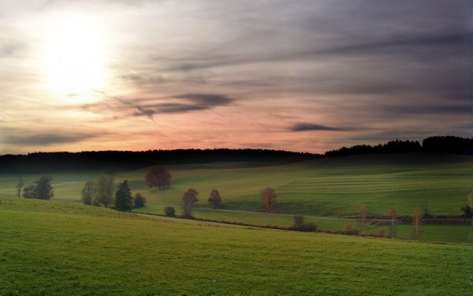
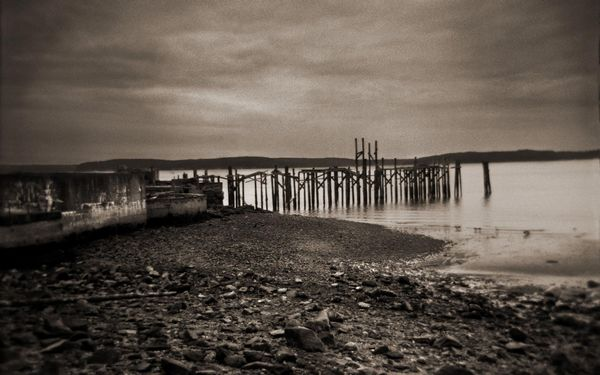

# ＜天璇＞西行组曲

**大概也有些人稍稍有趣一些，会理解旅行是一个过程而非一个结果，但他同样会困惑，你怎么知道哪条路好玩？“猜的”。这是个为了避免麻烦不负责任的答案。答案在于谷歌地图。当我第一次试着用地图规划路线的时候，我就发现了这个秘密。美好的东西往往有迹可循。或者是一圈一圈陡峭上升的海拔等高线，或是在一圈黄色中间扎眼的蓝，再不然就是群山之间弯曲前行的线。然而这依然是猜的，猜的有时准，有时不准。要是什么都能确认的话，我干嘛还要出去？**  

# 西行组曲

## 文/姚昕毅（威海职业学院）

  （一） 

如果我说我花了一路的时间来考虑怎么写游记，会不会有一点买椟还珠的意思？

但有一点可以确定，在我失去仅凭灵感写作的能力之后，我不希望我的故事过于无趣。而这一点确实让我有些困惑。

旅行是一种非常复杂的体验，贪心如我，总会希望能将我心中纯粹的感受传达，或是说印刻到文字里，使它有抗拒时间的力量，然而这很难。

 （二） 

当我们讨论骑行的时候，我们讨论的不应该是诸如浪漫、坚强、美好的景物、艳遇、心灵的强大、挥汗如雨的青春这类字眼，明白这个道理的时候，我已经积累了一千公里的里程。

总有一些复杂的东西很容易的被我们简化，或是美好，或是丑陋，然而事情本身的意义，却很难被人理解，反过来说，那些理解的人，就算不是因为懒惰或是疲乏，也很难再把同样的领悟传达出来，因为我们总是只能相信或是理解我们已经相信或是理解的东西，除此之外的一切，即为我们眼镜片上的灰尘，近在眼前，无处察觉。

时不时会听人谈论骑行去西藏，这次路上，也有一个人向我提起这个想法，说这话的时候他骑的很快，而我有些气喘地勉强跟着，他的车子上只有一个手提包，瘪瘪的，似乎不重，斜向的阳光被他的汗水折射，而我的眼睛被顶风吹的眯了起来，我说，“可是，西藏是一个省啊，你，到底要去哪里呢？”

这是我的标准反问，略带嘲弄，不怀好心，等待着我的一般是犹疑，然而也有时是更加快速的答案。“就是，拉萨”

“那可是很累的啊。”

我不自然地放慢踏频，这位小朋友有些快，然而他今天的目的地是七十公里外的齐河，而我的目的地是一百五十公里外的衡水。

按照我早年的习惯，对于某些无法应答的问题，一般的答案是，“哦，然后呢”，放在这里，应该就是，到达拉萨，然后呢？

这种质疑是可怕的，可怕的足以否决掉我自己行为的意义，如果一把剑足以锋利到同时杀死敌人与自己，那是没有人会使用它的。

 （三） 

出门之前，我在整理书包，边整理边抱怨，怎么会有这么多东西。

我记得我第一次骑车子出门，左边口袋里是手机，右边口袋里是钥匙跟钱，然后早晨出发，傍晚回来，一无所惧，一无所扰，哦，除了那次屁股真的很疼。

然而胆子越来越小了，现在我的背包里，有一件冲锋衣、外用止痛剂、止泻剂、外用消毒剂、酒精、防晒霜、三种充电器、微型无线路由器、几根数据线、五 号跟七号电池若干、手电、头戴式探灯、胃药、清凉油、高蛋白与热量的零食、两种笔、小记事本、捆扎带、医用手套、便携式组合扳手、马甲式垃圾袋、咖啡……

是的，这个列表足以帮我把字数轻松凑上一千字。

我一般只能用到其中三分之一的东西，但据我估计，下一次出门我可能带得更多，哪怕是这一次都是因为我的背包不够大所以精简了一些有用的东西。

曾经看过一个寓言，说是一个准备征服天下的骑士，在出门前考虑得很周详，把一切需要带的东西都准备好，于是他带了如山一般的行李出门，结果在过门口的木桥时压断了木桥，淹死了。

书上配了一个非常形象的插图演示这一点，所以我印象很深。然而，我想作者在写这个寓言的时候大概考虑的没有那么周详，因为如果我是那个骑士的话，我必然会考虑会经过不结实的桥这个问题，说不定，我会把一个便携式的高坚固铝镁合金易搭桥加入到我的背包清单里。

 （四） 

如果有人跟你炫耀他骑车旅行的经历，尤其是说看到了多少风景，相信我，你大可不必相信他。

因为骑行这事啊，这事情其实跟我们在家里时一样，绝大多数的人在绝大多数时候都是沉闷而无聊，少数的时候倒霉，极少数的时候走运。

是的，我想任何一个不是瞎子的人，亲自骑行过一次后都会明白，所谓的美景往往都是幻觉，这种幻觉的强烈程度取决于你之前沉闷或是倒霉的程度，或是你的摄影技术。

我们可以看到什么？农田、树木、公路、大卡车，不要试图在你脑中构想什么田园风光，因为当你看十个小时的农田、树木、公路、大卡车的时候，你会发现这跟你经常看到的办公桌、电脑键盘、电视机、出租房、谈了两年以上的女朋友一样，是的，一点感觉都没有就是你的感觉。

在这种时候，唯一的好处是，你对你自己内在的感觉突然敏感起来了，你会发现你的右腿膝盖在转到斜17度角的时候会有突然卡壳的感觉，你会发现你的内裤一点一点地缓缓被挤进你的臀缝里，你左边耳后有一滴汗以平均一百下心跳一厘米的速度下滑，是的，你的时间度量也变成了你的心跳。

我不清楚其他成熟的单车骑士如何解决这个问题，这确实会给你带来困扰，你会从你出生的本质怀疑到你现在的行为，那种突然想骂自己是傻逼的冲动偶尔会困惑我。

所以我会冒着被撞死的风险带着耳机，我的mp3里有一千多首流行乐，一般我出远门前还会拷进去我永远都听不懂的那几十张古典乐专辑，它并不能减少我对自己的质疑，但它会有其他的作用，它会有时让我相信，我并非是在远行，我只是如之前的某一天一样，带着饱满的情绪在去上班路上，这样我就不必考虑我行为的意义，只需要知道，大约还有多少天后，有人会因为我的行为付给我报酬就好。

 （五） 

我总会怀念我住过的酒店，那对于我来说简直是最理想的居所。

当你带着一身的疲惫重新回到城市的世界，满街的面孔让你不知所措，你依然会习惯性地走在汽车道上，仿佛从开天辟地以来自行车便是与汽车同道而行的。你会困惑呼吸到的气味逐渐变得透明而粘稠，这时候能够拯救你的，只有你在三五天之前就在网上订好的如家。

没有人会问你从哪里来，没有人会试图拉近跟你的关系，当你拿着房卡走进电梯的时候，背后的脊骨跟随着灯的节奏，一层一层，一节一节地放松下来。

地毯往往软的过分，令你每一步踩下去仿佛有陷落的感觉。然而打开房门，一切干干净净，井井有条，没有任何你讨厌的东西堆放在眼前，明明只有25平米却显得仿佛比你自己的家还要大。

永远有不用烧的热水，永远有干净柔软的床，还有两种不同硬度的枕头，拉上便一点光都不会露出来的窗帘。

第二天，你依然醒来的很早，这里并不是你熟悉的睡眠环境，但等待着你的是超过十个种类以上的早餐自助餐。

以上的一切，如果没有隔壁恼人的声音与最后的信用卡账单，大概，就是天堂的模样吧。

 （六） 

当你跟我一样常年生活在一个并不出名的二线城市的话，我想你会有跟我一样的困惑。

无论我走多远，当我进入任何一个城市甚至县城，我总有种走错路回到我出发的地方的感觉。

建筑、名称、人的面孔、衣装、汽车、还包括空气中的气味，模糊不明，令你恍惚。

野外不是这样子的。尤其是气味。

我想我理解对于动物来说为什么嗅觉是跟视觉同等重要的感觉，因为没有两处地方的气味应该是一样的。

作为一个可耻的城市人，我不了解植物，无法分辨出麦苗跟韭菜苗，然而我想我可以嗅出我所在位置的不同。这并不是一种文字可以命名的气味分类，而是烙印于我们基因里的原始力量。

然而城市摧毁了这个能力。尤其是那些还没有成长到拥有生命的城市。

我并不讨厌城市化，我是它的受益者，我是没有超市就会死的物种。然而，我怀念城市外的气味。

 （七） 

很多人会问我，你要去哪里，如这一次我会告诉他们“太原”。

“呵，挺远的，太原有什么好玩的？”

“我怎么知道？”

于是问题陷入了僵局。

大概也有些人稍稍有趣一些，会理解旅行是一个过程而非一个结果，但他同样会困惑，你怎么知道哪条路好玩？

“猜的”

这是个为了避免麻烦不负责任的答案。

答案在于谷歌地图。

当我第一次试着用地图规划路线的时候，我就发现了这个秘密。

美好的东西往往有迹可循。

或者是一圈一圈陡峭上升的海拔等高线，或是在一圈黄色中间扎眼的蓝，再不然就是群山之间弯曲前行的线。

然而这依然是猜的，猜的有时准，有时不准。

要是什么都能确认的话，我干嘛还要出去？

 （八） 

据说很多旅行家的另一个身份是人类学家，这一点其实很好理解。

因为人类学家研究的是一些共性，而这种共性你总能在旅行中体会到。

比如景点，在做过一两次无谓的尝试以后我就放弃了在路途上安排景点的做法。

但死性不改，偶尔还是会因为看到“***右转一公里”这种牌子的诱惑而做出错误的决定。

然而我能看到的往往是簇拥的人头、收费大门、卖纪念品的小摊、年份不超过十年的古迹、想象力丰富逻辑混乱的景点介绍牌。

我想起我上学的时候，我的老师经常会暗示我们，美国只有几百年的历史，而中国随便哪个县城的历史都比他们长，使得自豪之感冉冉升起。

然而照实说，我完全放弃了浏览古迹名胜的想法，除了我看不懂的，大抵已经被破坏了，这个结论很武断，然而相对我的心灵创伤，绝对是一个合理的结论。

不过下一次看到“***右转一公里”的牌子，只要我还没累死，大概还会拐弯吧。

从以上这一段，我们可以看出，人类的死性不改，大概是旅行家们最有体会的东西。

 （九） 

水跟山是两个极致。

只要出行过几次，你很容易得出结论，只要看到地图上有成片的蓝色，那里的风景不会差。当然前提条件是那片蓝色不在某个城市的里面。

然而海拔线是另一种奇特的指示，代表某种赌局，你用成倍的体力与时间下注，结果却从没能完全如你所愿。

但是水是抗拒的，或者说这种抗拒才是它独有的美感，被城市驯服的水，往往带着死亡的腐臭，我们还会给它画上额外夸张的油墨，正如我们常常对死人做的一样。

真正的水，湖泊、河流、海洋，有生命的水往往是抗拒人的接近，它们的野性被距离感所隐藏，在合适的距离，你能欣赏到他们平静的表象，仿佛是某种诗意 或是美术可以表达的东西，然而当你接近他，你感受到它的是某种狰狞、粗糙、暴躁、浑浊，这是某种告诫，意味着你的侵犯与它的敌意。

然而山是截然不同的。你接近也好，远离也好，它总在一个合适的距离，你的相机既无法捕捉它整体的美感，也无法准确抓住他的某个令人惊讶的细节，然而 实际上，你与他贴的无比的近。你的脚每一步都与它相连，你能看到它从某个剪影变成满目的绿色。你的体力一点一点地折算成高度，某一瞬间你终于到达了山的最高处，然而，你依然无法看到全部的它。即使你们如此的靠近，你们也无法合为一体。当你离开，风驰电掣，一瞬间，它就是过去，你不会再回头，它依然在那里。

 （十） 

危险的诱惑力因人而异。

对我来说，这简直是美感最重要的组成。很少有人会理解黑夜中翻过山梁，或是在道路完全被毁坏的山顶速降，又或是跟体积是你十几倍的大车抢路有什么美感可言。

这很难理解，就算是我，也有避免危险的本能。危险往往是与意外相伴。

没有人能预料到所有事情，尤其是在旅程中，当你被某个意料之外的事情拖进去的时候，你不会感觉到什么愉快，你最想做的事情是逃离，有多远逃多远，然而往往没有这么简单，很多麻烦是逃不掉的，纠缠不清，然人疲惫、困乏、绝望，终于结束的时候，你长喘一口气，我他妈的再也不要***了。

然而当你回到家，回到你平凡无奇的生活里，回到每天千篇一律的工作中，那些危险的故事，仿佛某个诡异的噩梦一般开始在脑中反复重演，它们并不愉快， 但足够不同，与打印机里的A4纸不同，与工具箱里的整套扳手不同，与邮件列表里传过来的Excel不同，与你每天见到的每个人都不同，然后你会在痛苦里感受到那种属于死亡的美感。

反复如此，反复如此，直到下一次，你看着地图，犹豫不决，一条路平直而优美，一条路曲折而未知，你的答案是什么呢？

 （十一） 

运气是很重要的。

我尚不能确定这个世界究竟是被因果论主导还是被概率论主导，然而有信仰的人在世界末日的时候会活得比较久，这绝对不是瞎说的。

如果你是一个科学而理性的人，大概真的不太适合旅行，你会面对很多足以动摇世界观的问题。你会不理解为什么上午跟下午朝相反的两个方向走你总是完美地顶风，你会不理解明明地图上看起来并不陡峭的曲线足以毁掉你的膝盖，你会不理解某条万年没人走的公路会什么会在你出行的那天开始全面封路整修，你会不理解为什么你定的每家酒店都恰好在某个城市最难到达的地方。

这不是科学跟理性能解决的问题，至少不能完全被解决，至少你的情绪完全没被解决。

所以我相信我在介绍自己的时候谦虚一些可以防止自行车爆胎，我相信爬山的时候不能乱说蔑视的话可以防止坡太陡，我相信出门前多准备某些东西是为了不用某些东西，我相信很多不科学不理性的东西。

不过它们依然帮不了我什么，就好像“概率”跟“运气”这两个词汇本质的不同。

但运气是很重要的。

 （十二） 

要分清必需品跟无用品是很难的。

比如码表，任何一个开始玩车子的人都会装一个，当你问他的时候，他会告诉你，我可以知道自己的速度跟里程。

那么，您是竞技运动员么，攒够里程可以抵燃油附加费么。

解脱是一个很大的词，它代表着某种追求，具体而微，当你放弃一些东西的时候，你会获取一些截然不同的东西。我想这是旅行中重要的修为问题。

比如当你车子上不装码表的时候，首先就不在会为某些数字困扰，那些数字意味着什么呢？意味着你还没有脱离你的束缚，从工作中生活中跟这些烦人的数字打交道还不够，逃出来了，放松的时候你还要这样？斯德哥尔摩氏症候群么。

太阳从东边的时候是上午，在西边的时候是下午，公路的边上会有路碑，每一百米有一个，每一千米有一个编号，抬头看，总会有大大的牌子在分叉路口标示着目的地，有一天我的手机坏了一天，在没导航的情形况下我也依然能到我想到达的地方。

当你放弃一些东西的时候，你总会有意外的收获。

 （十三） 

不知道从什么时候开始，旅行总跟美食关联在一起了。

然而我是味觉被现代快餐业摧毁的城市人，我大概能分辨出某道菜是不是太咸了，或是说熟没熟，再之外的，只要食品添加剂放得足够多，我也真的不是特别关心。

常识是当一个人大量运动后味觉会跟着失常起来，这跟我们的进化机制有关，为了保证生存，我们会更倾向于喜欢高糖分、高油脂、高盐的食物，很熟悉是不是，就是垃圾食品啦。

所以一路上尽管我也会倾向于尝试各地著名的特色，但我吃到最好的东西其实是太原某家“味千拉面”。是不是很像有关陈晓卿跟吉野家的冷笑话。

我自己也偶尔做饭，自认为手艺尚可，所以我格外不理解为什么专业的厨师会做得比我难吃这个事实。尽管我们不想承认，各种大型连锁快餐对味道的研究花的精力恐怕是传统菜馆的几百倍。所以结果就是上面那个冷笑话。

顺带一说，这次我吃的第二好的东西是在衡水学院旁边夜市摊上的一家苍蝇馆子，那里有几十家餐馆在野蛮竞争，而客人只有那么多，好吃则生，难吃则死。

 （十三） 

几天前，我回到家，跟朋友聊天。

他问我为什么不写东西了。我们讨论了一下，结论是我的审美能力跟写作能力脱节了，所以我憎恶我写出来的东西。

还有就是，我所知的东西非常有限，并不能支撑我不停地表达。

出门，面对一切的未知，警醒自己，告诫自己的愚蠢与弱小，这是我的目的之一。

然而其实我并不适合旅行，我太过关心自己，而无法更多的获得外界的价值。在我眼中仅仅能分清楚最美好的跟看起来差不多的，而并不能看到那些细微的不同。

所以说其实我在哪里都是一样的，我只能获得一些供我炫耀的地名、数字，一些虚构出来的瑰丽华美，一些假想的情节，一些依然重复的结论。

这可不是我想要的东西。

当我在返程的火车上看着对面那个面容姣好的女孩子的时候，我会突然怀疑之前全部发生的故事，是否全部都是我的幻想，对于一切我得不到，又放弃不了的东西的幻想。

答案应该是否定的，我却没那么肯定。

 

（采编自投稿邮箱；责编：麦静）

 
