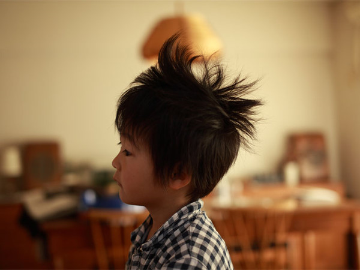

# ＜天璇＞让我陪你慢慢变老

**她是一位普通的母亲，对我没有要求，对儿媳妇也没有要求，唯一希望我平安健康，我开玩笑说：“妈你现在多舒服呀，天天躺着，有小护士伺候，衣来伸手饭来张口，我都想跟你换！”我是真的想跟她换，大二的时候献过血，献血证上写着直系亲属可以免费用血，却没想到，今天这项优惠政策就用上了，本来我身体里流的血也是她给的。** ** ** ** **

****

# ** **

# 让我陪你慢慢变老

##  文/袁戎（ 北京农学院）

我对这个世界的记忆，是从我穿开裆裤的时候开始的。

那时候我家还住平房，公共厕所离家大概有300米，因为家里院子大，我大便都是在院子里进行（正如雷锋叔叔报告中称常年在农村的房前屋后捡小孩的大便），然后喊我妈给我擦屁股，后来我怎么也想不起来是怎么学会自己擦屁股的。

儿时印象中觉得妈妈身材魁梧，很有力量，能挑两桶水（我们住的地方没有自来水，每天定时中午供水）。

上幼儿园的第一天是她送我去的，我不让她走，她说回家拿毛线，在学校织毛衣陪我，结果我被骗了。以后的日子都是我自己上学去的，再也没有让她送过，但条件是每天给我一块钱，能让我在路上的小卖部买奶糖。

每周妈妈都会带我去一次洗澡堂，起初并没有性别意识，因为我上幼儿园的时候是男女共用厕所，可时间久了，看着满池子下面跟我不同的人，我渐渐有了害羞的感觉。便不愿去公共浴池洗澡，改在家里，用一个足够装下我的大盆洗，妈妈会搓遍我的全身，可我怕痒痒，所以敏感部位都是自己搓。

小时候成绩一直很好，她也从没操心过我学习的事，那时有个好习惯，放学回家就写作业，然后跟同学出去玩，别的孩子总有父母管着不让出来，可是我一次都没有。

我很少跟她要钱买玩具，我的玩具都是哥哥玩过的，那阵子正是《变形金刚》热播的时候，我特别喜欢看，在商店里见到有卖玩具的，吵着要她给我买，不买我就赖着不走，结果是我赖着不走，她走了，可在我回家的时候，她已经把玩具给我买回来了。

我比较淘，胆子大，有回看见桌子底下有一片炸馒头，我爱吃，就用球拍勾了出来，却不知道上面撒了耗子药，妈妈正在给哥哥洗脸，看见我一手拿球拍，一手拿炸馒头片吃的津津有味，顾不上哥哥的一脸香皂沫，抱起我就往医院跑，医生拿一根又粗又长的管子插进我胃里，好在有惊无险。

刚回北京的那年，身边一个小朋友都没有，从未体会过的孤独感让我对这个城市充满厌恶，我讨厌二年级就谈恋爱，我讨厌同学之间勾心斗角，我讨厌老师有偏有向，我讨厌他们跟我一样的年纪却说着与这个年龄不相符的语言。于是，她带着我满京城的转，动物园、自然博物馆，很多地方都是我第一次去，再去的时候都是陪女友，好在去过，不至于在女友面前像个土鳖。

在我初中的时候，因为情感问题，严重违反校规，校长拟将我开除学籍，她冒着大雪，拉着我每天找校长，希望给我一次机会，校长躲着不见，终于在第四天见到了校长，念在他和我妈同是当年知识青年，上山下乡插过队，故给了我一次机会继续读书。我还清楚的记得妈妈当时含泪苦苦哀求的眼神。

因为我哥哥今年都31岁了，所以她比我的同学家长都大，很多时候会被同学误以为是我的奶奶。其实她确实看着也比同龄人显老，可能是经历的太多吧。我的妈妈确实没有享过什么福，她一辈子没旅游过，很少在外面吃饭，偶尔跟邻居打打乒乓球，更多的时间都是在看电视剧，每天下午北京影视频道有个英雄剧场，都会播警匪片，说实话拍的真的很烂，可她却看的津津有味，每集必看，看完就忘。

虽然看了这么多年电视，可她连遥控器还不会使，只会换台和调音量，有次给我打电话说家里电视坏了，买了一个新的，我回家一看，原来是旧电视按了定时关机。手机更不用说了，我教不会她，她眼睛也不好，有点斜视，领了残疾人证，可以免费乘坐公共交通，但却遗传了我一双明亮的双眼，让我有机会去考飞行员，当然最后一项高血压160的事就不提了，我只想骂人。

我上大学之后，因为住校，她一人在家就很少正经做饭，本来胃就不好，好一点的东西都吃不了，偶尔吃点油腻的就会吐，从春节过后，身体消瘦的厉害，我给她搓背的时候都不敢使劲了。看着她精瘦的身体，站立不能，真的很像那年我的姥姥，面无血光，皮肤干燥，情绪也变得不稳定。

在医院的病房里，护士给每个病人发一个玩具小动物，一捏眼睛就突出来，用来加强病人手部的血液循环，隔壁老太太拿了一只奶牛，可是这奶牛做的鼻子有点大，像猪，老太太也是回民，说什么也不要，老太太耳朵特别不好，我和护士劝她半天，确实是牛，不是猪。我妈拿了一只老虎，像个小孩一样摆弄着，可她手没有力量，捏一下只能让一只眼睛突出来。

医院的饭菜做的没有味道，她不爱吃，我从家做好饭给她送去，她胃难受，吃不了几口，剩下的我替她吃光。她躺在床上，我做在床边，她摸着我的头，看着我，不说话，眼圈红着，我也想哭，可是我忍住了，低头大口把饭吃完，然后出去刷饭盒。

我在楼道，看见宣传栏里，有病人写的相互鼓励的话，我看到有病人独自站在窗台，在想些什么。我回到家，夜深人静的时候，踢到桌脚，下意识的想到别把她吵醒，才意识到家里只有我一个人。

我回想起跟她吵架的情景，前一秒还在面红耳赤，下一秒就去给我洗衣服。小时候对她许过的愿望，将来一定要如何，一定要怎么样，却忽略了，这么多年，我一直没有停下脚步，好好的看她一眼，她就已经老了，老的很快。

她是一位普通的母亲，对我没有要求，对儿媳妇也没有要求，唯一希望我平安健康，我开玩笑说：“妈你现在多舒服呀，天天躺着，有小护士伺候，衣来伸手饭来张口，我都想跟你换！”

我是真的想跟她换，大二的时候献过血，献血证上写着直系亲属可以免费用血，却没想到，今天这项优惠政策就用上了，本来我身体里流的血也是她给的。

百善孝为先，论语云：父母在，不远游，游必有方。

我哪都不去，陪着你。

（采编自投稿邮箱 责编：项栋梁）
