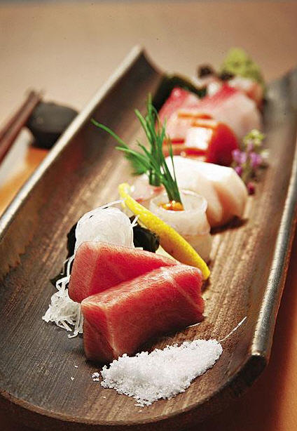

# ＜天璇＞读蔡澜日料谈

**这世上有越来越多的庸见，它们共同供奉着一尊虚拟的荣耀，崇拜的手段叫言过其实。对抗这股浊流最好的方式，恐怕便是同三五知己把盏相聚，不过问那些好坏得失，话尽时低头细品，好友为你费心煮过的一碗蘑菇汤。** 

# 读蔡澜日料谈

## 文/方可(中国政法大学)

 

在中国，你若说爱吃三文鱼刺身，自诩行家的食客会笑你：日本人不吃这玩意儿，高级寿司店哪有卖鲑鱼的！其实他们不过是伪行家，因为在中国要吃到味道浓烈的鱼生，往往还非三文鱼莫属。流行的鲷，平目，黑金枪，赤贝，只是能进到庸庸的渣货，吃进嘴没味道，再正常不过。养殖鱼肉味比野生鱼淡，早已是常识。而鱼本就是一种味极细淡的生物，活野鱼能品到一点肉鲜，已属不易；何况是养殖的，不怎么新鲜的，甚至连养殖环境都不能保证的鱼？在中国吃刺身，toro的印象就是肥，入口便是一块鱼油，化开来，花了大钱的食客嗯嗯啊啊得原地高潮一本满足，好肥美！其实要论肥美，猪油拌饭都要更浓甜些。不管什么鱼，生肉的滋味，都离不开鲜甜二字。光是油，若不是食者爱慕虚荣反复强化自我暗示，怎么可能觉得好吃？大众点评上一众日料店的食后感总是能让人笑掉大牙：toro真是肥美！一块就能让人感觉满足了，入口即溶；可是一般吃三块就够了，再吃觉得腻。我吃猪肉也是一勺好鲜美，三勺必催吐。这种贵到天上去的神仙食材难道也和猪油差不多？可是即便这么说，我们也不能嘲笑吃toro的人味蕾贫瘠不懂欣赏。不管有多贵，说到底，它只是一块鱼腩。好的鱼腩确实可以在丰满甜美的油脂中含有滋味浓郁的纹理，一沾酱油碟子里就飘起均匀的油花，又不腻，和夹杂其间的细鲜肉纹相配完美，几乎没有酸味。可是这样的鱼腩你在中国是吃不到的——醒一醒，它太少了，供应日本都供不过来，何况在渔获逐年减少的现在。季节对于黑金枪的肉质也是一大影响因素。在上海，乃至香港，印度和西班牙的金枪鱼可以堂而皇之地登堂入室，冒充高级食材，归根究底还是因为，有一大群爱慕虚荣的傻缺愿意为这种被人为神化又不怎么好吃的东西买单。

日料卖三文鱼生，是可耻的。但它不属于日本料理的原因主要并不在于口味，倒是更偏重卫生问题。日本人也爱吃鲑鱼，但是爱吃熟食；加之其产量大，挪威等产地能以低廉价格出口高品质渔获，高级不起来，自然也流行不起来。可是它就是好吃！香醇肥厚的油脂无鱼可比。蔡澜在书里提到，日本人是一个很喜欢很喜欢赶流行的民族。近几十年的英伦热，对红茶香气的偏执细分和疯狂迷恋；近几十年牛肉被过分神话和疯狂溢价，对红酒的盲目推崇。崛起的香港很像当年的日本，而如今日料在上海的流行，又像十年前香港的翻版。

大陆的日本菜究竟能地道到什么程度呢？我们换位打个比方，厉家菜在东京的餐厅，5万丹，5万丹噢！人均4000吃不饱的地儿，居然能评上米二。米其林评东南亚菜固然不靠谱，但也是能一定程度地说明在日本中国菜的水准。蔡澜说到日本人酿酱油，分浓口淡口，坛面儿坛底，熟成时间，压榨方式不一样，滋味自然有差别。但日本的酱油体系再复杂，放到中国菜上也肯定是笑掉大牙，为什么呢，连老抽生抽都不分，你还想做好中国菜？涮锅子海鲜味料底都调不好。当然，不见得厉家菜不会运用空运过去的国产调味料，可是厉家菜本来就不见得有多细。反观日料，你在中国面对的日料，是一种本应讲究食材在季，香料搭配冗繁而精细，且菜品口味对食材鲜度依赖极大的菜系，它在异国所能发挥的状态，先天有着较低的天花板。

在上海，你可以吃到能想见的大多数食材。个头小小的金目鲷，瘦而寡油的喜知次，养殖河豚的薄切，鲜度存疑的长崎胆或北海道胆；你也能吃到新派寿司时髦的九宫格调理，但鲜有日本正流行的腌渍法，柚子胡椒更是少见。上海不乏在日本也算有声望的名厨，但那就跟泡沫一般脆弱。很难想象能有一种比日本菜更容易玩出噱头的菜系存在。经过一段时间的沉迷，现在我倒是同意蔡澜的一句话：假冒的名牌货穿在身上，自欺欺人，没有什么大毛病；但吃假日本料理，先被人敲一笔，吃完了肚子还要生满虫子，你说值不值得？

书里还提到，尽管日本菜或许是一种在调理过程中追求细节工序的菜系，日本人本身的味觉却可能很单纯，甚至可说是贫瘠得可怜。类似的观点还有一些，和一般人的先见多有不同，读来有些新鲜，结合到日本人钟爱的精细繁杂的味觉分析体系（比如红茶--每年的大吉岭展销评鉴，酒--能写出神之水滴那种玛丽苏小清新神作），想想更是有趣。尽管蔡澜本人是否如他所言般会吃，他家的粗菜馆究竟是坑爹还是坑爷爷都不好说，但这本书是足够打某些真•假洋鬼子消费群体的脸了。这世上有越来越多的庸见，它们共同供奉着一尊虚拟的荣耀，崇拜的手段叫言过其实。对抗这股浊流最好的方式，恐怕便是同三五知己把盏相聚，不过问那些好坏得失，话尽时低头细品，好友为你费心煮过的一碗蘑菇汤。 

（采编：楼杭丹；责编：麦静） 

