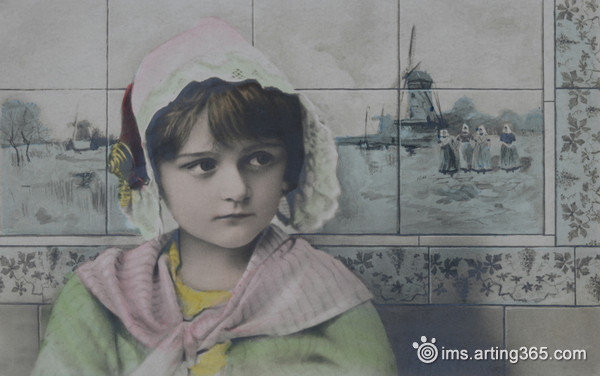

# ＜天璇＞谁也不会永远是小女孩

**青春逝去之后，仍然会有沉淀下来的东西，让人觉得美好。小时候听人说“你奶奶，那是极其的漂亮。”非常的不以为然，长大之后才明白其中的难得。一个女人在二十岁被夸漂亮真的很常见，三十岁的女人还是不少人夸的，可是已经少了很多，等到一个女人到了五十岁六十岁七十岁八十岁，还被称赞“漂亮”，那就远不是皮囊可以解释的了。回忆起来，那是一种穿越时间的勇气和安宁，饱含温柔又带着让人无所畏惧的力量。那是女性最美好的地方，不会随着时间流逝而消逝。**  

# 谁也不会永远是小女孩

## 文/ 朱逸欣（香港中文大学）

 

写下这个标题，自我感觉有一点无奈的调调~~

青春当然是很美好的。那少女，不需要多漂亮，只要有那张青春的脸明亮的双眸，那就可以第一时间撞开你的心房。年轻的时候就是怎么看都是好看的，那眼神，无论是懵懂，怯懦，羞涩，或者是犀利，野性，叛逆，在一张单纯的面孔里，都会让人不由自主喜欢起来。那不知世事的神情，即使带着胆怯或者怀疑，却仍然会有某种单纯的坦然和勇气，让人放下戒心去接纳，这就是所谓的“青春无敌”。

多年以后，也许你会感慨，再也没有人能像那个少女那般，撞开你的心，让你感到无法拒绝。可是那少女，她到哪里去了呢？她也许化着精致的妆容，学会说体面和有距离感的话，穿梭在各个需要应酬的场合。她也许做着一份辛苦的工作，天天加班加点，寂寞的度过茫茫长夜。她也许经历过许多的感情，心已麻木，可以心无负担的爬上不同人的床。她也许已经结婚生子，放下心中曾有的梦想，过一种安定的生活。她也许仍然凌烈犀利，奔跑在职场，却也要面对不同人的不同目光。她也许事事圆满，幸福快乐，温柔中多了一份坚强。

有无数的可能，只是，她不会永远是那个小女孩。无论青春有多耀眼，无论有过多少梦想和泪水，无论那些心情曾经怎样的纠缠过自己，那清冽得像泉水一般的青春终将一去不回。20岁嘟嘴的样子被无意拍下会让人觉得很可爱，30岁的女人还嘟嘴装可爱，只会让人觉得愚蠢。女人还是老得很快的，同样的神情，只要双颊开始松弛，就怎么看都不好看了。总有一天，女孩无法靠装可爱或者模样混饭吃，年轻时候被挥霍的，相应的回报就会到来。人总是要学着选择自己的生活方式，然后承担相应的后果。所以，如果感情只是为了随便找个男人照顾，或者换个男人照顾，就不要责怪男人轻易的放弃你。如果为了经济上的理由结婚，就不要再向别人要感情。如果放弃了自己奋斗，就不要因为自己变得平庸而失落。如果做了理想主义的选择，就做好吃苦和承受的准备。人，总要面对现实。

现实残酷，多少你觉得庸俗至极，看都不想多看一眼的大妈，都曾经青春过，理想主义过。曾经的女孩儿不顾一切地向前奔跑，就好像未来有无限未来在等待，结果跑啊跑啊，到头来发现没有什么在等待，反而一边跑一边丢失了一些失去才会后悔的东西。这个世界带给人多少失望，才会让路过的人说出“混吃等死”这几个字。但人们，总是挣扎着在混吃等死之前，努力的呼吸空气，企图活出自己的意义。

青春逝去之后，仍然会有沉淀下来的东西，让人觉得美好。小时候听人说“你奶奶，那是极其的漂亮。”非常的不以为然，长大之后才明白其中的难得。一个女人在二十岁被夸漂亮真的很常见，三十岁的女人还是不少人夸的，可是已经少了很多，等到一个女人到了五十岁六十岁七十岁八十岁，还被称赞“漂亮”，那就远不是皮囊可以解释的了。回忆起来，那是一种穿越时间的勇气和安宁，饱含温柔又带着让人无所畏惧的力量。那是女性最美好的地方，不会随着时间流逝而消逝。

再说个大家熟知的，就是珍妮·古道尔，很多人都知道她的故事吧。年轻美貌娇艳无双的女子，又如何能和满脸皱纹满头银发的她相比。

 

（采编：陈锴；责编：陈锴）

  
