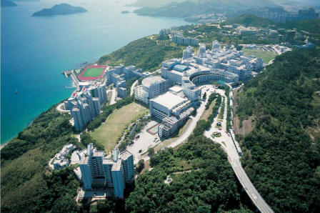

# ＜天璇＞象牙塔中槐花香

**所谓的林荫大道，也只有贯穿东西三条而已。余下的满眼的就是由三峡石垒砌的大小阶梯，少者三四阶，多则二三十阶。都说重庆出美女，但是其中缘由，知道的人不是很多。我猜测，多半是巴渝崎岖，蜀道难行，阶梯随处而置，上下爬行之间，练就了热烈娇柔的重庆美女吧。**

### 

### 

# **象牙塔中槐花香**

### 

## 文/卞海鹏 （重庆三峡学院）

### 

### 

来渝求学几年，也算是对山城雾都风物有所了解了。 山峦起伏，连绵崎岖不平，小城便在山势缓处扎下了根。逢河架桥，见山穿洞，道路弯弯曲曲，山坡陡峭处也会有炊烟弥漫。台阶从下至上盘桓而上，青石板，绿青苔，往来不绝如缕。 巴渝之地，冬季短暂却是湿气浓重，天气灰蒙蒙不能分辨远山近物。南方多不安装暖气，虽不结冰，也是挺冷。 冬去春来，万物复苏，一夜间便青蛙鸣唱，百虫争斗。本来以为这的植株多为常绿植物，全年遍身翠绿欲滴。前几天，春雨悠悠而来，散漫有序，山顶翠竹空泛了一冬天的身躯，顿然吸饱了春水。春雨初歇，校园中的树抛除老去的叶子，苍黄艳丽飘落满地。行走踩过，沙沙的响，甚至美妙。象牙塔也在这沙沙的脚步声中像是远离了嘈杂，变得纯净。 

学校处在半山腰，也不大。绿化倒是不错。林荫大道，阳光散落之时星光斑驳。树木翠绿茂盛，鸣禽清啼，上下跳跃间惊落数枚青果。所谓的林荫大道，也只有贯穿东西三条而已。 余下的满眼的就是由三峡石垒砌的大小阶梯，少者三四阶，多则二三十阶。都说重庆出美女，但是其中缘由，知道的人不是很多。我猜测，多半是巴渝崎岖，蜀道难行，阶梯随处而置，上下爬行之间，练就了热烈娇柔的重庆美女吧。 行走间，忽感沁香飘然而至，淡淡清香弥漫着整个校园。抬头一看，白白的小花，从翠绿中探出头来。小花上嗡嗡的响的是飞舞的蜜蜂。槐花蜜可是好东西。 一棵大大的槐树挺立在竹林的一旁。 槐树在北方遍地都是，落地生根。在这却不是很多。远远近近的就看见这么一棵。 北京的四合院是很讲究的风水格局的，连院内栽植何种芳草佳树也不例外。院内种植的多数为梅花兰草，取其四君子之意。梧桐也是很多的，自然是取其梧桐引凤凰之美意。然而，槐树是不能栽植的，因为槐字，与鬼为邻。 四合院不相容的树，希望在校园中会扎根成长，绿叶成荫，清香淡洒。 槐花清香，飘洒间，校园电锯声四起，震耳欲聋。 那日同老师去新校区写生。由于对新校区的新奇，一路上说说笑笑不觉公车的拥挤便到了。到了便都傻眼了！ 荒山野岭，突兀的伫立着一座灰色教学楼，沿着盘桓的大道望去，雾气飘渺的山顶上，还有几座建筑。大道两旁，新栽的树木，希希几片叶子飘着。等到火炉夏天到来，赤日炎炎似火烧，道路能炒鸡蛋之时，看能有几人边走边听音乐边闲聊。 沿着规划的道路，盘桓上山，山顶上的是几座寝室楼。几个系的学生便在这荒山野岭，修身学道一年有余了。 道路是早早规划好的，大一入学，老师便告知过寒假后搬新校区。这都过了几个寒暑假，搬新校区的计划也没轮到我，倒是让新来的10级占了先。 大家都必须走给你规划好的道路，老师的课表，学生的课程，有板有眼在一格格的表格中显现。更不用对于新校区的建设，能有什么建设性的意见了。再说了，你敢有吗？你就是有，你敢提吗？你提了，有人听吗？ 以我看，新校区的建设，实在不敢恭维。一则时间太慢，拖拖拖，磨洋工，不知有几人在吃饱后一摸油光的嘴，溜之大吉了。二则，新校区规划设计实在不怎么样。来回上下太远，要是上课忘了带什么东西，回寝再取来时，课以过半。 再说，校园在这扎根多少年了，老师们的家也都在此不远，要是老师自己去那么远的新校区从山脚爬到山上教室，方便不方便的只有去过的人自己知道。 重庆是众所周知的山城，大概是全世界人口最多、面积最大的山城。山连着山一层层的。还有一个号，“小香港”。是和香港有点相同，唯一不同的就是香港临海，重庆是临江罢了。自从1997年升级成为直辖市以后，这个城市突然飞速建设，据说城市面积每年增加25平方公里，现在的城区面积比北京、上海、天津三个城市的城区面积加起来还要大，高楼林立。属于古旧的建筑、年岁稍微有点老的建筑毁坏殆尽。大一时候的写生课，跟随老师去了名为“老巷子”的地方，石阶盘桓，旁边的黄角树从石壁间破壳而出。“老巷子”多数为民国建筑，灰瓦白墙，虽然去时正在拆迁，破败不堪，却也能看出建筑水平精细讲究，毫无当下之浮夸感。万州当时是川东门户，有名的埠口，商旅往来，商业繁华。那些民国建筑就是这些人的家产吧。我们去时刚好，要是再晚，那就会全部拆迁殆尽。幸亏有老师的几幅作品，能让人记起还有这么一个地方。不过听说现在还没拆迁完，还有极少的一点。看来拆迁在利益不到位时候，拆迁都不给力。 在网络上看到香港几所高校的图片，校园也是依山而建，上下盘桓，但是校园建设却十分合理，美观静谧。但不说大陆高校和香港高校体制上的不同，更不消说大陆高校和香港高校学术排名的高低，但说这校园建设，大陆大部分高校也只能望洋兴叹。 

但说一项，香港的几所大学也是依山而建，树木郁郁葱葱，上下道路自然是不便了，为了学生的一切，和一切为了学生的宗旨（大陆学校的这句话仅仅是墙上粉饰的而已）大学在上下道路中安装一个电梯，这些问题便迎刃而解。要锻炼要谈情，要修养，走林荫路；要是着急上课，腿脚不便那有电梯在等着你。 不是反对新校区的建设。建设更大的校园，扩大招生规模，自然是好事。然而新校区规划设计的确不怎么样。 山城，陡坡建筑为主。香港处理陡坡建筑的经验大概是全世界最丰富的，就是因为香港的地形造成的，香港高层建筑建造在陡峭的山地上，比比皆是，坚固而合理，现在国内的一些陡坡城市，像重庆之类，在香港学习是很应该的，因为在陡坡处理和良好功能方面，香港的确是很好的老师。就此新校区的规划建设而言，应顺应地势，因地制宜，显山露水，依山就势，错落有致。便于采光，和没有泰山压顶的压抑感。必要处安装上露天电梯，方便自然就大大提高。校车的设置也是有必要的。 山城校园规划如稍微在规划上下点心思，就会充满书院气息，高雅清爽，清新宜人，身处其中，倍感读书之快乐，而非是被校园中的电锯声搅扰和被坡墙上的标语闹得头昏脑胀。 转眼间，校园中的树不见了，还有一些也是被剃了头，尚未拔起而已。消失的树，都被重新移植到了新校区。校园中林间跳跃的鸟儿也不知道飞到哪里去了。那前几天飘洒芳香的槐树，槐花落尽，随风飘散。 

### 

### 

（来自投稿邮箱 责编：项栋梁）

### 

### 
