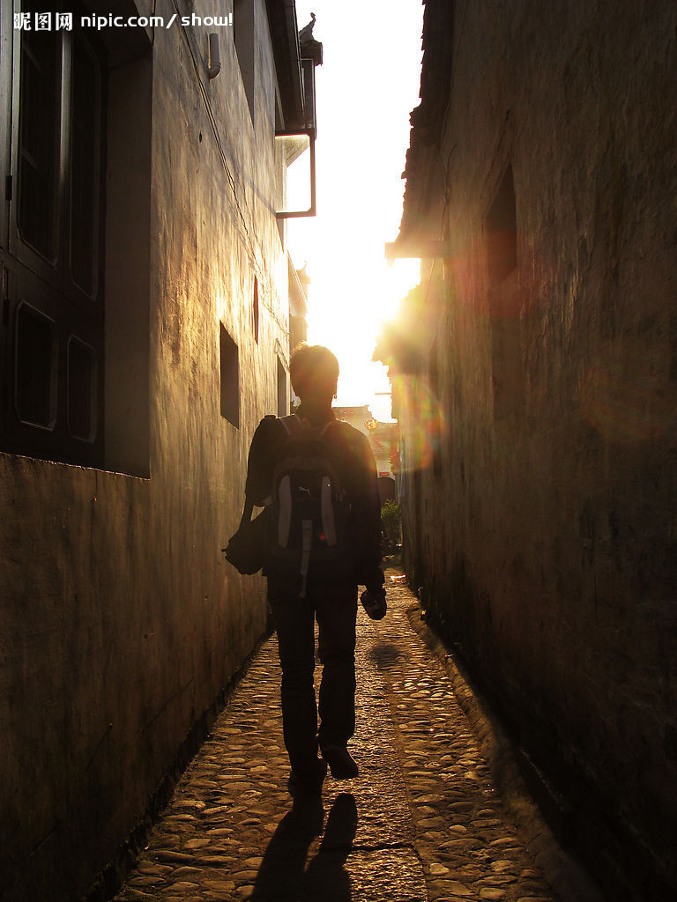

# ＜天璇＞走的太远，忘记了为什么出发

**那些过去了的，追求过的，得到过的，也失去过的，我非常的感激，也不会后悔。至少拥有过那些美好的东西，无论是痛苦抑或是快乐的，至少在自己的生命中确确实实存在过，因此我希望去感恩。而那些即将面临的，我不渴望是乌托邦，至少不只是另一个痛苦的轮回，让自己无措无力。** ** **

# 走的太远，忘记了为什么出发

## 文/刘清源（安徽财经大学）

 已经记不清究竟有多久没有写文章了，曾经何时的梦想是那般的强烈，兴趣是那般的让自己痴迷，然而终究自己丢掉了，这些丢掉的，是在过去。我不知道还能不能把 这些找回，也许当我不去品读一篇作品的时候，我甚至还是不会选择来动笔。然而终究我动笔了，只不过有些逃不了的、丢不下的，仿佛此刻也只能任其在回忆里倒 腾。陈盳在生前说过一句话：走的太远了，不要忘记当初是怎么出发的。话很有道理，也似乎是在教育着我们，然而对于这句话，我们仿佛除了感叹其又道理以外别 无所为。我曾经把他的话修改了一下：走的太远了，不要忘记当初为什么出发。我常选择去回想，那些过去了，遥远了的记忆，只是作为一些残破不堪的碎片，不时 的在脑海中闪现。曾经所向往过的一切，是这些零乱的碎片的一部分，在这一刻，终究离我们远去，我们还是走远了，当初为什么出发这个问题对于我们而言显得是 那么的脆弱，是那么的微不足道，因为我们早已经忘记当初为什么出发，那些所向往过的终点在也只是一地的悲伤，供自己伤感。 

现在总喜欢回想以前的点滴，回忆这大学的四年，所走过的路，所遇到的人，也总喜欢说自己是老了，很多东西已经记不清了。也许自己真的老了，老了的不是身体，而是信念。老师们会骂我，同学们会责备我，甚至领导也会教育我，归根结底还是因为自己放弃了坚持--那 过去的信念。也许吧！我真的是屈服了，曾经一腔热血的我，在残破的社会现实面前不得不选择低头。又或许他们说对了，我对自己丧失了信心，已经在现实的横流 中迷失，已经忘记当初为什么出发。我想，我不得不承认我此刻的卑微。然则告诉我该怎么做，我还是没有勇气去选择过去的那条路，已然它只能随现实慢慢沉沦， 也许没有终点，没有归途。 现 在总有朋友会问我害怕、恐惧吗？而我的答案却总是否定的。因为不知道现在的路是怎么样的，所以我无心去考虑我的感受，也就无所谓恐惧。也许有人说的对，很 长时间的迷失，已经不习惯记录自己的心情，也已经不习惯记述自己最隐蔽的感觉，曾经的那些多愁伤感，愤青情怀业已离我远去。错过了做梦的年纪，那段岁月便 不复再来。 其 实到了毕业的年纪，已经顾不上当初为什么出发的问题了。每日只是穿梭于寝室、工作单位抑或是招聘会之间，已经没有能力去考虑太多，这些已不在是一种执着， 不在是一种追求，俨然幻变的是一种现实的无奈。而这种无奈，却刚好在这个年纪显得如此明显。我不知道今夜为何颇多感慨，颇多怨言，也许是现在能能做的很少 了，微乎其微，似只能随波荡漾，在这里，我用的是“荡漾”一词，自希望是一种悠然的态度吧，哪怕自己悠然不起来。曾几何时，就是这种矛盾的态度支撑自己走 到了今天。 

那些过去了的，追求过的，得到过的，也失去过的，我非常的感激，也不会后悔。至少拥有过那些美好的东西，无论是痛苦抑或是快乐的，至少在自己的生命中确确实实存在过，因此我希望去感恩。而那些即将面临的，我不渴望是乌托邦，至少不只是另一个痛苦的轮回，让自己无措无力。 

（采编：佛冉；责编：项栋梁）

 
