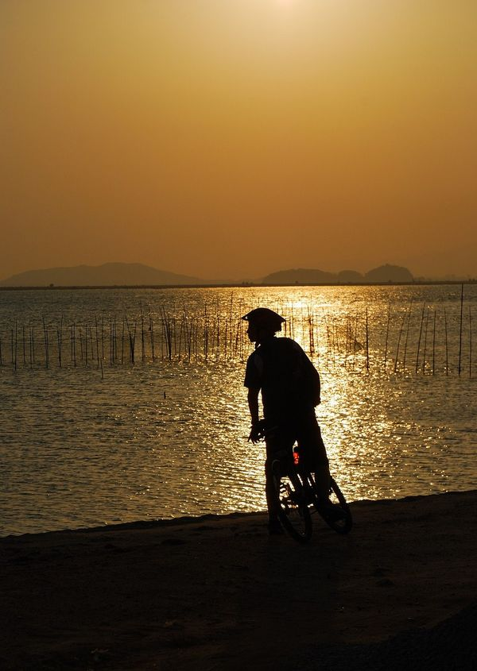
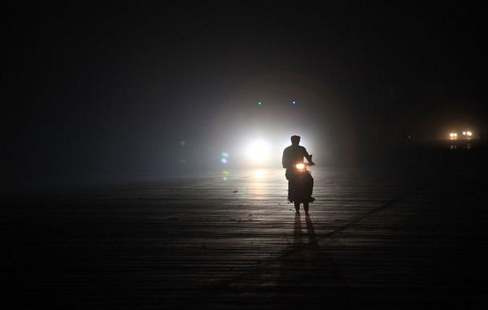
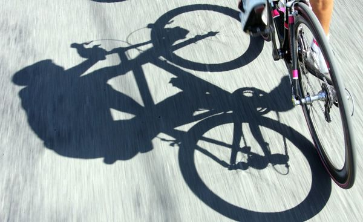
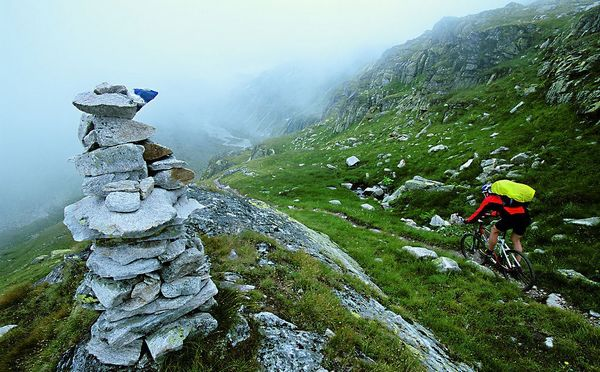
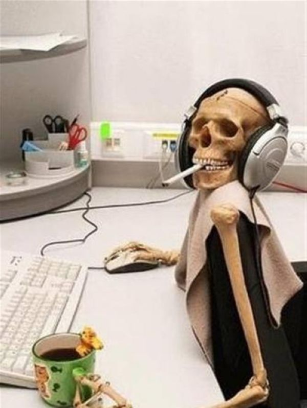
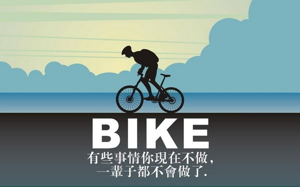

# ＜天璇＞车座上的骑士精神

**这可能就是现代人为什么这么孤独的原因。教育体制，大众媒体，流行文化，意识形态，总之，一切都在告诉你“那个”是好的。于是，你只想要“那个”，而忽视了生命中一些更加基本，更加接近于你自己的东西——哦，不，我说的不是“亲人”，不是“朋友”，不是“爱人”，我说的比他们更加基本，更加接近你自己。我说的是你自己，你的身体。一个不了解自己身体的人，怎能不孤独。** 

# 车座上的骑士精神

## 文/董泽宇（中国传媒大学）

 

热爱自行车运动的人，喜欢称呼自己为“骑士”。

众所周知，我们这个时代，早就没有“骑士”了，他们已经于几百年前倒在了塞万提斯的风车之下。

但他们并未完全离开这个世界，其所留下来的遗产，不妨称之为“骑士精神”。

#### 1.

一提到骑士精神，我们总是倾向于将其与“忠诚”“英勇”等品质乃至“勋章”“贵妇”等物质相联系——我不知道为什么流行歌里总喜欢唱“公主与骑士”的故事，历史上，“贵妇与骑士”的故事可比“公主与骑士”的故事多多了，大概是怕唱出真相容易引发道德争议吧，笑——但在我看来，骑士精神的核心，在于一个确定的现象世界图景，即上帝统领下的形而上秩序与贵族统领下的形而下秩序。只有在相对统一而又坚实的世界图景下，才会存在充满道德自律与卓越追求的上层社会——哪怕是表面上的，不妨参照革命组织初期的种种人之境况。

而进入现代之后，统一而又确定的世界图景早已不复存在，道德退位，逻辑上位；荣誉沉沦，物质上升。自律变为放荡——哦，不对，他们说这叫“人性的解放”——卓越变为平庸——哦，不对，他们说这叫“民主”。

有时候，会有人问我，为什么有人要满头大汗精疲力竭地不断蹬踏踏板以求二三十公里时速的前进呢；坐在真皮座椅上随意踩踏油门，轻轻松松地以百公里时速奔驰在公路上岂不舒适惬意？

这时，我总要提起到Robert M. Pirsig在《Zen and the Art of Motorcycle Maintenance》里的那句话：

骑摩托车旅游和其他的方式完全不同。

坐在汽车里你只是被局限在一个小空间之内，因为已经习惯了，你意识不到从车窗向外看风景和看电视差不多。你只是个被动的观众，景物只能呆板地从窗外飞驰而过。

骑摩托车可就不同了。它没有什么车窗玻璃在面前阻挡你的视野，你会感到自己和大自然紧密地结合在了一起。你就处在景致之中，而不再是观众，你能感受到那种身临其境的震撼。脚下飞驰而过的是实实在在的水泥公路，和你走过的土地没有两样。它结结实实地躺在那儿，虽然因为车速快而显得模糊，但是你可以随时停车，及时感受它的存在，让那份踏实感深深印在你的脑海中。

想起这段话是因为我实在喜欢这本书，但我觉得Pirsig推进得还不够深——不管怎样，摩托车总还是一种充满工业时代气息的交通工具，归根结底，它的动力源还是人身之外的他物，譬如汽油。而自行车，则是实实在在地依赖人这一存在本身而运动的工具。

#### 2.

Milan Kundera在《慢》里如是写道：

速度是技术革命献给人类的一种迷醉的方式。和摩托车骑士相反，跑步者始终待在自己的身体中，必须不断地想到自己的脚茧和喘息；他跑步时感觉到自己的体重、年纪，比任何时候都还深切地意识到自我和生命的时间。当人被机器赋予了速度的快感之后，一切便改变了：自此之后，他的身体处在游戏之外，他投身于一种无关肉体的、非物质的速度之中，纯粹的速度、速度本身、以及令人兴奋的速度感之中。

我想，这便是依赖人这一存在本身去做些什么与依赖工具去做些什么的本质区别。

经常，我骑了百来公里之后，会在路上一边骑行一边产生一种自暴自弃甚至自怨自艾的想法——这说明我是个无论身体还是意志力都不够顽强的人——我这又是何苦！有这点儿闲散时间，在图书馆晒着太阳看上几页小说，或是瘫软在电脑前看上一部电影，或是约上姑娘去逛街吃饭，岂不逍遥自在？！

会这么说，当然是因为我觉得自己不“逍遥自在”。比如说，往日里，我根本察觉不到自己在走路时所抬的每一次腿；可现在，每一次蹬踏所带来的酸痛都让我切切实实感受到“腿”这一依附于我身体的存在的存在，让我清清楚楚感到它的疲惫与磨损，甚至能感受到乳酸在一点点堆积，扩散，仿似在对我示威，高喊着：停止你那愚蠢的运动吧！

可渐渐地，你感到情况得到了好转，是的，它还在酸痛，还在示威，甚至更加猛烈，更加高声，但你的知觉却似乎离开了它，却也没有转向别的东西，诸如你戴着骑行手套的手，或是脑袋上不断透入寒风的防护头盔。

你在运动之中，竟然获得了“静止”。你开始摈弃杂音，背景音乐只剩下你规律而沉重的喘息声与轮胎摩擦地面的粗糙声；你开始摈弃杂色，视界的世界只剩下前方不断延伸的道路与两旁不断消逝的什么东西——你甚至来不及确定那是“什么东西”，转瞬即逝，就像从来没有存在过一般。你好像在想些什么，好像罢了，反正你也搞不清楚。

于是，骑行仿佛不再单纯是骑行，而是变成了你的人生，你的存在，你唯一的目的，你唯一的选择。你开始以第三视角，一台摄像机，注视着你自己，用冰冷的目光。你在想：所以，这就是这个人，这就是这个家伙，他在骑行，略微痛苦地，这就是人生。

 “我跑步，只是跑着。原则上是在空白中跑步。也许是为了获得空白而跑步。即便在这样的空白当中，也有片时片刻的思绪潜入。这是理所当然的，人的心灵中不可能存在真正的空白。人类的精神还没有强大到足以坐拥真空的程度，即使有，也不是一以贯之的。话虽如此，潜入奔跑着的我精神内部的这些思绪，或说念头，无非空白的从属物。它们不是内容，只是以空白为基轴，渐起渐涨的思绪。” 

——村上春树 《当我跑步时谈论些什么》

#### 3.

有时候我会想，那些三步一拜的信徒，一定比我们这些骑行的人更加纯粹，因为他们更加清楚什么是“身体”，什么是“存在”，虽然不说。

这可真是个有意思的话题，我们很容易为了徒步进藏的信徒而感动——“感动”真是个媚俗的词，且许多时候毫无益处，人却要相当程度地活在其上，好让自己踏实一些——却很难为了坐飞机去拉萨的人而感动。

我想其中可能有这么一种原因，就是：相对于坐飞机去那儿，徒步，或者骑单车去那儿，总是要“难”不少。“难”的意思，是身体和意志都要经受更大的考验。“考验”的意思，是折磨。

而这恰恰是科学出现的原因。

现在我们知道，科学的问题在于它并没有和人的心灵连在一起。然而过去人们并没有注意到这一点，因为大家最关心的是衣食住行的问题，是怎么“不难”怎么“不折磨”的问题，而科学正好能满足人们这方面的需要。

但另一方面，意义这玩意儿——虽然很难说是存在的——总要建立在一系列的过程之上，且这些过程决不能太过轻松随意，要么，意义的根基便不牢靠。如果你“去哪儿”只是为了“到那里”，那我想，许多途中的意义将会失却，因为“那里”的意义并不是单独存在的，是与每一条通向那里的路与周边的地方相互依存的。

可现在，我们却越来越不想去经历一条条路，而是很简单地想要“到那里”，或者“得到那个”，我们不想要过程，不想“麻烦”，不想“难”，我们只想要“那个”，越轻松随意越唾手可得越好。

这可能就是现代人为什么这么孤独的原因。教育体制，大众媒体，流行文化，意识形态，总之，一切都在告诉你“那个”是好的。于是，你只想要“那个”，而忽视了生命中一些更加基本，更加接近于你自己的东西——哦，不，我说的不是“亲人”，不是“朋友”，不是“爱人”，我说的比他们更加基本，更加接近你自己。

我说的是你自己，你的身体。

一个不了解自己身体的人，怎能不孤独。

#### 4.

不要想当然地认为你周六晚上的孤独只是没有人和你说话，不要想当然地认为你午夜梦醒的迷惘只是没有找到自己的梦想，永远不要低估你的身体，他从来不是你的工具，不是你的私家车或智能手机。他是神话，是文本，是你精神的另一面，一种隐喻，一种很难察觉的精神。你想找到自己的精神，或曰意义，很多时候并不能通过寻找“精神”或“意义”去获得——就好像“朝圣”必须得去“朝”，而不是“到”一样——你必须关注自己的身体，感受他，理解他，运用他。有时候甚至你必须“折磨”或“虐待”他，好获得物理上的感知，那些人体学永远不会告诉你的感知。

所以，车座上的骑士精神绝对和什么劳什子“荣誉”“勋章”无关，他的核心在于一个统一的世界图景。

我知道这很难，因为你是个现代人，知道得太多的现代人，被信息围攻的现代人。在你看这篇文章的时间里，你的人人好友又更新了48条新鲜事，“冷笑话精选”又发布了一条新笑话，且转发数已经上四位数了……更有可能的是，身患长文阅读障碍症——这是数字时代的人类通病，发病率和拖延症不相上下——的你，还没看到这儿就点了屏幕右上角的那个“X”。

同时，也因为你是个现代人，所以你的精神和身体处于双重羸弱的状态之中，其是互相影响，互为表里的。你在空虚的深夜感受到了自己精神的羸弱，于是你对着昏暗的电子屏幕漫无目的地想要对抗羸弱，而这只能加速你身体的羸弱，并再反过来让精神更加羸弱。

但是，也许仍有希望。你看到理性与科技是无法打败的——我们都得承认这一点，单车骑士们轻便坚实且可多级变速的单车，是现代化的产物，村上春树跑马拉松穿的耐克跑鞋，也是工业化的产物——但你根本无需“打败”它们，你所要做的，只是让它们去做他们应该做的事，更好地为你的身体和精神服务，去建立自身统一的世界图景。

这世界图景的建立，有赖于“真切”。所谓“真”，就是她只属于你自己，你绝难从LCD或是别的什么地方得来她，因为你知道“真”这玩意儿，每“转发”一次，便要变形扭曲一些；所谓“切”，就是她和你自身直接相关，无论是精神，还是身体。

你需要一个过程来接近这一世界图景，是精神的，同时也是身体的。谁先谁后并不重要，因为到最后你会发现，这二者是绝难完全分割的。

所以，出发吧，无论是读书或是行路，都是一种出发，你的精神或是身体，总得有一样在路上。而当你决定出发的时候，最困难的那部分其实就已经完成了。

#### 后记

这是一篇长久以来我一直很想写的文章，但却迟迟没有下笔，因为很多骑行中的感受，比较纯粹的“身体性”的感受，是很难用文字表现出来的，除非能够容忍相当程度的表达失真。自己为了自圆其说，瞎诌了一些概念出来，供看官一笑罢了。真正想探讨的问题，诸如“现代人的羸弱”之类的，也不是三两句话就可以说明白的。应该是永远说不明白。

但还是硬着头皮写了出来，留个存根，希望自己再读书行路若干年后，回头看，能有些新的想法，也算是个对比。

题目叫《车座上的骑士精神》，其实既和“车座”没什么关系，也和“骑士”没什么关系。若我喜欢跑步，估计题目就是《跑鞋上的骑士精神》了——要是个富二代，喜欢赛马，估计要成“马背上的世界精神” ，哈哈——或者《船桨旁的骑士精神》，也不错，但应该不太会是《油门上的骑士精神》或是《舷窗旁的骑士精神》。

（采编：麦静；责编：麦静）

 
