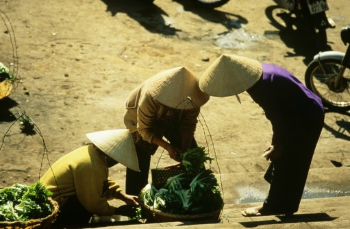
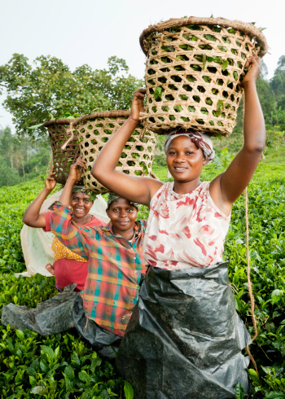
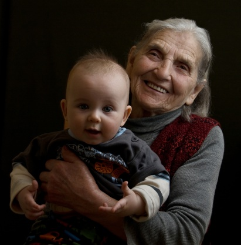

# ＜天璇＞这一年，我遇见很多人

**李开复说过，真正的热爱生活不是在象牙塔里嚷嚷着我多热爱生活，而是，见过丑陋之后，反而更加爱生活。我现在好像就是这样，如果说你现在看到的尽是世界丑陋，那是因为你没有看到更加温暖的灿烂的一面。无论怎样，我们都要相信好人总比坏人多，爱总比恨多。无论是过去，还是未来，人生中很难再有另一段时光可以让你接触到那么真实全面的社会，那么多种多样的人群，我想这是在教会我很多很多道理，尽是智慧，但愿我的慧根还不错。**  

# 这一年，我遇见很多人

## 文/沈颖婕(华东政法大学）

 

老路推荐了一篇帖子，一银行的姑娘写得一篇文章，励志，感人，新大学生的社会感触。第二次看到这篇文章了，每每看到，很多处确实尽是戳中心窝的地方，可以说她写的有那么一大部分，就是我的生活。

但是觉得有一些地方她点到了，但我还有些其它的感受，所以我自信地觉得我以我这六个月的经历和丰富的感受，可以写一篇比她更好的，可下笔的时候，我好像只记得，这一年我遇到了很多人。

这一年我确实遇到了很多人，这是真的。我想讲的第一点，就来自这里。

人人是否生而平等？

我遇到过天天来帮老板存取钱的外企白领，画家，化妆师，菲佣，快餐店的小弟小妹，油漆工，千万富翁，外国人的情妇，犹太教的人，黄牛，财经传媒集团总裁，农民工，菲律宾人妖，印度大叔，大学生，电视主持人，独当一面的女老板，毒挡一面的阿姨和大叔，加拿大籍美国籍英国籍澳大利亚籍挪威籍德国籍法国籍华人及其家属，香港人，台湾人，各色中外同胞。

这些人太不相同，境遇天差地别。以前，我记得小学里的时候，书本上让人印象最深刻的话之一就是那句，当我们坐在窗明几净的教室里学习的时候，山区的小伙伴们却连一本像样的课本都没有。在我小时侯，有一个和我同岁的小伙伴，是亲戚，我们很要好，她长在农村，爸爸妈妈没读过什么书，我想我的根也在农村，可是小伯春小亚平书读的还不错，所以我是在镇上养大的，从小是独生女，不管有钱没钱，都享受着来自父母的最大宠爱，得到的是父母能力范围内最好的教育，考高中考大学，然后工作。她大概十岁的时候家里又多了一个妹妹，小时侯就要带妹妹，后来大了，书也就没怎么读好，随便上了个什么中专，然后就去杂志社做打字工作，现在已经嫁作人妇。小时候，小亚平就一直拿她和我对比，让我不要生在福中不知福，我从小就一直在想，为什么同样的人，就差那么多，对她多不公平，为什么我就是我，如果我是她，我现在会怎样，不说那种更好，可是命运肯定是不公平的。

所以命运是不公平的，无论是跟比我们差，还是比我们好的比，都是一样的。但是在我遇到那么多的人之后，我终于从心底里强烈地感觉到，无论你从哪里来，你是想做一个善良还是肮脏的人，宽容还是斤斤计较的人，温暖还是冷酷的人，永远都是你自己的选择。

我曾遇到做饮食的小贩，钱不多，他存的钱上都有他卖的食品的味道，浓浓的油腻味，衣衫也不整齐，但他会把你给他签名的单子，签好，然后用手伸过钱兜直递到你的面前，就那么一直伸着直到你拿到，那扭曲的动作，让人心里酸酸的感动。

我曾遇到一个富裕的美国华侨，我的同事做错了一笔东西，少给他四角四分，他还会愿意马上过来解决这件事情，没有丝毫怨言。另一个富裕的爷爷，学者模样，我忘记将十三万多的钱从他帐户扣除，没打电话之前我就相信他一定会过来，那是人的气场和行为给你的一种信任，后来他过来，让我把帐扣除，说的第一句话是，希望不会扣你的奖金，小姑娘。

我也碰到过，没什么钱的，拼命吹嘘自己做这个银行的理财，是那个银行的VIP，随便逮着个机会就想吵一吵，让你们退一步，好占点蝇头小便宜，一分一毛的汇率差价，几块钱的手续费都会为难你的烂人，那股穷酸劲才真叫人恶心。

也有浑身名牌，学历不知怎么高的白领丽人，从来不怀疑自己不是什么都懂这件事，这个怎么会是这样，一定是你们这个不好，那个不好，系统不行，体制不对，抄着自以为流利的英文和电话那头说着，说来说去就一直重复那句，THIS IS SO RIDICULOUS.我听得都快吐了，昂着头的冷酷婊子就是这么个样子吧，我想。

这么久以来，我看到过好多好多的姑娘，漂亮的，普通的，有钱的，没钱的，北方的，南方的，本地的，外地的，留洋的，没读过书的，终于明白男嘉宾们那一句我喜欢善良的姑娘是什么意思了，有一次，有一对情侣在柜台上，那个女的就开始为一些有的没的排队排太久什么的吵，喋喋不休，吵得人耳朵疼，我只是怜悯的看着她的男友，LUCKY U，我内心这样OS着。宽厚是美德，尤其是对女孩子来说，难道有些人不知道一个斤斤计较，胡搅蛮缠的女人有多么的倒胃口。当然男女都一样。

我说了，那么多的例子，其实是想说，你是个什么样的人，你的人格品行，绝对跟你的出身，财富，教育没有关系，这永远都是你自己的选择。

当我们死的时候，我们都要光秃秃地站在上帝的面前，说我们是什么样的人，我们的选择，所以说从本质上我们是平等的。

不讲理真能在我们的世界占便宜？

还有一个现在社会让人百思不得其解的地方，在我们这样的工作岗位上，更是司空见惯，总结一下是，现在这个社会，只要你吵，声音大不讲理，你总会得到一些好处，我的大部分同事对此深信不移。我初想了一下，确实这样，那些蛮不讲理的人最后总还是得到了特殊待遇，在息事宁人的原则下，那些老实忠厚的好人却无法得到特殊的优待，这是为什么，一度，我也非常的想不通。甚至我自己也是这样，柜台上时间有限，所以，一些难搞的人就注意一点，尽量满足他们的要求，以免又要乱吵一通，那些好人，就稍微随便一点，他们也都不会介意。 有一段时间我很想不通这件事，并且觉得这是不对的，

后来有一天，我在地铁站，终于想通了，即使这些人得到了优待，你愿意成为他们的其中之一么，你不愿意，老子说，人法地，地法天，天法道，道法自然，自然界是个食物链，也是一个能量守恒的地方，其实世界上的事情，不也是这个理，你得了一样东西，必定要以失去另外一些的代价，你选择某条路，必然要经历这一路带来的荆棘，永远就是这样。他们以为她们赚到了，可是我们却不愿意与她们交换，那是应为，我们知道那必将是以失去另一些为代价的，也许是我们的为人的原则，也许是变成了一个自己都觉得不值得爱和尊重的人，这些人失去的多了去了，起码是我的尊重和信任，我也不会朝她们真诚的笑，她们当然不在意这个，但总有她们在意的东西。

而那些宽厚善良的人们，我也明白，我能给他们的远远不是几张新钱，或者是散一点的外币，尊重，信任，喜爱，才是配的上她们的东西。

不要对老人生气

在银行你碰到的很大一个群体，就是老人，一群很让人头大的客户，有时候你要花很长时间才能听懂他们到底要办什么，然后很多东西无论你怎么解释他们都听不懂，他们总是忘记密码，行动很缓慢，无论是签字还是什么都有困难。

有一天，我又照理碰到一个打扮地很整齐的老爷爷，也要八九十岁了，情况一如既往的糟糕，花了大概三分钟也没有搞懂他要办什么，外面人又很多，我开始急燥了，音量也抬高了，老爷爷明显很惶恐，但我转念一想，算了吼了没用，还是解决问题吧，开始再一遍遍跟他说，帮他办，指导他一个个签字，看着他一只手握着一只手才勉强写出的抖抖的字，有点岁月的心酸。最后帮他取信用卡，卡是批量开的，里面的地址是复旦大学法律系，我一下子很触动，然后老爷爷走的时候跟我说，小姑娘，非常谢谢你的耐心，我知道我们老了，真的做什么都不行……

我突然觉得不是滋味，也许是个法律系的教授，以前肯定也是出口成章，骄傲的不得了的人，现在却需要放下多少的自尊来承认自己一天比一天没用，带着对自我的觉醒老去，我们都会老，都会有那么一天的。

有句话说的好，不要和老人小孩生气，因为一个人生才刚刚开始，什么都不懂，一个人生接近尾声，应该尽量快乐。

每一次，我碰到一个老人，我都会想起这句话。

这是我这六个月来的一部分所见所想，李开复说过，真正的热爱生活不是在象牙塔里嚷嚷着我多热爱生活，而是，见过丑陋之后，反而更加爱生活。我现在好像就是这样，如果说你现在看到的尽是世界丑陋，那是因为你没有看到更加温暖的灿烂的一面。无论怎样，我们都要相信好人总比坏人多，爱总比恨多。

无论是过去，还是未来，人生中很难再有另一段时光可以让你接触到那么真实全面的社会，那么多种多样的人群，我想这是在教会我很多很多道理，尽是智慧，但愿我的慧根还不错。

 

（采编：何凌昊； 责编：尹桑)

 
