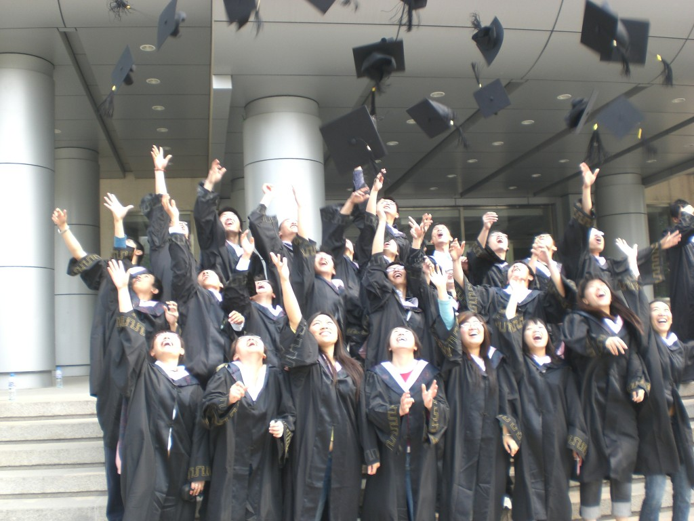
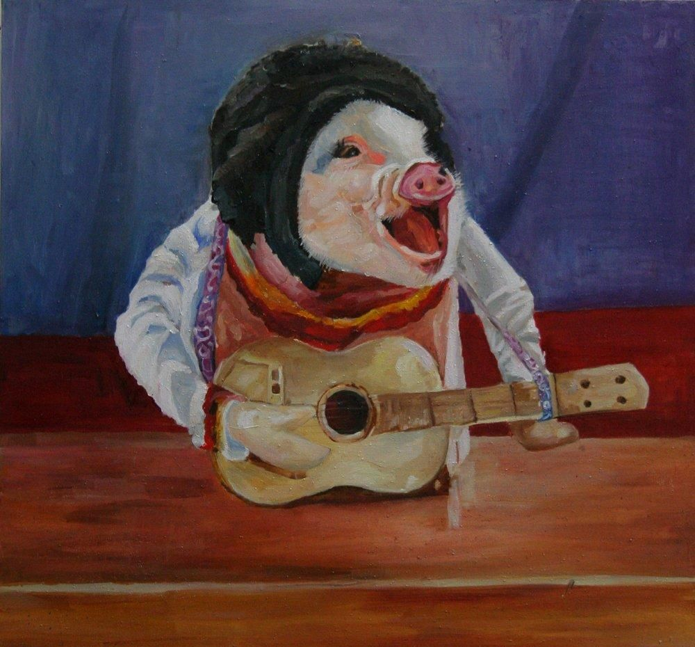

# ＜天璇＞这两年毕业的朋友们

**你如果还是放不下尘世嚣杂，又抱怨阿谀奉承，想单干，没经验，想滥交，没魅力，想写作，没故事，想嗑药，会上瘾，想死，怕疼，那你想干什么呢朋友？对了，你当然想辞职去云南了，这样就可以让你的个人主义放大到无穷，天地为床，阅妞无数，爽死了对吗朋友。你还可以假装信佛，那个玻璃盒子摆在案上，一面看着《色即是空》一面吃着素，准备死后把你的舍利子装在玻璃盒子里，你一定可以圆寂的，朋友。** 

# 这两年毕业的朋友们

## 文/歪拐（广西南宁）

 

昨日和两个旧友聚头吃饭，席间话题从房子开始谈，谈到男友女友，谈到整容，谈到刚刚起步的工作，谈到同龄人那谁谁的婚礼，最后又转回来谈到房子。这一年很有趣，我们这批人陆续从校园里出来，碍于一些大家都知道的原因，大多数同龄人所学习的专业都不是自己当初最愿意选择的。择业的这段时间里，人群分为两类，回乡类绝大部分进入体制内就业，外漂类为数多者选择文化宽松的外企或者一些个耳熟能详的民企。归宿虽然不同，道理大概相似，我发现无论如何，在这一两年里我们都不知道自己在干什么。

说这些是有原因的，在我们还假装文艺的校园时代，不受父母资金链控制的毕业后生活在我们的脑海中灯红酒绿，那时候理想有多大就能谈多大，每个人说起将来就两眼放光小肚子紧张。我有一个朋友，毕业后在一个一线城市的一家民企工作，氛围轻松，收入可观，微博更新得很勤快，我多次问他，你现在想干什么？他说不知道，开个店？我问为什么。他说，你可以试试看每天工作十二个小时以上时常没有周末业务指标还不一定能完成一半的工作，十年之后你在这买不起一个房间买不齐四个车轮请问你想不想自己做老板。我又帮他想了想，如果光买车不买房子，在人格魅力只够拥有三百个微博粉丝的现在，如果不靠舌头能舔到奶头这样的特异功能在网络上一夜走红然后依仗漂亮脸蛋和内增高急速蹿红在影视歌三栖领域成为时下女性仰慕的白脸小生，他也极有可能只能寻找一个同样的外乡人组成一个寻租家庭，操着外地口音吵架和谈情，被所有服务行业冷眼对待。就算他成功说服家人再遵从内心成为一个大龄单身上进青年，一头扎进工作和城市喧嚣中，十载春秋过后也难保他会不会后悔当初的选择。我又帮他想了一个底线，即使他是一个哲学上足够深刻的男人，即使他是当代尼采，即使他能摒弃一些利禄功名、亲情羁绊、心理落差、意外怀孕，心满满地就想和宇宙对话，那他活在哪里根本上都是一个样子的。所以我判断我的朋友并不是这样一个人，和大多数男性青年一样，我的这个朋友还是一个更愿意各方讨好又有条不紊的平凡人。我们的结果是，除非撞大运，不能生大病，否则我们便可以在一个晚上预见他的一生一世。但是我并不想把这些跟他讲得太细，因为他说他有理想。

我还有一个朋友，前年回乡工作，公务员待遇，就职在广西的一个市级事业单位，已经独立购入一套大面积单位集资房，今年正在看车，预谋和男朋友分手，准备考察家里介绍的高富帅相亲对象。我问她，你有什么心愿没？她说，心愿？心烦差不多，结婚吧，嗯，结婚。我心想，好，结婚，这是个好理想，一个姑娘家，你并不能要求她们想得太多。我又问，结婚之后呢？她说，生娃，花钱，潇洒，感受人生。我说现在就是人生，今天就是生活，你感受到了什么？她说，一个男人就可以改变女人一辈子，你不是女人你不知道。我又帮她想了想，就算我不是女人我当然还是知道一个心存目标的人和一个碌碌无为者的本质区别。我有一个大专毕业的朋友，住在四百块一个月的城中村里，她的理想是设计服装，她每天像吃了蜜一样。我的这个公务员朋友，也是大专毕业，每次遇到我，脸上的阴郁层层叠叠，我都可以想象用指甲盖把那些阴郁刮下来的样子。但我开始逆向思考，如果她是有想法的，她也着实这么做了，但是她的婚姻会把她带到哪里去呢？她敢不敢做一个家庭关系的弃儿再奔向一个虚无缥缈的理想世界中？想大多数姑娘一样，她心情孤寂了怎么办？她性欲旺盛了怎么办？她姨妈疼痛了怎么办？她总还是一个相对柔软的社会成员，就算她加入了一个爱猫爱狗俱乐部每天喂养一些流浪小动物也总能让内心充满幸福的。我很想告诉她这些，叫她不要再阴郁了，刚一抬头看见她指着一辆保时捷卡宴说，操，这地方怎么会有这车，叔叔快来娶我。

我所沮丧的是，大家的理想，甚至连个念想都算不上。

就拿我自己来说，我每个月拿两千多的工资，加上一些稿费的收入，我可以拿到三千左右。同时，我在一个企业文化居然由党群部而不是人力资源部建设的单位中工作，企业的归属感和对自己的认同感并不奢望可以在这里找到。

于是我想在这个城市的年轻人群里寻找归属感，我每月先拿出一千块钱加入到一些文艺活动里。有一次看完演出，我问一个腰间有刺青的学生姑娘，你最想干什么？姑娘说，流浪，去流浪。我马上把我现在的情况跟她大概描述了一番，说完再问，你看看，我还能跟你来看演出，每年有长假去旅游，资金充裕，不养车房，女朋友远在天边，我想日你，我就日你，让你选，你选哪种？姑娘想了想，又想了想，终于还是笑笑说不知道。

于是我又拿出一千块钱赴各种经商前辈的饭局，在一整晚烟酒缭绕的包厢里的谈话之后，我听到最多的就是哪支股票的年后看涨，哪种型号的车的驾驶舒适度和油耗是相当美好的，哪个女星是最适合日的类型。这没有什么好批判的，都很好，每个人群的话题都很有针对性。于是我问，叔叔，我现在什么也没有，我怎么能日到她们？他们说，年轻人，积累，学习，等待，蛰伏，对领导要暖，对金钱要信，很快就能了。我明知不讨好且会冷场，但我忍不住又问，你们有没有远一些的规划，例如理想之类？问完后不出所料，他们所有人突然都笑了。

我看看我的钱包，还剩下最后的一千块钱，解决好我的食宿之后，已经不剩几张了，我不能再去探求什么归属感，无奈的我只好回家上网。网页一开我傻眼了，白天的生活记忆仿佛被瞬间和谐，世界突然纯洁正义又充满浪漫的理想主义。我发现居然每个人原来都是公正善良且富有理想的，无论学生、公务员、白领、失业者、老人、儿童、摇滚歌星，他们都是有理想的，并且他们的理想都很玄幻。例如他们都想去西藏流浪，他们都想在马尔代夫裸泳，他们都想成为歌手、画家、作家、记者、嬉皮、抗拆英雄、舆论精英，总之他们想的都与金钱无关。旅行类的书籍卖的特别好，豆瓣里大家都加入没钱也旅游小组，微博上只要关于辞职去云南的段子转发一定上千，《转山》的票房飘红，《荒野求生》在任何影评网站里都不会打下八分，朋克乐广泛落实到各基层社会青年的心中，私立妇科医院每天都要处理这些二线城市的啤酒摊嬉皮士留下的烂摊子。

我很郁闷，我他妈不敢置信，网上的这些人都他妈是谁呢？我走了一圈找了一路，一年来我已经很少发现眼眶中还闪着理想亮光的年轻人，他们大多都被琐事缠身，都被党群工作磨平，偷偷买《穷爸爸富爸爸》之类的书籍放在床头积累灰尘，当问及理想，已经没人能够在三秒之内笃定地回答出来，甚至很多人就如上面我所描述的，他们喜欢说我不知道。那网上的这些人都他妈是谁呢？

这个问题你可以问问自己朋友，就算去西藏流浪，在马尔代夫裸泳，当你收入是三千块的时候，一张机票就是你的理想啊朋友，当你收入是一万块的时候，一张国际机票就是你的理想朋友，当你收入是三万块的时候，一张没有返程的国际机票就是你的理想朋友。如果理想那么简单，是一次省吃俭用攒钱换来的旅行就可以达到的话，你为什么还目中无神呢朋友？

你如果还是放不下尘世嚣杂，又抱怨阿谀奉承，想单干，没经验，想滥交，没魅力，想写作，没故事，想嗑药，会上瘾，想死，怕疼，那你想干什么呢朋友？对了，你当然想辞职去云南了，这样就可以让你的个人主义放大到无穷，天地为床，阅妞无数，爽死了对吗朋友。你还可以假装信佛，那个玻璃盒子摆在案上，一面看着《色即是空》一面吃着素，准备死后把你的舍利子装在玻璃盒子里，你一定可以圆寂的，朋友。

是的，说这些我很爽，但是我发现说完这些我的口袋里还有三百块钱，在此之前我解决了温饱。我打算把这三百块钱存起来，当然我之前每个月已经这么干了，具体用来干什么，我也不知道，理想当然不会是这么简单的事情。那你要问了，说虚了也不行，说实了也不行，到底要人家他妈怎么样嘛？请允许我这么说吧朋友，你不如先孝敬父母，先尊重兄弟，先亲吻恋人，每天按时如厕，锻炼身体，学习知识，跟暗恋对象表白，结婚生子，定时做爱，发展爱好，安心工作，研究自己，感知世界。等到某一天，我相信一定会有这么一天，你的脑袋刹那一空，大地颤动，阳光射入瞳孔，肉体感觉渐去，你的头发竖起来，你就是超级赛亚人三，你的酥胸剥出来，你就是美少女战士团，你穿着很薄很薄的布裤你的的盔甲变成金黄色，没错，你就是黄金五小强。你知道这个圣洁伟大的日子已经来临，只剩一颗真诚的心无端端地悬浮在你眼前，跟随它，取出你存了十几年几十年的三百块钱，到时你会知道，我也会知道，我们该去哪里。至于现在，我的同龄朋友，你连理想的鸟毛都还摸不到。

我可能又把这事儿说得太悬了，好吧，我的理想就是能变成超级赛亚人三去跟夜礼服假面约在黄金十二宫决战。

 

（采编：应鹏华；责编：麦静）

 
