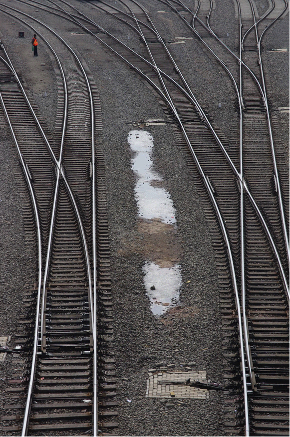
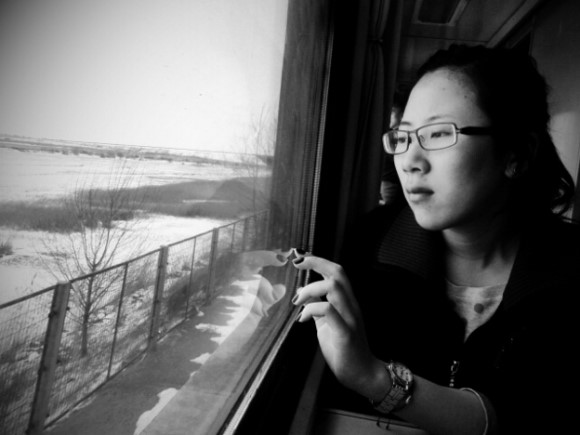

# ＜天璇＞通宵列车

**但如此这边久了，遍野为自己找到了舒缓之说法，不妨将其看成一帧帧快速闪过播放的胶片，每一帧都是绝伦的精彩，连起来则会成了最普通、最常见的生活，别人平凡的生活。你不会觉得扼腕可惜，反而会有丝慰藉，因其还原了它原本的面貌，这就足够震撼人心。最文艺的词汇和画面都深藏在深不见底、足以淹没所有人雄心壮志的平凡生活中。你知道这一帧帧作品上印有自己独特的水印，虽别人看不到也无法向其证明，但那就是你的，独一无二的存在于你的体会和感动当中，任别人谁也抢不走**

# 通宵列车

## 文/李东哲（吉林大学）

一、天黑上车

破旧的车厢在寒风中如老马一般喘着粗气，尽显沧桑疲态。在车厢外面疾走而过时，就能感受到其中的雾气氤氲。待走进车厢，配合着冷光灯照，混合成一股死气沉沉的气氛。

人在这样的车厢里坐了多久，打眼一看便知。长时间置身其中的人，大多眼皮沉重，眼神微醺，眼眶湿润，像极大醉之人，又像初醒之人，还像梦游之人。猛然间陷入这样的环境，周遭都是此种状态的人，未免会有一丝恐慌，好像自己一不小心掉进了时空的褶皱之中，掉进了一个不属于我的全然无意识的世界。好像自己恍惚间成了刘慈欣那篇《我的祖国不是梦》小说中的主人公，清醒且恐惧地活在一个集体无意识的国度。而那些迟钝、呆滞、空洞的眼神，只有在刚上车之人来进股股凉风时，才忽地亮起那么一下。但很快就又黯淡下去。

晃晃悠悠的火车如同一个巨大的摇篮，而铁轨之间的缝隙则是一根绵延不绝的琴弦，弹奏着单调却又有效果的催眠曲。头越来越沉，笑声吵杂声越退越远，困意偷偷来袭。不知过了多久，一阵小骚动把你惊醒，你抬眼打量四周，已没了刚上车是那股怪异之感。你自己已然融身于其中，有着同样的神情，便察觉不出周遭的怪异。只是你自己无法看到你自己。

被吵醒的你困意全无，等着酸楚的眼皮，盯着车厢上部一排行李发呆。发呆是通宵硬座车厢中颇受欢迎的常态，仅次于睡觉而多于聊天。而这时的聊天，在睡觉和发呆者之中，显得格外明显，就和脚臭一样，少数几个人干着，其余的人受着。在这片空间里，所有的感官都不受自主，被绑架般，被迫接受着些什么。耳边充斥着各种与自己毫不相关却使劲往里钻的闲篇，毫不在意，却不由自主地安置那无处可去的精力于其上，听着原本也不认识的两人从小学同学聚会与老相好的重逢聊到各自手机卡套餐里有多少分免费通话分钟。一时突然没话、对话中止，你还浑身不舒服地忍不住回头看看他们到底怎么了。

受够了这种自己如傀儡般受人摆布的状态，使劲甩了甩头，戴上耳机，把音量一点一点慢慢调大。当如潮水般的音乐盖过周遭那一刹那，好像周身充盈期一个透明屏障一般，隔离开那份吵杂，留一份孤独和清净给自己。这才，长出一口气。

夜晚的火车无法欣赏窗外之景，少了火车上一项分量十足的消遣。撩起窗帘，目光投向黑漆漆的窗外，朱能看到飞驰而过时隐时现的昏黄路灯，磨得锃亮的铁轨，以及随着节奏不住摇晃脑袋的自己。俨然已经进入了自嗨环节。

十余个小时的通宵列车，我一般都会有几个固定的戏码。上车落座，正襟危坐，拿出书翻看，用行动向周围人传达一个我不愿多聊天的明确信号。但这样的装腔作势只能维持不多一会。紧跟而来的是抵挡不住的困意，索性放弃抵抗，扔掉一路维持过来的形象，枕着书抱头睡上那么一会，脑海中还琢磨回味着刚才书中的只言片语。外界环境虽然险恶，但这一觉往往香甜。

但是时间，往往会在你睡着的这段时间里慢下脚步，好像走到你身边，捂嘴偷笑着看着眉头紧锁、不断调整睡姿以缓解酸麻的胳膊和脖子的你。当你受够了这般折磨，愤而醒来，一看表，长约一世纪的折磨换算回现实也才过去了一个多小时而已。赌气似的在此趴下，却如何也睡不着了。无奈起身，再看表，盘算着还有多久以及该如何打发。

一般这时，我会祭出我的小本子，开始我在午夜列车当中的打发时间杀手锏。打开本子，在上面涂涂写写，把片刻的感受想法拍在纸上，一顿奋笔疾书之后，抬眼与周遭好奇的目光遭遇，顶回去之后，以一副胜利者姿态般的目光便找一个空旷之处继续发呆，直到下一段灵感闯入脑海，再匆匆伏案，将之拿下。颇有猎户的风采。

这段时间往往能够持续多时，是我夜车上消磨时间的大户。买票之时，站在售票窗前，面对后有黑压压焦急排队的人群，前有语气不耐烦问我只剩硬座要不要票的售票员的情形下，让我有勇气买下通宵硬座的勇气，大多来源于此。

二、天亮到站

坐在车窗前的我贪婪地看着窗外，车窗玻璃上反映的光线不时提醒着我现实的存在，也许在这种的干扰下，车窗之外的景色才愈显珍贵。

火车路过一片凹地，在盆地中央的底部坐落着一个小村庄，密密排列紧紧簇拥在一起的一个个平房突突地向上吐着白烟，表现着朴实却又无比真实的气息。火车运行之中与铁轨的撞击声在此显得格外刺耳，生怕声音掉下去——怕疾驰而过的风吹乱炊烟，怕轰隆隆之声吵醒酣睡晒阳之人。但又觉得多虑，小村庄离得足够远，之间的距离足以屏蔽尘嚣隔绝纷繁，匆匆的脚步与好奇的目光都与其无干无妨。

同样的风景，坐在火车里的不同位置，看到的也会不一样。面朝着火车前进的方向，窗外与你来说就是一副无限展开的画卷，而你所需要做的就是注视其徐徐的铺陈而来的风景而已。而背朝着列车的前进方向，则是另外一番情趣。你无法预先看到即将驶过床前的景物，所有的画面都将变成惊喜，所有近处的食物在眼前一晃而过，而稍远的房屋农田隐秘于云中的山峦则没那么吝啬，肯稍等我片刻，在眼中多做停留。

途中好多处风景，倘若定格下来，毫无疑问都将是佳作一副，惹得车中的我坐立难安，眼睁睁看着一个个好作品慢慢悠悠地溜走，只能在玻璃这边车厢里头拿手机乱拍一气，以偿不甘。但如此这边久了，遍野为自己找到了舒缓之说法，不妨将其看成一帧帧快速闪过播放的胶片，每一帧都是绝伦的精彩，连起来则会成了最普通、最常见的生活，别人平凡的生活。你不会觉得扼腕可惜，反而会有丝慰藉，因其还原了它原本的面貌，这就足够震撼人心。最文艺的词汇和画面都深藏在深不见底、足以淹没所有人雄心壮志的平凡生活中。你知道这一帧帧作品上印有自己独特的水印，虽别人看不到也无法向其证明，但那就是你的，独一无二的存在于你的体会和感动当中，任别人谁也抢不走。

车上的几个小时，翻几十页书，听十几首歌，写几页密密麻麻的字，看几小时窗外的呆，则这段时间就足以算的上闲适、理想，内心也会因此而充盈富足。时间在此期间，如细密的沙子一边，均匀地铺洒在过程当中，一切都显得那么自然，好像本该如此。精神贪婪的我总会去质问自己，从每件事每分每秒中都得到了什么感受到了什么，而车上的时光回答不起这样问题，但我知道这些时光不会就这么汇入书剑的汪洋自恣中，无声无息，它已在我的生命中趟出了一条不可磨灭的痕迹，供我日后回味品玩。

火车上听歌，大多喜欢听过去的歌，听自己以前喜欢、常听的歌。而脑海中则会以其这段旋律所伴随的故事，亦或是以前的某段心境。一首首几兆大的歌曲文件摇身变成了塞进小便携箱里、装载着另一种形式的你的过去、你的故事的容器，而你好像变成了无所不能的邓布利多，肆意操纵着自己的记忆。带着这一堆老朋友上路，很轻，也很沉。到这时你才明白，平日里听歌时分，不止是你在欣赏它而已，它也在刻录着你。

三、孤身一人

身在摇晃中的你向朋友抱怨，说这车明天不到五点就到了，晚上十二点你的下一班车才开动，你很发愁这一早一晚一头一尾的黑暗要如何消磨。但令你头疼纠结的问题在友人那里，只是几个莫名其妙的地名和一长串无甚意义的数字罢了。抱怨过后你也明白了，旅途中的苦与乐，其实无法与人分享，不如老老实实闷在心里，任其发酵、弥漫，再也不要轻易向人吐露，哪怕吐露也不要有更多的期待了。“外人”这个词在这时范围陡增，除你之外的人，皆不幸命中。

旅途中的你是孤单的。虽然此前一直饱尝孤寂之感，但在路上的它，却对你更加得变本加厉。

 

（采编：何凌昊；责编：尹桑）

 
