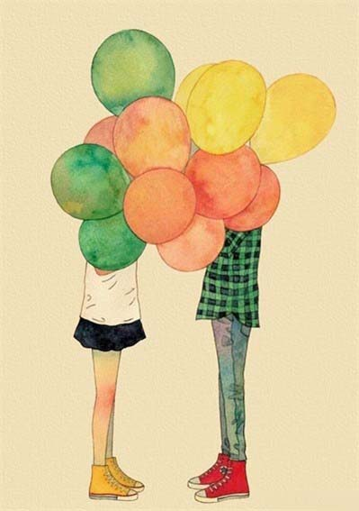

# ＜天璇＞那些年，我们错过的男孩

**每个女孩的生命里都曾经有这样一个男孩。他不是前男友，不是蓝颜知己，比朋友多一些回忆，比爱情少一些心跳。但是，在很久以后，我们也许不再会回忆起轰轰烈烈地爱过谁，也不再会想起痛彻心扉地为谁哭泣，却会永远记得，那个错过的男孩，站在校门口略显单薄的身影。 ** 

# 那些年，我们错过的男孩

## 文 / 吕晓燕 （大连外国语学院）

 

最近九把刀的小说和电影火得一塌糊涂。我始终没有看过。却在心底默默地想，也许所有的女孩们也都在轻轻问，那些曾经追过我们的男孩，他们如今还好么？

他可能出现在你还憧憬偶像剧的年纪——例如初中二年级——却离想象中的白马王子有些差距——也许个子不太高，也许皮肤不够白，也许唱歌不动听，也许打球不算帅。但是，却在谁都羞于说爱的时候，默默地用自己的方式守护你，哪怕知道你永远不会牵起他的手。

他可能比你大一两岁，会在放学时站在校门口张望，旁边停着中古的单车，肥肥大大的校服裤子下面是脏脏的球鞋。你会感到些许窘迫，周围还有朋友善意的调笑消遣，于是半低着头磨磨蹭蹭走过去然后一起回家——尽管他跟你明明是不同方向。

一路上并没有太多交谈，多数时候只是默默骑着单车。他偶尔讲个冷笑话，之后自己尴尬地笑笑。你抿着嘴，转过头看夕阳下他涨红的脸，觉得刚才的笑话 其实蛮好笑。你不知道，你突然的笑颜在他眼里是多美的风景。

后来，你记不得他的容貌，却单单记得当初那个冷笑话和那抹夕阳。

也许有那么某一天，中午突然下起了雨。你没带伞，正在担心，却发现楼下的他举着一把大大的伞抬头看着你。可是，你却不知怎么被莫名 的 情绪占据，执拗地不肯走进那把伞底。他愣了一下，接着随手把伞塞给身边的人，匆忙跟着你跑进雨里。雨水很冷，风很轻。

后来，在下雨天你还会想起，曾经有个人同你共过风雨。 

当然，他也会做些自以为浪漫却使你困扰的事情。比如校运会的时候，你突然听到广播里有人喊你的名字，希望你为他加油。你在熙攘的人群里又羞又恼，只好匆匆忙忙落荒而逃。第二天，你听说，长跑冠军在那天铩羽而归。你才发现，你的鼓励对于他是那么重要的事情。

后来，你想，如果重来一次，你一定会勇敢地站在跑道边对奔跑着的他喊一句——加油！

不知不觉一年转眼过去，你慢慢发现同隔壁班的某个男孩有好多共同话题。是不是喜欢你不确定，也不在意，只是欣喜。但是他却再次霸道地出现，偏要定义你和男孩之间模糊不明的友情。你恼怒，你指责，你觉得委屈。你忘记对他说了什么，只是后来明明经常“偶遇”的他仿佛消失在你的世界里。又一年之后的某天，你送完作业从老师的办公室出来，在校园里再次遇到了他。那时，他已经升入重点高中。他叫住你，只说了一句话就匆匆离开。

后来，听过好多甜言蜜语，你依旧觉得，当初的那句话最动听——他说：“我等你。”

可是，你终究没有去他所在的高中。你会偶尔想起他，想起曾经有个人执拗地保护你。你也会怪自己当初口不择言伤害了他，更钦佩他那时的勇气和执着，在你有了男友，渐渐开始懂爱的年纪。你以为一切云淡风轻的时候，曾经初中的女同学找到你，递给你一张纸条。那个同学给你讲述着他是怎么兜兜转转找到她，如何郑重地拜托她转递这张薄薄的纸。那个下午突然变得温暖起来。他在纸上留了电话号码。你发了短信问候他，他回道——知道你有了男友，不然我会继续追你。记得好好照顾自己，不是每个男人都单纯善良。

后来，在爱情里哭过痛过你才终于明白，原来当初他早就教过你这个道理：一个男人如果真的在乎你，翻遍全世界都会找到你。你也终于读懂他的话，不是每个男人都单纯善良，只有爱你，才会善待你。

后来的后来，你们隔了好久又有了联络，会在QQ上闲聊，他依旧关心你的近况，你也温润地回应。彼此都有了幸福的归属，他成了别人的骑士，你变作他人的公主。谁都不再提起当初的事情，像是有着某种默契。那些过往是时光罅隙里闪着光的水晶。

那年夏天，当你穿着得体的裙装，画着精致的妆容随着商场的扶梯缓缓下落，你看到入口处，他携女友满面笑容地走进来。他还是当年的摸样，依旧不够高大，不够帅气，却有了一个男人的成熟气魄。你从他身边走过的时候，他没曾认出你。你微微笑了，这样的擦肩而过证明你已从不起眼的毛毛虫蜕变成蝴蝶，也证明他终于离开原地走向了更温暖的去处。你对着他的背影，轻轻地说一句：“谢谢。”

谢谢你陪我经历过的每一场风雨；

谢谢你单车的印迹留在我曲曲折折的青春里；

谢谢你在我不美丽的年纪给了我无与伦比的回忆；

谢谢你的执着和勇敢教会我在追逐爱的旅途上永不轻言放弃。 

每个女孩的生命里都曾经有这样一个男孩。他不是前男友，不是蓝颜知己，比朋友多一些回忆，比爱情少一些心跳。但是，在很久以后，我们也许不再会回忆起轰轰烈烈地爱过谁，也不再会想起痛彻心扉地为谁哭泣，却会永远记得，那个错过的男孩，站在校门口略显单薄的身影。

我们这一生会有无数次错过，有的令人惋惜，有的让人心痛，有的使人庆幸，唯独这一次错过想起来没有遗憾，只有暖暖的感动和满满的欣喜。那么，就隔着重重岁月，对着当初站在校门口的他，用力地喊一句：“我很幸福，愿你安好！”

然后，我们也可以笑着挽起身边人的胳膊，向着更幸福的地方，慢慢走去。

——致那些年，我们错过的男孩。 

（采编：徐海星 ；责编：黄理罡）
