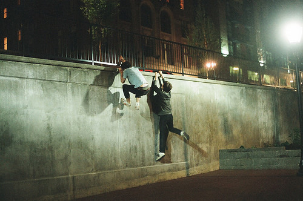

# ＜天璇＞那些鸡冻人心的趴踢

**趴踢之夜，会有少数打了鸡血的奔放青年，爬上窗户对面的屋顶。当他们发现坐在窗边的我，就会充满善意地嘶吼。有个男生大喊：“你叫什么名字？”上帝啊，这就是我来洛杉矶之后的第一次被搭讪。**

** **

# 那些鸡冻人心的趴踢

## 文/王非（University of Southern California）

美国人的业余活动少得可怜。他们没有KTV，因为版权问题。他们不习惯腐败，因为只有兔子们才蹲在一起啃蔬菜。好莱坞也没有卖啤酒和烧烤的小贩，让他们在烟熏缭绕中小酌怡情。所以，他们只有趴踢。 所谓趴踢，就是一群形同陌路的人借着酒精的力量，相见恨晚地聚在一起，相互之间说着“yeah” "right" "cool"之类的废话，而第二天又继续形同陌路的游戏。 之所以会形同陌路，不只是因为酒精让你觉得对一个人说话和对一棵树说话并无区别，而且因为趴踢一般在伸手不见五指的夜晚举行。你只能识别对方的性别，即使他是纯种的高加索白人。 

因为上帝和观音菩萨都认为，夜晚应该是大家睡觉的时候，所以某些没有趴踢细胞的少数民族同胞就深受负外部性之苦。外部性是经济学里一个非常重要的概念，而我们对这个概念的理解永远比那些美国人深刻。 但是美国人懂得如何把外部性内部化。刚来洛杉矶的时候，房间的窗户没有窗帘。因为在二楼，所以觉得无所谓。但是趴踢之夜，会有少数打了鸡血的奔放青年，爬上窗户对面的屋顶。当他们发现坐在窗边的我，就会充满善意地嘶吼。有个男生大喊：“你叫什么名字？”上帝啊，这就是我来洛杉矶之后的第一次被搭讪。我很高兴他们把我看成这个趴踢的一员，但我实在不想动嘴说出我的名字，因为我想动的是手指。 我曾经不止一次地想过，在趴踢结束的那个早晨，在我家门口那块布满狗的排泄物的草坪上，公放第十套广播体操的音乐，最好配上低音炮。并且大喊： “Get up, Trojans! 来欣赏洛杉矶绚丽的朝阳！”虽然贵校的口号其实是：Fight on, Trojans! 但是他们都Fight在了趴踢上。 我其实不是最惨的受害者。最惨的大概是我们房东的姐姐，一个墨西哥的中年妇女。她住在隔壁的房子里，并且出租该房子的其他房间。她曾经很自豪地告诉我，她的房子里决不允许趴踢的存在。但她没有意识到，最恐怖的莫过于被一堆开趴踢的动物包围，却不能对他们说：滚出我的房子！ 

趴踢的形式也在与时俱进。从一开始的嘶吼和上房，到后来的公放音乐，再到后来他们拥有了一支自己的乐队。你能相信么？那支乐队由提琴手和小号手组成，而主唱却是雷帝嘎嘎。没有能比这个更鸡冻人心的了。我真想扑向他们，抢下话筒，教会他们“爱情买卖”。不，其实“忐忑”更简单一些，因为他们不会中文。 在我行将停笔的时候，洛杉矶警局的直升机飞过上空，驱散了那些趴踢的动物们。墨西哥大妈，我向你致敬。因为你的忍无可忍，我也享受到了正外部性的眷顾。 
