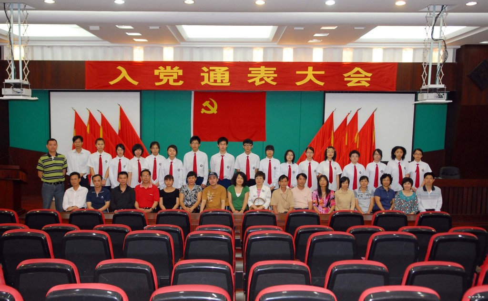

# ＜天璇＞重庆的可能：兼记一次入党

**我告诉他们，在重庆吃火锅，就像我现在德国学哲学，地道而诱惑；不仅有内心情感的归依之人，也有政治外貌派的偶像人物坐镇，政治和生活表里如一；生在沱江水边，偏爱群山的轮廓，而重庆的位置让我可以依山傍水，何乐不为。这些美好的愿景都是我擅自勾勒的，而当我毕业归来，关于政治和感情生活表里如一的愿景却注定要落空了。** 

# 重庆的可能：兼记一次入党

## 文/ 余蜡树 （Uni Würzburg）

 

高中三年级的最后一个学期，我和一批同学成为了预备党员，按几年的党龄算来已经不是新人。而进入大学之后，由于自由发展的气氛弥漫了整个校园，我的四年大学生活的确是按着独立自由之精神在发展个人的爱好。对于政治的关心时断时续，总是不入门道，反而是文学院的生活使我不食人间烟火之气逐渐高涨。幸而闲暇之余玩起了微博，是一个获取各类信息的闸门。而只有当今天，内心才逐渐有了这个念想：关心政治，其实才能够让生活更美好。

虽身在国境以北，却因家在西南，关注的视线从来没有离开过川渝两地。在成都读书四年，而心爱的人在重庆，即使远天远地的在国外，自己也是决定了毕业以后要回重庆发展的，大有为了爱情而奔赴山城的嚣张气焰。可是今天醒来这新闻头条已然让我的热情少了一半。那就是前些年口碑极好威望极高的薄熙来离职重庆的消息。

以前朋友们疑惑我为何毕业回国非要到重庆生活，我告诉他们，在重庆吃火锅，就像我现在德国学哲学，地道而诱惑；不仅有内心情感的归依之人，也有政治外貌派的偶像人物坐镇，政治和生活表里如一；生在沱江水边，偏爱群山的轮廓，而重庆的位置让我可以依山傍水，何乐不为。这些美好的愿景都是我擅自勾勒的，而当我毕业归来，关于政治和感情生活表里如一的愿景却注定要落空了。

临近归国，我的未来之城重庆有如此变化，不免内心一阵惊慌。这种内心的紧迫感的确是头一次升上心头。唯有对生命的珍惜才有对命若琴弦的领悟，而唯有对政治的关注才有对生活如履薄冰的提前体验。还记得小学或者更小的时候，跟爸妈第一次来重庆，那个时候留着小男生短发的我，穿着碎花的连衣裙，红色小皮鞋，童年的盛夏因为有父母的臂膀为我遮挡，又有时光的距离为我吹凉，那一年童年的夏天并不是太炎热。那是我对重庆的最初印象。父亲在这座城市学医，学成回乡，默默的为家乡的医疗卫生事业做着自己的贡献。正直壮年因身患肝病，返回这座自己念念不舍的城市治疗，修养康复一趟就是一年半，也失去了自己在事业上平步青云的绝好时机。虽然在事业上因为身体原因没有抓住升职的机会，但是仍然和母亲两人互相扶持鼓励，康复之后一如既往的在原有岗位上辛勤工作，又终于在我刚刚进入学龄阶段，把我送进了县一级条件更好的学校读书。转眼，高中三年也结束了。

在此之前，我已经是预备党员的身份，每次向学校组织交那一块钱的党费的时候，内心都充满了一种虔诚。我至今仍然清楚的记得，高三下学期刚开学，县委组织部的人员到我的高中对我们这一批申请入党的年轻学生进行政治审查。无非是一些谈话。对于高中生来说，还是相当神秘而又神圣的。当然，谁都知道，党员身份在如今，在高考都可能占优势，进入大学更容易获得一些锻炼的机会，不过那时候的考虑就到此为止，毕竟还是一个懵懂无知的高中生，还没有联想到工作以后的各类云云。 

不过，我在这里想要回忆和记录的，却是一个至今都无比虔诚的关于一个政党、一个政治选择的心理活动。我还记得有四五个中年的“领导”把我们领进学校的会议室，一对一的坐下来摆谈，叫我们不用紧张，就随便了解一下我们的学习和思想动向。与我摆谈的，是一位中年女性，慈祥而面带微笑。这一切很容易消解我无名的紧张情绪，更让我都没有想到的，我竟然对她敞开了心扉：当时是怎样一种童真的理想，让人如此虔诚。

不过这一切的关于“入党”这个问题的起因，我都只围绕我的父亲。小学的时候，毕业典礼上，我的班主任老师给我写了一句留言：为你爸爸创造永恒的辉煌。班主任老师那时候，也不过是三十多岁的年龄，心中也是有理想的，不然不会教出那一帮富有理想和内心坚持理想的少年，我自信我就是其中的一员。

而那天我对这位来自组织部的女性说的，便是刚刚开始但是后来被卫生部自己宣布的进行了三十年却宣告失败的医疗卫生改革当中为数不多的保持到现在获得许多好评且造福“三农”的“农村医疗卫生改革”。关于农民的看病难问题，我曾经深有体会，就在我一次路过父亲上班的医院门口，看见那些排队的佝偻着身躯的妇人，或者眼神迷茫但是又充满希望的农夫，在拿着医保卡报销了一笔连自己都没有想到的账目之后脸上露出的小小的欣喜。

这种欣喜是纯净的，我想这就是我申请入党那一刻的简单心理一样的情形。就是如此纯净，一点小小的意外，更多的希望并不被外在的环境所掺杂。并且为了弥补我言谈之中飘散的思维，我只好重申一句话，这句话直到今天我都记得：我的人生偶像是我的父亲，当然也就包括他的政治选择以及在从事的行业里他的所作所为。所以不管以后，将来，我现在选择的政治倾向，就是我此刻看到的状况使我下定决心的，并永不改变。因为我内心有一个完美的偶像做着我的表率，在自己的行业上做着一个党员应该做的事情，为人民服务。我至今都无比热爱这句话，并从内心深处认为这是一句善良而可能的誓言，也有更多我们都不认识的人在各自的每分每秒里实践着。即使世界上所有人都不把这句话和这种理想当真，但是我会，于是我会去做，于是这就是一个事实。我就没有违背我当初那一刻纯净的动机。

后来我的高考把我送到了成都读书，在去报到之前和父母又去了重庆，路过此地，我们的目的地是三峡，被三峡大坝水涨船高的三峡。还记得那一年的重庆，异常炎热，我一个人顶着烈日在红岩村，歌乐山参观。按理说暑假应该有很多游客，可是我想多了，整个纪念馆，那天中午，的的确确只有我一个人，拿着个笔记本，边走边看，边擦汗。那一次是我第一次成年以后到重庆，看到了更多的关于重庆历史的印记。就因为这些遗迹，残垣断壁那几年就掺杂在山城的高楼林立中，有一种历史的孤傲之感，凸现出来的是这座城市对历史的谦卑从而洋溢着的自信。就因为较场口，新华日报旧址，或者路边随处的一个纪念碑，我感言重庆的真实率性，于是我享受着盛夏的挥汗如雨，真实的美丽。

大学几年，和重庆的交集不多，除了有个室友是典型的重庆美女让我耳濡目染以外，毕业前夕去过一次重庆的经历，为我的大学生涯又横添一笔。几年之间，重庆变化特别明显，而成渝两地暗地里较劲的势头更是愈演愈烈。常常有“成都向右，重庆向左”，“川渝不两立”的口号等等，在经济文化上都要一争高下。更是不能够在成都的出租车司机面前提重庆，否则定然一顿鄙夷。而重庆美女的豪放率真又瞬间让春熙路的张曼玉们黯然失色。一部《三峡好人》又让刚刚从四川分离出去的重庆经历了低调而隐忍的疼痛，散发出文艺气氛浓厚的人性滋味。冷幽默的《疯狂的石头》和一部反思的《日照重庆》，终被《观音山》的光芒遮盖，而此时《二十四城》的余味犹在。更让我等文学院资深女生津津乐道的更是川大资深风流老教授与重庆旅欧美女作家某的前尘往事。那些个文艺范的捕风捉影，以及去岁我在北大聆听这位操一口重庆普通话的率真作家的交流，让我对这两座城市的爱重新浇灌起来。

让我对一座城市承认，是他不经意间流露的对待历史的态度；而让我加强对一座城市的好感，一定是这座城市在自我认知之后的全面定位，以及这儿的人们。不能跳出俗套的我，在大学毕业之后选择了走出蜀地。一直认为蜀人要走出这儿才能够真正找到一片属于自己的天空。李白是如此，苏轼如此，邓小平如此。而只有当此时，端坐欧亚大陆另一端，头枕《有个半岛叫欧洲》，捧读《东坡志林》，说着尼采曾经的口头禅，听着瓦格纳的弦音，我只有在这儿研读Kant的时候才能够回忆起火锅的味道，也只有在莱茵河的柔波里想起锦江的波涛，以及阿尔卑斯山云无心以出岫的时候，总让我魂牵梦绕峨眉山月半轮秋，影入平羌江水流。 

是的，只有远离家乡以后才可以唤起对家乡的另一种更贴近的关照。正如当年深处成都平原我读着雨果全集，写着荷尔德林诗歌读后感，而如今这异常寒冷的欧陆春天，我的笔端频频写出关于重庆如何才可以建成中国内陆枢纽城市的全球经济化关照之文，以及早在宋代时候蜀人是如何与中央朝廷斡旋从而树立自己的地位并保有大宋疆土完整的历史评点。

寒夜无边，魂梦忽然来到灯火通明的长江大桥。人可能两次经过同一条长江，只是在这桥上的风景和看风景的人，都变了。 

（采编自投稿邮箱；责编：应鹏华）

 
