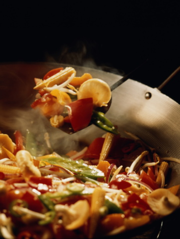
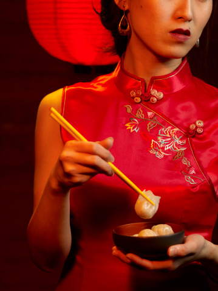

# ＜天璇＞量中华之才力，结与国之欢心

**咳！其实，还有多少菜，我根本就懒得费心八力拿出来讨好洋大人呢。我有个习惯，每当想念一位亲人，就动手做一道他教会我的菜，慢慢地吃完，算是寄托一点牵挂。**  

# 量中华之才力，结与国之欢心

## 文/朱明哲（巴黎政治大学）

 

前些天一位师妹问我，她要到外国朋友家给一家子人做饭展示中国佳肴，选什么菜好。我告诉她西红柿炒鸡蛋必选，可以考虑红烧排骨，或者红烧茄子什么的。师妹觉得这太不足以展示自己的实力了，决定只接受西红柿炒鸡蛋的建议，再做个重庆烤鱼、糖醋排骨、莲子银耳羹。昨天，她告诉我，朋友一家人嫌烤鱼太辣一点儿没动，嫌莲子银耳羹恶心第二天全倒了，糖醋排骨倒是吃完了，就是让女主人把厨房擦了三遍。

我笑得都要岔气了。

她犯的错在于过高地估计了欧洲同学们对食品的开放程度。往往是在吃喝上，人最容易成为一个民族主义者。就在我前几天贴了一篇旧作批评北京食肆大不如前时，还有人说这人怎么会喜欢吃德国菜。所以，我们觉得中餐那么好吃无比好吃天下第一其他国家的饮食都不如饲料的时候，世界上还有为数不少的人觉得这简直是失心风的人才会吃的东西。

在巴黎的八个月我倒是也没少给我的外国同学做饭，每次都是一扫而空。其中中餐总计有红烧肉、东坡肉、芋头扣肉、汆丸子、珍珠丸子、红烧小牛肉、番茄牛肉、酱牛肉、汾酒牛肉、八珍白菜卷、油焖对虾、咸水鸡、香菇鸡饭、照烧鸡腿、红烧茄子、西红柿炒鸡蛋、卤蛋、芹菜拌豆腐、炒饭、抓饭。可以说都是些家常菜。但我敢说，如果单让他们吃这些，很多人还是会无法接受。比如说有人不吃肥肉。比如说有人不吃鸡皮。也比如说有人会嫌红烧茄子里的蒜太生了。我做饭给别人吃，一定是见不得盘子里留鸡皮和肥肉什么的。要吃就都给我吃了，要不就别吃。

但另一方面，一个人要是无法欣赏中国的美食，是多么大的一个损失啊！就像无法欣赏德国香肠和熏肉一样，生无可恋嘛。他们又都是我的朋友，我强烈地感觉到有一种道德义务要把他们引导到接受中国美食的路上来。

循循善诱是第一步。我记得第一次带咸水鸡到学校吃，同学们在闻到花椒味儿的时候都震惊了。于是我第二天又给他们带了一些。过了一周，我下猛料酱了些牛肉，切成薄片，用小饭盒装了，一人一饭盒打包带回家。他们还饭盒的时候，纷纷表示牛肉异香扑鼻，好吃无比。于是这大厨的名号算是打响了。有了这个名头，坐等同学找我带他们去中国餐厅就好，顺理成章。我把他们带到了另一个朋友推荐的餐厅，那其实也是我在巴黎吃到的第一家中餐厅……在法国吃中餐还不如去吃酸菜肘子和英国国菜呢。那天晚上，在中餐的感召下，几乎是我这个博士项目全员出席。餐厅都快坐不下了。印象中，我们把菜谱上所有的菜都点了一遍，个别的还点了两遍。酒饱饭足后，大家问我这餐厅好不好吃。我只能回答“还算可以一吃。但勾芡过浓油下得过重，仍是等外品”。

想象一下这帮鬼子终于知道为什么国外中餐不象中餐的秘密时兴奋的心情吧。

我继续说“我下厨，不勾芡，少放油，口感应当比这清爽些。”

这时再不上钩的话就没道理了。要知道欧洲人从小被所谓健康饮食环保饮食荼毒，食素者不在少数，对浓油厚芡的菜色实在是敬而远之。然而有时候，不得不说还是心理作用。整块红烧肉上面的肥肉不愿吃，可你怎么吃肉丸子的时候就不想想我那肉丸子也是用同样的五花肉绞的呢？还有那个挪威人，我去你家帮你炸牛肉丸子的时候，把用黄油煎好的洋葱混入牛肉馅儿里，然后再下黄油里炸。那天晚上咱们用了多少黄油你知道么？还有青豆泥里豪迈地倒入的奶油。这热量和动物脂肪什么的能比红烧肉少？能比一根鸡腿上的鸡皮要少？我怎么不相信呢？更别说意大利粉煮出来的时候使劲儿往里浇的橄榄油了。

即便如此，该循循善诱的地方还是要循循善诱。于是我给他们做了东坡肉以后，详细讲解了制作过程：我把肉放在锅里炖上三个小时就是为了脂肪充分析出，然后把肉汁放到冰箱里，让脂肪凝结在表面方便撇去，再把肉汁加热后倒回锅里，放到更大的锅里隔水蒸，所以已经没什么脂肪在肉里了，云云。记住一点，任何程序加上为了脂肪充分析出这个目的，一下子就变得崇高起来了。比如说照烧鸡腿，不放油直接煎，也是为了用鸡油加热而不用添加多余的油。所以那天晚上，七厘米见方的五花肉，就连平常只吃点儿蔬菜沙拉的女生，也吃了一整块儿。研究法国宪法的莱奥吃了三块。

大哥，那是我留着下星期吃的……

吃照烧鸡腿的那个晚上，尽管第一次见到剔骨的鸡腿颇为眩晕，巴西女孩儿还是习惯性地把鸡皮给切下来了。这时候，就要利用长期培养起来的信誉了。同学们，吃朋友做的饭，不仅仅是对厨艺的肯定，也是对人品的肯定。如果有个人行事龌龊，你是断然不会请他到家里做饭的。而我跟这帮办公室同僚们，实在已经是关系太好了。于是，在她准备把鸡皮扒拉到一边的时候，我盯着她一字一顿地说：“你看，我煎的时候没有放油，就是为了让它脂肪少一些。然后所有的精华味道都在这皮里面。你要是不吃，我觉得这个鸡就压根没必要吃了。”

希望外国同学接受中餐，一个前置工作其实是学会欣赏别的国家的菜，甚至做得走样的中餐。黎巴嫩菜对酸奶和茄子的伟大应用、法国菜的品类丰富、巴西菜里的黑豆味道、刚果菜里浓郁精致的酱料，都让我一时惊艳。更不用说我最爱的香肠……啊，不是，是最爱的德国熏肉，夏末刚完成的熏肉，散发着松木和花朵的芬芳，肉的鲜香和熏制过程中产生的味道结合在一起。再配上酸白菜，简直妙极了！对本民族美食最佳的推广者，一定是世界主义者。他对别的民族的成果持赞美的态度，也对别人的习惯满怀敬意。我穆斯林朋友很多，为此我还专门买了一个锅，用来做清真食品。

噢，对了，刚才说到炖肉酱肉撇出来的油。那可是好东西不能浪费。怎么办？拌在剩饭里，炒了给他们吃。那才香呢！至于烧茄子，油肯定是很多的。但多等一会儿，茄子里的油又都出来了啊，所以你们挑茄子吃就好了嘛，你们自己非要用面包把盘子里的油蘸了吃完就不管我事儿了。

当然了，忽悠他们吃下那么多动物脂肪，还是要出一些安民告示。我的办法很简单：找一天穿一件低领的单衣，挽起袖子，中午吃饭的时候拿出饭盒，里面有二两饭、四五块红烧肉、一个酱蹄子、一堆油汪汪的炒萝卜丝，当着他们的面，露着锁骨和几乎没有脂肪的小臂，吭哧吭哧地把这盒东西吃完。潜移默化的力量，大家懂得。有一次一个女孩儿问我“你吃那么多还不胖”。我只能意味深长地说：“其实我做的饭里面，油已经不多了。”

不过话说回来，我做的饭大概真的不让人发福。曾经有个做模特的朋友，从外省跑到巴黎，告诉我她节食一个月，过来找我就是要吃饭的，就是做好了胖上四斤再回去的准备的。结果那几天我们胡吃海喝，从早上就吃牛排什么的。临走了称体重，一点儿没见长。

咳！其实，还有多少菜，我根本就懒得费心八力拿出来讨好洋大人呢。我有个习惯，每当想念一位亲人，就动手做一道他教会我的菜，慢慢地吃完，算是寄托一点牵挂。

比如说爷爷教会我的腐乳肉。五花肉切大块汆去血水，改刀成片，码在盆里，浇上花雕花椒红方八角葱姜片调成的汁，上屉蒸透。

又比如说奶奶教会我的拉条子。和面饧好拉成长条大锅滚水煮熟，捞到碗里浇上臊子和老醋。吃不完的第二天回锅炒，叫炮仗。

比如说外婆教会我的葱烧鸭。肥鸭子剁块炸成金黄，锅内留底油下葱炸黄，放入鸭子，再加入酱油黄酒和清汤焖透。

还比如说老爸教的意大利粉调料。牛肉粗粗地剁好，炒锅爆香蒜蓉和洋葱末，再下牛肉炒到白色，入白葡萄酒，下西红柿和盐，西红柿出水以后放进萝卜小火炖三小时。

至于妈妈……那还用说吗？从8岁学会西红柿炒鸡蛋吃了一个星期，经过荷包蛋、蛋炒饭、盐水菜心、蒜蓉菜心、醋熘白菜、小葱拌豆腐、清蒸河鱼、咸水鸡等等，到12岁做红烧肉被糖色烫得满手包，中间经过豉汁排骨、红烧排骨、香菇鸡饭、叫化鸡、凉拌鸡丝等等，再到15岁第一次自己配出酱牛肉的卤汁并开始煲汤，到北京以后学会的炸酱面、最后到出国前集训葱油饼韭菜盒子，哪一次不是在她的关怀下成长？甚至那些看上去多少有炫耀成分的菜比如说白菜八珍卷，比如八宝鸭，虽然不是母亲手传，却是为了照顾在病榻上的她而学。

我的母亲，会在我吃得心满意足时说“将来你要找个不会做饭的媳妇儿怎么办”，而我只能回答“你给培训两个月呗”。

她会在我舔着嘴唇说奶奶做的拉条子好吃时说“我也会做，就是懒得伺候你”。

她会在我说我用她寄来的炸酱拌意大利面吃的时候说“啊？能好吃吗？我还以为你自己擀呢。”

她年轻时为了这个家放弃了艺术方面的梦而选择当职业妇女和灶台能手的结合体。我做的每一道菜，我吃的每一口饭，甚至我活着的每一个瞬间，都在见证着她的伟大，并向她的牺牲和付出致敬。

 

（采编：安镜轩；责编：安镜轩）

 
