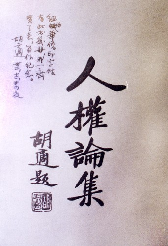

# ＜天璇＞陌生的同齡人

**他們，是你我的同齡人，但是你我並不見得都瞭解他們。他們是一群陌生的同齡人，他們抑或被歷史的風塵所掩蓋，抑或被政治的強力所抹殺，抑或因為你我的reluctance去發見他們的故事，而在故紙堆里靜默。如果你真正地想見有這麼一個，一群同齡人，在你的身邊，你能不奮發么？你還會感到寂寥么？**  

# 陌生的同齡人

## 文/江左夷吾（中山大学）

 

故事的源起算是2008年初，那時節還沒有《北斗》，西藏啦地震啦，於是乎自以為自己可以擔當一點公民的義務，做一些啓蒙的事功，其志也嘐嘐然，可謂狂簡之至，自然猖狂得很。我記得那時候校內上很多朋友就憤而提筆，普及一些最基本的常識，翻來覆去的大白話，當然，也在真誠地和同齡人辯論。

我自己是個極耽懶的人，覺得自己獻身去挨駡，太無意思，還不如從歷史里挖出個什麽東西來，好比火影里的召喚獸，你們要練找人家練去，我自清淨。基於這種想法，自然挖出來的言語的主人越大牌越好，“扛紅旗反紅旗”那是最佳。好比說，尾獸化了，除非你是三代雷影，硬殼蟑螂，否則大可以直接踩死。不特此也，那些百年前的中國知識人，那些二十幾歲的名教授，多是“兩腳踏中西文化，一心評宇宙文章”的靈魂，在他們面前，我們不得不承認我們有inherent defects，不僅僅在學養和見識上，更在於靈魂上。畢竟這六十年的國進民退，有教養的階層，被徹底消滅了。誠如资中筠先生所言，比起那一輩中國知識人，我們都是野蠻人。如此這般，我當時發的日誌，自然分享的又多，又沒幾個來留評論的，影級忍者畢竟沒那麼多。我是以頗為自得。

在此種方法論下，我自然著眼點就在於民國的那些大家們對國民政府的批評，理性、溫和、建設性同時又毫不留情。誠可謂“望之儼然，即之也溫，聽其言也厲”，溫潤君子操，狂狷名士行。胡適之先生有言：“讀一個人的書，也算是做作者的學生了。”“余讀孔氏書，想見其為人”，那很自然的，我接觸得愈廣，讀背得愈多，即便高山仰止，卻也不免“雖不能急，吾心嚮往之”了。不特此也，胡適之先生也並沒有像08年做WT的我們那樣，在短短兩年內就經歷了激情，彷徨，玩世的輪回，胡先生是用自己的生命去踐行他的主義，終生以之，一世帶著他溫潤的微笑，微笑著的異端，一個無可救藥的樂觀主義者（incurable optimist）。

隨之問題就來了，網絡上的資料零零散散，也未經校對，大多還是那種“二手史料”，一些中青年學人對那個時代的研究，我肯定是不痛快的。好比一大盤土豆燒牛肉上來，僅瞧見些肉丁肉末點綴調味，這怎麼夠意思呢？但是麻煩的又來了，這些大家的集子，出版的本來就少，在大陸還免不得被切成太監，混雜些無關痛癢的文藝，胡適之先生一不留神就成“胡一半”了，真不敢看。再者，大陸出的本子的註釋很後面的citation我個人以為做得很不好，我想看原始史料的時候很多書目找不到。那麼，就只能從台北郵購，這也就是在海外的好處了，從台北郵購到美國，雖說要繳兩倍於書價的郵費，似乎不當用“聊勝於無”這樣消極的話，但也確是彌足珍貴了。

關於這些集子文章的摘抄同讀書筆記做多了，我就又起了一個好玩的想法，這些大家是你我的同齡人呀。胡適之先生就是至顯的例子，先生生於1891年12月，正是19世紀的清國90后。那一代90后，是一代有世界眼光的中國人，站著中西文明的匯合點，現代文明的起點和政治道德的基點。梁任公倡《少年中國》，李大釗言“青年不死”，不都是對那一輩90后的啓蒙么？胡先生1910年18歲負笈美利堅，不也與今日之留洋潮相類么？

屈指算來，我自己也是17歲自己從廣州中山大學退學愣頭愣腦跑到美國來，那時節什麽都沒搞明白，所有的防身之具只是一個懵懵懂懂的美國夢，一點點用功的習慣，和一點點懷疑的傾向。這是一個非常inspiring的analogy喲，因為大家想想，胡適之先生不過一米七零左右的個頭（我一米九零），在紐英倫呆了整整七年，本科完了進研究院，雖然沒拿博士頭銜就回國了，但是到處去給洋人做講演，給洋報紙寫文章，還得了論述Browning徵文的大獎，還賺到了好幾個美國女友。要知道，那個時節，可是沒有新東方學校的。

留美的朋友也都知道，這一個世紀以來，其實美國是並沒有多大變化的，尤其是東部和中部，很多生活，該是怎麼樣，還是怎麼樣。最淺顯的一點，我自己常去chipotle啃burrito，米飯自然是原因之一，而這點在胡先生的書信里也有說的，因為胡先生有段時間住的地方的房東家的廚娘有南美血統，常烹飪南美系的食品，因為同是以米飯為主，和我們今天大多數朋友一樣懶的胡先生，自然再樂意不過來享受房東家的伙食了。

經常看到有朋友在校內上抱怨美國學生不用功云云，胡先生也會抱怨美國同學的，“美國大學生之大多數皆不讀書，不能文，談吐鄙陋，而思想固隘，其真可與言者，殊寥寥不可多得。”摘自《留學日記》。我猜大概是美國校園的啤酒文化讓少年老成的胡先生覺得幼稚可笑吧。

學習生活呢？自然也差不多的。哈哈，差不多先生。胡先生那段在船上打牌的日誌很多朋友都拿來作玩笑看，可見大家還是曉得先生溫潤的性情的。張愛玲女士寫她姑姑看到胡先生戰後下船拍的照片，刊載在報紙上的：

“我姑姑和我母親跟胡適先生同桌打過牌。戰後報上登著胡適回國的照片，不記得是下飛機還是下船，笑容滿面，笑得像個貓臉的小孩，打著個大圓點的蝴蝶式領結，她看著笑了起來說，‘胡適之這樣年輕！’”

這又何其可愛呀！呀，說得遠了，閒言少表，大家想想，來美國留學常常碰到的苦痛情狀大概莫過於在除夕夜、大年初一備期中考或期末考了吧？我影響里，每每到這種時候，校內網上留學的朋友，尤其是女孩子，就會大肆刷屏，哀怨、吐槽、詛咒、神神叨叨，無奇不有。那我就想了，胡適之先生那時候來留學，肯定也是要碰到同樣情形的，他又會作何反應呢。我去查了《留學日記》，發現 1911年1月30日--胡適先生《留學日記》第一日，正是農曆的新年。當天就是期末考第一日。適之先生前一天晚上的除夕夜寫了一首詩自況： “永夜寒如故，朝來歲已更。層冰埋大道，積雪壓孤城。往事潮心上，奇書照眼明。可憐逢令節，辛苦尚爭名。”

那時候胡先生剛剛滿二十歲才一個多月，第二天一早第一門考生物，熟悉胡先生的故事的朋友都知道，胡先生學農學，苦痛不堪，那想必他考生物是絕對快樂不起來的。但是請大家細細看看這首詩：“永夜寒如故，朝來歲已更”，紐約州的绮色佳肯定是暖和不起來的，別忘了因為時差，中午一過，地球另一面已是新年。“層冰埋大道，積雪壓孤城。”這種情形想必在college village的朋友們都不會陌生，無需我贅言。“往事潮心上，奇書照眼明。”哈哈，一面想家，一面複習。“可憐逢令節，辛苦尚爭名。”可憐我自己過年了，除夕夜，還要勉力考個好名次。

好玩吧？子曰：“不學詩，無以言。”真是有至理。另請注意一點，胡先生這寫的都是日記，就好比說發了篇校內日誌，但是勾選“僅自己可見”。絕不是什麽張揚的事情，只是二十歲的胡先生私人的自修。每次想起這首詩我都免不住想，我自己現在二十有一，比那時候的胡先生還大一歲，我奈何寫不出這種情調呢？或者說，奈何我就沒有這種修養呢？我們有網絡有書本有一切第三次工業革命后的瑰麗神奇的玩意，但是我們難有二十歲的胡先生的charm。那該如何是好呢？唯有勉力。

胡先生二十一歲時候作的一萬兩千字的長文《非留學篇》，天下聞名，我就不在這裡討論了，我自己也二十一歲。越討論越推人惶愧。

那就朝前看吧，看看胡先生二十二歲時候在做什麽，這樣我最起碼還有半年的喘息。哦，胡先生二十二歲的時候在讀Robert Browning（白朗寧）！而且胡先生在日記里，也就是“儘自己可見”的校內日誌里，試著翻譯Browning的佳句。

這是Browning的原詩: One who never turned his back but marched breast forward. Never doubted clouds would break. Never dreamed, though right were worsted, wrong would triumph. Held we fall to rise, are buffled to fight better. Sleep to wake.

胡先生呢，用楚辭體來翻譯！

“吾生惟知猛進兮，未嘗卻顧而狐疑。見沉霾之蔽日兮，信雲開終有時。知行善或不見報兮，未聞惡而可為。雖三北何其傷兮，待一戰之雪恥。吾寐以復醒兮，亦再蹶起以再起。”

由此可見，胡先生是真正地在留學了。

當然，胡先生還談戀愛，寫情詩，一弄還弄了個深情五十年。他會糾結該不該進女生宿舍去約女孩子出來，他還會老老實實地在日記里交代：“I must take advantage of being in this country and being at a co-educational university to get to know some educated women. My cold and aloof disposition might yet benefit from feminine influence....”(Hu Shih, 23 years old)

23歲的他會給女孩子寫這樣的信：Perhaps you do not realize how much I have been a recipient of in this friendship. Your conversation always stimulates serious thinking. “Stimulate” is not the proper word-“inspire” is the right word. And I believe that one of the most valuable fruits of friendship is to be found in this kind of mutual inspiration of thoughts. Don't you think so?

當然，因為篇幅所限，這裡就不多列了。如果你想找更多的關於胡先生的詩啦，翻譯啦，情書啦，可以到我的新浪微博[@江左夷吾Douglas ](http://weibo.com/douglaszjiang)上檢索，可以搜“胡適”（勞煩大家注意要用正體中文輸入），或者“Hu”，或者看話題#胡適的信#和#胡適的詩#。很動人的。

真是不好意思，拉拉雜雜居然瞎寫了這麼多，做個概況吧。胡適之先生只是一個例子，他代表的是他那一代的留學生，也大都是17、18、19歲出來的，留美讀本科。他們，是你我的同齡人，但是你我並不見得都瞭解他們。他們是一群陌生的同齡人，他們抑或被歷史的風塵所掩蓋，抑或被政治的強力所抹殺，抑或因為你我的reluctance去發見他們的故事，而在故紙堆里靜默。如果你真正地想見有這麼一個，一群同齡人，在你的身邊，你能不奮發么？你還會感到寂寥么？

高中語文課文里收了羅曼羅蘭的《名人傳》序，《語文讀本》里有托爾斯泰和米開朗琪羅，當然也許有朋友因為地方教材或者新課改沒有讀過，但是我這屆（2007年高考）人教版應該還是有印象的。在序言里，羅曼羅蘭道：

“人生是艱苦的。在不甘於平庸凡俗的人，那是一場無日無之的鬥爭，往往是悲慘沒有光華沒有幸福的，在孤獨與靜寂中展開的鬥爭。他們只能依靠自己；可是有時連最強的人都不免在苦難中蹉跌。他們求助，求一個朋友。 為了援助他們，我才在他們周圍集合一般英雄的友人，一般為了善而受苦的偉大的心靈。”

由是作者聲言：「即使他們不曾把濃密的黑暗一掃而空，至少他們在一閃之下已給我們指點了大路。跟著他們走罷，跟著那些散在各個國家、各個時代、孤獨奮鬥的人走罷。讓我們來摧毀時間的阻隔，使英雄的種族再生。」

爲什麽呢？羅曼羅蘭collaborate了。

「所以不幸的人啊！切勿過於怨歎，人類中最優秀的和你們同在。汲取他們的勇氣做我們的養料罷；倘使我們太弱，就把我們的頭枕在他們膝上休息一會罷。他們會安慰我們。在這些神聖的心靈中，有一股清明的力和強烈的慈愛，像激流一般飛湧出來。」

“人類中最優秀的和你們同在”，何其marvelous的statement，傅雷先生的翻譯呀。由此推之，胡先生這樣“陌生的同齡人”不也與我們同在么？Come on, right? 子曰：「不憤，不啟；不悱，不發。舉一隅不以三隅返，則不復也。」

結束前再補遺幾句話吧，很多朋友也許不知道，一度在兩岸流行的臺灣校園民謠《蘭花草》一曲的歌詞改編自胡適之先生1922年發表在《新青年》上的詩，原詩是:「我從山中來，帶著蘭花草。種在小圓中，希望花開好。一日看三回，看得花時過。急壞看花人，苞也無一個。」溫潤君子風也。大家再想想，
