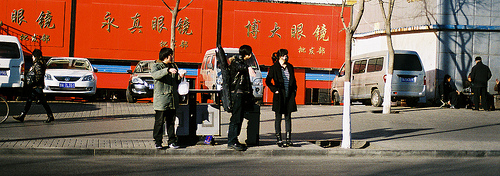
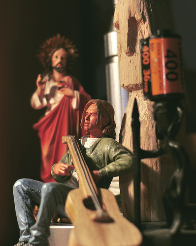

# ＜天璇＞青春说谎的日子

**在我青春说谎的日子里，有个姑娘走进我的世界，让我在阳光下招摇，熠熠生辉。她可知道，我只在她的面前才会如此闪亮。**  

# 青春说谎的日子

## 文/刘兆鹏（河北师范大学）

 

（一） 

楔子：忽然青春已逝去

这个夏天是场漫长的旅行。夏天又快结束了。每个夏天都让我感觉异常漫长，无论痛苦抑或幸福。我总是牢记着每个发生在夏天的故事，无论怎么强行忘记，它总会在某个深夜或雨天的午后瞬间袭来，让我深陷回忆中，无法自拔。

我们在夏末入学，在夏初毕业。每个夏天既是开始，又是结束；既是希望，又是失望；既是相逢，又是别离。

我的大学也这么快就结束了，昨天刚背着行李入学，刚遇到我的她，刚傻逼呵呵地入学生会，刚还在宿舍打扑克，刚还在青苹果餐厅吃饭抢她的筷子，刚还在世纪联华、金马市场闲逛，刚还在图书馆看书打CS，刚还在破旧的操场打球，刚还在教学楼前教她打乒乓球，刚还在焦头烂额地找教室准备考试，刚还在听考研的讲座，刚还在为扯淡的论文发愁。一眨眼就毕业一个多月了，忽然四年已逝去。

让我痛苦的不是毕业，而是别离，更为痛苦的是我在毕业前失恋了。

爱情她是个难题，让人目眩神迷，她不曾真的离去，她始终在我的心里。我对她仍有爱意，我对自己无能为力。对过去念念不忘，暂且不管这种态度有没有出息，它只会让你更加与现实保持距离。我时常在空旷的街上迎着风，想忘了她。认识她就好像认识了整个世界，离开她时，就意味着离开了整个世界。当我对所有的事情厌倦的时候，我就会想起她，想到她还在世界某个地方生活着，我就愿意忍受一切，她的存在对我很重要。

在我青春说谎的日子里，有个姑娘走进我的世界，让我在阳光下招摇，熠熠生辉。她可知道，我只在她的面前才会如此闪亮。

当她离开时，我感觉浑身发抖，只有站在夏日强烈的阳光下才能感觉到温度。为什么我竭尽全力活下来，还要做命运的奴隶。你还会回来吗？我不像你一样有勇气面对沙漠。

我在你大学里每个镜头都没有缺席，现在，我的演出结束了，我只能谢幕了。你是主角，你的人生还得继续。你说好马不吃回头草，但我不是好马，我不仅在回头，而且还在不断追忆。我相信我们必然会有一天再次相逢。为了在那一天到来前我不至于绝望，现在，让回忆上路。

（二） 

几天前。

我坐在北京的927上以很悲怆的心情来叙述刚刚发生的故事。

在外漂泊半月有余，与家断绝联系，弹尽粮绝。刚刚，就刚刚，为了省下买花的钱，我没吃早饭，没坐公交。来到了她公司门前。想假装成送资料的潜入她公司，无奈门卫小哥在我几天不断的光顾下跟我熟的比他们公司员工都熟。说：哥们儿，你就别煞费苦心了，把眼镜和口罩摘了吧。我们公司从来没打扮的跟特务似的送资料员。

我摘下口罩和眼镜说：惭愧哥们儿，我太业余了。

小哥说：别磨叽了，给她打个电话让她出来接你吧？

我说：别。我等等吧。他哪知我的难处，她哪知我在门口又来烦她。他哪知道她已经完全不理我了，她哪知道我如此费尽心机厚颜无耻呢。

我蹲在门口的树荫下，准备守着树等着兔子撞上来。吃午饭时你总得出来吧。在大太阳下找了个阴凉地，我真替自己暗自庆幸。半小时过去了，一个小时过去了，一看表，才十点半，肚子也叫过十次半了。科学家说人在饥饿情况下是最聪明的，科学家有时也是正确的。此时我仔细思忖了下，想，如果她中午不出来吃饭我岂不傻逼了。再说她在不在公司啊？我不能如此二下去了。

我打开电话，上了QQ，找到几个她身边的卧底，打探好消息。确认她中午会出来吃饭后，又耐心地蹲下，等待兔子的出现。在此感谢小欣欣。

在等待兔子的过程中，我突然发现等待是给有体力的人的，我已经两顿饭没吃了，我耗不起啊。在发现这个悲催的事实后，我慌了手脚。手脚慌了后，就躲过门卫，翻过墙头，趟过楼梯，来到了一扇玻璃门前。

一个熟悉的背影出现在玻璃门的远后方，那，就是我的她，我的兔子。

我深吸一口气，舔舔了干裂的嘴唇，当时肯定是一特猥琐的形象。我只是太渴了，没别的意思，真的。

拉开那扇门，里面的人们齐刷刷抬头，以很惊异的眼神看着我，我就没再看他们。穿过众多的桌子，我来到了她的身后，从包里掏出玫瑰，放到她的桌子上。

她冷冷地抬起头，说，谁让你进来的？

然后呢？然后的故事我就忘了，也许我会在某天深夜里舔噬那份伤痛，到时如果我能够忍着伤痛说出来，再告诉自己。

我坐公交，坐地铁，坐火车，只要是坐下来，脑部神经就自动打开，开始回忆过往的时光。以前是憧憬美好的未来，现在开始不断追忆，也许我已经老了。

2007年，度过生不如死的高中生涯后，我终于重生了。高考后，本没希望上好学校的我竟奇迹般地考入了一本院校河北师大，虽在全国也就个二流，还是个师范，但我对此已知足不已。就像大夏天我本希望来瓶矿泉水，结果给了我瓶啤酒，还是冰镇的，这瓶啤酒下肚后让我眩晕不已。

现在想想其实付出就是有回报的，那么多夜不是白熬的，那么多题不是白做的。我们不怕付出没有回报，就怕追求的是错的东西。对于大学的追求的对错我至今没搞清楚。但大学让我在其中认识了她，认识了你们，07的同学，我所有大学认识的朋友，老师，让我懂得，其实大学没什么好坏，关键是看在这个大学里的人，看这些缘分，你们，让我觉得，值了。我最美好的时光留在了那里，即使错过了什么，谁又在乎。

（三） 

回忆是会说谎的。

回忆是会说谎的。越远的回忆会撒越大的谎。为了避免回忆歪曲事实，这个故事应该从今天开始往前追述。但这样的故事会显得杂乱无序。还有，你敢把最近的日子赤裸裸地呈现吗？这是个难题。但有些最近我急切地想陈述。我怕回忆继续来歪曲它，我很怕自己忘记。

2010年12月，即将期末考，07届的同学即将迎来研究生入学考试。在这个冬天，我徜徉在图书馆，中文楼，历史楼，六餐，七餐，小吃城，301。我在前三个地方陪考，陪学。顺便在图书馆看《明朝那些事》全集，《肖申克的救赎》，《沉默的告白》，《麦田的守望者》，《刀锋》，《飞越疯人院》，重看《草样年华》三部，《奋斗》两部，还有许多乱七八糟记不住名字的书。她在旁边拼命地做题，背诵，我抱一摞书坐下，看的比她还专心。她让我出去倒水给她我都舍不得离开书一眼。书籍是人类的精神食粮，但女朋友是精神食粮中的鲍鱼，孰轻孰重我还不至于犯傻，唯能唯命是从。在看这些书籍的空档，也必须抽出时间看看那些深恶痛绝的专业书籍，同样是书。差距怎么这么大呢？石家庄虽然夏天热，但冬天却也不暖和。找靠暖气的座位在我的记忆里那么深刻地存在着。

我在中间三个地方吃饭，周六日会跟她在六餐，周一至周五貌似是自理。我有时在七餐，有时在小吃城，吃饭地点却总是在301。

301是我们喝酒和睡觉的地方。不知道在这里我们干过什么牛逼的事，现在我懒得回忆。301，一上楼梯口一拐弯就到的宿舍，现在想想在这里留下太多的回忆。而在521，我TMD压根记不起我在那里干过什么。也许等回忆歪曲一段时间后，我也会很想念521。

我在晚上陪考，有时陪考到12点。我们那时疯狂地爱上喝酒，每晚几包花生米，几瓶白酒，几瓶啤酒，一喝喝到天亮，我不知道那时为什么那么的迷茫和精力旺盛，我们在酒后谈理想，谈人生，谈青春，谈文艺，谈政治，我也不知道那时为什么那么牛逼和傻逼。钉子会在酒后敲着桌子诉说自己的无力和期望；老哲会在醉后抱着酒瓶傻笑；海龙TMD一喝酒整一个话唠；党永远思路清晰得令人发指；忠鸟参加的时候发言不多，但我也能看出他的迷茫和对现实的不满，他整天笑呵呵地面对这个世界，在酒后还是这样，笑呵呵地面对这个世界，这个世界却时刻冷冰冰的。即使我们喝着浓烈的二锅头，也无法让这个世界暖和。韩月只喝啤的，难道他喝酒只是为了喝酒？什么也不为？我们喝酒为了什么？宣泄吗？我大多数情况下要迟到，因为得向媳妇儿请假。这个冬天我总在安心陪媳妇儿考研的考验下和回宿舍喝酒这两难的境地下徘徊。

考研那两天我没去，留在宿舍睡大觉。给她租了大巴，中午也管饭。把男朋友的活儿给抢了，其实还是挺郁闷的。

考完研送她回家，她给了我个证书，在六餐门口。

寒假发生了许多事情。

3月回来的时候大家开始做论文了，现在想想真是TMD瞎着急，胡闹腾。

在机房见过她两面，之后复合了。

去人民广场看散步那天还没有复合，回来自然要喝酒。晚上是在壹加壹。

搬家那天我在301下给她弹吉他。我最后一个离开西区，我率领全宿舍的兄弟给她全宿舍搬家。她搬到了8号楼，我搬到了9号楼。

我们在新校区，开始写论文，开始找工作，她拉着我开始准备公务员考试。

我很少再跟兄弟们喝酒了，他们也喝的次数少了。

我们开始在电脑上斗地主，踢实况足球。对这个的兴趣让我们开始很少再在一块交流了。 我们只会在晚饭后步行到很远的操场坐坐，偶尔打打乒乓球，总是不欢而散。也打过网球，她总是很懒，总让我捡球，还想坐拍子。领着她跟兄弟们踢过次足球。多好的姑娘。分手后说这次也是个导火索，说我不够照顾她，冷落她了。

在新校区很少打篮球了。在篮球场老哲，钉子，她，我们拍了一场别人的戏。

最后一次是去了趟职技，逛街，还看了看三星的电视。在职技那里买了最后的情侣挂件。还有东方快车，那家米线店，那个小吃一条街，那个衣服一条街。那个北国，那个保龙仓。

然后，就到5月8日。此后，我的记忆，一片空白。

从2010年12月到2011年5月8日那个雷雨天，这半年的故事，我以后该写多长，才能完全复原当时的心境和景象？

陈述完这些，也许故事该真正的开始了。  

（采编自投稿邮箱；责编：麦静）

 
